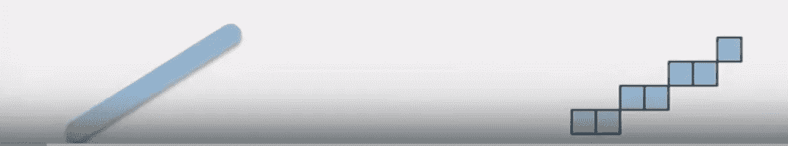
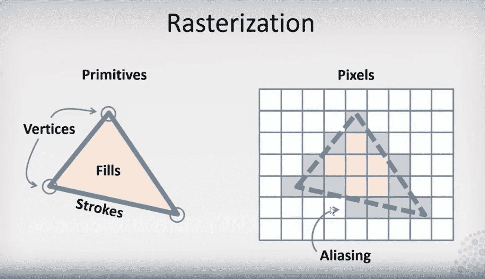
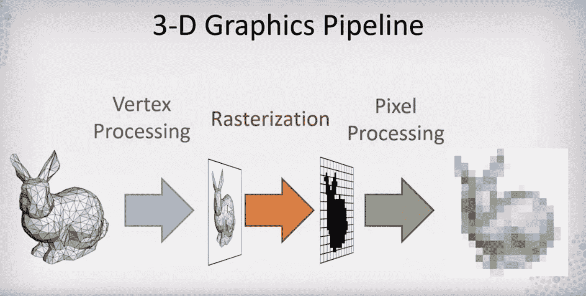
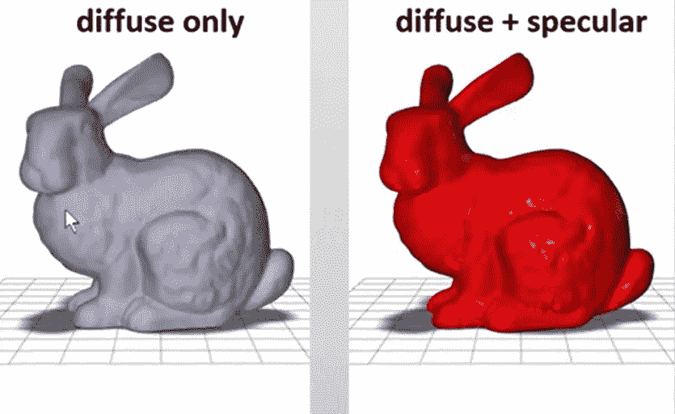
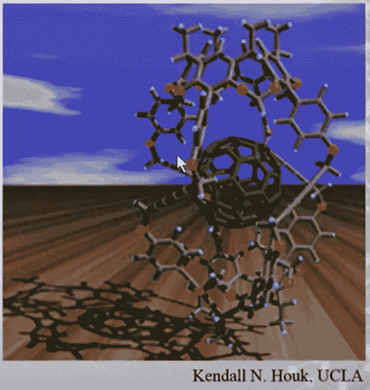
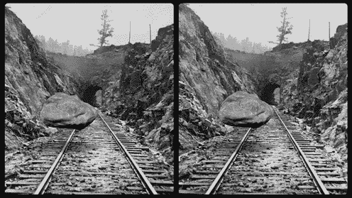
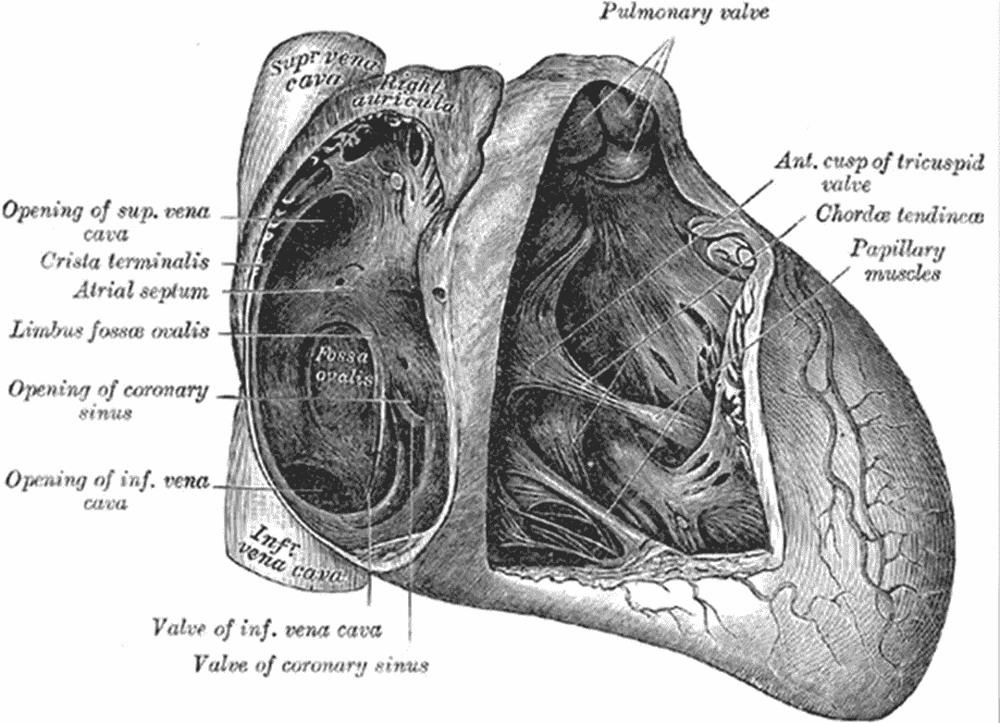
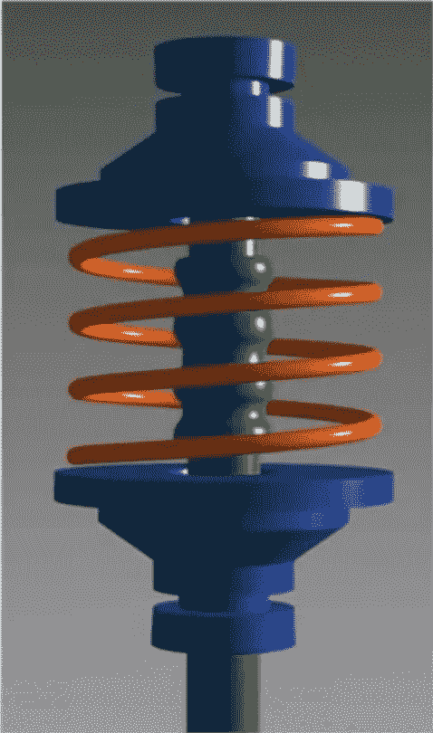
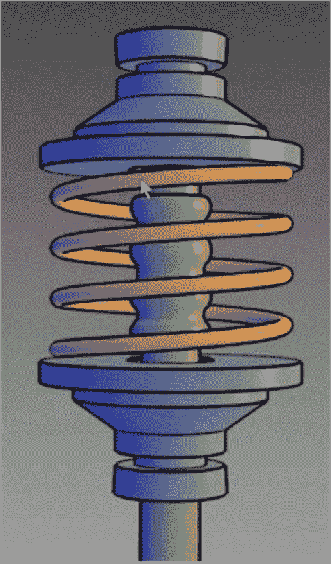

# 数据挖掘基础

> 原文：<https://medium.com/analytics-vidhya/data-mining-fundamentals-4f64061c05a1?source=collection_archive---------25----------------------->

***数据可视化*** 我们应该做数据挖掘，那我们为什么要做数据可视化呢？是的，这是因为我们从最开始就开始了，就像从最基本的开始，我们需要知道挖掘以及数据可视化对它的重要性。

> **数据挖掘**是在大型**数据**集中发现模式的过程，涉及机器学习、统计学和数据库系统的交叉方法。
> —维基百科
> 
> **数据可视化**是将数值数据转换为图形图像的过程，如有意义的 3D 图片，这些图片将**用于轻松分析复杂数据**。
> ——[educba.com](https://www.educba.com/data-mining-vs-data-visualization/)

*数据可视化告诉我们如何创建可视化，* ***通过视觉感知将数据背后的意义有效地传达给观察者。我们将学习计算机如何使用计算机图形显示信息，以及人类如何视觉感知这些信息。我们还将研究数据的形式，包括**定量和非定量数据**，以及它们如何正确地映射到观察者能够很好地感知的可视化元素。我们将简要概述有效可视化的一些设计元素，尽管我们不会关注制作吸引人的艺术可视化所需的视觉设计。***

*可视化*可以有两种模式:
*1。* *交互式可视化——用于基于用户输入的发现和渲染*
*2。* *演示可视化——用于交流，不支持输入*

***矢量图形 vs 光栅图形***
***矢量*** *图形*用于 ***描述*** 形状，而 ***光栅*** *图形*用于 ***显示*** 形状。

试试 SVG( ***可缩放矢量图形*** )这里是—[https://www.w3schools.com/graphics/svg_intro.asp](https://www.w3schools.com/graphics/svg_intro.asp)

矢量(左侧)和光栅(右侧)

> 光栅化(或**光栅化**)的任务是获取以矢量图形格式(形状)描述的图像，并将其转换为光栅图像(一系列像素、点或线，当一起显示时，创建通过形状表示的图像)。
> —维基百科
> 
> **走样**。(1)在**计算机图形**中，由于**图形**设备或文件的分辨率不够高，无法表现平滑曲线，平滑曲线和其他线条变得参差不齐的过程。
> —维基百科

**光栅化和走样**

> **照片写实主义**是一种包含绘画、素描和其他图形媒体的艺术类型，其中艺术家研究一张照片，然后试图在另一种媒体上尽可能逼真地再现图像。
> —维基百科

同样，这是一个通用术语，在我们的上下文中，我们想知道的是，照片真实感被添加到我们的 2D 图像中，以给我们的感知系统提供关于我们在 2D 屏幕或表面上显示的形状的 3D 空间配置的视觉线索。

****

**遮挡示例**

*****光照*** 有助于感知一个表面的方位。
这有两种:
***漫射照明:*** 面对光源时表面最亮。
***镜面照明:*** 反射光源时表面最亮。**

****

*****阴影:*** 阴影表示光线遮挡，提示感知系统物体相对于彼此的位置。**

****

**阴影示例**

*****透视:*** 大小恒常性暗示深度，物体大小相同但父亲越大，看起来越小。**

*****运动视差:*** 物体向更远的方向移动比向更近的方向移动要慢，给人更真实的感觉。**

*****立体视觉:*** 从两个不同的视点(每只眼睛一个)进行渲染，应该是平行的，不能旋转。**

****

**立体视觉示例**

****非真实感** 当我们使用 3D 图形进行数据可视化时，我们通常不希望它看起来像照片而是插图，为此我们使用非真实感渲染。**

****

**非真实感渲染示例**

**这不是一张照片，而是《格雷的解剖》中的心脏插图，侧重于通过感知描述更多细节，而不是展示现实效果。**

******

左边的图像是照片级渲染，右边的图像是非照片级渲染** 

**可以清楚地看到，左边的图像主要集中在照片真实感渲染，即适当的物理照明等。但是右边的图像更侧重于感知心理学。**

**我会继续给这个故事添加更多的东西，这只是我们旅程的开始。
*关于图像处理相关的东西，可以参考* [***图像处理基础***](/@harshit120299/image-processing-fundamentals-d33c96220072) *。
而对于* ***的数据分析系列请参考每周故事*** [***这里的***](/@harshit120299/data-visualization-week-1-338c59932798) ***。*****