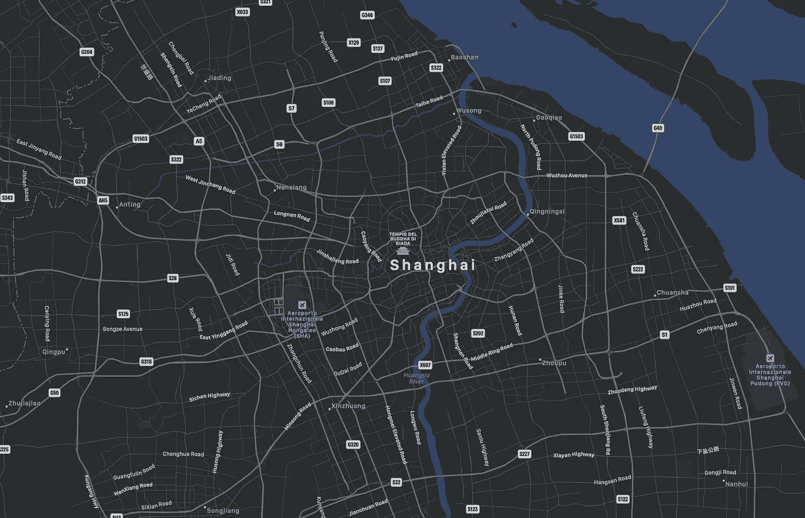

# Geolife 数据集的数据挖掘

> 原文：<https://medium.com/analytics-vidhya/data-mining-of-geolife-dataset-560594728538?source=collection_archive---------4----------------------->

来自苹果地图

该项目的目的是准备数据集(Geolife ),用于预测某一路线所使用的交通工具类型。

该数据集( [Geolife Trajectories 1.3](http://research.microsoft.com/en-us/projects/geolife/) )是由微软亚洲研究院通过收集 182 名用户在 2007 年 4 月至 2012 年 8 月期间记录的 24，876，978 个点所代表的 GPS 轨迹(或路径)的数据而开发的。数据集的每个文件夹都包含…