# Power Pivot 数据建模—入门

> 原文：<https://medium.com/analytics-vidhya/data-modeling-with-power-pivot-getting-started-1ed9f3dd61e2?source=collection_archive---------7----------------------->

MS Excel 无疑是最受欢迎的电子表格程序，由于其受欢迎程度，它已经成为数据分析师的首选工具。现代 Excel(尤其是微软 365)充满了有用的功能，使数据分析和可视化变得超级容易。

从 2013 年开始，MS Excel 自带了一些强大的数据转换和建模工具。这些功能被称为权力查询和权力枢纽。两者都很有特色，而且相对容易学习。

这篇文章是关于如何开始使用这两个特性。我们可以在不到两分钟的时间内开始分析数据！

# 什么是权力支点？

我们大多数人都熟悉 Excel 中的数据透视表。当涉及到快速总结和分析数据时，它是一个方便的工具。

文章:[透视表的五大特性](https://www.vivran.in/post/5-useful-features-of-excel-pivot-tables)

通常的数据透视表只能汇总单个表中的数据。大多数情况下，我们的数据存储在多个相关的表中。因此，在使用数据透视表汇总和分析数据之前，我们首先组合多个表(使用 VLOOKUP)。

Power Pivot 简化了这一步。我们可以连接多个表，然后将它们用作常规的数据透视表。

在下面的例子中，我们可以快速看到每个客户*段*(来自*客户*表)的*退货*(来自*退货*表)的*经理*(来自*用户*表)的*总订单*(来自*订单*表)

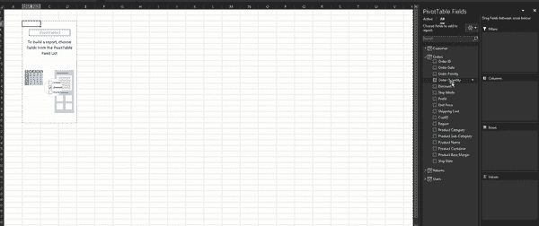

最终输出:

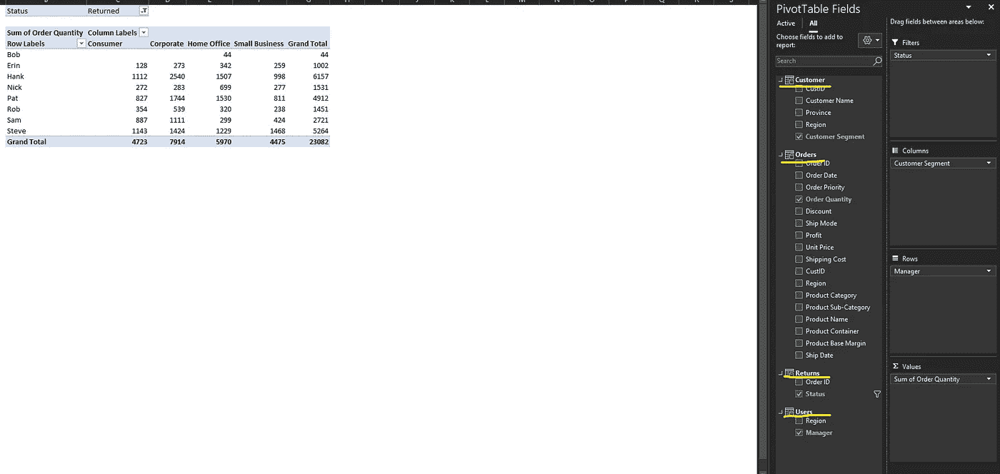

最棒的是没有公式。

整个步骤分为三个阶段:

与数据连接

转换数据

数据建模

但是，首先要做的是:

# 理解数据

在本练习中，我们将对超市销售进行抽样调查

[样本数据文件](https://vivranin-my.sharepoint.com/:x:/g/personal/vivek_ranjan_vivran_in/EUDqboC1sUZNgx_2E_wyFtQBEzHPjd1q1Ax9RA8XdIpbmA?e=gYOJec)

数据模型中有四个表:

订单:包含所有订单的列表

客户:包含客户详细信息

Returns:包含所有返回订单的列表

用户:包含区域经理

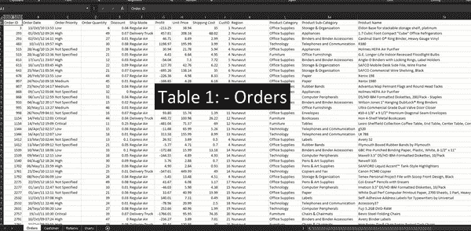

# 步骤 1:连接数据

让我们打开一个新工作簿

数据>来自文件>来自工作簿

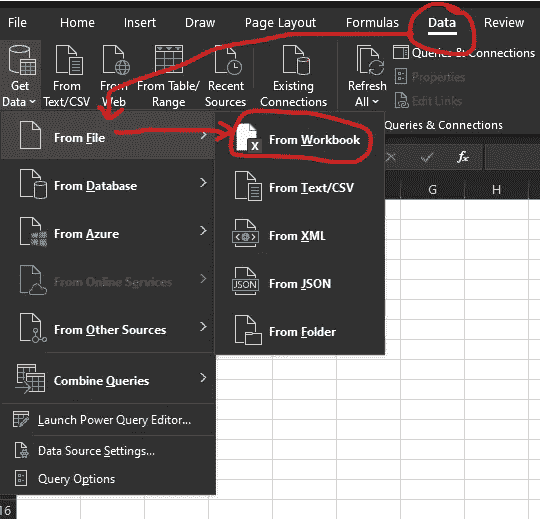

导航到文件位置>选择文件>导入

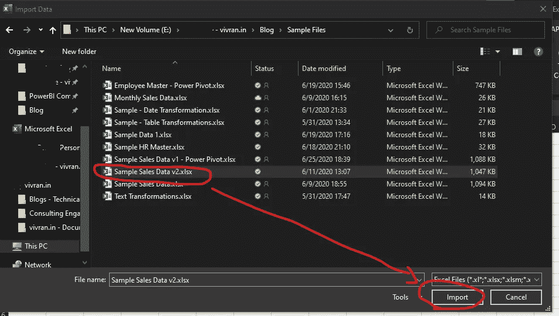

因为我们需要在模型中引入所有四个表，所以我们选中了选项:选择多个项目

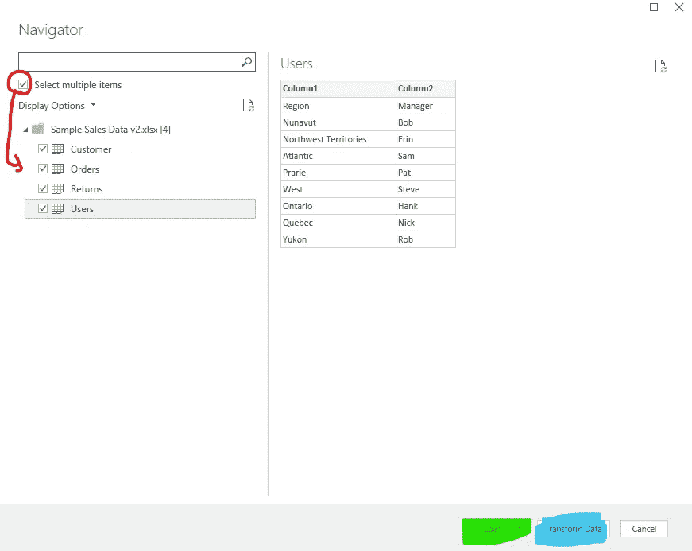

Post 表的选择，我们有两个选项:加载和转换

# 负荷

当我们的数据不需要任何转换时，请使用此选项。

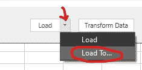

o **加载**:以 Excel 表格的形式加载所有选中的数据表

o **Load To** :仅创建与数据源的连接，不在当前 Excel 文件中添加任何数据表。

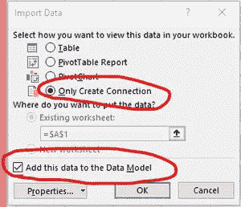

另外，检查选项:*将该数据添加到数据模型*。它将表加载到 Power Pivot 数据模型中。

*从数据建模的角度来看，建议选择 Load To 而不是 Load，除非我们需要表格形式的数据。*

# 转换数据

当我们的数据需要转换时，请使用此选项。这个选项将我们带到 ETL 工具: [Power Query](https://www.vivran.in/my-blog/categories/powerquery) 。

我们应该总是首先加载数据以进行 Power Query(转换数据),并确保所有的表和列都有适当的结构。

对于我们的活动，数据表需要某些转换；因此，我们选择变换数据。

# 步骤 2:转换数据

当我们点击转换数据时，功率查询窗口在一个单独的窗口上打开:

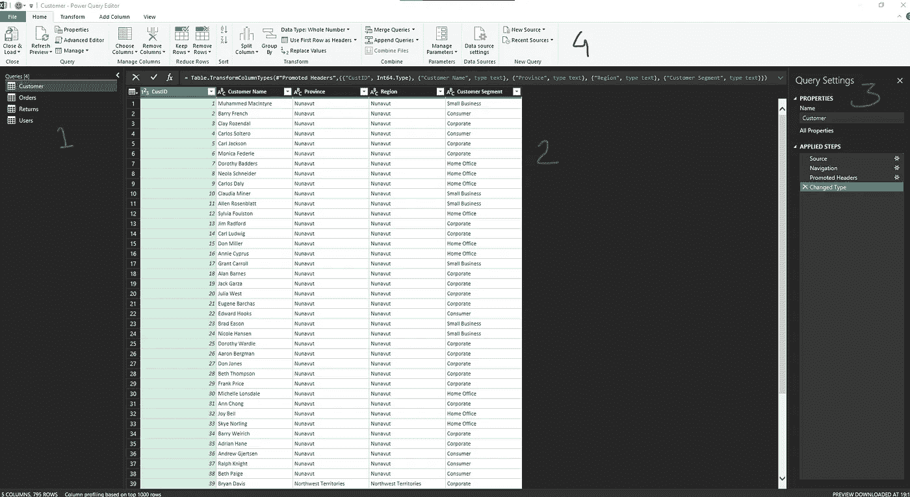

1.查询:显示加载的所有数据表的列表

2.数据预览:显示源文件中前 1000 行数据

3.查询设置:显示查询的名称和每个表上应用的所有转换(在“应用的步骤”下)

*应用步骤*有点像宏记录。它列出了在数据表上执行的所有操作，当我们点击刷新时，它运行所有步骤并显示最终输出

# 分配正确的数据类型

分析的关键要素之一是为每一列分配正确的数据类型。

Power Query 足够智能，可以检测和分配适当的数据类型。符号表示数据类型，位于列名之前:

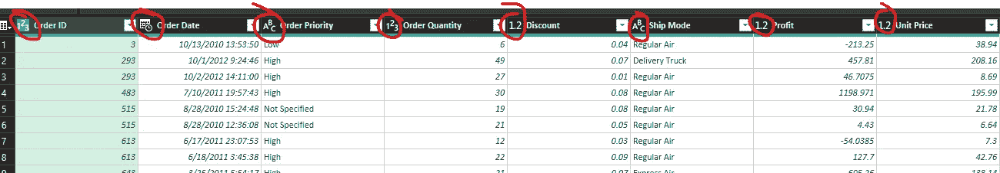

以下是每个数据类型符号的含义:

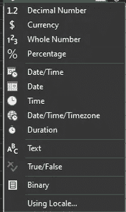

要更改现有数据类型，请单击符号，然后选择适当的数据类型:

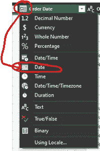

在当前数据模型中，我做了以下更改:

将 *CustID* 转换为*客户*和*订单*表中的**文本**

将*订单 ID* 转换为*订单*中的**文本**，并且*返回*表

将*订单*表中的*订单日期*和*发货日期*转换为**日期**(起始日期/时间)

将*用户*表中的第一行提升为标题

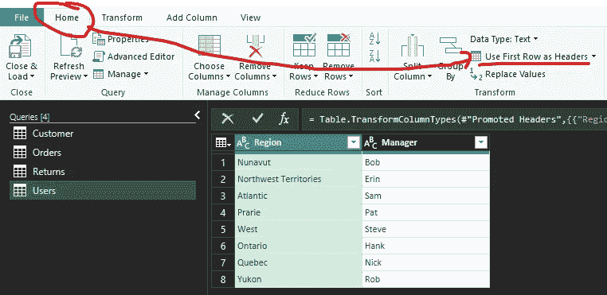

您可以查看关于[电源查询转换](https://www.vivran.in/my-blog/categories/powerquery)的文章。

一旦我们确定了转换，就该将数据加载到 Power Pivot 数据模型中了

主页>点击关闭和加载>关闭和加载至上的向下箭头

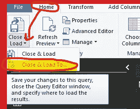

选择:

**仅创建连接**:仅连接源文件，不导入数据表

选中选项**将该数据添加到数据模型**以将数据表加载到 Power Pivot 中

注意:如果电源查询窗口处于打开状态，我们将无法访问任何 Excel 窗口。

# 如何启用 Power Pivot 外接程序？

如果您已经启用了 Power Pivot 加载项，请跳过此步骤

文件>选项>加载项>管理> COM 加载项>转到

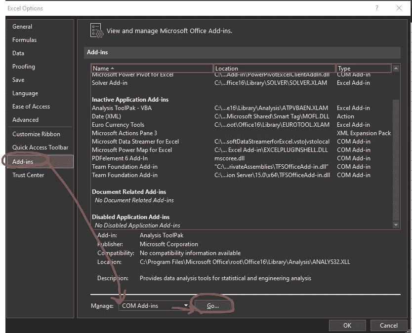

选择 Excel >确定的电源枢纽

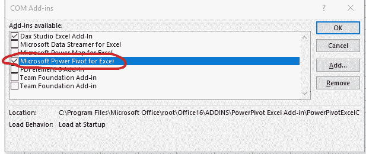

# 步骤 3:数据建模

是时候打开电动旋转窗了。

权力枢纽>管理

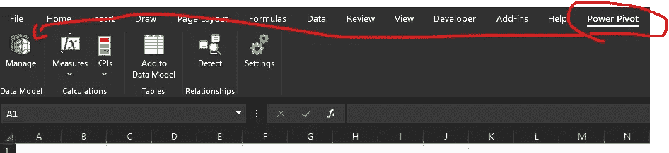

或者，我们也可以通过数据功能区访问它:

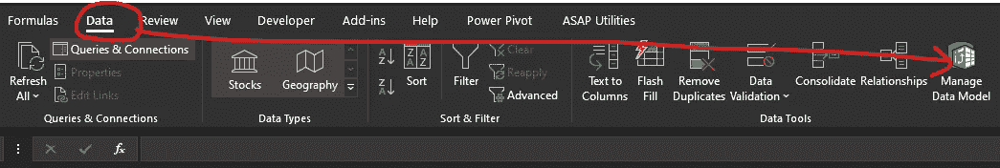

它会打开电动旋转窗口

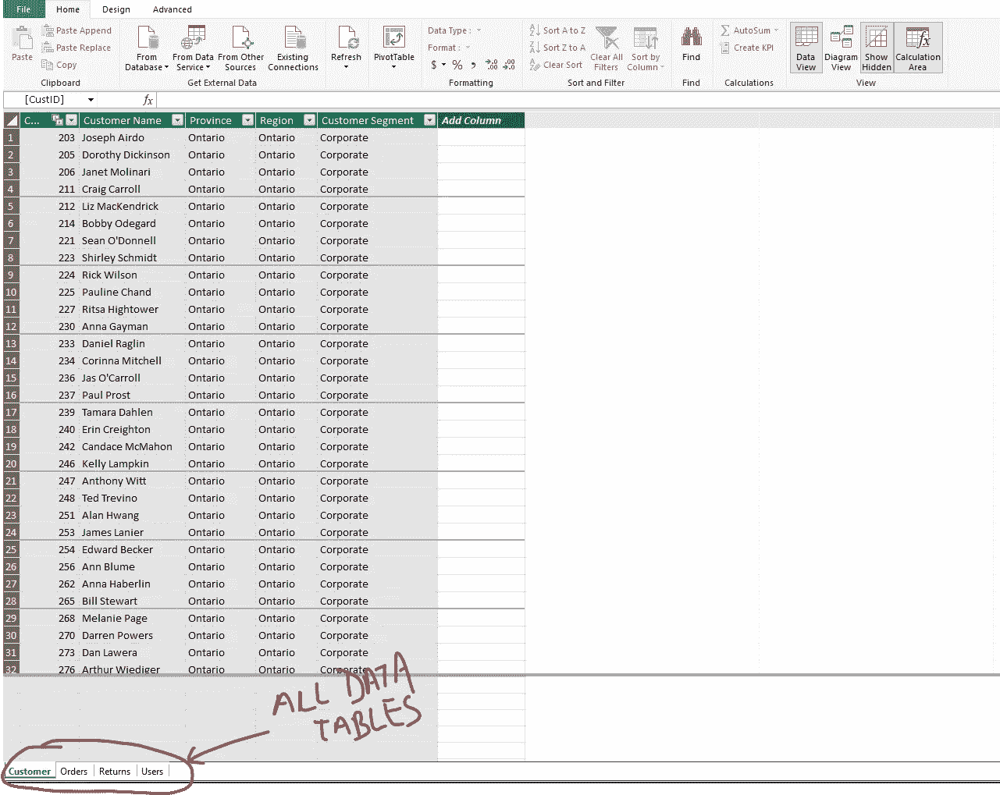

# 建立表之间的关系

切换到图表视图

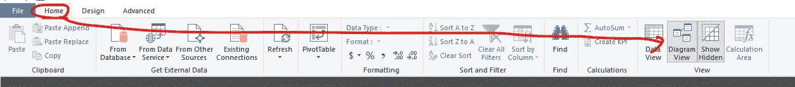

使用鼠标拖放，我们建立了表之间的关系:

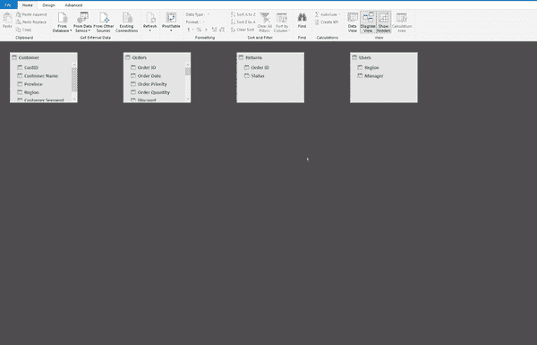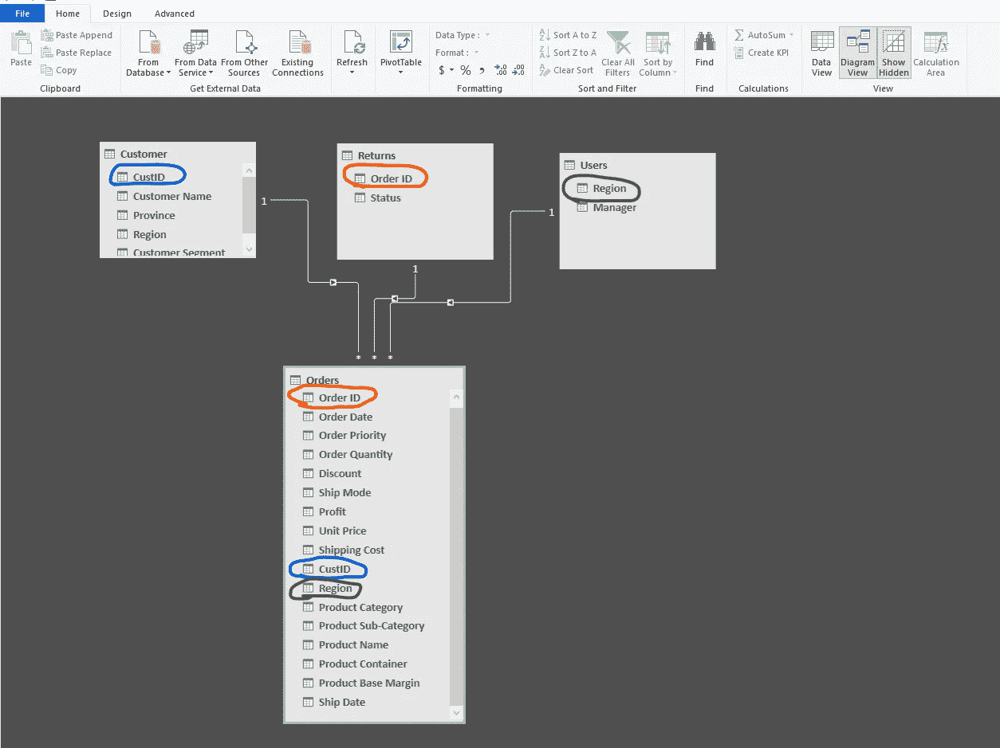

管理关系视图:

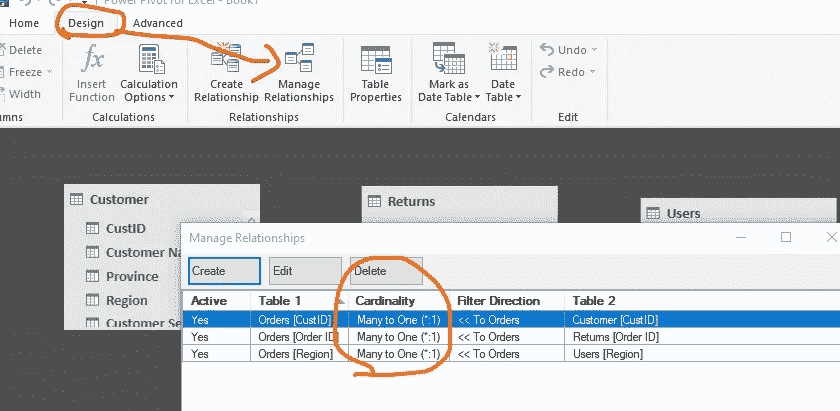

> 请注意，Power Pivot 不支持多对多关系。它只支持多对一和一对一的关系。

就是这样！数据建模完成。

现在，点击主页>数据透视表:

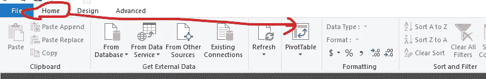

单击确定

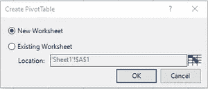

# 汇总和分析数据

现在，我们需要做的就是从多个表中拖放字段来汇总数据:

我们有来自四个表的数据，Power Pivot 使我们能够通过几个简单的步骤连接和分析数据。

# 下一步是什么？

Power Pivot 具有一些广泛的数据建模功能，当与 Power Query 结合使用时，它会产生一些重大影响。下一篇文章将以此为基础，我们将学习如何编写 DAX 度量(Power Pivot 公式引擎)。

# 相关文章

[向达克斯](https://www.vivran.in/post/say-hello-to-dax)问好！

[在 Power Pivot 中添加日历表](https://www.vivran.in/post/adding-calendar-table-in-power-pivot)

[带电源查询的数据转换](https://www.vivran.in/my-blog/categories/powerquery)

*我写关于*[*MS Excel*](https://www.vivran.in/my-blog/categories/excel)*[*权力查询*](https://www.vivran.in/my-blog/categories/powerquery)*[*权力毕*](https://www.vivran.in/my-blog/categories/powerbi)*[*权力中枢*](https://www.vivran.in/my-blog/categories/power-pivot)*[*DAX*](https://www.vivran.in/my-blog/categories/dax)*[*数据分析【数据*](https://www.vivran.in/my-blog/categories/data-analytics)*****

**[@imVivRan](https://twitter.com/imvivran)**