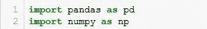

# 模型训练前的数据预处理

> 原文：<https://medium.com/analytics-vidhya/data-pre-processing-before-model-training-7e741e9cb253?source=collection_archive---------8----------------------->

你已经有了一个数据集，你已经准备好开始模型训练和预测，但是请等待！这些数据准备好训练算法了吗？你们可能都知道答案，一个很大的否定。那么，有哪些东西可以让我们的数据为建模做好准备呢？以下是需要遵循的步骤，通常称为*数据预处理*技术:

1.  导入库
2.  读取数据集
3.  检查和处理缺失值
4.  编码技术
5.  特征缩放
6.  分割数据集

现在让我们一个一个地来看这些:

**导入库:**首先，我们需要导入所有必要的 python 库，这些库在所有步骤中都要用到。导入*熊猫*很重要，因为它有助于读取不同格式的文件(csv、excel、json 等)。Pandas 提供了各种操作和分析数据的选项。同样， *numpy* 对于我们的数据进行数学运算也很有帮助。需要时，还可以导入所有其他库。

**读取数据集:** Pandas 帮助将不同格式的文件读取到 Pandas 数据帧中:这是一个创建二维表(行和列)的构造函数，该表是可变的，可以包含异构数据。这里我要借用一个数据集(确保数据文件与工作笔记本在同一个路径下)。Doing data.head()将显示前 5 行(从索引 0 开始)。

**检查缺失值:**一旦加载了数据，第一件事就是检查空值或任何缺失值。所有机器学习算法都无法处理具有空值的数据集。下面的代码片段说明了哪些列包含缺少的值。

现在的主要部分是删除这些丢失的值。对于分类变量，我们通常用模式替换丢失的值。对于数字特征，有均值插补、中值插补、分组插补和 KNN 插补。向前填充和向后填充也用于用正好在丢失值之前或之后的值来填充丢失的值。还需要分析数据，了解缺失值的域和模式。

还有一种方法可以通过使用机器学习方法来计算缺失值。在这种情况下，可用数据是训练数据，缺失值数据是预测数据。使用回归或分类算法，我们可以预测丢失的值。(只是附上 2 个片段供参考)。你可以在这里查看一个深入讨论缺失值类型的内容丰富的博客[。](/@dikshabellani.2803/handling-missing-values-bb8b549364cc?sk=e8e564953e9039429d1715d23acb8315)

**编码技术:**机器学习算法只对数字数据起作用。如果有任何分类列，那么它们将被编码成数值。有两种方式来执行编码:标签编码和一个热编码。标签编码是对顺序数据进行的，值被分配给列中的每个唯一标签。一个热编码(也称为虚拟变量)用于名义数据。这里所有的唯一值都被赋予 1 或 0，因此也称为二进制编码。每个唯一值都被转换为一列。所有这些编码值都从 0 开始，只是分类值的表示。

展示标签编码如何工作的示例

标签编码前后

位置有 6 个唯一值

在应用一次热编码后，每个唯一值都被转换为仅包含二进制值的列。1 表示该位置

**特征缩放:**有时在训练模型时，有必要将所有数值变量的范围调整到一个共同的比例。这有助于在培训时同等重视所有变量。规范化和标准化是两种最常见的技术。在标准化中，这些值被缩小到 0 到 1 或-1 到 1 的范围。在标准化中，这些值的均值为零，方差为 1。

在这里，你们可以浏览这个关于[特征选择](/@nishant.shah0209/feature-selection-techniques-1a99e61da222)技术的博客，因为这也是一个需要考虑的重要因素。

**拆分数据:**现在在给定数据训练模型的同时，我们将给出一部分数据进行训练，保留剩余的数据作为测试数据。一般来说，划分为 20%的测试数据和 80%的训练数据(但这不是固定的，您可以根据数据的大小取任何值)。这将有助于通过比较预测值和测试数据值来了解我们的预测有多准确。变量的顺序应该和给定的一样。

测试规模为 20%

现在，您已经准备好了预处理步骤，可以开始模型训练了。