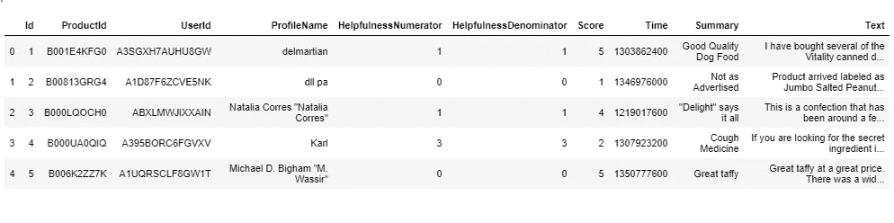
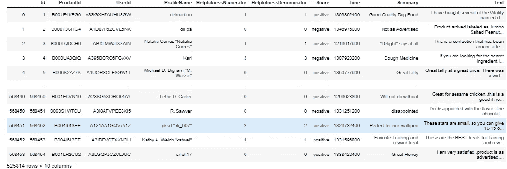
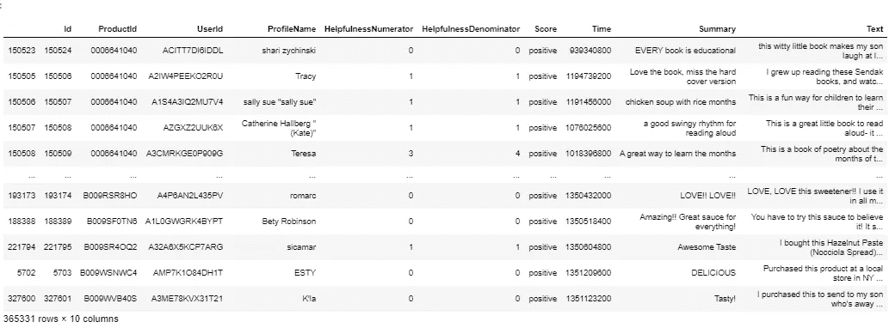
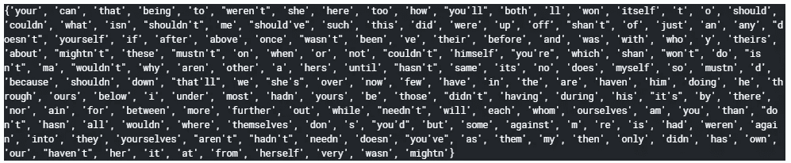
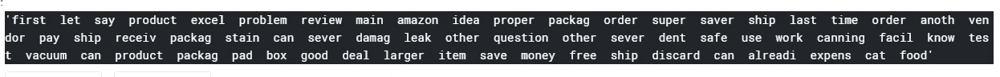
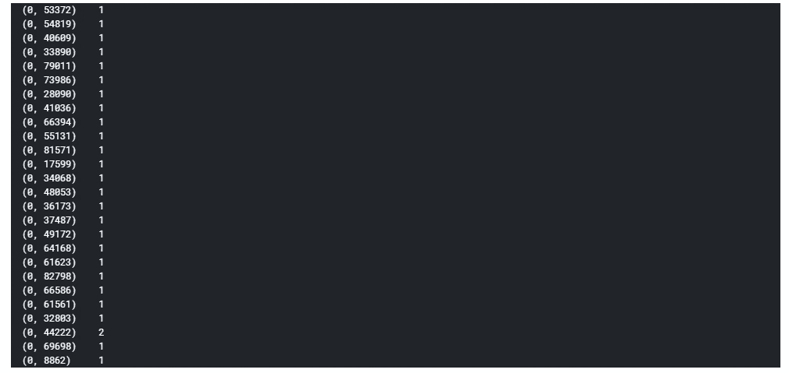
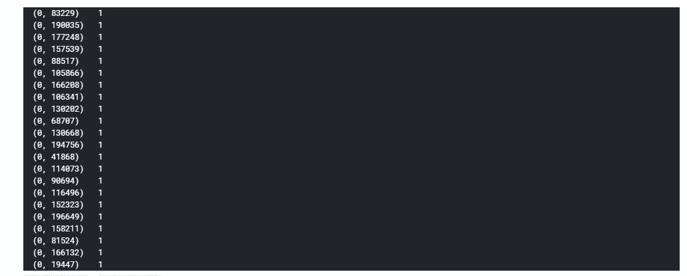
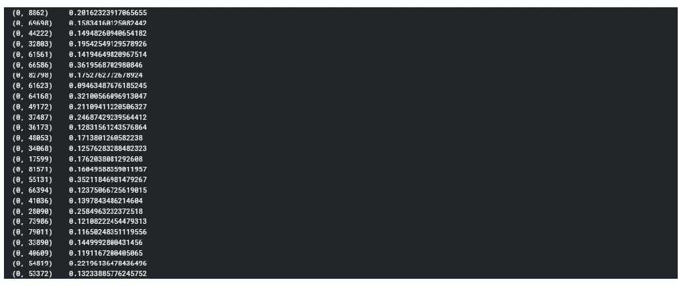
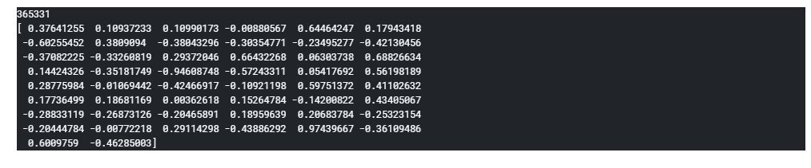

# 亚马逊美食评论的数据准备和文本预处理

> 原文：<https://medium.com/analytics-vidhya/data-preparation-and-text-preprocessing-on-amazon-fine-food-reviews-7b7a2665c3f4?source=collection_archive---------4----------------------->

在这里，我将向您展示亚马逊美食评论的数据准备和文本预处理。

但在此之前，你需要知道为什么文本预处理是必要的。


亚马逊美食(图片提供:Kaggle)

## **为什么我们需要做文字预处理？**

机器学习模型不处理文本数据，因此需要清理文本数据并将其转换为数字向量。这个过程称为文本预处理。

这些是我将在本文中向您展示的基本步骤。

**了解数据**:首先，你需要看到数据是关于什么的，有哪些参数(停用词，标点，html 标签…etc)在数据中。

**数据清洗:**在这一步，我会去掉所有不必要的参数。

**编码文本数据的技术**:编码文本数据的技术有很多。但是下面是我在解决现实世界问题时最常用的技巧。

1.  一袋单词
2.  双字母，n 字母
3.  TF-IDF
4.  Avg-Word2Vec

现在，让我们开始吧:

首先，导入所有必需的库

```
**import** pandas **as** pd
**import** numpy **as** np
**import** nltk
**import** re
**from** nltk.corpus **import** stopwords
**from** nltk.stem **import** SnowBallStemmer
**from** bs4 **import** BeautifulSoup
**from** sklearn.feature_extraction.text **import** TfidfTransformer
**from** sklearn.feature_extraction.text **import** CountVectorizer
**from** sklearn.feature_extraction.text **import** TfidfVectorizer
```

所以，我们现在要导入亚马逊美食评论数据集

```
data=pd.read_csv('./amazon-fine-food-reviews/Reviews.csv')
```

检查数据

```
data.head() 
```



亚马逊美食评论数据集

检查形状

```
data.shapeOutput:(568454, 10)
```

**目标**:给定一篇文字评论，预测评论是正面还是负面。

> 但是这里我只做数据准备和文本预处理部分。

那么我们就进入数据准备部分。

**数据准备:**

让我们先看看“分数”一栏

```
data['Score'].value_counts()Output:
5    363122
4     80655
1     52268
3     42640
2     29769
```

所以如果你看到“分数”栏，它有 1，2，3，4，5 个值。我们的主要目标是预测给定的评论是正面的还是负面的。在这里，如果我们认为 1.2 是负面评价，4.5 是正面评价，那么从逻辑上来说，3 不会给我们的目标增加任何价值。因此，让我们丢弃那些“分数”=3 的行

```
data=data[data['Score']!=3]
```

现在，数据将只包含包含“Score”= 1 和“Score”= 2 的行。

让我们将得分值转换成类标签“正”或“负”。

```
def xyz(x):
    if x>3:
        return 'positive'
    else:
        return 'negative'
s=data['Score']
d=list(map(xyz,s))
data['Score']=d
data
```



现在，我将向您展示如何删除重复和不需要的记录。在这个阶段，您需要一些领域知识，因为这是数据科学中最“先进”的部分之一。

首先，我检查了基于 UserId、ProfileName、Time、Text 的副本(因为没有用户不能在同一时间评论相同的产品)。如果我发现任何重复，我会删除这些记录。

此外，有益分子必须小于或等于有益分母，因此检查记录并删除这些记录。

```
data_f=data.sort_values('ProductId').drop_duplicates(subset=['UserId','ProfileName','Time','Summary','Text'],keep='first',inplace=False)
Final_Values=data_f[data_f['HelpfulnessDenominator']>=data_f['HelpfulnessNumerator']]
Final_Values
```



现在，我们进入文本预处理阶段。

**文本预处理**:

如上所示，我在文本列上应用了这个文本预处理。

在开始文本处理之前，我想向你解释一些话题，如词干和停用词。

词干化:这是一种可以将单词转换成其基本单词或词干的技术(例如，tasty，tasty 被转换成基本单词 tasti …)

**停用词**:这是一些不重要的词，即使你把它们从句子中去掉，文本的语义也不会改变。

例如:“这家餐馆很好”(这里‘This’，‘is’是停用词)

检查所有停用字词

```
stop=set(stopwords.words('english'))
print(stop)
```



首先，我检查了文本数据的几个样本，以了解哪些参数(html 标记、标点符号、特殊字符、……等等)需要被移除以获得干净的文本。在检查了几个例子后，我发现句子中很少包含 html 标签、标点符号和特殊字符。所以，我需要删除这些参数来获得干净的文本。

**以下是我为预处理**所做的步骤:

a.移除 html 标签。

b.删除所有标点符号和特殊字符

c.将单词转换成小写

d.删除停用词

e.最后，我用雪球词干分析器来做词干。

**下面是文本预处理的代码:**

```
import nltk
from nltk.corpus import stopwords
from nltk.stem import SnowballStemmer
import numpy
import re
from bs4 import BeautifulSoup
stop=set(stopwords.words('english'))
snow = nltk.stem.SnowballStemmer('english')
stop
def decontracted(phrase):
    phrase=re.sub(r"won't","will not",phrase)
    phrase=re.sub(r"can't","can not",phrase)
    phrase=re.sub(r"n\'t","not",phrase)
    phrase=re.sub(r"\'re","are",phrase)
    phrase=re.sub(r"\'s","is",phrase)
    phrase=re.sub(r"\'d","would",phrase)
    phrase=re.sub(r"\'ll","will",phrase)    
    phrase=re.sub(r"\'t","not",sentence)
    phrase=re.sub(r"\'ve","have",sentence)
    phrase=re.sub(r"\'m","am",sentence)
    return phrasepreprocessed_reviews=[]for sentence in Final_Values['Text'].values:
    sentence=re.sub(r"http\S+"," ",sentence)
    sentence=BeautifulSoup(sentence,'lxml').get_text()
    cleanr=re.compile('<.*?>')
    sentence=re.sub(cleanr,' ',sentence)
    sentence=decontracted(sentence)
    sentence=re.sub("\S\*\d\S*"," ",sentence)
    sentence=re.sub("[^A-Za-z]+"," ",sentence)
    sentence=re.sub(r'[?|!|\'|"|#]',r' ',sentence)
    sentence=re.sub(r'[.|,|)|(|\|/]',r' ',sentence)
    sentence='  '.join(snow.stem(e.lower()) for e in sentence.split() if e.lower() not in stop)
    preprocessed_reviews.append(sentence.strip()) 
```

让我们看看预处理后的文本是什么样的:

```
preprocessed_reviews[1700]
```



正如你从上面看到的，我们在预处理后得到了干净的文本。

现在，我们将应用一些文本编码技术。

## ***文本编码技术* :**

**包话(鞠躬)**:

在 BOW 中，我们构建了一个字典，其中包含来自我们的评论文本数据集中的所有唯一单词。在这里，每个单词的出现频率都被计算在内。如果我们的数据集中有 d 个唯一的单词，那么对于每个评论，向量的长度将为 d。在这种情况下，向量将非常稀疏。

这是弓的基本概念。

> 要了解更多信息，我在本文末尾提供了链接。请过一遍。

现在，让我们在我预处理过的文本数据上应用蝴蝶结。

```
from sklearn.feature_extraction.text import CountVectorizer
count=CountVectorizer()
Reviews_BOW=count.fit_transform(preprocessed_reviews)
print(Reviews_BOW[1]
```



**使用弓的缺点**:

从上面的输出可以看出，它是一种稀疏矩阵表示。我们的主要目标是相似意义的评论应该彼此接近。但是它不理解句子的语义。

让我们举个例子:

假设有两个评论:

r1:意大利面很好吃。

r2:意大利面不好吃。

正如你所看到的，上面两个评论的语义有明显的不同。由于这两个评论不相似，所以它们对应的向量不应该彼此接近。但是在 BOW 中，在停用词移除之后，两个句子都将被转换为 **pasta tasty** ，因此两个句子给出完全相同的意思，并且它们对应的向量将彼此接近，这是不正确的。

让我们来看看第二种文本编码技术，它是二元语法，n 元语法。

**二元语法，多元语法:**

双字母组合基本上是指用于创建词典的两个连续单词对，三字母组合基本上是三个连续单词。

Scikit-learn CountVectorizer 有一个参数`ngram_range`，如果它被赋值为(1，2)，那么它被称为 Bi-gram。

现在，让我们将二元语法应用于我预处理过的文本数据。

```
count=CountVectorizer(ngram_range=(1,2))
Bigram_Counts=count.fit_transform(preprocessed_reviews)
print(Bigram_Counts[1])
```



**双字格、n 字格的弊端:**

它和 BOW 有同样的缺点，它也不接受文本的语义，而且它也大大增加了字典的大小。

让我们进入下一个文本编码技术，即 TF-IDF

**TF-IDF:**

术语频率-逆文档频率(TF-IDF)对最频繁的词给予较低的重要性，而对不太频繁的词给予较高的重要性。

**词频**是某个**特定单词(W)** 在评论中出现的次数除以评论中的总单词数 **(Wr)** 。术语频率值的范围从 0 到 1。

**逆文档频率**计算为 **log(总文档数(N) /包含特定单词的文档数(n))** 。在这里，文档被称为评论。

**TF-IDF**=**TF * IDF**=**(W/Wr)* LOG(N/N)**

```
counts=TfidfVectorizer()
cnt=counts.fit_transform(preprocessed_reviews)
print(cnt[1])
```



**TF-IDF 的缺点:**

在这里，我们得到了每个单词的 TF-IDF 值。它和 BOW，Bi-gram，n-gram 有同样的缺点。它也不考虑文本的语义。

所以为了真正克服语义评论的问题，我将使用 Word2Vec。

**Word2Vec:**

在进入 Avg-Word2Vec 之前，我将告诉你 Word2Vec 是如何工作的。

> 为了了解更多关于 Word2Vec 和它的数学直觉，我将在本文末尾给你一些链接。

它实际上获取了单词的语义以及它们与其他单词之间的关系。它学习单词之间的所有内部关系。它以密集的向量形式表示单词。

我正在导入 gensim 库，它有 Word2Vec，它采用类似于 **min_count** =5 的参数，这意味着如果一个单词重复的次数少于 5 次，那么它将忽略这个单词， **size** =50 给出了一个长度为 50 的向量， **workers** 是运行这个的核心。

**平均 Word2Vec:**

要计算平均 Word2Vec，请遵循以下步骤。

1.  计算每个单词的单词 2Vec
2.  将句子中每个单词的向量相加
3.  然后用向量除以句子中的字数

它是所有单词的 Word2Vec 的简单平均值。

下面是计算平均 Word2Vec 的代码

```
from gensim.models import Word2Vec
list_of_sentences=[]
for sentence in preprocessed_reviews:
    list_of_sentences.append(sentence.split())
w2v_model=Word2Vec(list_of_sentences,min_count=5,size=50,workers=4)
w2v_words=list(w2v_model.wv.vocab)
sent_vectors=[]
for sent in list_of_sentences:
    sent_vec=np.zeros(50)
    cnt_words=0
    for word in sent:
        if word in w2v_words:
            vec=w2v_model.wv[word]
            sent_vec=sent_vec+vec
            cnt_words=cnt_words+1
    if cnt_words!=0:
        sent_vec=sent_vec/cnt_words
    sent_vectors.append(sent_vec)
print(len(sent_vectors))   
print(sent_vectors[0])
```



**结论**:

在本文中，我向您展示了一些将文本数据编码成数字向量的不同技术。但是哪种技术最适合您的模型，这完全取决于数据的结构、您将选择的模型、模型的目标以及最重要的业务需求。

希望你已经对本文中的数据准备和文本预处理技术有了基本的了解。

延伸阅读:

[](https://www.kaggle.com/snap/amazon-fine-food-reviews) [## 亚马逊美食评论

### 下载数千个项目的开放数据集+在一个平台上共享项目。探索热门话题，如政府…

www.kaggle.com](https://www.kaggle.com/snap/amazon-fine-food-reviews) [](http://www.thushv.com/natural_language_processing/light-on-math-machine-learning-intuitive-guide-to-understanding-word2vec/) [## 数学机器学习之光:理解 Word2vec 的直观指南

### 数学机器学习之光:理解 Word2vec 的直观指南下面是该系列的第三篇博文…

www.thushv.com](http://www.thushv.com/natural_language_processing/light-on-math-machine-learning-intuitive-guide-to-understanding-word2vec/) [](https://machinelearningmastery.com/gentle-introduction-bag-words-model/) [## 单词袋模型简介

### 词袋模型是在用机器学习算法对文本建模时表示文本数据的一种方式。的…

machinelearningmastery.com](https://machinelearningmastery.com/gentle-introduction-bag-words-model/) [](https://scikit-learn.org/stable/modules/generated/sklearn.feature_extraction.text.TfidfVectorizer.html) [## sk learn . feature _ extraction . text . tfidf vectorizer-sci kit-learn 0.22 文档

### class sk learn . feature _ extraction . text . tfidf vectorizer(input = ' content '，encoding='utf-8 '，decode _ error = ' strict '……

scikit-learn.org](https://scikit-learn.org/stable/modules/generated/sklearn.feature_extraction.text.TfidfVectorizer.html)  [## tf-idf

### 在信息检索中，tf-idf 或 TFIDF 是词频-逆文档频率的缩写，是一种数值型词频。

en.wikipedia.org](https://en.wikipedia.org/wiki/Tf%E2%80%93idf) [](http://www.nltk.org/index.html) [## 自然语言工具包- NLTK 3.4.5 文档

### NLTK 是构建 Python 程序来处理人类语言数据的领先平台。它提供了易于使用的…

www.nltk.org](http://www.nltk.org/index.html)  [## 雪球

### 编辑描述

snowballstem.org](https://snowballstem.org/) [](https://www.dataquest.io/blog/machine-learning-preparing-data/) [## 机器学习的数据清理和准备

### 数据清理和准备是任何机器学习项目中关键的第一步。虽然我们经常想到数据…

www.dataquest.io](https://www.dataquest.io/blog/machine-learning-preparing-data/) 

希望这对你有帮助。感谢阅读:)