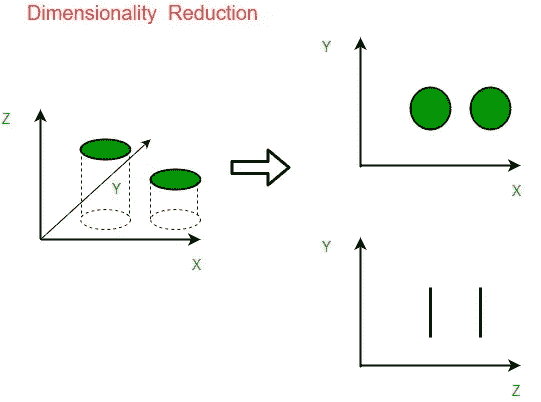

# 数据预处理

> 原文：<https://medium.com/analytics-vidhya/data-preprocessing-5f2dc4789fa4?source=collection_archive---------26----------------------->

在机器学习中，数据预处理是最重要的步骤之一。所以问题是数据预处理到底是什么？在本文中，我将尽可能用最好和最简单的方式解释数据预处理。

现实世界的数据往往不完整、不一致或缺乏某些行为或趋势，并可能包含许多错误。数据预处理是解决这类问题的一种行之有效的方法。正是在这个步骤中，数据被转换到机器可以轻松分析的状态。换句话说，数据的特征现在可以很容易地被算法阐明。

让我们试着理解为什么我们必须在将数据作为机器学习模型的输入之前对其进行预处理。

*   机器学习模型对输入数据有一些特定的条件，比如它必须是数字形式。例如:如果我们的数据中有一列是周名，那么我们必须将它转换成数字，比如 0 代表星期一，1 代表星期二，依此类推。
*   预处理也有助于提高模型精度。这包括处理缺失值、标准化、创建虚拟变量等。

预处理时我们必须记住的事情。

*   缺失价值观——缺失价值观是一种常见的现象，我们需要有一个处理它们的策略。缺失值可能表示数据中的不同内容。也许数据不可用或不适用，或者事件没有发生。可能是输入数据的人不知道正确的值，或者没有填写。数据预处理方法在处理缺失值的方式上有所不同。通常，它们会忽略缺失值，或者排除任何包含缺失值的记录，或者用平均值替换缺失值，或者从现有值中推断缺失值。

*   噪声数据—噪声数据意味着数据包含错误或偏离预期的异常值。不正确的数据也可能是由于命名日期约定或使用的数据代码不一致，或者输入字段(如日期)的格式不一致。这个问题可以通过

    的宁滨、回归和聚类来纠正。
*   重复数据-数据集可能包含彼此重复的数据条目。当一个人不止一次提交表单时，可能会发生这种情况。术语重复数据删除通常是指处理重复条目的过程。
*   数据的维度-大多数真实世界的数据集都有大量的要素。降维或维度缩减是减少所考虑的特征数量的过程。高维度的缺点是随着数据维数的增加，数据分析任务变得更加困难。随着维度的增加，数据占用的平面数量增加，从而给数据增加了越来越多的稀疏性，这很难建模和可视化。通过创建由旧特征组合而成的新特征来降低数据集的维数。换句话说，高维特征空间被映射到低维特征空间。这个过程中常用的技术是主成分分析和奇异值分解。建立在低维数据之上的模型更加准确和易于理解。数据可视化也变得更加容易。

## 特征编码

特征编码是将分类变量转换为连续变量并在模型中使用它们的过程。

1-一个热编码和标签编码

假设我们在分类变量中有“鸡蛋”、“黄油”和“牛奶”。

*   一个热编码将产生三列，类的存在将以二进制格式表示。三类分为三个不同的功能。该算法只担心他们的存在/不存在，而不对他们的关系做出任何假设。
*   标签编码为类提供了数字别名。因此最终的标签编码特征将具有 0、1 和 2。这种方法的问题是，这三个类之间没有关系，但我们的算法可能会认为它们是有序的(即它们之间存在某种关系)可能是 0 <1<2 that is ‘eggs’

2- Frequency encoding — It is a way to utilize the frequency of the categories as labels. In the cases where the frequency is related somewhat with the target variable, it helps the model to understand and assign the weight in direct and inverse proportion, depending on the nature of the data.

After feature encoding is done, our dataset is ready for the machine learning algorithms.
但在我们开始决定应该使用哪种算法之前，我们必须将这三个部分(训练数据、验证数据、测试数据)分开。

机器学习算法必须首先在训练数据上进行训练，然后分别在验证和测试数据集上进行验证和测试。

感谢您的阅读！