# 数据预处理:减少分类数据中的类别

> 原文：<https://medium.com/analytics-vidhya/data-preprocessing-decreasing-categories-in-categorical-data-132e8b4a4fd?source=collection_archive---------0----------------------->

马库斯·斯皮斯克拍摄的照片

下一篇文章将研究各种数据类型，重点关注分类数据，回答为什么以及如何减少类别，并以 Python 中的实际例子结束。本文还将探讨一种不同的方法，可用于缺失值插补和减少类别。

## 数据预处理和各种数据

数据预处理提高了数据的质量，以促进有意义的见解的提取。在机器学习中，它指的是原始数据的转换，使其适用于机器学习模型。数据可以是连续的，也可以是离散的。离散数据只能取特定的值。这些值可能有无数个，但每个都是不同的，在它们之间没有灰色地带。离散数据可以是数字(如苹果的数量)，也可以是分类数据，如红色或蓝色，或好或坏。连续数据不限于定义的不同值，而是可以取连续范围内的任何值。在任何两个连续的数据值之间，可能有无限多个其他值。连续数据本质上总是数值型的。

## 分类数据

分类数据可以分为名义数据和顺序数据。名义上指的是具有一个以上类别的数据，但是在有序数据中存在的类别之间没有内在的顺序。例如，性别是一个有两个类别(男性和女性)的分类变量，类别没有内在的顺序。相比之下，幸福指数的值(0-10)自然序列为 10，表示比 0 更幸福。

# 为什么减少分类变量中的类别？

在数据集上训练 ML/DL 模型并在测试和验证集上获得满意的结果可能是个人项目的最终目标。尽管如此，在组织中，这些结果也应该与管理层的想法相吻合。假设 ML/DL 模型具有不错的准确性，表明某个特定的分类变量非常重要，包含 15-20 个类别。现在，这可能是压倒性的，因为很难理解变量的不同值如何影响结果，但如果有 4-5 个类别，这可以很快计算出来。

## T 他依据哪些范畴可以进行归纳？

首先考虑两种情况，其中变量是一个常量，即变量的所有值都相同；第二种情况是变量的所有值都不同，比如每行的“ID”。

在这两种情况下，建议在定型模型之前删除变量，因为第一种情况没有变化，第二种情况变化很大。ML/DL 模型可以理解数据中的模式，但在可变性非常低或非常高的情况下会失败。通俗地说，如果所有的值都不相同，怎么能预测呢？如果所有的值都相同，又有什么必要预测呢？

## 类似地，出现率小于 1%的所有类别都可以忽略/减少。

## 如何减少类别？

当决定要删除的类别时，非常简单，用空值替换那些值，并在缺失值处理中处理它们。

缺失值处理的各种方法包括:

1.集中趋势—平均值/中间值/众数

2.最频繁或恒定值插补。

3.链式方程多元插补(小鼠)。

4.使用 KNN 的插补

5.使用机器学习/深度学习的插补。

参考威尔·巴德尔的一篇文章。

## T2 的例子

下面的文章展示了一个数据预处理代码演练和一些关于如何使用 Python 减少分类列中的类别的例子。

1.  导入数据

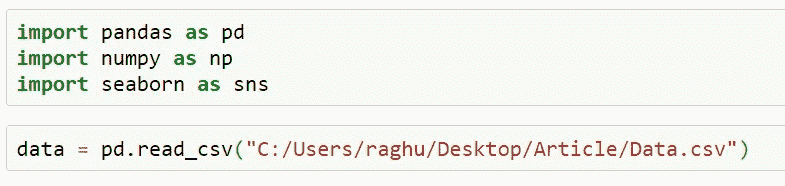

2.检查空值并查找分类列。

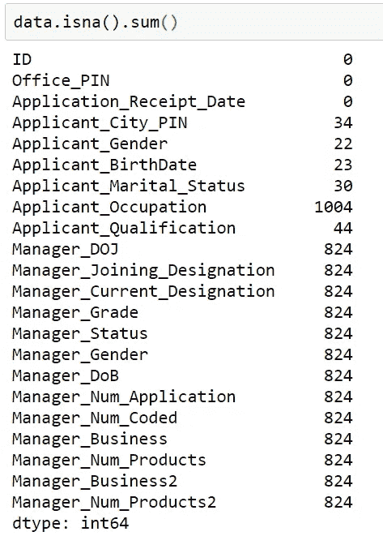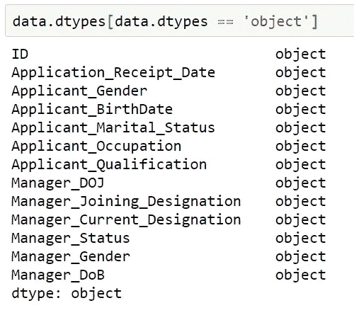

3.让我们从“申请人 _ 婚姻状况”开始逐一检查这些列。

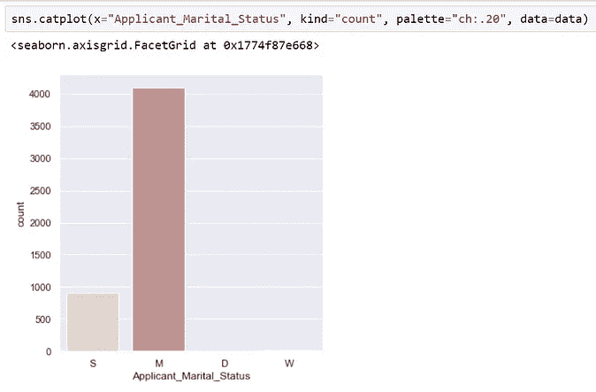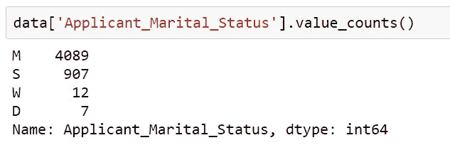

Raghuvansh Tahlan 的申请人婚姻状况

总共有 5045 个记录，其中 30 个缺失，有两个类别“W”和“D ”,分别对应于丧偶和离婚，这两种情况发生的次数非常少，可以减少。

这可以通过用空值替换“W”和“D”来实现。

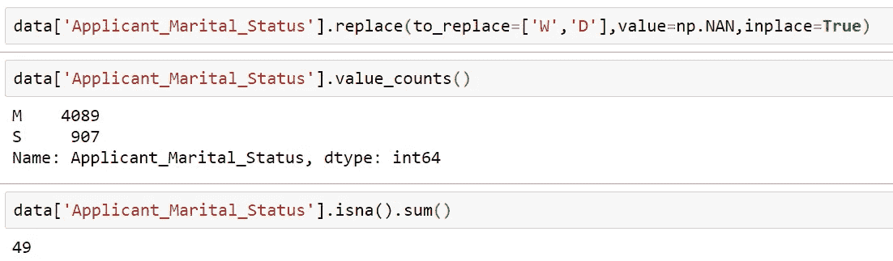

空值的计数也表明我们的代码执行正确。

4.现在，这些值可以通过任何缺失值估算技术进行估算。

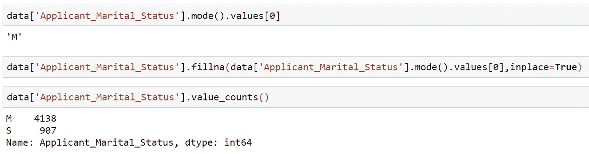

## 集中趋势插补总是一个好的选择吗？

让我们看看另一个专栏“申请人 _ 职业”的例子。

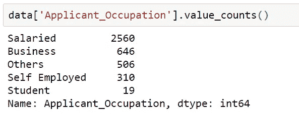

我们可以清楚地看到，Student 只有 19 条记录，相当于总值的 0.38%，因此删除这个类别似乎是可行的。

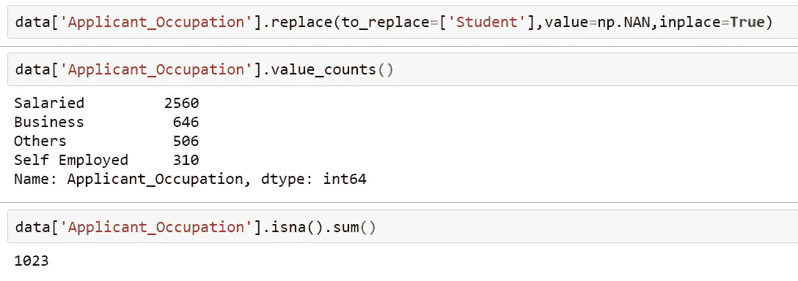

一切正常，但是有 1023 条记录缺少值，这是一个问题，因为这相当于总记录的 20%。

现在让我们考虑一下，如果我们用集中趋势——众数来估算这些值。

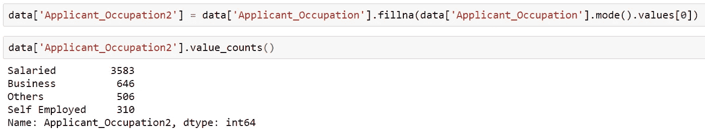

现在工薪阶层的比例已经从 51%上升到 71%，这是没有说服力的。比较最高和最低发生类别，它们的比率从 8 增加到 11。

如果我们使用其他插补技术，如 KNN、DL、MICE 等，就可以避免这个问题。

## 我解决这个问题的方法

这种方法认为，即使在插补后，每个类别在人口中的百分比也将保持不变。因此，要估算的缺失值根据其在人口中的百分比在人口类别中进行划分。为了证明这一点，我们举了上面的例子:

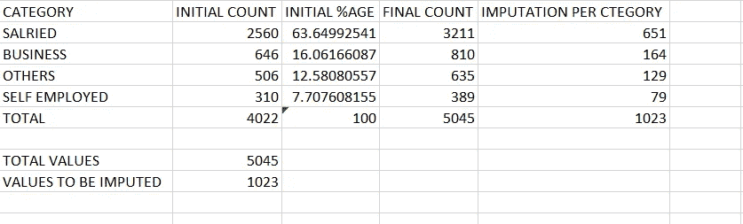

最初，对于受薪类别 2560 是 4022 个非空值总数的 63%,然后在插补后，该值应保持不变，因此保持 63%不变，如果值的总数为 5045，则应有 3211 个值。这给我们留下了 651 个要估算的值。类似地，计算所有类别的值。

这就给我们留下了自动化这个过程并从列中输入有限数量的空值的任务。

# 自动化

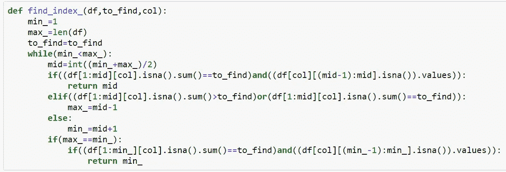

函数‘find _ index’给出了从列的开始直到出现指定数量的空值的索引。

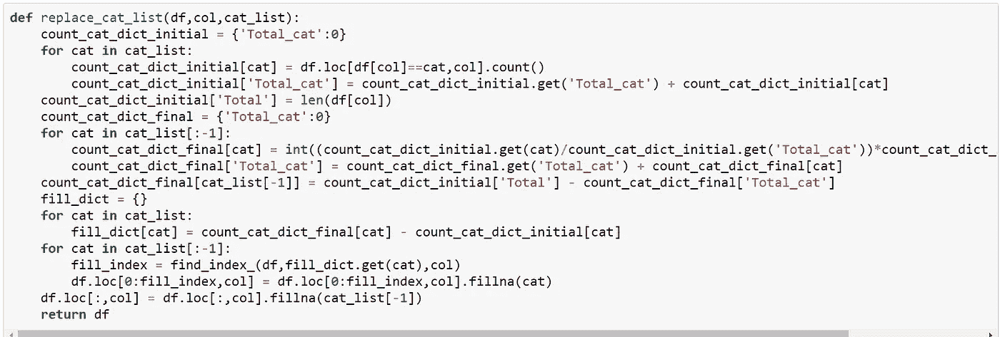

函数“replace_cat_list”使用“find_index”函数根据提供的类别填充来自动执行填充空值的过程。使用相同的示例:

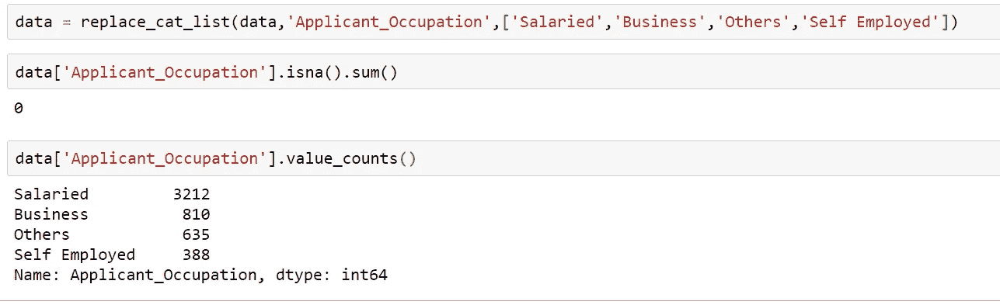

“replace_cat_list”考虑了数据帧、要估算的列名和要考虑的类别列表。

欢迎提出建议和意见。在 [LinkedIn](https://www.linkedin.com/in/raghuvansh-tahlan/) 上与我联系。本文的所有源代码都可以在 [Github](https://github.com/rvt123/Medium_Articles/tree/main/Data_Preprocessing_Reduce_Categories) 获得。