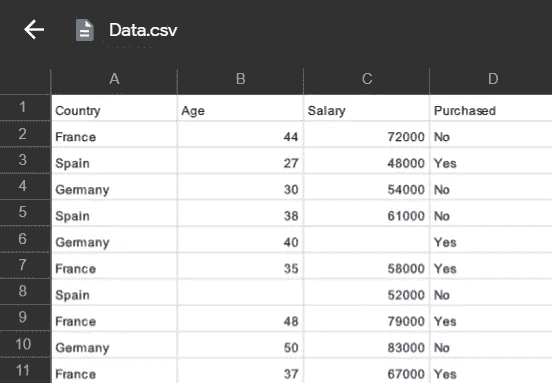

# 机器学习中的数据预处理

> 原文：<https://medium.com/analytics-vidhya/data-preprocessing-for-machine-learning-3e0c53a8e328?source=collection_archive---------20----------------------->

([https://cdn . educba . com/academy/WP-content/uploads/2019/12/Data-preparation-in-Machine-learning . png](https://cdn.educba.com/academy/wp-content/uploads/2019/12/Data-Preprocessing-in-Machine-Learning.png))

*数据预处理是机器学习的一个非常重要的部分，因为我们确实建立了一个机器学习模型，你总是有数据预处理工作要做。*

*我们必须以正确的方式处理数据，这样我们建立的机器学习模型才能以正确的方式对数据进行训练，并给出高精度的结果。*

# 数据预处理的步骤:

**步骤 1** : *导入库*

**第二步** : *导入数据*

步骤 3: *处理丢失的数据*

**步骤 4** : *编码分类数据*

**第五步** : *将数据集拆分成训练集和测试集*

**第六步** : *特征缩放*

## 数据预处理中使用的库:

# **NumPy**

NumPy 是一个通用的数组处理包。它提供了一个高性能的多维数组对象，以及处理这些数组的工具。

它是使用 Python 进行科学计算的基础包。其中包括:

*   一个强大的 N 维数组对象
*   复杂的(广播)功能
*   集成 C/C++和 Fortran 代码的工具
*   有用的线性代数、傅立叶变换和随机数功能

# **Matplotlib**

Matplotlib 是允许我们绘制非常好的图表的库。

Matplotlib 是一个 Python 2D 绘图库，它以各种硬拷贝格式和跨平台的交互式环境生成出版物质量数字。

# **熊猫**

Pandas 是开源的，这个库为 Python 编程语言提供了**高性能**、**易于使用的数据结构**和**数据分析工具**。Pandas 代表“Python 数据分析库”。

# 为什么用熊猫？

Pandas 的酷之处在于它获取数据(如 CSV 或 TSV 文件，或 SQL 数据库)并创建一个包含行和列的 Python 对象，称为**数据框**，它看起来非常类似于统计软件中的表格。

# 导入数据

在 python 上导入数据集是通过使用 pandas 库完成的。

*   首先，我们必须为数据创建一个变量，存储它以备将来使用。
*   之后，我们将创建两个新的实体，其中第一个是矩阵特征，第二个是因变量向量。

.

.

# 处理丢失的数据

通常，由于简单的原因，我们在数据集中没有缺失数据，因为它会在训练机器学习模型时导致错误，因此，我们应该注意它们。

有一些方法可以处理丢失的数据:

*   简单地忽略观察，删除它，只有当我们有大数据集时它才起作用&我们有大约 1%的缺失数据。因此，如果我们删除它，它不会影响模型的学习质量
*   用数据缺失列中的平均值替换缺失数据或缺失值。为此，有像 [Scikit-Learn 库](http://scikit-learn.org/stable/index.html)等库。

Scikit learn 是一个了不起数据科学库，它包含大型工具和许多机器学习模型。因此，为了处理丢失的数据，scikit learn 中有一个类，即 Imputer。使用 Imputer 类可以解决数据缺失的问题。

# 编码分类数据

序号编码涉及将每个唯一标签映射到一个整数值。

两种最流行的技术是一种**整数编码**和一种**热编码。**

对于机器学习模型来说，很难计算出你知道特征的列和因变量的结果之间的一些相关性，因此必须将这些类别转换成数字。

我们将使用 [Scikit-Learn 库](http://scikit-learn.org/stable/index.html)对自变量和因变量进行编码

因此，它有时简称为整数编码。

只有在类别之间存在已知关系的情况下，这种类型的编码才真正合适。

# 将数据集分为训练集和测试集

在机器学习中，我们通常将数据分成两个子集:训练数据和测试数据，我们根据训练数据拟合模型，以便根据测试数据进行预测。

(数据预处理讲座到此结束。敬请关注更多博客。)

训练数据集包含已知的输出，模型学习这些数据，以便以后推广到其他数据。我们有测试数据集，以便测试我们的模型对该数据集或子集的预测。

我们将使用 [Scikit-Learn 库](http://scikit-learn.org/stable/index.html)，特别是 [train_test_split 方法](http://scikit-learn.org/stable/modules/generated/sklearn.model_selection.train_test_split.html)来完成这项工作。

# 特征缩放

***机器学习中的特征缩放*** *是建立机器学习模型前数据预处理过程中最关键的步骤之一。*

*缩放可以在弱机器学习模型和更好的机器学习模型之间产生差异。*

*最常见的特征缩放技术是归一化和标准化。*

这些是在将数据用于机器学习之前预处理数据的一般 6 个步骤。

机器学习中的数据预处理到此为止。敬请关注更多博客。

*谢谢*

乳腺癌数据集上数据预处理的实现

[https://github.com/Navu4/Machine-Learning](https://github.com/Navu4/Machine-Learning)