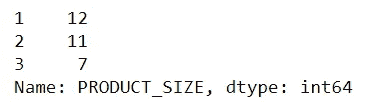
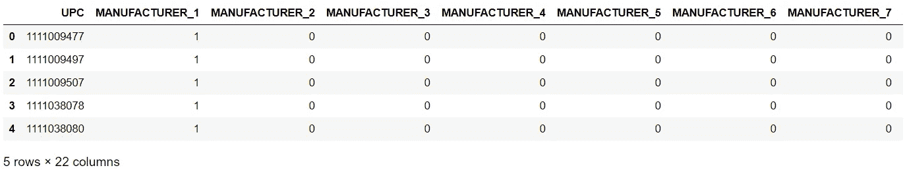

# 实际项目中的数据预处理实现

> 原文：<https://medium.com/analytics-vidhya/data-preprocessing-implementation-in-real-project-e82fa4b8c40c?source=collection_archive---------26----------------------->


在 [Unsplash](https://unsplash.com/?utm_source=unsplash&utm_medium=referral&utm_content=creditCopyText) 上[创作八](https://unsplash.com/@creatveight?utm_source=unsplash&utm_medium=referral&utm_content=creditCopyText)的照片

在本教程中，我将以零售需求预测项目为例，详细讨论如何对分类特征和数值特征进行数据预处理。

从本文中，您将学习以下 Python 技能:

*   一个热编码
*   从变量中删除单位(字符串)
*   将不同的类别替换成数字
*   缺失值插补

# 1 预处理:分类特征

*   找出并估算分类特征中是否有缺失值。
*   删除没有添加太多信息的特征
*   选择编码方案将分类特征转换为数值。

```
# importing required librariesimport pandas as pd
import numpy as np
import category_encoders as ceimport matplotlib.pyplot as plt
%matplotlib inline
```

## 数据集 1:每周销售数据包含以下特征

*   **周 _ 结束 _ 日期** —周日期
*   **商店编号** —商店编号
*   **UPC** —(通用产品代码)产品特定标识符
*   **基价** —项目的基价
*   **展示** —产品是店内促销展示的一部分
*   **特征** —产品在店内通告中
*   **单位** —售出的单位(目标)

```
# read the store data
data = pd.read_csv('dataset/train.csv')
data.head()
```


```
data[['STORE_NUM','UPC','FEATURE','DISPLAY']].isnull().sum()
```


*   STORE_NUM:不需要修改，因为它是一个键，以后将用于合并表。
*   UPC:不需要更改，因为它是键，以后将用于合并表。
*   特性:不需要预处理
*   显示:不需要预处理

## 数据集 2:产品数据包含产品的详细信息

*   **UPC** —(通用产品代码)产品特定标识符
*   **描述** —产品描述
*   **制造商** —产品制造商
*   **类别** —产品类别
*   **子类** —产品的子类
*   **产品尺寸** —产品的包装尺寸或数量

```
product_data = pd.read_csv('dataset/product_data.csv')
product_data.head()
```


```
product_data.shape
product_data[['UPC','DESCRIPTION','MANUFACTURER','CATEGORY', 'SUB_CATEGORY', 'PRODUCT_SIZE']].isnull().sum()
```


***没有空值***

```
# number of unique description
product_data['DESCRIPTION'].nunique()
# number of unique manufacturer
product_data['MANUFACTURER'].nunique()
# number of unique categories
product_data['CATEGORY'].nunique()
# number of unique sub categories
product_data['SUB_CATEGORY'].nunique()
# number of unique product sizes
product_data.PRODUCT_SIZE.nunique()
```

*   **描述** -在描述中，我们有产品的类别、子类别和尺寸，这些也已经存在于其他特征中。因此，我们将放弃这个特性，因为它不会给模型增加太多价值。
*   **制造商、类别、子类别** -因为在给定的类别中没有订单，所以我们将对此特征进行热编码。
*   **PRODUCT_SIZE** —不同类别产品的产品尺寸单位不同。因此，对于每个类别，我们将根据不同的尺寸进行宁滨。

```
# drop the DESCRIPTION FEATURE
product_data = product_data.drop(columns= ['DESCRIPTION'])# remove the units from the product size
# we will keep only the values
product_data['PRODUCT_SIZE'] = product_data.PRODUCT_SIZE.apply(lambda x: x.split()[0])# change data type of product size from string to float
product_data.PRODUCT_SIZE = product_data.PRODUCT_SIZE.astype(float)# Let's see the unique product size values for each category
product_data.groupby(['CATEGORY'])['PRODUCT_SIZE'].unique()
```


```
# define 3 bins for category type = "COLD CEREAL"
product_data.loc[product_data.CATEGORY == 'COLD CEREAL', 'PRODUCT_SIZE'] = pd.cut(product_data.PRODUCT_SIZE,bins=[10,13,16,21],labels=[1,2,3])# define 2 bins for category type = "ORAL HYGIENE PRODUCTS"
product_data.loc[product_data.CATEGORY == 'ORAL HYGIENE PRODUCTS', 'PRODUCT_SIZE'] = pd.cut(product_data.PRODUCT_SIZE,bins=[0,501,1001],labels=[1,2])# define 3 bins for category type = "FROZEN PIZZA"
product_data.loc[product_data.CATEGORY == 'FROZEN PIZZA', 'PRODUCT_SIZE'] = pd.cut(product_data.PRODUCT_SIZE,bins=[20,25,30,35],labels=[1,2,3])# define 2 bins for category type = "BAG SNACKS"
product_data.loc[product_data.CATEGORY == 'BAG SNACKS', 'PRODUCT_SIZE'] = pd.cut(product_data.PRODUCT_SIZE,bins=[9,14,20],labels=[1,2])# value counts of PRODUCT SIZE
product_data.PRODUCT_SIZE.value_counts()
```



```
# One Hot Encode the features
OHE_p = ce.OneHotEncoder(cols= ['MANUFACTURER', 'CATEGORY', 'SUB_CATEGORY'])# transform the data
product_data = OHE_p.fit_transform(product_data)# updated data
product_data.head()
```



## 数据集 3:存储数据

*   **商店标识** —商店编号
*   **店铺名称** —店铺名称
*   **地址 _ 城市 _ 名称** —城市
*   **地址 _ 状态 _ 证明 _ 代码** —状态
*   **MSA_CODE** —(大都市统计区域)基于地理区域和人口密度
*   **细分值名称** —商店细分名称
*   **PARKING_SPACE_QTY** —商店停车场的停车位数量
*   **SALES_AREA_SIZE_NUM** —店铺面积
*   **AVG _ 每周 _ 购物篮** —商店每周售出的平均购物篮

```
# read the store data
store_data = pd.read_csv('dataset/store_data.csv')store_data.head()
```


```
# shape of the store data
store_data.shape# check for the null valuesstore_data[['STORE_ID','STORE_NAME','ADDRESS_CITY_NAME','ADDRESS_STATE_PROV_CODE', 'MSA_CODE', 'SEG_VALUE_NAME']].isnull().sum()
```


```
# number of unique store names
store_data.STORE_NAME.nunique()# number of unique city names
store_data.ADDRESS_CITY_NAME.nunique()# number of unique state provision code
store_data.ADDRESS_STATE_PROV_CODE.nunique()# number of unique msa code
store_data.MSA_CODE.nunique()# number of unique segment value names
store_data.SEG_VALUE_NAME.nunique()
```

*   **STORE_ID** —无需更改，因为它是一个键，以后将用于合并文件。
*   商店名称 —因为，在 76 家不同的商店中，我们有 72 个独特的商店名称。商店名称包含商店的一些位置信息，这些信息以地址、城市名称和州的形式存在。因此，我们将放弃这一功能。
*   **ADDRESS_CITY_NAME** —因为在 76 个不同的商店中，我们有 51 个唯一的地址城市名称，所以由于基数较高，我们将放弃该功能
*   **ADDRESS _ STATE _ PROV _ CODE**， **MSA_CODE** —由于给定的类别中没有顺序，所以我们将对这个变量进行热编码。
*   商店细分分为三类:高档、主流和超值。高档商店就像它们听起来的那样；它们通常位于高收入社区，提供更高端的产品。主流是中间路线，大多位于中产阶级地区，提供高档和价值产品的组合。超值商店更多地迎合低收入顾客，所以低价会比其他东西更受关注。

所以我们将**值映射为 1** ，**主流映射为 2** ，而**高档映射为 3**

```
# drop store name and address
store_data = store_data.drop(columns=['STORE_NAME','ADDRESS_CITY_NAME'])# OneHotEncode the rest of the categorical features
ONE =ce.OneHotEncoder(cols=['ADDRESS_STATE_PROV_CODE', 'MSA_CODE'])# transform the data
store_data = ONE.fit_transform(store_data)store_data.SEG_VALUE_NAME = store_data.SEG_VALUE_NAME.map({'value':1,'MAINSTREAM':2,'UPSCALE':3})# columns of the updated data
store_data.columns
```


# 2 预处理:数字特征

*   检查并估算数字特征中缺失的值。
*   检查异常值并处理它们。

## 数据集 1:每周销售数据

```
data.head()
```


每周销售数据具有以下数字特征:基本价格、单位(目标)

```
# check the null values for the numerical features
data[[ 'BASE_PRICE', 'UNITS']].isna().sum()
```


***输入基础价格中的缺失值***

```
# creaating a new dataframe which will have "average base price" for the combination of STORE_NUM and UPC
# We will use this to impute the missing values
avg_price = data.groupby(['STORE_NUM','UPC'])['BASE_PRICE'].mean().reset_index()avg_price
```


```
# null values in BASE PRICE
data.loc[data.BASE_PRICE.isna() == True]
```


```
# define function to fill missing base price values
def fill_base_price(x) :
    return avg_price.BASE_PRICE[(avg_price.STORE_NUM == x['STORE_NUM']) & (avg_price.UPC == x['UPC'])].values[0]data.BASE_PRICE[data.BASE_PRICE.isna() == True] = data[data.BASE_PRICE.isna() == True].apply(fill_base_price, axis=1) # scatter plot for UNITS variable
# sort the target variable and scatter plot to see if it has some outliers or not%matplotlib notebook
plt.figure(figsize=(8,6))plt.scatter(x = data.index, y = np.sort(data['UNITS'].values))
```


我们可以看到，在上面的一些点上，单位超过 750 个，而它们的数量只有 21 个。因此，我们可以删除它们，因为它们的数量只有 21，不会影响数据，这些数据会对我们的模型产生干扰。


## 商店数据具有以下数字特征

*   停车位数量
*   销售面积大小数量
*   AVG _ 周刊 _ 篮子

```
# check for the null values
store_data[['PARKING_SPACE_QTY', 'SALES_AREA_SIZE_NUM', 'AVG_WEEKLY_BASKETS']].isna().sum()
```


PARKING _ SPACE _ QTY 检查其与 SALES_AREA_SIZE_NUM 的相关性

```
# check correlation
store_data[['PARKING_SPACE_QTY','SALES_AREA_SIZE_NUM']].corr()
```


由于 **PARKING_SPACE_QTY** 与 **SALES_AREA_SIZE_NUM** 的相关性很高，因此我们可以删除此列，因为它不会给模型增加太多价值。

```
# drop the column
store_data = store_data.drop(columns=['PARKING_SPACE_QTY'])
```

# 3 保存更新的文件

```
data.to_csv('updated_train_data.cas', index=False)
product_data.to_csv('updated_product_data.csv',index=False)
store_data.to_csv('updated_store_data.csv',index=False)
```

作为参考，请查看此处的笔记本。