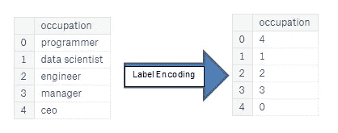

# 机器学习模型中的数据预处理

> 原文：<https://medium.com/analytics-vidhya/data-preprocessing-in-machine-learning-model-3af34d0f3ceb?source=collection_archive---------9----------------------->

数据预处理

# 数据预处理

*数据预处理是将原始数据转换成可理解格式的数据。原始数据包含缺失数据、噪声数据和许多错误。利用数据预处理技术可以解决所有的问题。整个数据集被分成训练集和测试集。该训练集用于训练机器学习模型。*

原始数据— —经过处理的数据

# 原始数据

*原始数据是未经加工的计算机数据。这些信息可能存储在文件中，也可能只是存储在计算机硬盘某处的数字和字符的集合。例如，输入数据库的信息通常被称为原始数据。*

# 为什么要进行数据预处理？

*原始数据包含大量缺失数据、噪音数据和错误，因此我们不能在机器学习模型中使用这种格式。预处理数据仅用于机器学习模型。*

更好的数据预处理提高了模型的精度。因此，在机器学习和深度学习模型中，数据预处理是最重要的。

# 数据预处理技术

1.获取数据集。
2。导入库。
3。正在导入数据集。
4。编码分类数据。
5。寻找丢失的数据。
6。将数据集分为训练集和测试集。
7。特征缩放。

## 1.获取数据集

*首先，我们从网站或任何其他地方获取数据集。数据集具有 csv 或 excel 格式。csv 表示逗号分隔值，excel 是正常的 Microsoft excel 格式。titanic 数据集用于这种数据预处理技术。*

 [## 泰坦尼克号:机器从灾难中学习

### 从这里开始！预测泰坦尼克号上的生存并熟悉 ML 基础知识

www.kaggle.com](https://www.kaggle.com/c/titanic/data) 

## 2.导入库

*导入数据预处理所需的所有包。pandas 包用于处理数据集。Numpy 用于在数据集上执行的数组操作。matplotlib 用于可视化数据。*

## 3.导入数据集

*使用熊猫将数据集导入到 python 文件中。*

## 4.编码分类数据

*数据集有一些字符串格式的卷。机器学习模型只允许数值。通过分类值技术将字符串转换成数值。*

*两种技术:
1 .标签编码器
2 .一个热编码器*

## 标签编码器

标签编码

*SK learn 提供了一个非常有效的工具，用于将分类特征的级别编码成数值标签编码器使用 0 和 n_classes-1 之间的值对标签进行编码，其中 n 是不同标签的数量。*

*“性别”栏不是数值。所以转换成数值。*

## 一个热编码器

一个热编码器

## 5.查找丢失的数据

缺失数据通过各种方法填充，以下方法用于填充缺失值。
1。平均值/中位数
2。零方法
3。最常见的值

缺少值

*前 5 列中缺失值较多。现在，我们可以填充“年龄”和“费用”列中缺少的值。*

## 平均值/中值

在缺失值列中找到平均值，然后将平均值填入缺失值位置。

## 零点方法

*缺失值用零填充。*

## 最常见的值

*缺失值由该特定列中最常用的数据填充。*

## 6.将数据集分为训练集和测试集

*数据集分为训练集和测试集。重要特征仅选择用于该模型训练过程，因为通过选择数据集中最重要的特征来增加准确性。*

## 7.特征缩放

*特征缩放是一种将固定范围内的数据中存在的独立特征标准化的技术。在回归算法中使用特征缩放以获得更高的精度。*

现在，数据已准备好构建机器学习模型。

如果你想要完整的代码，请访问我的 Github 页面

 [## jack Daniel-软解决方案/机器学习-算法

### 此时您不能执行该操作。您已使用另一个标签页或窗口登录。您已在另一个选项卡中注销，或者…

github.com](https://github.com/jackdaniel-softsolution/Machine-Learning-Algorithms/tree/master/Machine%20Learning%20Algorithms/03.%20data%20preprocessing)