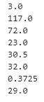
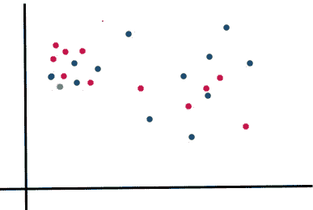

# 数据挖掘中的数据预处理技术

> 原文：<https://medium.com/analytics-vidhya/data-preprocessing-techniques-in-data-mining-4c90666f6f7a?source=collection_archive---------3----------------------->


图片来自 pexel

假设你从任何一个著名的电子商务网站上搜索了一条牛仔裤，后来因为某些原因你决定不买它，并关闭了你的购物应用程序，过了一段时间，如果你打开浏览器进行冲浪，你会发现你当时搜索的相同产品，这是机器学习的一个非常重要的实现。另一个著名的实现是谷歌语音助手，你可能已经在你的手机和 Alexa 中看到了它的实现，顾名思义，当通过语音询问时，它们可以帮助找到信息。机器学习是这些个人助理的重要组成部分，因为它们根据你之前与它们的接触来收集和提炼信息。稍后，这组数据将用于呈现根据您的偏好定制的结果。

现在事情变得越来越有趣，我最喜欢的机器学习在 ML 中的应用是，它在视频监控系统中的使用。如今的视频监控系统是由人工智能驱动的，这使得在犯罪发生之前发现犯罪成为可能。他们跟踪人们不寻常的行为，比如长时间一动不动地站着，磕磕绊绊，或者在长椅上打盹等等。因此，该系统可以向服务员发出警报，这最终有助于避免灾难。

那么，你认为实现所有这些应用的主要重要因素是什么？不要太担心它的数据🤗。因此，我们需要处理这些数据，并针对我们的应用进行相应的调整。


来源:[期限](https://tenor.com/view/data-on-data-off-appurv-gupta-the-laugh-club-comedy-bar-comedy-stint-gif-12085621)

> 我将在这篇文章中讨论什么？？

1.数据预处理及其子技术介绍。

2.我们将获取一个数据集，并在**上工作，通过找到缺失值和有噪声的数据来清理数据**，然后使用一些基本的 python 命令(如 Mean、Median、Mode)填充缺失值。并使用一些复杂的填充技术，如 K 近邻、多元插补和深度学习技术。

3.稍后我们将看到一些数据整理技术。

**数据预处理介绍**

数据预处理是一项至关重要的数据挖掘技术，主要处理清理原始数据并将其转换成有用且可理解的格式。通俗地说，原始数据往往是不完整的，不一致的，可能缺乏某些行为，并可能包含许多错误，将我们的算法应用于它将减少不准确性。数据预处理是解决这类问题的一种行之有效的方法。数据预处理是从记录集、表或数据库中检测和纠正(或删除)损坏或不准确记录的过程，是指识别数据中不完整、不正确、不准确或不相关的部分，然后替换、修改或删除脏数据或粗糙数据。


来源:[期限](https://tenor.com/view/tired-panda-gif-9965672)

在数据预处理中，主要有三个重要的子主题:

*   *数据清洗。*
*   *数据转换。*
*   *数据还原。*

## 数据清理:

数据清洗是通过处理不相关和缺失的元组来清洗原始数据的过程。在进行我们的机器学习项目时，我们获取的数据集可能并不完美，它们可能有许多杂质、有噪声的值，并且大多数时候实际数据可能会丢失。在数据清理期间，我们将面临的主要问题是:

我们可以故意将缺失值添加到我们的数据集中吗？

是啊！在我们的例子中，我们的数据集中可能有缺失值，但是如果您想要处理其他数据集中没有缺失值的数据，您可以使用下面的代码按照您的意愿故意添加缺失值:

```
import pandas as pd
import numpy as np
import random
df = pd.read_csv(r'diabetes.csv')
nan_percent = {'Pregnancies':0.10, 'Glucose':0.15, 'BloodPressure':0.10,'SkinThickness':0.12,'Insulin':0.10,'BMI':0.13,'DiabetesPedigreeFunction':0.11,'Age':0.11,'Outcome':0.12}  
for col in df:                         
    for i, row_value in df[col].iteritems():
        if random.random() <= nan_percent[col]:              
            df[col][i] = np.nan
df.to_csv(r'NaNdiabetes.csv')
```

在上面的代码中，在第 5 行我们提到了在我们的数据集的每一列中我们需要多少百分比的缺失值。这将导致以上述速率插入缺失值。

a) **缺失数据:**

我们正在处理的数据集包含缺失值，我们需要使用各种技术来填充它们:

> 1.忽略丢失的值*😉*。

在下面的实践中，我将使用[皮马印第安人糖尿病](https://www.kaggle.com/uciml/pima-indians-diabetes-database)数据集

```
import pandas as pd
df=pd.read_csv("pima-indians-diabetes.csv")
cols=["Pregnancies","Glucose","BloodPressure","SkinThickness","Insulin","BMI","DiabetesPedigreeFunction","Age"]
df[cols] = df[cols].replace({0:np.nan})
df.isnull().sum()
```


图 1:上面代码的输出

在原始数据集中，缺失的 NaN 值用 0 表示，因此为了方便起见，我用'替换它们。“replace()”函数。

如果您遵循上面的命令，您将得到上面的输出，显示每一列中缺少的值。因此，如果我们删除所有缺失值的行，那么我们的数据集将变得不完整，我们可能会丢失其他列中存在的一些重要信息，从而使我们的预测不太准确。如果缺少的值非常少，我们可以遵循这种方法，但是如果缺少的值很多，我们就不应该删除它们。因此，如果缺失值计数太高，我们就不应该采用这个定理。

> 2.填充缺少的值*。*

既然我们不能忽略计数过高的缺失值，那么我们现在要做什么呢？？😕。


来源:[男高音](https://tenor.com/search/dont-worry-gifs)

不要担心，我们可以通过使用一些基本和高级的填充技术填充适当的值来处理它们。这些技术包括:

1.  用像零这样的常数值填充。
2.  卑鄙。
3.  中位数。
4.  模式。
5.  K-最近邻居。
6.  使用链式方程多元插补的插补(小鼠)。
7.  使用深度学习的插补(Datawig)。

现在让我们把手弄脏(就像一些程序员说的..😅)通过编码来填补我们缺失的值

> **1。使用常数值(如“零”**)填充缺失值

```
import pandas as pd
import numpy as np
df=pd.read_csv("diabetes.csv")
cols = ["Pregnancies","Glucose","BloodPressure","SkinThickness","Insulin","BMI","DiabetesPedigreeFunction","Age"]
df[cols] = df[cols].replace({np.nan:0})
df.isnull().sum()
```


图 2

正如您在图 2 中看到的，缺失值的总和是 0，这意味着所有缺失值都被替换为零。

> 2.**使用平均值填充缺失值。**

我希望你们都知道它的含义，但我只用两个词来概括它。

*   它是给定集合中所有值的算术平均值。
*   计算方式为所有数字的总和除以数据点的总数


平均公式

用平均值填充缺失值的第一步是计算每列的平均值。

```
import pandas as pd
import numpy as np
df=pd.read_csv("diabetes.csv")
df.mean()
```


图 3:每列的平均值

现在让我们看看如何用上面生成的**平均值**填充数据集中的空值:

```
print(df.head())
for index,value in enumerate(cols):
    df[value]=df[value].replace([0],c[index])print(df.head())
```


图 4


图 5

在图 4 的**中，**如您所见，缺失值表示为 NaN，现在，如果我们将缺失值填充代码应用于数据集，我们将获得如图 5 所示的结果。在图 5 的**中没有缺失值，所有缺失值都由各自列的平均值填充。**

> **3。用中值填充缺失值。**

我们可以遵循与上面相同的技术，但是需要用中间值代替平均值。

让我们谈一谈中位数，简单来说，它是按升序排列时数据集的最中间值。


中位数公式

那么什么时候应该使用中位数而不是平均数来填充缺失值呢？🤔

如果我们的数据集有很多异常值，我们必须使用中值高于平均值，因为对不规则数据应用平均值会导致异常输出，从而导致错误的准确性。

我将用一个例子来说明这一点，假设您正在处理一个数据集，该数据集包含来自一个州的成年人的体重。一般来说，成年人的体重在 50-110 公斤之间，但是当数据输入时，一只猫🐹走在你的键盘上，输入一些重量，如 998，530，213，12，-234，-4546 等..，这些不规则的值称为异常值。现在，如果您对包含异常值的不规则数据集应用平均值，将导致异常平均值。因此，为了避免这种人为错误，我们将使用**中值。**

为了应用**中位数，**数据应该按降序或升序排列。使用**中值函数**的最大优点是数据列表在作为参数发送给 median()函数之前不需要排序。

```
import pandas as pd
import numpy as np
df=pd.read_csv("diabetes.csv")
c=df.median()
print(c)
```


图 6:每列的中值

如果你想检查中位数是否默认排序数据，参考下面的代码，这里我在应用 **median()** 函数本身之前删除了丢失的值。最后，两者给我们相同的结果:—

```
import pandas as pd
import numpy as np
df=pd.read_csv("diabetes.csv")
cols = ["Pregnancies","Glucose","BloodPressure","SkinThickness","Insulin","BMI","DiabetesPedigreeFunction","Age"]
for i in cols:
    a=df[i]
    a=a.dropna()
    b=a.sort_values(axis=0,ascending=True)
    print(b.median())
```



图 7:上述代码的输出

现在让我们看看如何用上面生成的**中值**填充数据集中的空值:

```
print(df.head())
for index,value in enumerate(cols):
    df[value]=df[value].replace([0],c[index])
print(df.head())
```


图 8


图 9

在图 8 中，缺失值由 **NaN** 值表示，缺失的 NaN 值由我们之前计算的中值代替，如图 9 所示。

> 4.**用模式填充缺失值。**

众数是给定数据集中重复次数最多的值，由离散值或分类值组成。也可以有两种模式(双模态)、三种模式(三模态)或四种或更多种模式(多模态)。

所以最重要的问题是我们应该什么时候使用 Mode 来填充缺失的值？

答案很简单，最好是使用**模式**如果你有分类变量，分类变量取值为名称或标签。这些是定性的。我们可以进一步将这些分类属性定义为名词性的**或序数的**。一个名义变量对其类别没有内在的排序。例如，性别是一个具有两个类别(男性和女性)的分类变量，这些类别没有内在的顺序。序数变量有明确的顺序。例如，温度作为一个变量有三个*有序的*类别(低、中、高)。****

****我们的数据集由数字属性组成，每个数字可能不会重复很多次，因此不推荐使用模式作为填充缺失值的主要技术，因为它可能不会给出期望的结果。****

**现在让我们看看 **mode()** 函数的工作原理。**

```
for i in cols:
    a = df.groupby(np.arange(len(df))//768)[i].apply(lambda x: x.mode())
    print(a)
```

****

**图 10:上述代码的输出**

**代替上面的代码，你可以直接在数据框上使用简单的 **mode()** 函数，如下所示:**

```
import pandas as pd
import numpy as np
df=pd.read_csv("diabetes.csv")
df=df.replace([0],np.NaN)
c=df.mode()
print(c)
```

****

**图 11:上述代码的输出**

**如果您在图 10 和 11 中观察到，葡萄糖和糖尿病谱系函数属性有两个模式值，这意味着可能有两个值出现的次数最多。**

**现在，让我们使用计算出的模式值来填充缺失的值。**

```
cols = ["Pregnancies","Glucose","BloodPressure","SkinThickness","Insulin","BMI","DiabetesPedigreeFunction","Age"]
for i in cols:
    a = df[i].mode()
    print(a[0])
    df[i]=df[i].replace(to_replace=[0],value=a[0])
print(df.head(10))
```

****

**图 12:上述程序的输出**

**在这里，如果您观察第 7 个实例中的血压值，您可以看到缺失的值被相应的模式值所替代。**

> ****5。使用 K 近邻填充缺失值****

**那么什么是 K 近邻呢？这是什么意思？是新话题吗？很难吗？**

****

**来源:[男高音](https://tenor.com/view/panic-spongebob-patrick-scared-running-gif-7888576)**

**不要慌！！这是一种非常先进的技术，可用于连续、离散、有序和分类的各种数据。K-NN 是一种算法，它将所需的值与其 k 个最近的邻居之一进行匹配。它属于非参数的、基于实例的和**监督学习领域**，并在模式识别、数据挖掘、入侵检测中找到应用。考虑下面的例子**

****

**图 13**

**在图 13 中，绘制了两种不同的类别，红色和蓝色。现在考虑一个用绿点表示的新实例被引入数据帧(图 14)**

****

**图 14**

**现在我们的目标是将绿点分配到红类或蓝类。对于这种类型的分类，我们将使用 K-NN 技术。K-NN 的参数为“ **k** ”。它是一个数值，表示该点周围相邻点的数量。选择满足我们要求的合适 k 值非常重要-采用低 k 值会减少周围的邻域，导致结果的概化程度较低。另一方面，采用高 k 值会覆盖所有可能的类别，会模糊局部效果，而这正是我们想要的。**

## **那么 KNN 是如何运作的呢？**

**假设 **k=10** ，意味着我们必须选择围绕绿点的 10 个最近的邻居。为了选出这 10 个点，我们需要计算从绿点到数据集中所有其他可能点的距离，为此，我们将主要使用**欧几里德距离。**由 **:** 给出**

****

**[公式为**欧氏距离**公式为](https://kevinzakka.github.io/2016/07/13/k-nearest-neighbor/#:~:targetText=Despite%20its%20simplicity%2C%20KNN%20can,based%20on%20their%20expression%20profiles.)**

**涉及的步骤:**

*   ****Step1:** 遍历数据集中的每个点，计算 **x** 与每个训练观测值之间的距离 **d** (这里 x1，x2，…&x’1，x’2…代表数据点的坐标)。**
*   ****Step2:** 在所有距离(d)中，我们称最接近 **x 的 **k** 点，**这些是我们的 k 近邻。**
*   ****步骤 3:** 获得最近的邻居后，我们的下一步是将该点绘制到一个合适的类中。**

**如果你参考图 15，你可以观察到在一组点周围画了一个圆，也包括我们的绿点。如果您计算圆内的点，除了绿色之外还有 10 个点，这意味着围绕绿色点选择了 10 个邻居，其中点 **4 是蓝色的**和 **6 是红色的，**因此，在良好的置信水平下，我们可以说绿色点应该属于红色类。在该算法中，参数 K 的选择非常关键。**

****

**图 15**

****代码:****

```
import pandas as pd
import numpy as np
import impyute
from impyute.imputation.cs import fast_knn 
df=pd.read_csv("diabetes.csv")
cols = ["Pregnancies","Glucose","BloodPressure","SkinThickness","Insulin","BMI","DiabetesPedigreeFunction","Age"]
for i in cols:
    df[i]=df[i].replace(to_replace=[0],value=np.NaN)
k-nn_impute=fast_knn(df, k=3)
pd.DataFrame(k-nn_impute).to_csv("file_k-nn.csv")
```

****

**图 16:上述代码的输出**

**在图 16 中，您可以看到缺失值已被加权最近邻值填充。**

> **6。通过链式方程使用多元插补填补缺失值(小鼠)**

**多重插补是复杂的不完整数据问题的首选方法。MICE 在假定插补程序中使用的给定变量在随机位置具有缺失数据的情况下运行，称为**随机缺失(MAR)。**填充缺失值将在以下步骤中完成:**

*   **第一步:首先，我们将使用各自属性的平均值来填充每个变量/属性中所有缺失的值。**
*   **第二步:现在，第一个变量(姑且称之为 **v)** 的估算平均值将被设置回 NaN，剩下的其他变量(姑且称之为 **totalset-v=l** )将使用它们的估算平均值。**
*   **第三步:现在对由 **l 预测的 **v** 进行线性回归，使用所有观察到 **v** 的情况运行**。**
*   **步骤 4:这里，缺失值 **v** 的预测将从回归方程中获得并进行估算。此时，变量 **v** 中没有任何缺失值。**
*   **步骤 5:将重复步骤 2-4，取一个新变量为 **v，**也改变 **l.** 的值**

****代号:****

```
import pandas as pd
import numpy as np
import impyute
from impyute.imputation.cs import mice
df=pd.read_csv("diabetes.csv")
cols = ["Pregnancies","Glucose","BloodPressure","SkinThickness","Insulin","BMI","DiabetesPedigreeFunction","Age"]
for i in cols:
    df[i]=df[i].replace(to_replace=[0],value=np.NaN)
mice_imp=mice(df)
pd.DataFrame(mice_imp).to_csv("file_MICE.csv")
```

****

**图 17:上述代码的输出**

**在图 17 中，您可以观察到缺失值已被多元插补填补。**

> ****7。使用 Datawig 填充缺失值。****

**这里我们将使用库 **Datawig** ，这种方法对于
分类和非数字特征非常有效。这是一个学习机器
学习模型的库，使用深度神经网络来估算
数据帧中的缺失值。**

****Datawig** 期待您提供:**

*   **您要为其估算值的列的列名(下面称为 output_column)和一些。**
*   **包含您认为对插补有用的值的列名(以下称为 input_columns)。**

```
import datawig
import pandas as pd
import numpy as np
df=pd.read_csv("diabetes.csv")
cols = ["Pregnancies","Glucose","BloodPressure","SkinThickness","Insulin","BMI","DiabetesPedigreeFunction","Age"]
for i in cols:
    df[i]=df[i].replace(to_replace=[0],value=np.NaN)
df_train, df_test = datawig.utils.random_split(df)
imputer = datawig.SimpleImputer(
    input_columns=[ 'Glucose', 'BloodPressure','SkinThickness','Insulin','BMI','DiabetesPedigreeFunction','Age','Outcome'],output_column= 'Pregnancies',output_path = 'imputer_model')
imputer.fit(train_df=df_train)
imputed = imputer.predict(df_test)
pd.DataFrame(imputed).to_csv("file_datawig.csv")
```

****

**所以，本文到此结束。感谢您阅读这篇文章，希望您喜欢它，并发现它很有趣！！**

> **那么下一步是什么？？**

**我们的下一步是对数据集应用不同的算法，并计算我们之前讨论过的不同算法的精确度，然后比较精确度，找出哪个模型最适合清理数据集。**

**我将在接下来的文章中讨论这些问题。**

**……………………………………………………………………………………….**