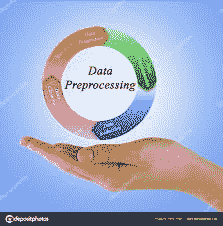
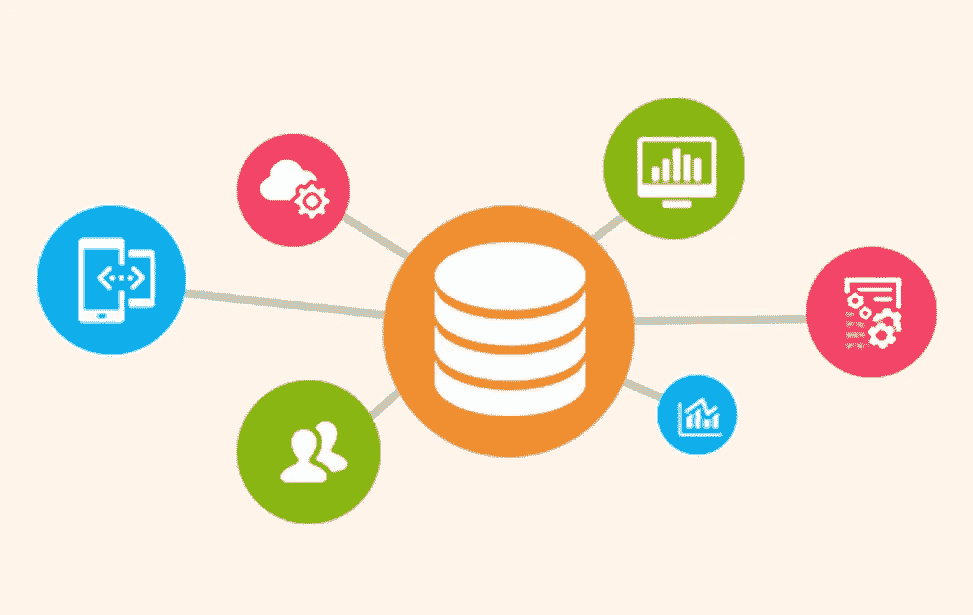
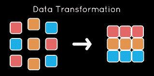

# 数据预处理——数据科学的第一步

> 原文：<https://medium.com/analytics-vidhya/data-preprocessing-the-first-step-in-data-science-eed6e577492c?source=collection_archive---------16----------------------->

我们都知道，我们周围的数据量正在迅速增加，数据中出现异常的可能性也在增加。数据中出现这种异常的原因可能是任何东西，如不同来源的来源，也可能是由于巨大的体积。考虑到高质量的数据导致更好的模型和预测，数据预处理已经成为数据科学/机器学习中至关重要的基本步骤。

正在收集的数据的质量可以通过 3 个主要因素来评估:

1.  **精度**:显示与预期值有偏差的错误值。
2.  **完备性**:缺少属性/特征值。
3.  **一致性** : [数据汇总](https://en.wikipedia.org/wiki/Data_aggregation)不一致。

影响上述因素的一些原因可能是:

*   在数据输入和传输过程中可能出现的人/计算机错误。
*   用户提交了不正确的值。
*   输入字段的格式不正确。
*   数据不可用。

> 为了保证数据的高质量，数据预处理至关重要。

数据预处理分为四个阶段:

数据预处理阶段

*   数据清理
*   数据集成
*   数据整理
*   数据转换。

# 数据清理

数据清理可以解释为通过移除异常值、替换缺失值、平滑噪声数据和纠正不一致数据来“清理”数据的过程。

## ->处理缺失值

为了处理缺失数据，我们可以使用多种方法:

1.  **删除训练示例**:最简单的方法是忽略带有缺失输出标签的特定训练示例(如果是分类问题的情况)。但是通常不鼓励这样做，因为这会导致数据丢失。
2.  **手动填写缺失值**:另一种方法是将缺失值手动输入系统，但这很耗时，不建议用于大型数据集。
3.  **用标准值替换缺失值**:缺失值可以用一个全局常数替换，如“N/A”或“Unknown”。这是一个非常基本的方法，通常用来防止数据丢失和遇到丢失的值。
4.  **使用集中趋势(*均值、中位数、众数* )** :基于数据分布，可以使用均值(正态分布的情况下)或中位数(非正态分布的情况下)来填充缺失值。

## ->处理噪音数据

数据中的噪声被定义为测量变量中的随机方差。简而言之，有噪声的数据是具有大量附加无意义信息的数据(数据可能被破坏或失真)。

为了处理这些异常值，我们使用数据平滑技术，如下所述:

1.  **宁滨**:这是一个将连续的测量划分为离散区间的过程，这些区间被称为信息仓，然后我们在这些信息仓周围寻找数据中的噪声。去宁滨有各种各样的方法。其中的两个是 ***按箱平滑意味着*** ，其中每个箱被箱值的平均值替换，以及 ***按箱中值平滑*** ，其中每个箱被箱值的中值替换。
2.  **回归**:线性回归和多元线性回归可以用来平滑数据，其中的值符合一个函数。
3.  **异常值分析**:聚类等方法可用于检测异常值并进行相应处理。

# 数据集成

数据集成

由于数据是从多个来源收集的，数据集成已经成为该过程的一个重要部分。由于各种原因，这可能导致冗余和不一致的数据，从而导致数据模型的准确性和速度较差。为了处理这些问题并保持数据的完整性，诸如元组重复检测和数据冲突检测的方法被寻求。集成数据最常用的方法是:

1.  **数据整合**:数据被一起物理购买到一个数据存储中。这通常涉及[数据仓库](https://www.tutorialspoint.com/dwh/dwh_data_warehousing.htm)。
2.  **数据传播**:使用应用程序将数据从一个位置复制到另一个位置称为数据传播。它可以是同步或异步的，并且是事件驱动的。
3.  **数据虚拟化**:一个界面用于提供来自多个来源的数据的实时统一视图。可以从单一访问点查看数据。

# 数据整理

数据简化的目的是在保持原始数据完整性的同时，得到一个更小的数据集的压缩表示。这导致有效但相似的结果，因为它提高了数据的质量。减少数据量的几种方法是:

1.  **缺失值比率**:缺失值超过阈值的属性被删除。
2.  **低方差过滤器**:方差(分布)小于某个阈值的标准化属性也被删除，因为数据中的小变化意味着更少的信息。
3.  **高相关性过滤器**:相关系数大于阈值的归一化属性也被移除，因为相似的趋势意味着携带相似的信息。相关系数通常使用统计方法计算，如皮尔逊的[卡方](https://en.wikipedia.org/wiki/Chi-squared_test)值等。
4.  **主成分分析** : PCA，是一种统计方法，通过将高度相关的属性分组在一起，减少属性的数量。随着每次迭代，初始特征被减少到主分量，在它们与前面的分量不相关的条件下，具有比原始集合更大的方差。该方法仅适用于具有数值的要素。

# 数据转换

数据预处理的最后一步是将数据转换成适合数据建模的形式。这可以通过以下方式实现:

1.  **平滑**
2.  **属性/特征构建**:根据给定的属性集构建新的属性。
3.  **聚合**:对给定的属性集应用汇总和聚合操作，以产生新的属性。
4.  **归一化**:每个属性中的数据在一个较小的范围内缩放(如 0 比 1 或-1 比 1)。
5.  **离散化**:数值属性的原始值被离散的或概念上的区间代替，这些区间又可以进一步组织成更高层次的区间。
6.  **名义数据的概念层次生成**:名义数据的值被推广到更高阶的概念。

> 尽管有多种预处理数据的方法，但由于每天都会以极快的速度产生大量不一致的数据，因此它仍然是一个活跃的研究领域。

> 参考资料:

你可以在这里尝试用熊猫来实现数据预处理:[https://github.com/bhartendudubey/Data-Preprocessing](https://github.com/bhartendudubey/Data-Preprocessing)

为了更好地理解，可以考虑以下文章:

1.  [数据预处理——机器学习](https://www.simplilearn.com/data-preprocessing-tutorial)

2.[你应该知道的数据预处理技术](https://towardsdatascience.com/data-pre-processing-techniques-you-should-know-8954662716d6)

3.[Python 中的数据预处理](https://towardsdatascience.com/data-preprocessing-in-python-b52b652e37d5)