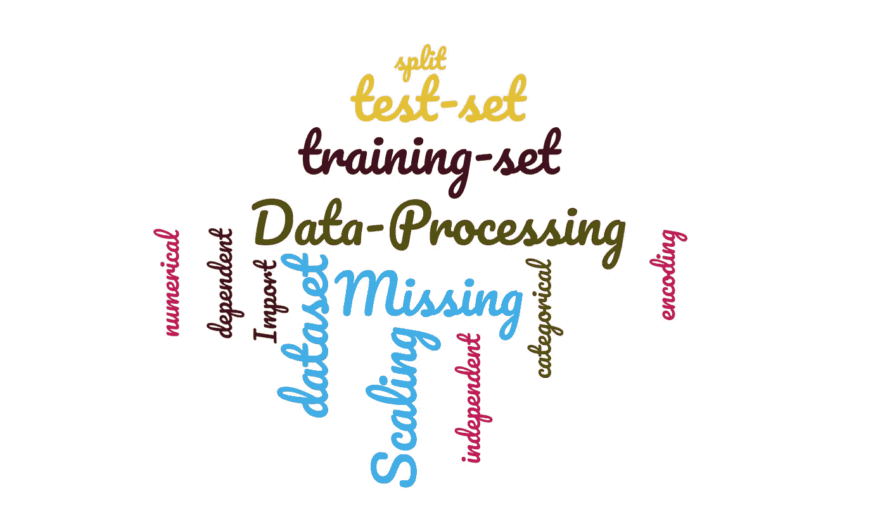
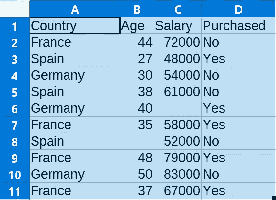
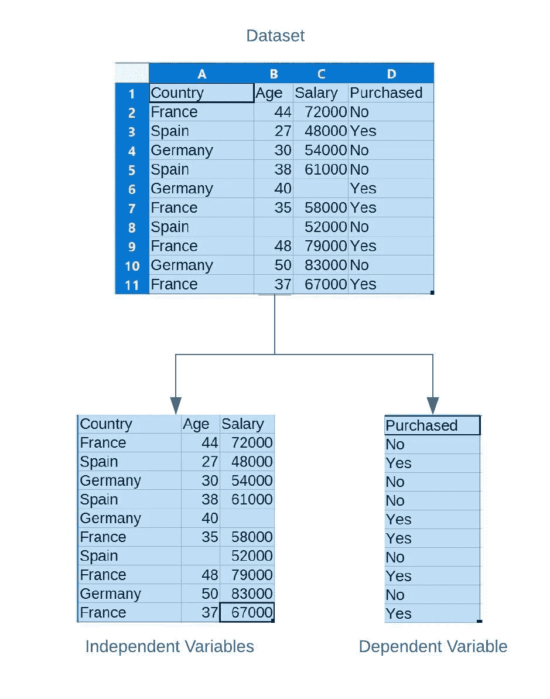
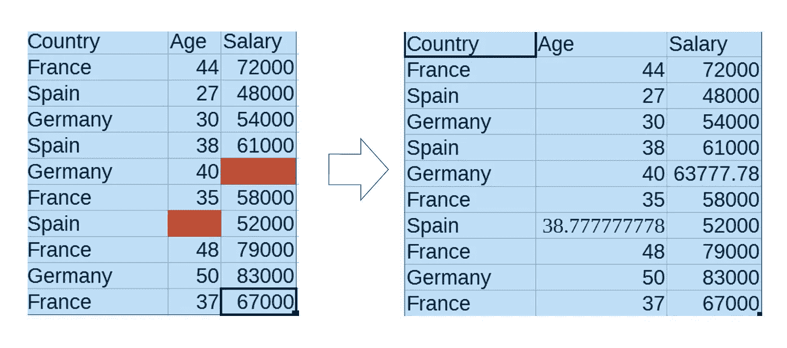
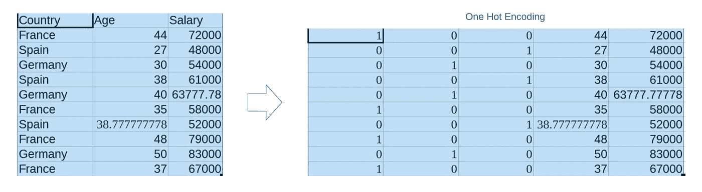
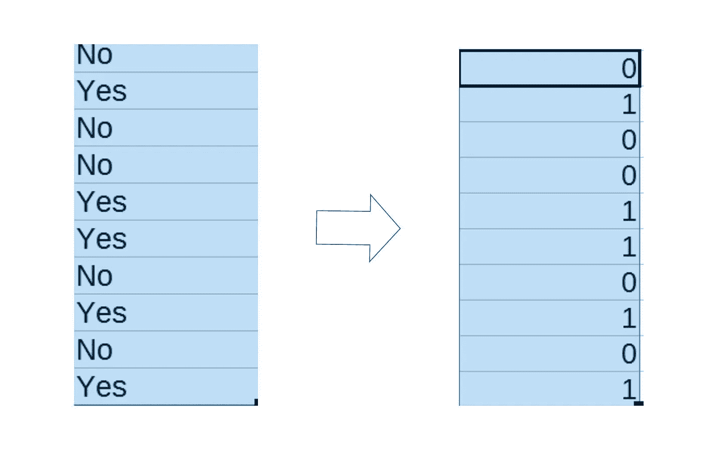
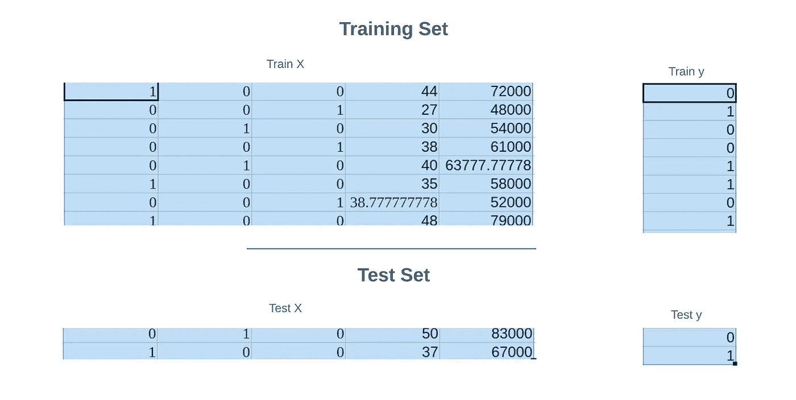
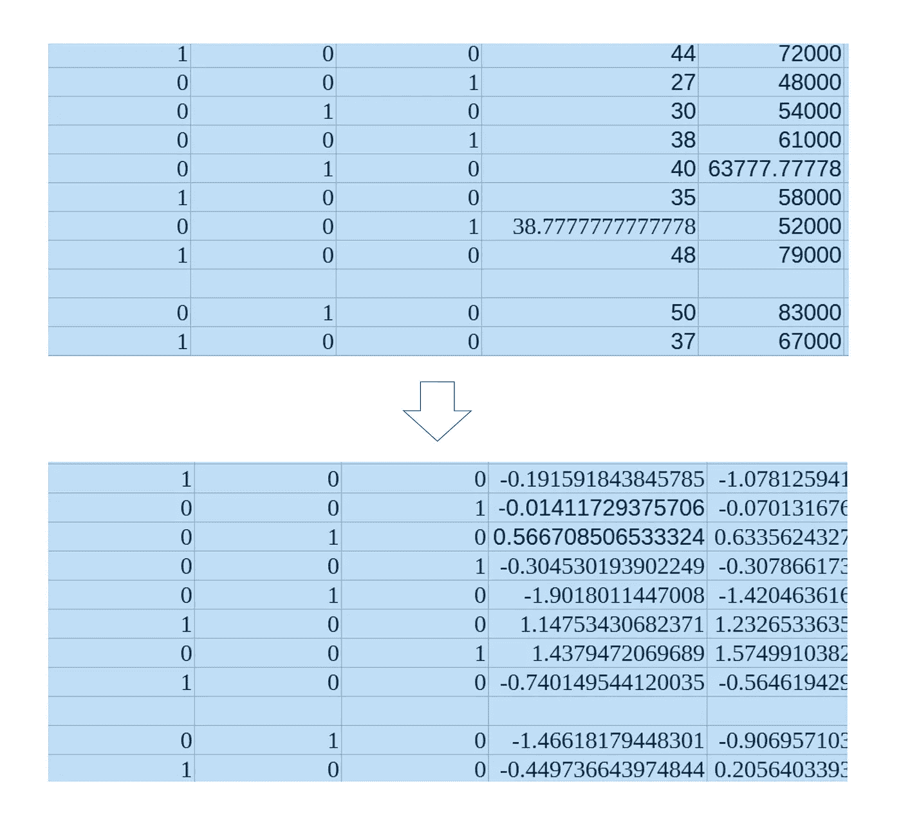

# 使用 Python 的 ML/DL 项目的 CSV 数据处理管道

> 原文：<https://medium.com/analytics-vidhya/data-processing-pipeline-for-ml-dl-projects-csv-6e1c8a1fcbfd?source=collection_archive---------10----------------------->

容易获得的 CSV 数据集可能并不总是被处理，并且可能需要一些清理。这是机器学习(ML)和深度学习(DL)项目中非常常见的一步。

在本文中，我将介绍数据预处理和为 Python 中的 ML/DL 应用程序准备 CSV 数据集的基本技术。根据应用，您可能需要执行这些步骤中的部分或全部…



数据预处理:词云

# 预处理任务:

*   导入数据集。
*   分离因变量和自变量。
*   处理缺失数据。
*   编码分类数据。
*   拆分数据集(训练集和测试集)。
*   特征缩放。

# 导入数据集:

不同的库可以用来导入数据集，我更喜欢 Pandas，因为它最容易使用，并且在一个地方提供了很多数据操作。此外，pandas 还集成了读取 CSV 的功能，使得数据导入任务变得轻而易举。

```
import pandas as pd
dataset = pd.read_csv('path_to_dataset/file_name.csv')
```



示例数据集

# 分离因变量和自变量:

我在以前的文章中已经写了一些，我在这里引用一下。

> 简单来说，因变量是那些你需要预测的变量，自变量是我们用来预测因变量的变量。这些需要分开，因为只有独立变量需要传递到网络，而从属变量需要计算它们与网络预测值之间的差异(损失)

按照惯例，自变量被命名为‘X’，因变量被命名为‘y’。现在，考虑到因变量在最后 n 列…(本例中为 1)，它的代码简单如下:

```
n = 1
X = dataset.iloc[:, :-n].values
y = dataset.iloc[:, -n].values
```

即使不使用 pandas，在 python 中提取行也很简单，但是提取列有点繁琐。Pandas ' ' iloc '方法更方便，也更容易实现。



分离因变量和自变量

# 处理缺失数据:

很多时候，数据集可能会有一些缺失值。如果不处理这些缺失值，将会在拟合我们的模型/训练时导致错误。


## 丢失的值可以通过以下任一方法处理

*   丢弃缺少值的行。
*   填补(或估算)缺失的值。

## 丢弃行:

在大多数情况下，丢弃行是不可取的，因为用于训练的数据大小将会减少，而且，如果数据集的属性是平衡的(例如，如果每个类的条目数相等)，删除行将导致数据不平衡，并且您稍后训练的模型可能会有偏差。

在极少数情况下，您确实需要删除行，这可以在 pandas 中通过“dropna”函数来完成:

```
dataset.dropna(inplace=True)
```

## 填充(或输入)缺失值:

填充丢失的值是删除行的更好的替代方法。这些值可以用各种方法填写，最常用的方法是用该列的平均值代替。

**方法一:使用熊猫**

```
dataset.fillna(dataset.mean(), inplace=True)
```

**方法二:使用 sklearn**

我更喜欢使用 sklearn，因为在这里你可以指定要替换什么值(可能是 NaN 或其他)以及替换所用的技术。正如我提到的，最常见的是用 mean 替换，但也使用了其他技术，如用 mode 或 median 替换，并且可以在 sklearn 中实现。(在策略参数中指定)

```
import numpy as np
from sklearn.impute import SimpleImputerimputer = SimpleImputer(missing_values=np.nan, strategy='mean')
start = 1
end = 3imputer.fit(X[:, start:end])
X[:, start:end] = imputer.transform(X[:, start:end])
```

这里，我想填充第 2 到第 3 列中缺少的值，索引从 0 开始，所以我将 start 设为 1，end 索引为 exclusive，所以 end 设为 3



处理缺失数据

# 编码分类数据:

既然我们已经恰当地处理了缺失数据，那么是时候处理分类数据了。

我们可以看到数据集中的第一列是分类的(它在几个类别中取值)，本质上不是数字。这样的属性需要被转换成数字，以便在项目的下一阶段我们的模型可以很容易地解释它。

## 一个热门编码:

一个 Hot 编码器接受属性的所有离散类别，并将这些列添加到数据中，每个类别一列。对于该列，类别的存在由值“1”指示。(例如:对于当前数据，第一列中有 3 个不同的国家，因此一个热编码器将向数据添加 3 列，一列为法国，一列为西班牙，一列为德国)

```
from sklearn.compose import ColumnTransformer
from sklearn.preprocessing import OneHotEncoderct = ColumnTransformer(transformers=[('encoder', OneHotEncoder(), [0])], remainder='passthrough')X = np.array(ct.fit_transform(X))
```

如果您在项目中使用 Tensorflow，您还可以使用 tf.one_hot()函数来获得相同的结果。



编码分类数据

## 标签编码器:

如果分类变量是二进制的，或者由于某种原因不能增加列数，可以使用标签编码器。Label encoder 通过获取离散属性的数量并为每个属性分配一个数字，将名义属性转换为数字属性。

例如，这里的因变量是二进制的，所以如果使用标签编码器，则“否”将被转换为 0，“是”将被转换为 1。(对于更多类别，标签编码器将分配下一个数字，即 2、3、4 等)。

这在直觉上对我们更有意义，因为在一个热编码中添加列似乎是多余的，但在实践中，**一个热编码实际上比标签编码更受欢迎。**这是因为 ML 算法将数值属性视为值的**，这意味着它将认为标签为 4 的属性比标签为 3 的属性更有价值(如 4 > 3)，尽管实际上两者具有同等的重要性。**

```
from sklearn.preprocessing import LabelEncoder
le = LabelEncoder()
y = le.fit_transform(y)
```

在二进制属性的情况下，标签编码器是优选的，因为只有 1 和 0 将是标签，并且没有必要为此添加列。



标签编码

# 拆分数据(训练集和测试集) :

同样，我在以前的文章中已经写了一些，我在这里引用一下。

> 我们将在某些数据上训练我们的网络。测试决定了我们的模型在现实世界中的工作。考虑一个例子，你学了一个新单词，你的老师给了你一个在句子中使用它的例子。现在，为了表明你已经理解了那个单词的意思，你必须在另一个句子中使用它，在同一个句子中使用它是没有用的。同样，用训练模型的相同数据来测试我们的模型是没有用的。因此，我们分割数据集，并保留其中的一部分进行测试，这将为我们提供一个真实的估计，即模型在以前看不到的数据上工作得有多好。

也就是说，让我们继续看代码…

sklearn 提供了将数据分成训练集和测试集的最简单的方法，它只需要两行代码。它需要的一个参数是测试集的大小。这表示您想要用作测试集的数据部分。(例如:test_size=0.2 将在测试集中保留 20%的数据。)

```
from sklearn.model_selection import train_test_split
X_train, X_test, y_train, y_test = train_test_split(X, y, test_size = 0.2, random_state = 1)
```



列车测试分离

# 特征缩放:

我们几乎完成了…最后一部分是功能缩放。如您所见，训练集中的最后两个属性是数字。同样，由于是数值型的，ML 算法将赋予具有较高值的属性更多的重要性，在这种情况下，salary 属性的值以千为单位，而 age 小于 100，因此要消除这种偏差并赋予所有属性同等的重要性(归一化)，特征缩放是必不可少的。

要素缩放将数字属性调整到通用比例(通常为-1 到+1)

```
from sklearn.preprocessing import StandardScaler
sc = StandardScaler()
start = 3
X_train[:, start:] = sc.fit_transform(X_train[:, start:])
X_test[:, start:] = sc.transform(X_test[:, start:])
```

第 3 列和第 4 列必须进行缩放，因此开始索引设置为 3，没有结束索引表示所有列的其余部分都要考虑。



特征缩放

就这样…我们已经预处理了我们的数据，现在准备在我们的 ML/DL 应用程序中使用它。

# 总结:

*   **导入数据集** **:** 加载数据集。用熊猫(read_csv)。
*   **分离变量** **:** 因变量和自变量。使用熊猫(iloc)。
*   **缺失值:**删除或填充。使用 sk learn(simple imputr)。
*   **编码分类数据:**一个热编码或标签编码器。用 sklearn。
*   **拆分数据:**训练集和测试集。使用 sklearn(train_test_split)。
*   **特征缩放:**归一化属性。使用 sklearn(标准定标器)

感谢您阅读我的文章。觉得有用就鼓掌。

# 另请参阅:

[](https://link.medium.com/j2on2UYdK7) [## 入门:深度学习项目

### 深度学习(DL)在过去几年里受到了一些严重的影响，我们许多人都对这些感兴趣…

link.medium.com](https://link.medium.com/j2on2UYdK7) [](/@rohanhirekerur/image-processing-pipeline-for-ml-dl-projects-in-python-2d2438e6621b) [## Python 中 ML/DL 项目的图像处理管道

### 卷积神经网络(CNN)正在迅速普及，并被应用于各种图像处理

medium.com](/@rohanhirekerur/image-processing-pipeline-for-ml-dl-projects-in-python-2d2438e6621b) 

资源:

数据集和代码:[查看我的 GitHub 库](https://github.com/Rohan-Hirekerur/Data-Processing)

# 更多关于我的信息，请访问:

## GitHub:

[](https://github.com/Rohan-Hirekerur) [## Rohan-Hirekerur -概述

### 在 GitHub 上注册你自己的个人资料，这是托管代码、管理项目和构建软件的最佳地方…

github.com](https://github.com/Rohan-Hirekerur) 

## LinkedIn:

www.linkedin.com/in/rohan-hirekerur

## 推特:

【https://twitter.com/Youthful96 