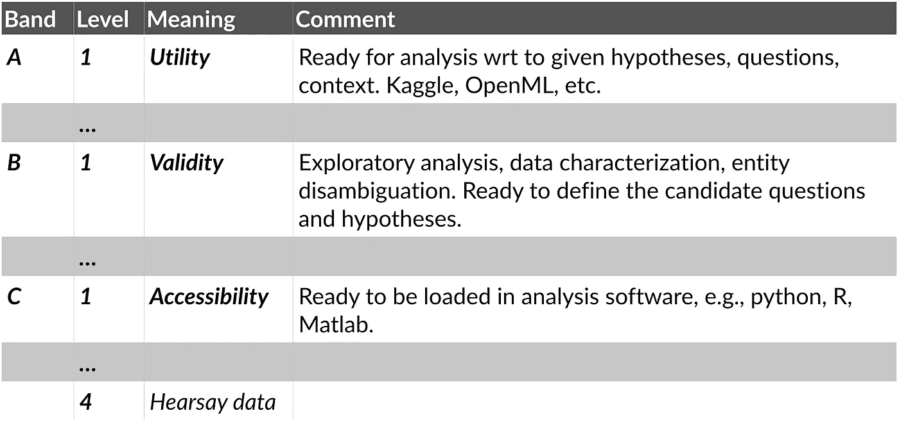

# 自然语言处理的数据准备

> 原文：<https://medium.com/analytics-vidhya/data-readiness-for-natural-language-processing-225926662f9b?source=collection_archive---------15----------------------->

## 没有数据，没有 AI 采用。在自然语言处理领域进行研究和创新时，做好数据准备意味着什么？

作为 [RISE](https://www.ri.se/en) 的高级研究科学家，我参与了许多研究和创新项目，在这些项目中，我们应用了自然语言处理(NLP)方法作为解决方案的一部分。所有项目中的第一个也是最主要的挑战之一是可处理数据的状态。以下是我们所做的一篇综述，旨在提高同行研究人员和客户对自然语言处理数据就绪性的认识。

完整的文档可以在[这个 GitHub 库](https://github.com/fredriko/nlp-data-readiness)中找到，还有 arXiv 上的 PDF [版本。](https://arxiv.org/abs/2009.02043)

# 数据准备水平

Lawrence
( [2017](https://arxiv.org/abs/1705.02245) )引入的[数据准备水平](http://data-readiness.org/) (DRL)的概念，提供了一种谈论数据的方式，就像[技术准备水平](https://en.wikipedia.org/wiki/Technology_readiness_level)促进关于技术成熟度的交流一样。因此，这是一个适合与利益相关方交换关于数据**可访问性**、**有效性**和**效用**的信息的框架。

数据准备程度的不同级别。

**波段 C** 关注数据的**可访问性**。这一级别的所有工作都是为了授予打算使用数据的团队对数据的访问权；一旦提供了接入，数据就被认为处于频带 C - Level 1，并准备好被带入频带 b

**B 带**关注数据的**有效性**。为了通过波段 B，数据必须是有效的，即代表手头任务的**。此外，应对数据进行**去重**，识别**噪声**，表征**缺失值**等。在这个阶段，数据应该适合于探索性分析和工作假设的形成。**

**波段 A** 关注数据的**效用**。数据的效用与数据的使用方式有关:数据是否足以解决手头的任务？

一个项目应该努力达到 A 级-1 级的数据准备程度。请注意，应该根据给定的任务来解释数据准备程度。

# 项目阶段

为了将对训练、验证和评估数据的需求放入上下文中，让我们看一下典型的 NLP 项目的结构。组织在应用研究、创新和分析方面的工作方式有很多种。它们中的大多数大致通过以下步骤进行

1.  指定要解决的问题。
2.  评估可用的数据以产生和评估问题的解决方案。
3.  选择用于解决问题的技术。
4.  以演示者、原型或产品的形式实施解决方案。
5.  研究团队和客户之间的相互知识转移。

尽管上一节中描述的数据准备水平渗透到项目管理的所有阶段，但上面项目结构中的步骤 1 到 3 通常是深入处理数据准备的地方。因此，在项目开始时，数据准备水平是非常重要的。

# 需要指导的问题

以下问题旨在为解决与 NLP 相关的研究或业务问题达到适当的数据准备水平的过程提供指导。

## 你想解决什么问题？

每个应用项目的第一步是确保对*完成*有一个清晰简明的定义；项目的目标是什么，我们如何知道何时达到了目标？我们建议将目标与有形的商业价值紧密联系在一起，并且从一开始就有一个项目如何融入商业价值链的清晰想法。在指定问题时，确保将重点放在要满足的实际业务需求上，而不是放在解决问题的技术上。尝试明确所有关于业务需求的假设；将它们写下来，并确保与涉众一起彻底检查假设，让他们签署对问题的共同理解。

对业务需求和问题有一个详细的一致的规范是至关重要的，因为看似细微的细节可能对实际解决问题的可能技术空间有很大的影响。例如，如果利益相关者希望实现一个解决方案来从长文档中提取段落，对其进行排序，并以亚秒级的延迟向用户呈现，从数据的角度来看，您必须知道文档集是否会不断变化，文档的格式是什么，以及有哪些信息来指导学习排序过程。

您着手解决的问题的特征决定了解决该问题所需的数据要求。因此，问题的规范对于理解数据的要求是至关重要的，例如，在训练数据方面，以及对评估或验证数据的手动标记的需要方面。只有当你知道数据的特征时，才有可能提出一个候选的技术方法来解决问题。

## 你有什么数据？

“可供您使用”是什么意思？知道有数据需要处理和在正确的时间对正确的数据进行正确的访问是有区别的。数据准备水平框架提供了一种与利益相关者(包括数据所有者和业务问题所有者)交流的好方法。在这种情况下,“可用”意味着数据在波段 B 或以上。

有了 B 波段的数据，你将很有可能形成关于数据对你试图解决的问题的适用性的工作假设。

## 你可以使用现有的数据吗？

使用数据的法律方面取决于许多事情。因此，法律部门应被视为与您的特定挑战相关的数据准备水平评估的主要成员。确保你在项目的早期就有适当的法律能力。必须正确处理与个人身份信息和 GDPR 相关的事宜。不这样做可能会导致项目失败，即使项目的所有技术方面都是完美的。

## 解决问题需要哪些数据？

鉴于对可用数据的了解，问自己以下问题:

*   解决问题需要哪些数据？
*   这是您已经可以获得的数据的子集吗？
*   如果不是:有没有办法获得你需要的所有数据？

如果可用数据和解决问题所需的数据之间存在差异，则必须缓解这种差异。如果无法将可用的数据与需要的数据相匹配，那么这就是一个提示，让我们回到绘图板，或者重复问题规范，或者收集合适的数据。也许除了目前指定的方法之外，还有其他方法可以解决业务或研究需求？发现解决问题实际需要的数据甚至不存在并不罕见，尽管最初的假设与此相反。这一结论不一定完全是负面的，因为它提供了启动数据收集工作的可能性，或者，如果需要，改进业务流程以开始生成相关数据。

## 如何知道自己是否成功解决了问题？

当你在定义和指定要解决的问题的过程中，你还应该考虑如何*评估*问题的潜在解决方案。

评估解决方案所需的数据类型通常与解决方案的实施方式紧密相关:如果解决方案基于监督机器学习，即需要带标签的示例，那么解决方案的评估也将需要带标签的数据。例如，如果您面临的问题是帮助用户在公共机构提交的大量年度报告中找到与主题相关的部分，那么您很可能需要构建一个标有适当主题描述符的部分集合。这些数据可以用来评估和比较你提出的技术解决方案。

另一方面，如果有可能产生一个基于无监督机器学习的解决方案，那么*也许*也有可能基于未标记的数据进行评估(尽管这还远未确定)。

在任何情况下，如果解决方案依赖于带标签的训练数据，标注的过程通常也会产生适当的评估数据。任何注释工作都应考虑到:

*   **注解的质量。**处理数据的注释者之间的协议，也就是注释者之间的协议，为评估注释的整体质量提供了一个很好的起点。注释者之间达成一致的原因可能与注释指南不清楚、注释者之间的专业知识不同、任务太难或者以上所有情况的结合有关。应该仔细监控所产生的注释的质量。应分析质量随时间的偏差，以便缓解依赖于带注释的数据进行训练的模型的能力的潜在下降。
*   **数据特征的时间方面。**数据的分布多久从变化中学习一次，即我们需要多久产生新的注释？我们什么时候知道我们需要新注释的数据？
*   **数据的代表性。**标注的数据真的适合手头的任务吗？它是否反映了用户与系统的交互方式？

获取训练、评估和验证数据是产生基于机器学习的问题解决方案的核心。数据的质量设定了所学功能所能达到的上限。生产流程中还包括模型选择、为机器学习建立基础设施、持续监控解决方案性能下降等问题。《构建机器学习驱动的应用:从想法到产品》一书[对端到端过程进行了很好的概述。](https://mlpowered.com/book/)

## 您的组织如何存储新数据？

即使您组织中的数据处理在机器学习的要求方面并不完美，您追求的每个项目都有机会阐明对您组织的数据存储过程的改进。问自己这样的问题:我的组织如何存储传入的数据？该流程是否非常适合 NLP 项目环境中的数据自动处理，也就是说，数据的存储格式是否超出了数据就绪级别的 C 级(**可访问性**)范围？如果没有；需要做哪些改变来改善存储？

在多个项目的过程中，我们发现一些重要的事情与数据存储的格式有关。特别是:

*   **数据中的信息在存储之前不应被删除。**破坏性处理，如文本的符号化、词干化和小写
    不应作为数据存储过程的一部分执行。不要将特定用例的数据预期用途与存储格式混为一谈；尽可能少地假设数据在未来会被如何使用。
*   避免专有格式和不用于自动处理的格式。由常规文字处理软件输出的文档格式，例如 PDF、word 和 Pages，对于自动的、基于机器学习的信息处理的输入来说*不是*合适的格式。将例如 PDF 文件转换成适合在处理流水线中使用的文本格式面临许多挑战。目前没有通用和稳定的编程解决方案来避免:
    -信息的省略，例如错误地分解单词；
    -引入多余信息，例如，插入页眉作为文本的一部分；
    -字符编码问题；
    -将信息从表格分散到连续文本中；
    -段落或列顺序的混淆，或；
    -许多额外的挑战，如[中所述，PDF 文本提取有什么难的？](https://filingdb.com/b/pdf-text-extraction)
*   **逻辑结构。如果可能，确保文档的逻辑结构在检索时是可访问的。也就是说，确保文档的相关部分可以通过它们的功能来引用，启用文档分段查询，例如:
    -给我这个文档的目录。
    -按顺序列出本书第 3 章中的所有顶级小节及其文本内容。
    -从年度报告中提取所有表格。**

未能解决上述问题可能会导致您的数据永远无法通过数据就绪级别 C，因此不适合自动分析。

# 最后…

我们希望这篇关于自然语言处理的数据准备的文章能够有所帮助，并为其他研究人员和开发人员提供灵感。如果您有任何问题或改进建议，请直接联系我(fredrik.olsson AT-SIGN ri.se)或向 GitHub 资源库提交拉请求:[https://github.com/fredriko/nlp-data-readiness](https://github.com/fredriko/nlp-data-readiness)按照说明[这里](https://www.dataschool.io/how-to-contribute-on-github/)。