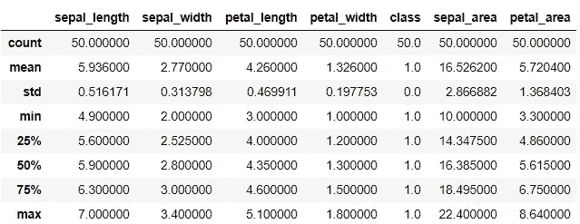
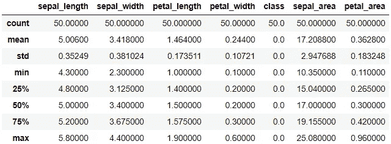
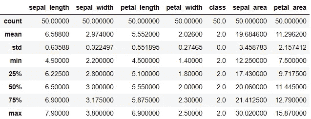
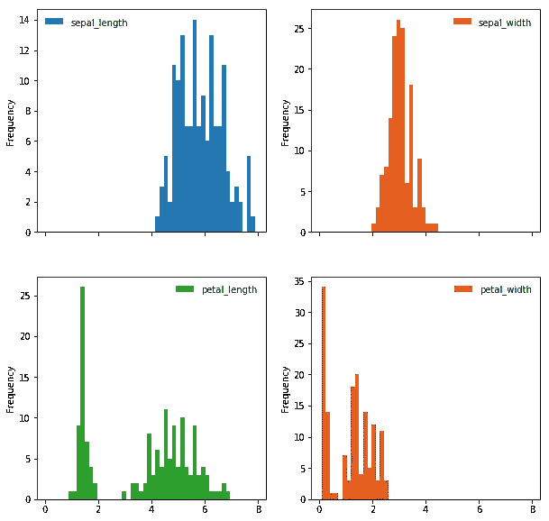
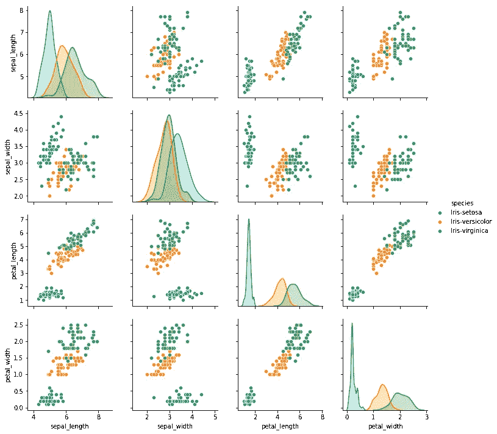
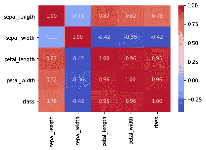
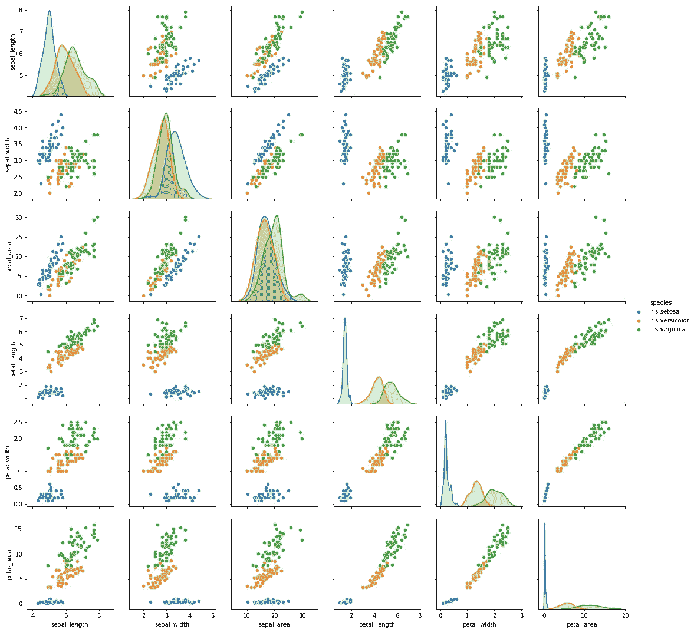
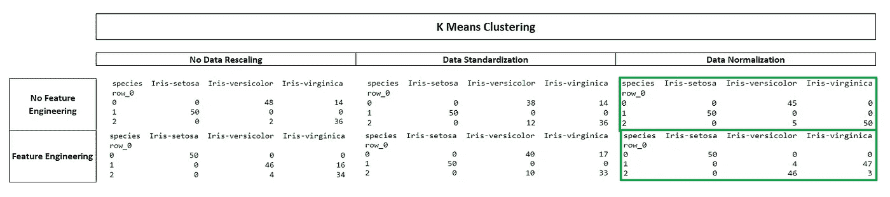
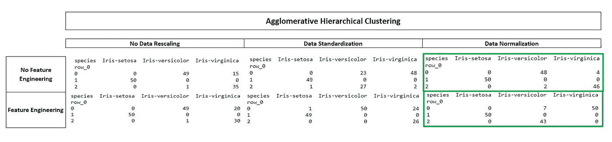

# 无监督学习——K-均值和层次聚类

> 原文：<https://medium.com/analytics-vidhya/data-scaling-and-unsupervised-learning-b254054cbd3d?source=collection_archive---------3----------------------->

我用鸢尾物种识别问题来演示无监督学习技术。这篇文章不是提供问题的解决方案，而是向你展示特征工程和数据缩放对不同的聚类方法有什么影响。

## 关于数据集

鸢尾花数据集是一个只有 150 行的小数据集(3 种鸢尾花各 50 行:setosa、versicolor 和 virginica)。物种由 4 个特征定义:*萼片宽度*、*萼片长度*、*花瓣宽度*和*花瓣长度*。

**三种花卉的分布指标**

## 数据分析和特征工程

萼片长度和萼片宽度具有某种正态分布，但花瓣长度和花瓣宽度不遵循高斯分布。所以，我按物种划分了这些特征，看看这些特征是如何在不同物种中分布的。

**所有特征的频率分布——萼片长度、萼片宽度、花瓣长度、花瓣宽度**

从配对图中可以看出，刚毛鸢尾的花瓣长度和花瓣宽度与其他两个物种明显不同，这导致了与正态分布的偏差。这也是为什么花瓣长度和花瓣宽度与花的种类(种)具有如此高的相关性，而萼片宽度与种类负相关的原因(参见下面的相关矩阵)。此外，使用任何一对特征都可以将刚毛藻与其他两个物种区分开来。

**关联热图**

另一方面，对于所有的特征对组合，杂色和海滨锦鸡儿没有明显的边界。因此，我设计了两个新的特征:萼片区域和花瓣区域，看看这些特征是否有助于区分物种。

而且，似乎由于这两个新的特征，物种之间的区别与以前相比确实增加了，但集群仍然不是完全不同的。

现在来模拟这些集群。但是，在我们进行算法训练之前，需要对数据进行缩放，以照顾到:

*   鸢尾所有特征的显著不同的数据范围
*   萼片面积和花瓣面积是不同的单位(平方公制单位),这使得它的值也比长度和宽度大得多

## 数据缩放

我使用的两种缩放技术是:

1.  **标准化—** 标准化是指减去一个位置度量值，再除以一个尺度度量值，从而得到一个均值为 0、标准差为 1 的“标准正态”随机变量。标准化假设您的数据正态分布在每个要素中。通过“移除平均值并缩放至单位方差”，您可以在图片中看到，无论原始值是多少，现在它们都具有相同的“比例”。它按列工作。
2.  **归一化—** 表示除以向量的范数。它还经常指通过向量的最小值和范围进行重新调整，使所有元素位于 0 和 1 之间，从而使数据集中所有数值列的值达到一个通用的范围。当特性具有不同的范围时(就像我们的例子一样)，这是最有必要的。它按行工作。

我使用了两种无监督学习技术来形成聚类:K-means 和凝聚层次聚类。

## k 均值聚类

K-means 聚类是一种无监督学习方法，其中观察值被划分为指定数量的非重叠聚类。这是通过首先决定簇的数量=‘K’(**这里 k=3 并且是预先决定的**)来执行的。

然后将每个观察值分配给这 K 个聚类中的一个。这里的成本函数是所有 K 个聚类的聚类内变化的总和，我们的目标是使其最小化。简而言之，K-mean 算法首先将观察值随机分配给任何 K-聚类。然后计算每个聚类的质心。质心是该特定聚类中所有观测值的 p 个特征的平均值的向量。然后，它将观察值重新分配给质心最接近该特定观察值的聚类。当结果不再改变时，这就停止了。目标是:

*   最小化聚类中所有观测值与其质心的距离，以及
*   最大化所有质心之间的距离

对于虹膜数据集，我们没有得到非重叠聚类作为 k-means 算法的输出。数据标准化后，重叠进一步增加(参见下表)。不过，通过对要素进行归一化，可以在一定程度上解决重叠问题，因为它解决了数据范围和要素间不同测量单位的变化问题。

## 凝聚层次聚类

凝聚聚类是最常见的层次聚类类型，用于根据相似性将对象分组到聚类中。它也被称为*艾格尼丝* ( *集聚嵌套*)。该算法首先将每个对象视为一个单独的集群。接下来，成对的聚类被连续地合并，直到所有的聚类被合并成一个包含所有对象的大聚类。该算法适用于可能有也可能没有重叠聚类的数据。分层聚类的局限性:

1.  分层聚类没有数学目标。
2.  层次聚类的高空间和时间复杂度。因此，当我们有大量数据时，不能使用这种聚类算法。

因为 iris 数据集非常小(只有 150 行),所以运行这个算法不成问题。

我们看到，尽管聚类有重叠(特别是萼片面积对萼片长度和萼片宽度)，但该模型的准确性相当好(参见下表)。

 [## surbhigup/iris _ flower _ identity

### 此时您不能执行该操作。您已使用另一个标签页或窗口登录。您已在另一个选项卡中注销，或者…

github.com](https://github.com/surbhigupt/iris_flower_identity/blob/master/Iris%20Classification%20-%20Unsupervised%20learning%20%28clustering%29.ipynb)