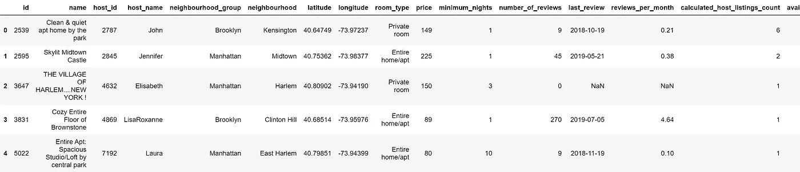
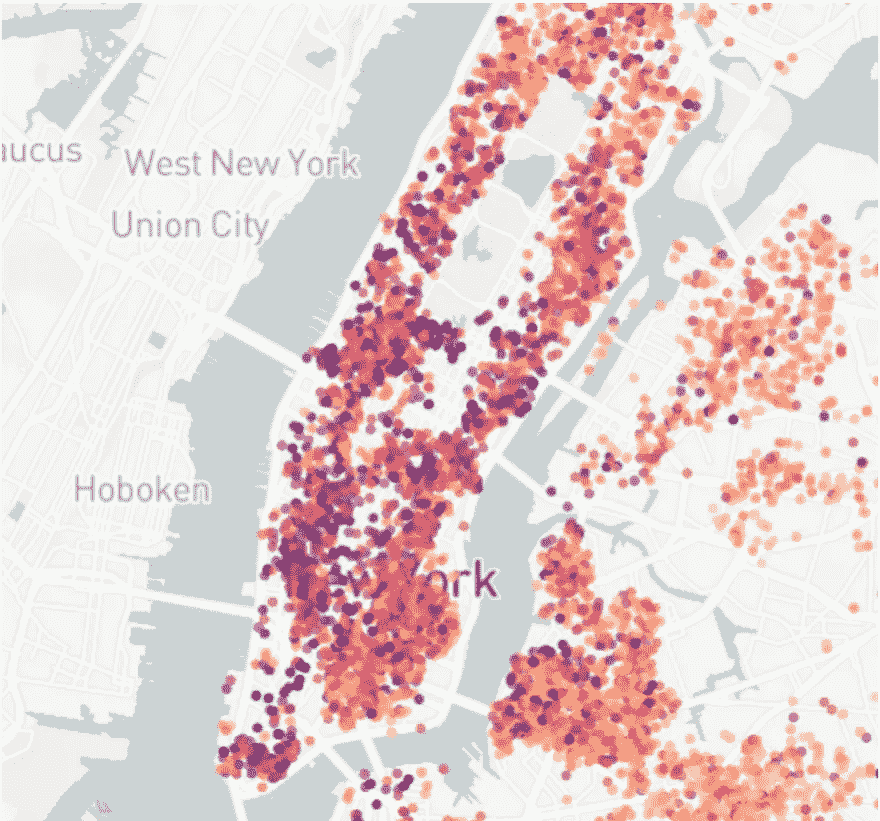
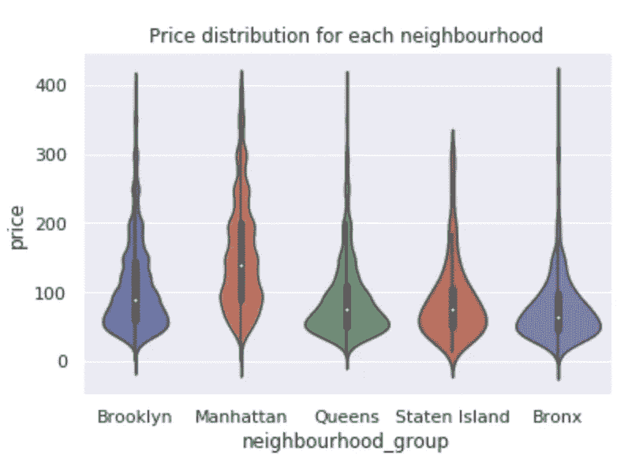
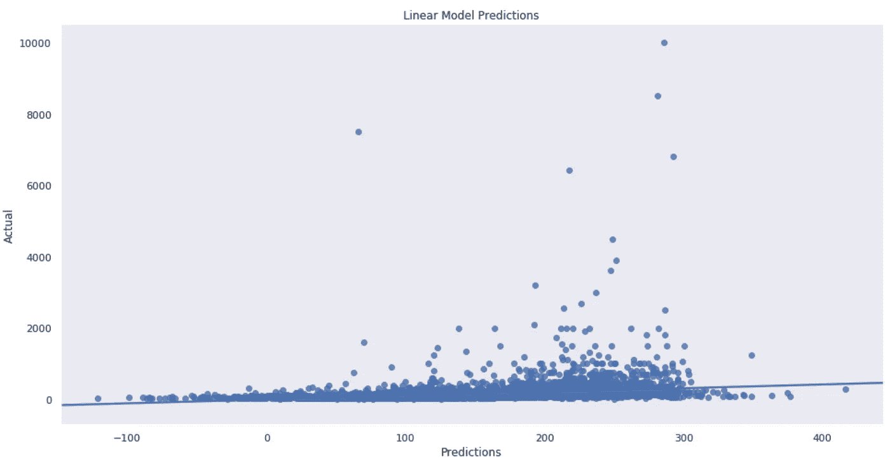
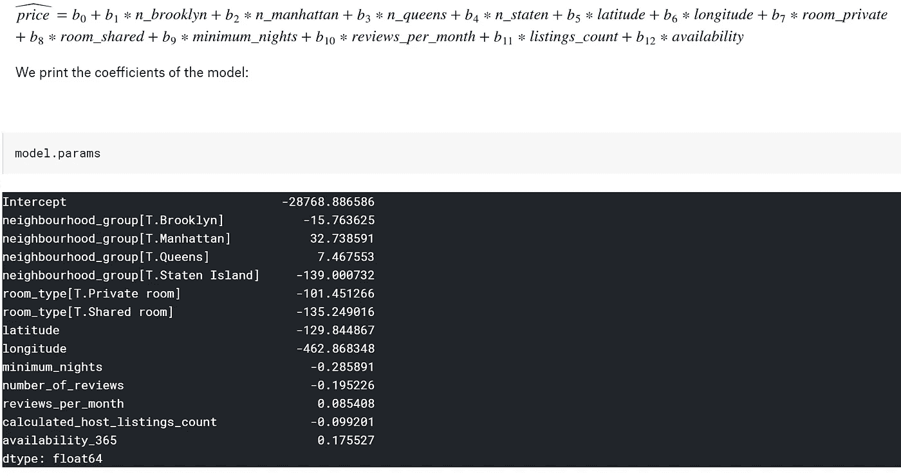

# 数据科学——教程的演练

> 原文：<https://medium.com/analytics-vidhya/data-science-a-walk-through-of-a-tutorial-b8eb31fd407c?source=collection_archive---------15----------------------->

如今，似乎每个人都被数据科学迷住了。我们身边到处都是数据，我相信你已经听说过了，人们正在利用公共数据源进行分析和预测。那么，新人如何才能在这个快速发展(且竞争激烈)的新领域生存下来呢？

简而言之，机器学习

事实证明这很容易上手。如果你对学习数据科学感兴趣，网上有很多资源可供你学习。走向数据科学是一个很好的媒体平台，在这里你可以阅读和聆听该领域的趋势话题。您可以查看正在进行的其他工作，并与教程一起工作，以便更好地理解如何使用数据。

Kaggle 对于数据爱好者来说也是一个很好的资源！Kaggle 为用户提供免费的数据源(由其他用户发布)和课程，帮助你掌握使用数据所需的一切。他们有一个正在进行的比赛列表，你可以参加来测试你新开发的技能。最重要的是，对于新用户来说，他们拥有基于 Kaggle 平台的笔记本电脑。在这里，你可以看看其他人的工作，并学习如何处理新的任务。一旦你觉得自己准备好了，就在 Kaggle 上启动自己的笔记本，开始行动吧！

学习数据科学的最佳方式是通过教程。这些教程是由那些出于某种原因想要解决某个任务的人组织起来的，他们会一步一步地完成整个过程。最近，我和我的朋友们制作了一个教程，作为我们数据科学课的最终项目。在本教程中，我们使用来自纽约市的 Airbnb 数据，并尝试将不同的功能作为价格的预测变量。在这篇文章中，我们不仅要浏览这个教程，还要了解阅读其他教程时会遇到什么情况。

跟随我们的完整教程！在我的网站上查看:amanjaiman.github.io/nyc-airbnb-data/

教程的第一部分处理导入正确的库，查找要使用的数据并收集这些数据。对我们来说，这相当简单，因为我们使用的是 Kaggle 上的可用数据。因为我们使用的是 Kaggle 笔记本，所以我们可以简单地从他们的文件系统中获取数据。如果不是这样，您可以下载许多不同格式的数据，然后使用库将其导入。

数据框架的一部分，显示了前 15 列和前 5 行。

这里我们有一个 csv 文件，我们打开到一个数据帧。数据帧是一个二维数组。可以把它想象成一个数据表，每一行对应一个新条目，每一列是一个不同的变量。您将使用的大部分数据都是类似的格式，因为它很容易处理。

在获得数据之后，我们遍历这些数据实际上意味着什么，以及它包含了什么。在我们的例子中，我们讨论每一列及其相关性。我们还看一下我们正在处理的具体数据点。例如，我们处理 5 种不同的邻里群体(布鲁克林、曼哈顿、皇后区、斯塔滕岛、布朗克斯)，以及三种不同的房间类型(共享、私人、整个家庭)。

> **为什么这很重要:**这是你预处理数据并弄清楚你在处理什么的地方。您将能够看到一些基本特性，并开始规划在接下来的步骤中您想要对数据集做什么。

下一步，我的最爱，探索性数据分析。这是更深入地查看数据，并以易于理解的方式可视化数据的过程。

左图:基于价格的热图，曼哈顿比其他区更红。右图:每个行政区的价格分布。

这里我们可以看到每个街区的价格分布。正如我们所料，曼哈顿的平均价格更高，这是有道理的，因为大多数人都比其他 4 个区的人更喜欢去曼哈顿。

此外，只是为了好玩，我们决定使用 plotly 制作一个实际的纽约市地图，用颜色表示价格的数据点。曼哈顿显然比其他地区更红。

我们还没有接触过文本数据，所以我们决定再多做一点，添加一些自然语言处理。*这是一个你在新领域会经常听到的术语。*自然语言处理是指观察书面或口头语言，并理解我们使用的单词和句子背后的含义的行为。我们研究了主持人在命名他们的房产时使用的前 25 个词，以及他们名字背后的普遍情绪，以及这与价格的关系。

> **为什么这很重要:** EDA 是根据数据得出结论的关键。您将能够获得关于某些变量的关键见解，并开始获得创建模型时将会遇到的情况的预期。制作好看的视觉效果也很有趣！

如果你一直跟随我们的教程，你会看到我们现在在预测价格部分。这就引出了本教程的第三部分，某种形式的机器学习。这是本教程中最复杂的部分，它试图用其他变量来预测其中一个变量。对于我们的数据集，我们认为从数字变量预测价格是合适的(我们也用数字值对一些分类变量进行编码)。

我们的第一款产品似乎不太受欢迎。

我们的第一个模型表现不是最好的，我们把这归因于数据中的异常值和模型做出的一些假设。看到这一点，并对其进行一些统计分析，我们决定对 price 执行对数转换。我们看到这使我们的模型变得更好！我们的残差现在正态分布。然后，我们查看不同变量对价格的具体影响，并删除我们发现对我们的模型没有帮助的变量。我们只剩下最后的模型了。

我们的模型系数。请注意，曼哈顿与价格的正相关性最大。

> **为什么这很重要:**机器学习步骤是你要做的最后一步。您收集了数据并查看了一些特征，但现在您能够实际找到特征之间的关系，并在未来使用其预测能力。

一旦我们总结了我们的发现，教程就完成了！

我们已经能够一步一步地走过整个过程:找到数据并弄清楚我们正在处理什么，探索性数据分析，以及机器学习。希望本教程能帮助你理解处理数据的过程，并且这可以作为一个工具，让你知道在阅读教程时会遇到什么。一旦你理解了为什么不同的步骤如此重要，你自己解决一个新问题就容易多了。

下一步是在 Kaggle 上挑选一些你感兴趣的数据，然后开始吧！