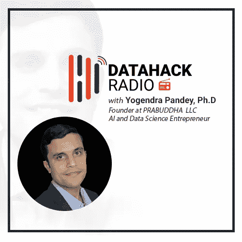

# DataHack Radio #13:石油和天然气行业的数据科学和人工智能，Yogendra Pandey 博士

> 原文：<https://medium.com/analytics-vidhya/data-science-and-ai-in-the-oil-gas-industry-with-yogendra-pandey-ph-d-f0f180d3aa64?source=collection_archive---------3----------------------->

# 介绍

您知道石油和天然气行业目前仅使用了其产生的近 1%的数据吗？这是一个令人难以置信的数字，而且不是我们在谈论人工智能和机器学习应用时通常会想到的数字。

在 DataHack 电台播客的第 13 集，Yogendra Narayan Pandey 博士将带领我们踏上一段知识丰富的石油和天然气世界之旅。

这不是一个在人工智能和人工智能社区中占据很多头条的领域，但是正如你将在这个播客中发现的，潜在的应用是巨大的。在典型的石油和天然气勘探和生产过程中收集的数据量惊人地高，这反过来又催生了多种使用案例，其中可以应用回归、聚类和神经网络等机器学习技术。

Yogendra 做了一项非凡的工作，将端到端的石油和天然气生命周期浓缩成字节大小的知识，供你我捕捉。非常值得花时间听听这个播客，开阔你的视野。快乐聆听！

*今天就订阅 DataHack 电台，在以下任何一个平台上收听这一集以及之前的所有剧集:*

*   [**音云**](https://soundcloud.com/datahack-radio)
*   [**分析 Vidhya**](https://www.analyticsvidhya.com/blog/category/podcast/)
*   [**iTunes**](https://itunes.apple.com/in/podcast/datahack-radio/id1397786677?mt=2)

# 约根德拉·潘迪的背景

Yogendra 是 PRABUDDHA 的创始人和管理顾问，pra Buddha 是一个为石油和能源行业提供人工智能解决方案的组织。他是来自 IIT-瓦拉纳西的化学工程师，并在休斯顿大学成功完成了同一领域的博士学位(他的论文题目是“界面现象中热力学的模拟方法”)。

在他的职业生涯中，Yogendra 曾为 Halliburton、Innowatts 和 W.D. Von Gonten Laboratories 等组织工作。他在所有这些组织中的角色都是数据科学家。他对石油和天然气行业的热情驱使他在这一领域追求并取得成功。

在播客的第一部分，Yogendra 描述了他在获得博士学位后在这一迷人领域的工作。任何对数据科学和能源领域感兴趣的人都会非常欣赏这一集！

# 人工智能和人工智能在石油和天然气工业中的应用

石油和天然气是一个高风险行业，因此这使得验证阶段比通常情况下更长。决策者必须更加谨慎，这是人工智能和人工智能在该领域采用率较低的主要原因之一。但正如 Yogendra 提到的，随着技术进步的加快，这种情况开始发生变化。

人工智能在石油和天然气领域最重要的应用之一是预测性维护和设备故障分析。另一个应用是关于自主钻机，这意味着设计一个端到端的全自动钻井系统。该系统足够智能，能够理解在哪里钻井(最佳井眼轨迹)、如何钻井以及完成作业所需的最佳持续时间。像当今大多数人工智能应用程序一样，这些自主钻机旨在增加工人投入的人工努力，而不是取代他们的工作。

# 石油和天然气管道，以及 AI 和 ML 在该行业中的作用

为了让您有一个非常高层次的概述，我们可以将端到端的石油和天然气生命周期(从地表下数千英尺处发现的一滴石油开始)大致分为三个主要部分:

*   向上游
*   河流正中
*   下游

**对于钻井作业，一个大型海上设施每天可以产生高达 1-2tb 的数据。大型下游炼油厂也是如此，它每天可以生成高达 1tb 的数据。**因此，如果您想知道这个行业可以从哪里获得多少数据，这是一个很好的起点！

在播客中，Yogendra 用多个例子雄辩而详细地解释了上面提到的每个部分，相信我，整个过程令人难以置信地着迷。我最喜欢的部分是关于模型如何以非常高的准确率告诉你某个地区是否有石油(概率模型)。这有助于组织决定是否值得在该地区钻井。像聚类这样的无监督学习技术在这个过程中被大量利用。

**数据科学家在该领域用于预测的其他算法包括回归、时间序列的隐马尔可夫模型、递归神经网络、门控递归单元(GRUs)和长短期记忆(LSTMs)等。**

# 了解石油和天然气最新动态的几个资源

*   **石油技术杂志:**报道石油和天然气行业的最新动态。他们详细介绍了这一领域的数字化转型
*   麦肯锡和埃森哲(以及其他论坛)等公司发布高水平的权威报告，告诉我们该领域数字化转型的现状

# 结束注释

在听到这个播客之前，老实说，我对石油和天然气行业以及人工智能和人工智能如何被用于改造传统流程和增加收入有一个非常模糊的想法。我只花了 50 多分钟就很好地了解了整个石油和天然气管道，从确定钻井区域和开始钻井过程到将石油输送到汽油泵等。

我完全沉浸在这个播客中，我相信你也会一样。请务必收听这篇文章，并让我们知道您对人工智能和人工智能如何推动石油和天然气行业变革的想法。

*原载于 2018 年 10 月 29 日*[*【www.analyticsvidhya.com】*](https://www.analyticsvidhya.com/blog/2018/10/datahack-radio-podcast-oil-gas-ai/)*。*