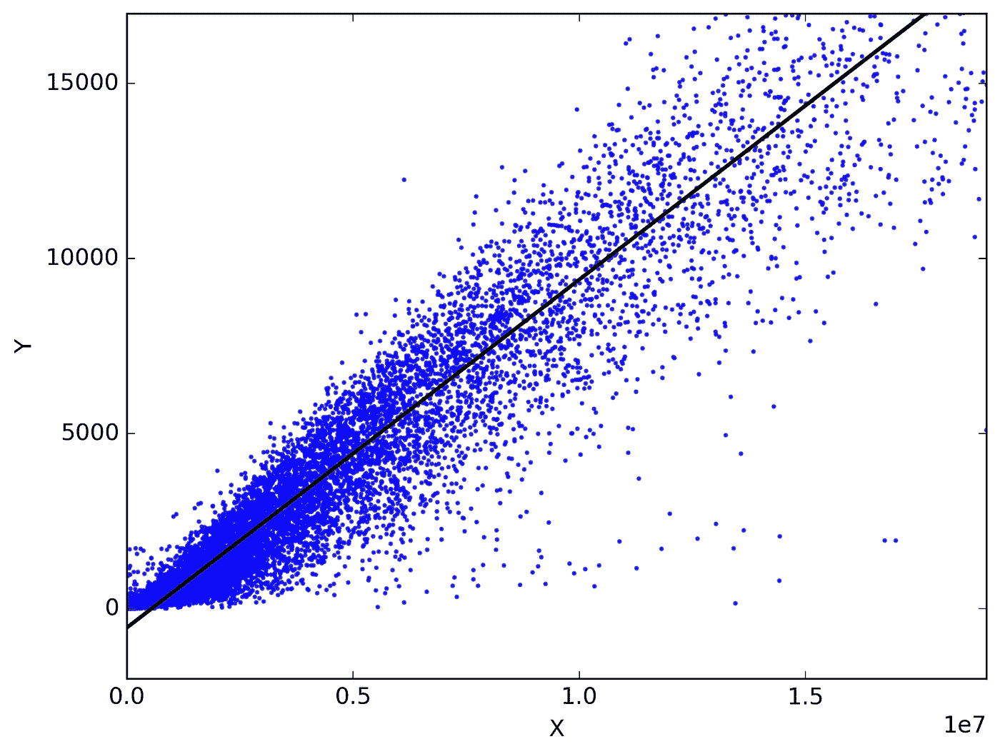

# 数据科学和机器学习-前言

> 原文：<https://medium.com/analytics-vidhya/data-science-and-machine-learning-a-foreword-1a5bdc583ed7?source=collection_archive---------24----------------------->

前言方法

谷歌的无人驾驶汽车和机器人受到了很多媒体的关注，但该公司真正的未来在于机器学习，这项技术可以让计算机变得更加智能和个性化。

*–埃里克·施米特(谷歌董事长)*

***数据科学*** 是利用数学、统计学和计算机科学从数据中产生洞察的领域。

与科学的许多其他领域一样，数据科学通过假设、证明、否定假设、切片、组合数据和生成观察结果来理解给定的问题。

机器学习是人工智能的子集。它是通过使用各种算法来执行的，这些算法执行某些任务，而无需显式编程。

深度学习是机器学习的一个子集，它更年轻，更先进，更复杂，计算成本更高。

基于要解决的问题和解决的方法，机器学习有两种主要类型。

有人监督与无人监督

1.  监督学习:这需要标签数据来执行任务，给定的任务是在标签数据的监督下执行的。
2.  无监督学习:这不需要带标签的数据，给定的任务是自己计算出数据并生成趋势。

基于数据类型和任务，监督学习有 2 个子类型。

回归:一种发现自变量和因变量之间关系的技术。它要求因变量连续。

b)分类:将对象分为不同类别的技术。它要求因变量是离散的。

无监督学习有两个主要的子类型

a)聚类:这是一种将相似的对象分组在一起的技术

b)降维:这是一种用于减少数据中的维度以降低复杂性而不丢失信息的技术。

算法是机器和深度学习中使用的构建模块。

有不少算法。这里讨论几个吧。

1.  线性回归
2.  逻辑回归
3.  支持向量机
4.  k-最近邻
5.  k 均值聚类
6.  决策图表
7.  随机森林
8.  装袋和增压
9.  主成分分析
10.  神经网络

我们来谈谈算法

**线性回归:**可以说是最古老、最著名的统计技术。这用于找出一个因变量和一个或多个自变量之间的线性关系。

线性回归的目标是找到大致通过实际点的“最佳拟合线”，同时减少实际点和预测点之间的距离。

这条线的方程式是 Y = B0 + B1X

这里 Y 是因变量，X 是自变量，B0，B1 是我们需要找到的值。

梯度下降是一种更新 B0、B1 值的方法，以找到“最佳拟合线”,同时降低成本函数或损失函数，或通常称为误差。

在线性回归中，误差称为均方误差。MSE 计算为所有预测点和实际点之间的差值的平均值。

评估线性回归模型有多种方法

a)均方误差

b)均方根误差

c)绝对均方误差

d) R2 ( R 平方)

e)调整后的 R2

**逻辑回归:**最通用、最常用的分类技术。逻辑回归是一种监督分类算法。

该算法的目标是将因变量分成不同的类。这个概念叫做*最大似然估计。*

由于因变量本质上是离散的，应用回归没有意义。因此，它使用称为 logit 函数的转换函数将预测输出转换为离散类。

划分类别的直线方程形成一条“S”形线。

这里，成本函数称为对数损失函数，用于计算误分类的成本。目标是降低成本函数，梯度下降用于更新“S”形线的值。

逻辑回归几乎没有评估指标

a)混淆矩阵

b) F1 分数

AUC-ROC

**支持向量机:**这是一种监督分类算法，将变量的类别分开。

该算法的目标是找到分隔类别的超平面，同时增加超平面和决策边界之间的距离裕度，该决策边界是在每个类别中最近的向量的帮助下形成的，这些向量被称为支持向量。

支持向量确定超平面的位置和方向。

在这里，我们希望最大化超平面和点之间的距离裕度，以便将来的新点舒适地落入特定的类别。

这里的代价函数叫做*铰链损耗。当实际类别和预测类别不同时，计算*成本函数。错误分类越低，成本函数越低。使用梯度，我们更新平面方程中的权重。

对于非线性可分数据，寻找超平面变得复杂且不直观。SVM 有一个额外的参数叫做*内核*，可以将高维转换成低维。

有几个像多项式，径向，径向基函数等核函数…

**决策树**:决策树是一种监督分类和回归算法，也称为 CART 算法，意思是可以用于分类和回归问题。它构成了所有基于树的高级模型的基础。因此，理解决策树对于任何 DS/ML 爱好者来说都是至关重要的。所以，让我们试着去理解。

顾名思义，它遵循一种树形的方法，为给定的问题做出决策。模型的目标是获得沿途形成的纯节点和决策。

基于目标变量数据类型的决策树有两种类型

1.  分类变量决策树
2.  连续变量决策树

在我们开始之前，让我们先了解一些术语

a)根节点:数据特征进入树的位置

b)决策节点:在此做出拆分节点的决策

c)叶节点:在此停止分裂成其他子节点。

d)修剪:当我们删除树的子节点时。

现在，让我们看看决策树是如何工作的。

模型的准确性取决于变量的选择和分裂决策。决策树必须首先决定变量，并决定内部节点的变量及其分裂，以在最后给我们最好的纯节点。通过使用决策树模型中的以下算法之一进行选择。

他们是

1.  ID3-构建树时采用自顶向下的方法。

2.c 4.5-ID3 的高级版本

3.分类和回归树

4.CHAID 卡方自动交互检测在计算分类树时执行多级分裂

5.MARS-多元自适应回归样条

还有一些标准(指标)是变量选择和分割过程的一部分。

a)熵:它是节点中数据随机性的度量。熵越高，模型性能越低。因此，我们需要具有较低熵的变量来进一步构建树

b)信息增益:信息增益与决策时的熵有关。这给出了节点关于变量的多少信息。因此，我们需要从节点获得更高的信息增益值。

ID3 算法同时使用熵和信息增益来建模。

基尼指数

d)基尼系数

e)方差的减少

f)卡方检验

未完待续…