# 数据科学在海洛因消费中的应用

> 原文：<https://medium.com/analytics-vidhya/data-science-applied-to-heroin-consumption-e61f9c60d60e?source=collection_archive---------1----------------------->

学习算法背后的理论和数学是非常重要的，但真正的挑战是能够将它们应用于现实世界的问题！在这篇文章中，我们将建立一个逻辑回归模型的'海洛因消费'的数据。我们开始吧！

# 为二元分类设置数据集

我们将研究将一个人归类为海洛因使用者或不使用者的问题。用于确定这一点的一些预测因素是个性因素，如 Nscore(测量神经质)、SS 评分(寻求感觉)和冲动(冲动性)。根据他们使用药物的时间，原始数据集将个人分为 7 类。原始数据集还包括除海洛因之外的许多其他药物；然而，在这个项目中，我们只关注海洛因。该数据集取自 UCI 机器学习知识库，可以从这里下载:

[https://medium.com/r/?URL = http % 3A % 2F % 2f archive . ics . UCI . edu % 2f ml % 2f datasets % 2f drug % 2b 消费% 2B % 2528 量化%2529](http://archive.ics.uci.edu/ml/datasets/Drug+consumption+%28quantified%29)

对于每种药物，个体属于 7 类中的一类——CL0、CL1、CL2、CL3、CL4、CL5 和 CL6。CL0 表示该个体从未使用过该药物，CL1 表示该个体在十年前使用过该药物，CL2 表示该个体在最近十年内使用过该药物；CL3、CL4、CL5 和 CL6 分别表示个体在去年、上个月、上个星期和最后一天使用该药物。

首先，我采取了。数据文件并将其转换为. csv 文件。我通过删除其他药物的所有列，将数据集限制为药物海洛因。然后，我添加了一个新列“User ”,如果个人属于 CL0 或 CL1，则值为 0——个人不被视为用户。否则，该个人属于 CL2、CL3、CL4、CL5 或 CL6 在这种情况下，值为 1-个人被视为用户。这给出了将个人分类为用户或非用户的二元分类问题。

我用 excel 对海洛因数据集进行了随机抽样。然后，我将数据集分成两个独立的 csv 文件:一个包含 80%的数据，另一个包含 20%的数据。包含 80%的集合是我们的训练集，包含 20%的集合是我们的测试集。

# 可视化数据

在这一部分，我将使用海洛因消费的整个数据集。让我们来看看按性别划分的海洛因消费量。这是每个性别用户数量的图表。

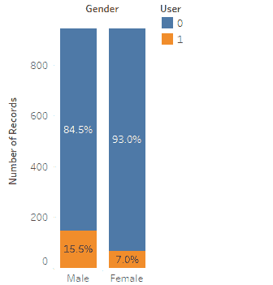

如你所见，人口中男性和女性的数量差不多。对于男女来说，只有一小部分是海洛因使用者，男性海洛因使用者大约是女性海洛因使用者的两倍。我们可以使用卡方检验来检验性别是否具有统计学意义:

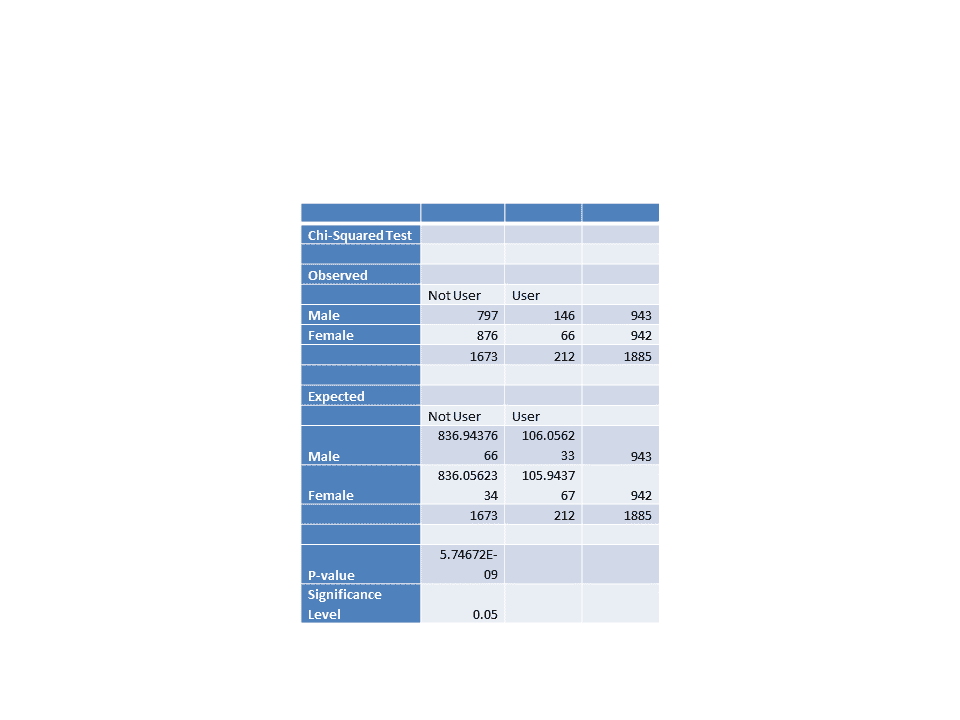

由于 p 值小于显著性水平，性别具有统计学意义。

让我们来看看各国用户的百分比。

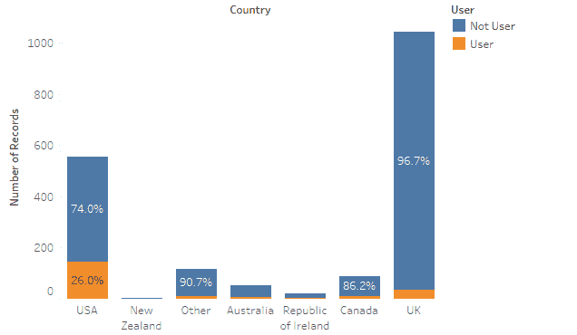

如你所见，美国和英国在样本中的代表性最大。样本中的大多数海洛因使用者来自美国。应用卡方检验，我们可以检查该国家在统计上是否显著:

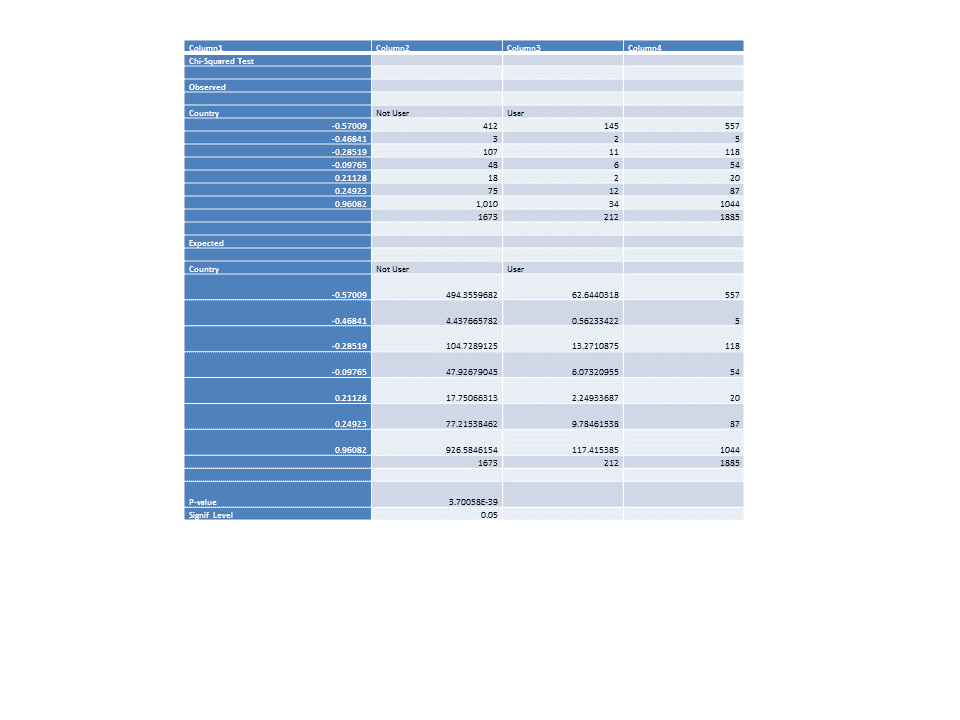

由于 p 值小于 0.05，国家具有统计学意义。

让我们看看冲动如何影响用户的百分比:

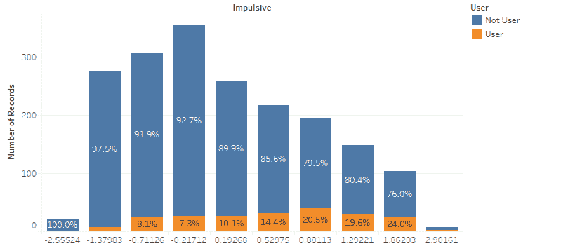

随着冲动得分的增加，用户的百分比也增加。

我们可以应用卡方检验来检查冲动性在统计上是否显著:

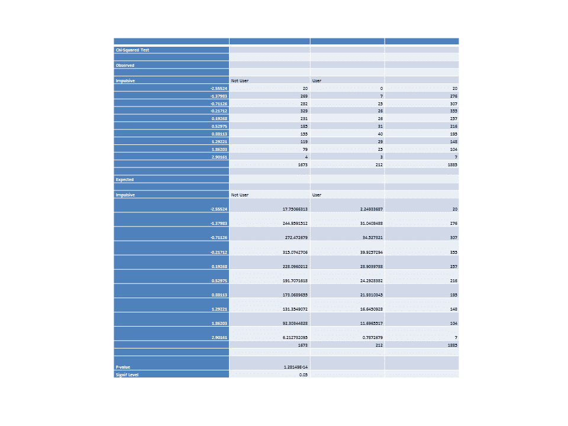

由于 p 值小于显著性水平，冲动性具有统计学意义。

随着冲动得分的增加，用户的百分比也增加。在 Nscore 中可以看到类似的效果:

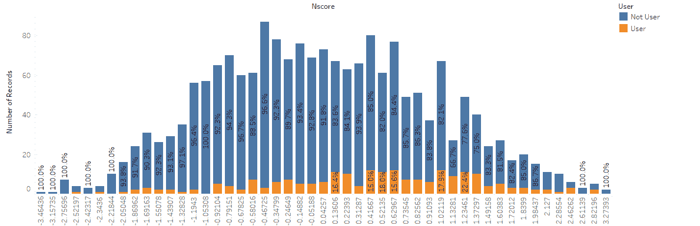

同样的事情也可以在 SS 中看到:

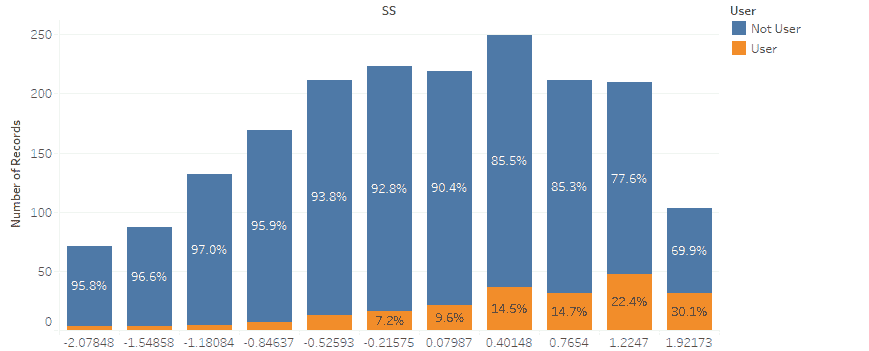

Ascore 出现了相反的效果:

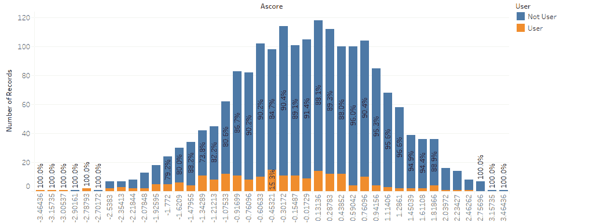

低海拔地区的用户比例较高。我们可以通过标准化条形图更清楚地看到这一点:

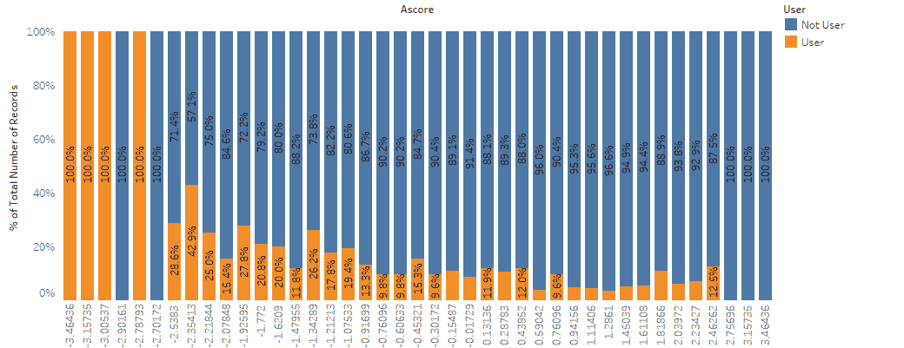

同样，教育程度越低，使用者的比例越高:

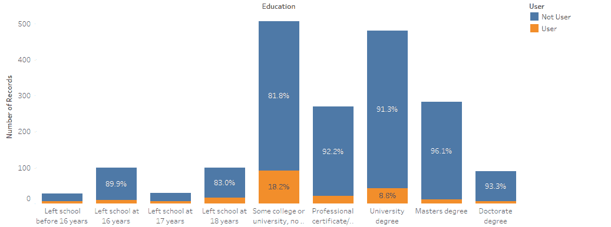

我们可以通过标准化条形图更好地了解这一点:

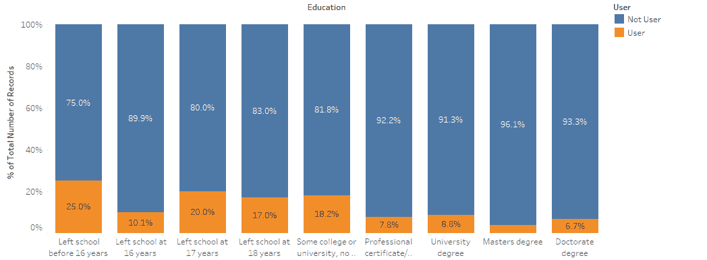

卡方检验适用于 Nscore、SS、Ascore 和教育；所有这些都被发现具有统计学意义。相比之下，对 Escore 进行卡方检验得出的 p 值为 0.156615315，大于 0.05。因此，Escore 没有统计学意义。种族划分在统计上也是无关紧要的。有趣的是，Cscore 和 Age 在统计上是非常重要的，尽管我们在构建模型时会在反向消除中消除它们。在 Cscore 和个人是否是用户之间似乎确实存在关系:

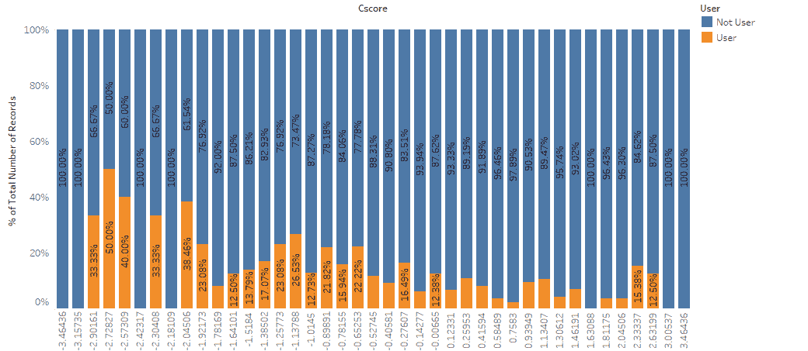

较低得分的用户百分比较高。同样，年轻人的用户比例更高:

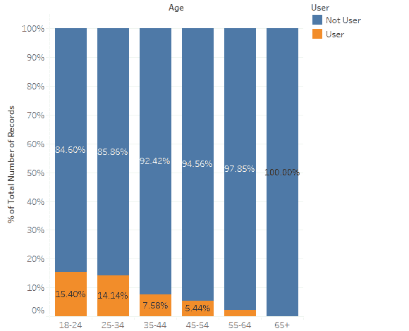

# 建立逻辑回归模型

使用 gretl，我对训练集应用了逻辑回归。在逻辑回归中，我们的模型将给出每个人的概率——即这个人是用户的概率。

首先，我使用反向消除法消除了一些自变量，p 值的阈值为 0.05。这样，我就能够消除 Escore、Cscore、年龄和种族。此时，我们在 gretl 中的逻辑回归模型看起来是这样的:

模型 32: Logit，使用观测值 1–1508

因变量:用户

基于 Hessian 的标准误差

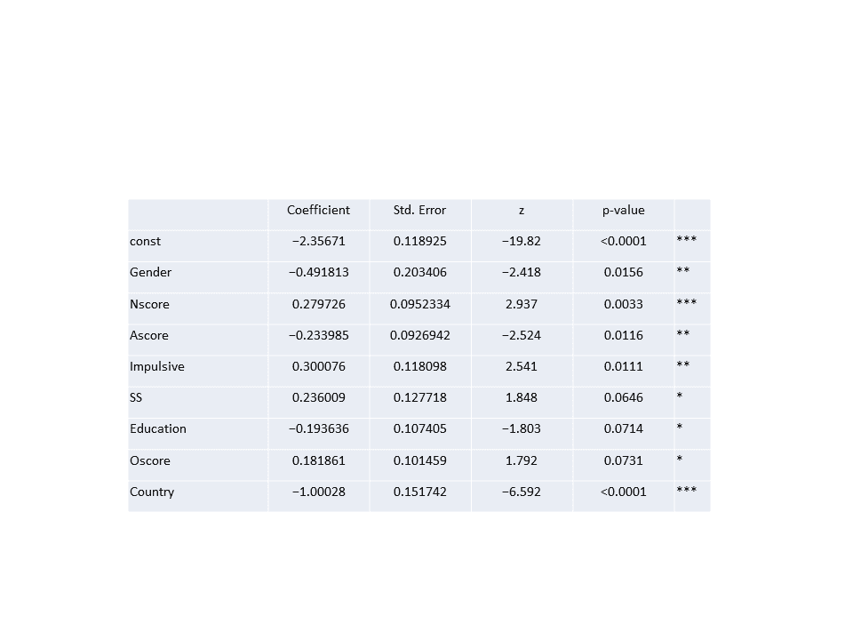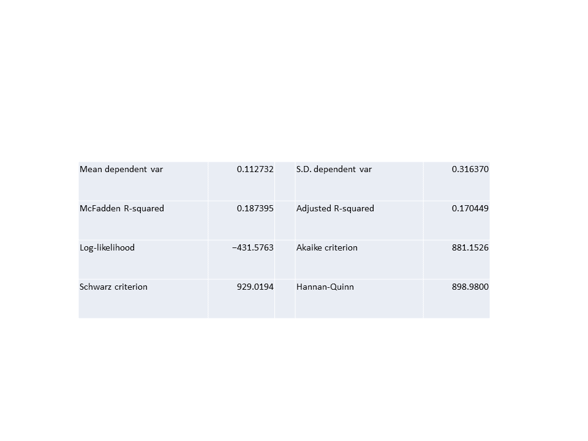

“正确预测”的病例数= 1334 (88.5%)

独立变量平均值的 f(β' x )= 0.316

似然比检验:卡方(8) = 199.051 [0.0000]

可以看到，Oscore 的 p 值大于 0.05；但是，从模型中移除 Oscore 会将调整后的 R 平方值降至 0.169289。所以，我决定保留 Oscore 以及 Education 和 SS。我检查了共线性，没有共线性的迹象。模型的准确率为 88.5%。

# 评估模型

下面是 CAP 曲线的样子:

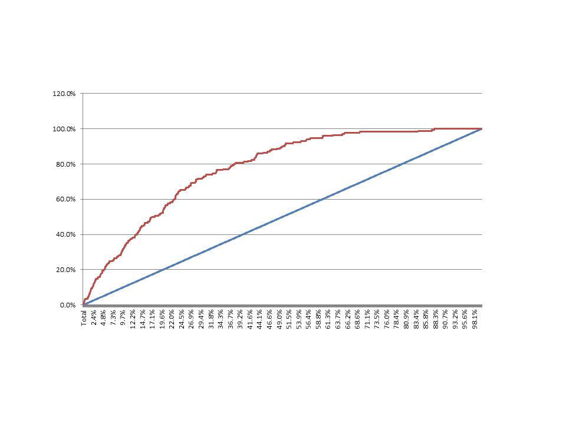

我们的训练集由我们的逻辑回归模型从最高预测概率到最低预测概率排序。横轴表示所考虑的个体占总人口的百分比。纵轴测量我们的训练集中的用户人口的百分比。水平轴上 x%处的红色曲线表示从我们的训练集的前 x%中识别出的用户数量(根据我们的模型排序)除以我们的训练集中的用户总数。蓝线是随机模型的性能。从 CAP 曲线可以看出，我们的逻辑回归模型是好的。在 x=50%时，我们的上限曲线约为 90%。

接下来，我们将模型应用于测试集，并为测试集创建了 CAP 曲线。我们的逻辑回归模型从最高预测概率到最低预测概率对测试集进行排序。这是我们测试集的 CAP 曲线:

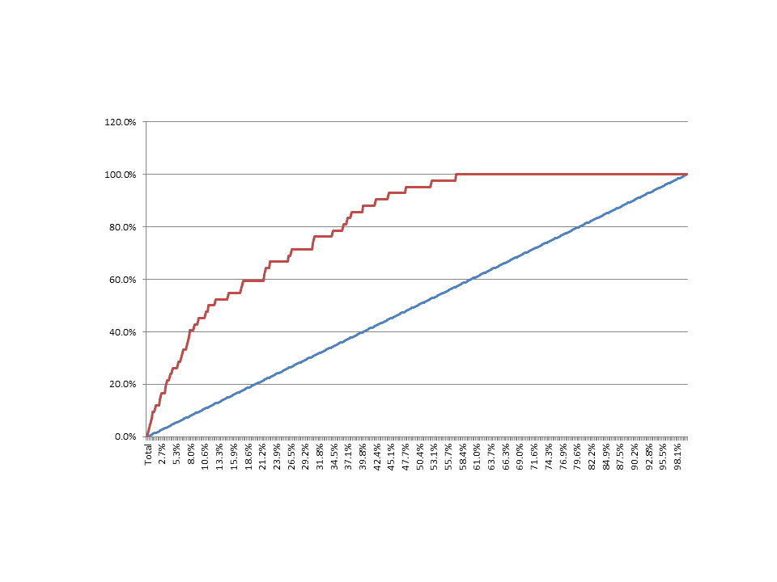

在 x=50%时，我们的上限曲线约为 95%。所以我们的模式非常好。这个帽曲线告诉我们的是，通过根据我们的模型给出的最高概率对我们的测试集中的个体列表进行排序，我们将通过考虑列表中的前 50%的个体来识别 95%的用户。如果我们考虑一组新的个体，我们可能通过只考虑 50%的个体来识别 95%的用户。我们的模型在测试集上的准确率为 89.9%。

让我们来看看预测者的优势比:

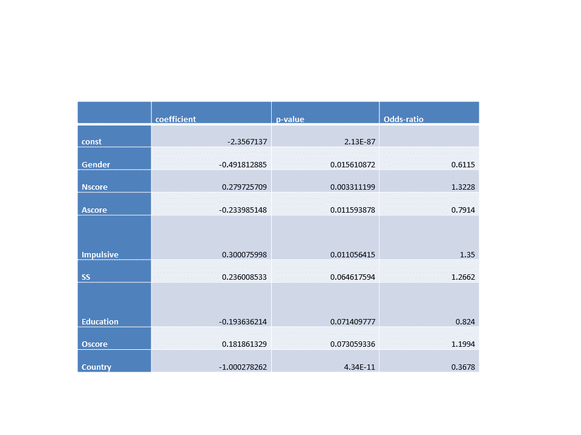

如您所见，冲动、Nscore、SS 和 Oscore 与其优势比呈正相关。另一方面，国家、性别、年龄和教育与他们的优势比呈负相关。这表明，增加冲动、Nscore、SS 和 Oscore 与增加个人成为用户的可能性相关。另一方面，增加 Ascore 和教育与降低个人成为用户的可能性相关。

回想一下，尽管 Cscore 和年龄没有包含在模型中，但它们在统计上是有意义的。我通过包含它们来训练一个新的模型，看看它是否改进了模型。这是 gretl 的新模型:

模型 1: Logit，使用观测值 1–1508

因变量:用户

基于 Hessian 的标准误差

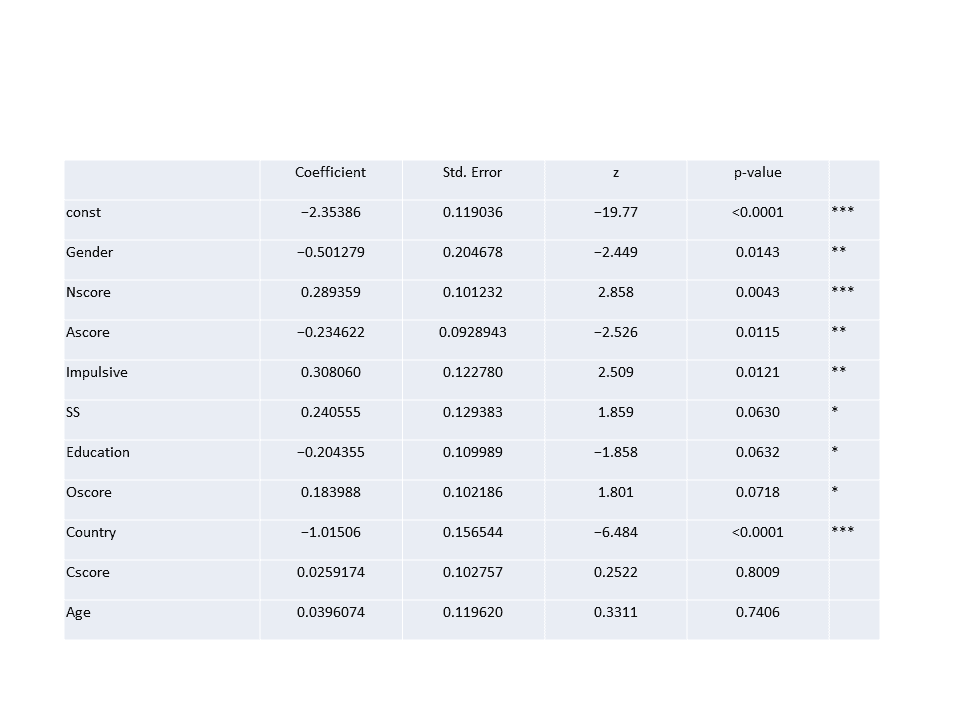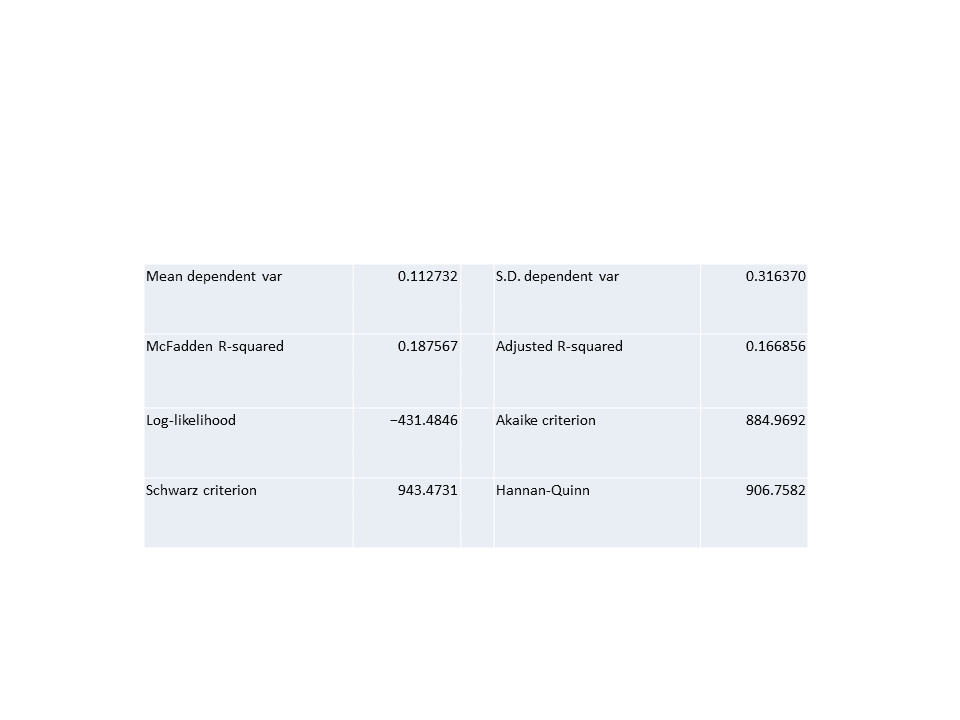

“正确预测”的病例数= 1337 (88.7%)

独立变量平均值的 f(β' x )= 0.316

似然比检验:卡方(10) = 199.235 [0.0000]

你可以看到，准确率是 88.7%，比我们原来的模型准确率好不了多少。

这是我们应用于训练集的新模型的 CAP 曲线:

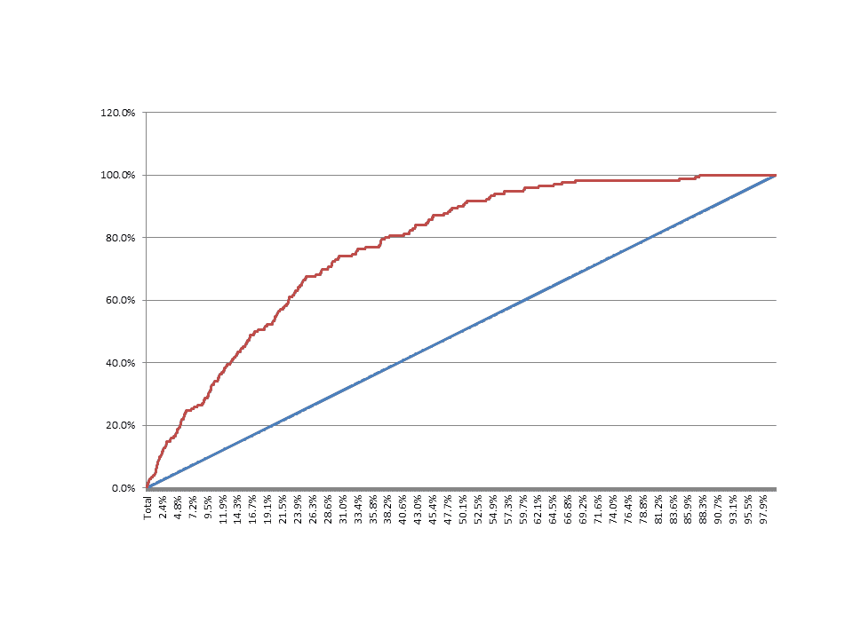

当 x=50%时，帽曲线约为 90%。该模型在训练集上的准确率为 88.66%。因此，我们的新型号并没有比原来的型号改进多少。

我在测试集上应用了新的模型，得到了下面的 CAP 曲线。

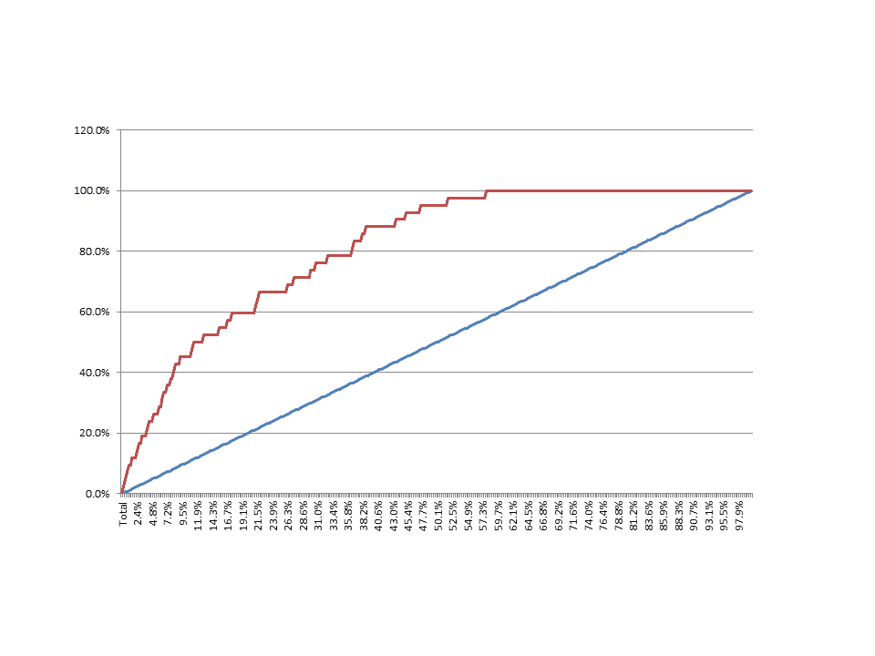

当 x=50%时，曲线大约为 95%。该模型在测试集上的准确率为 89.9%。因此，在模型中包括 Cscore 和 Age 并不会对模型有太大的改进。

以下是预测因子 Cscore 和年龄的优势比:

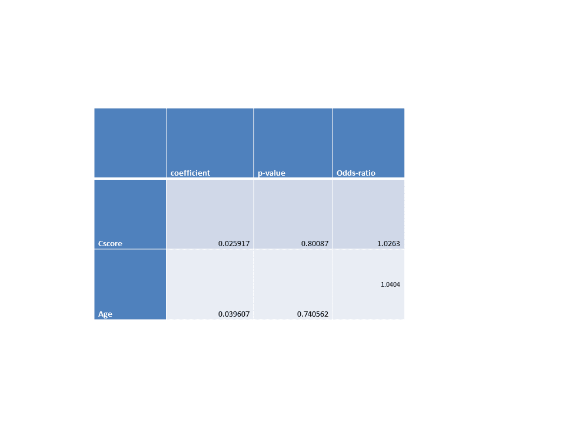

因为 Cscore 和 Age 的系数接近于 0，所以它们对个人是用户的概率没有太大贡献。奇怪的是，根据卡方检验，Cscore 和年龄在统计上是显著的，但在模型中却不是必需的。可以解释这一点的是，Cscore 与 Nscore 和 Impulsive 负相关，年龄与 SS 负相关。这是关联矩阵的热图:

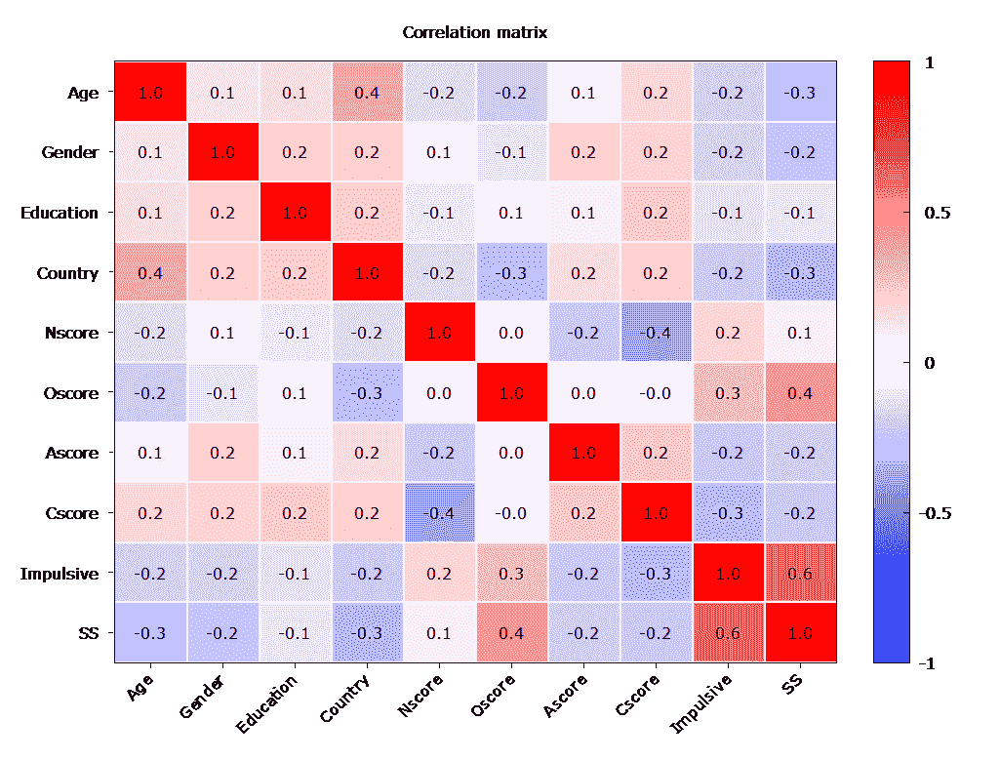

数据集可以在这里找到:[http://archive . ics . UCI . edu/ml/datasets/Drug+consumption+% 28 quantified % 29](http://archive.ics.uci.edu/ml/datasets/Drug+consumption+%28quantified%29)

E.Fehrman，A. K. Muhammad，E. M. Mirkes，V. Egan 和 A. N. Gorban，“人格的五因素模型和药物消费风险的评估。，“arXiv [【网页链接】](https://arxiv.org/abs/1506.06297)，2015