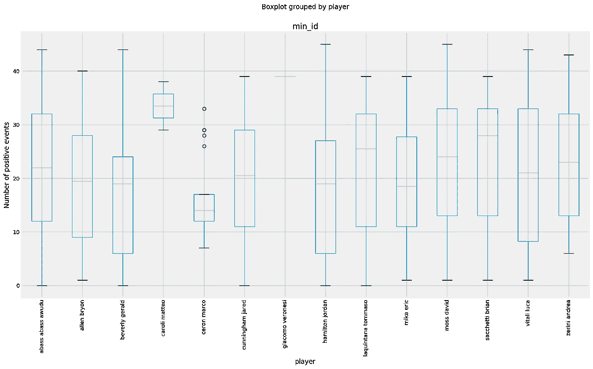

# 应用于体育的数据科学:识别随着时间推移表现相似的运动员

> 原文：<https://medium.com/analytics-vidhya/data-science-applied-to-sport-identify-players-with-similar-performances-over-time-914e73e523f9?source=collection_archive---------8----------------------->

## **简介**

我一直希望将数据科学应用于体育。我一直希望将数据科学应用到体育运动中，并有所作为。篮球是一项令人惊叹的运动，它不会受到孤立事件的太多影响:图式和战术通常会对最终得分产生有效的影响。因此，这是试验一些数据建模的好地方！

## **总结**

在本教程中，我们将了解如何应用数据科学来识别与**相似的玩家。我们不会太关注与检索和解析数据相关的第一部分，但我们将主要考虑一些有趣的调查，这些调查可以在预处理的篮球数据上执行。我们将进行一些基本的描述性探索，然后，最重要的是，我们将试图理解如何识别在一段时间内表现相似的篮球运动员**。****

## **动机**

这种分析可能在不同层面上有用。篮球教练可能想了解对手队员的特点，以研究可能的对策。招聘经理可能希望在下一个转会窗口期间确定具有特定表现的球员，以提高团队技能。一个运动员可能会对观察自己的表现感兴趣，以了解他效率下降的关键时刻。最后，甚至支持者或赌徒也可能想利用这些信息来促进他们对比赛结果的预测。因此，确定具有相似表现的玩家可以给游戏中的多个参与者带来具体的利益。

## **下载、解析和预处理数据**

*   第一步是搜集数据。正如在每一个优秀的老式数据科学过程中一样，这无疑是最令人讨厌和要求最高的一步。我们不会在这里讨论细节，但数据是从意大利参考篮球服务器收集来的，这些服务器报告了从 2016 年开始的比赛事件的**摘要和**细节。
*   下一步是解析数据。这个手术花了我大部分时间，一剂很好的耐心(还有眼泪和绝望的哭喊！)来得出一个像样的结果。
*   最后，不同的数据源被合并以产生一个包含所有可用信息的综合表格。

这里是在这些步骤之后获得的数据集的一个小摘要。 *game_details* 是一个 [Pandas dataframe](https://pandas.pydata.org/pandas-docs/stable/reference/api/pandas.DataFrame.html) 在事件级别报告每场比赛的信息。

第一个元素列表描述了数据框中可用的列。具体包括以下内容:比赛的日期和地点，每节比赛后的最终得分和得分，裁判名单，以及在特定时间进行比赛的球员。

接下来，报告了自 2016 年以来参加意大利篮球联赛的所有球队的名单。

然后，我们有一些合并数据帧的基本统计数据。有 **478** **游戏**对应 **~220.000 赛事**。不幸的是，由于在参考门户网站上并非所有的游戏都包含游戏信息，我们在数据集中缺少一些匹配。然而，这仍然是相当多的事件。而且上赛季(2018–2019)的比赛都包含在内。

最后，显示所有事件的列表。最后一个空字符串指的是门户网站没有分配给任何玩家的团队事件。

## **描述性统计**

一旦数据被下载、解析和处理，就该对匹配进行一些探索性的分析了！在这方面，有几个假设可能被测试和探索要完成。下面我们只考虑其中的一些。

我们可能渴望**比较一段时间内主客场球队的表现**。正如我们所看到的，总体和季度得分分布非常相似，似乎正如所料，*队在主场比赛时往往得分更多*。

比赛中得分的分布。数据参考 2016–2018 赛季(包括极端情况)。

接下来，我们研究特定的团队在相同的模式下如何表现。例如，当我们将阿玛尼米兰交易所的主场和客场表现与其他球队进行比较时会发生什么。

从剧情来看，似乎是**队在主场** ( *黄线* ) **的表现明显优于其余队伍** ( *蓝线*)。这尤其发生在最后一个季度(最后一个情节)。换句话说， *a|x 阿玛尼交换米兰*证明了在有利的条件下(即主场作战)，甚至在球员疲惫的时候(最后一节)，对比赛有着颠覆性的影响。这个事实可能是他们在前两个赛季达到最高位置的关键原因之一。

另一个简单的分析是可视化团队事件在时间上的演变。例如，我们可以**探究在游戏过程中进行了多少次替换**。以下是团队整体的结果:

及时替换

剧情有一个清晰的模式。在第一个季度中，从比赛的第 5 分钟左右开始有一个急剧的上升。然后在第二季度，趋势保持在高位，我们在比赛中期有一个高峰，那时教练可能需要球队更有活力。另一个增加发生在第三节，随后在比赛的最后部分减少，这时可能**教练不想过多影响球队的平衡，因为这是比赛中最危险的部分**。此外，请注意，随着我们进行到单节的最后几分钟，当球员累了的时候，换人的次数增加了。

**#识别相似玩家**我们现在重点识别随着时间推移表现相似的玩家**。基本思想是首先导出玩家表现随时间的统计分布。然后，我们在这些概率分布中定义一个**距离度量**。最后，使用这个度量，我们评估所有玩家分布之间的距离，并执行分层聚类来识别相似的玩家。**

**现在，我们继续详细说明所采取的步骤的确切顺序，并分享该过程中涉及的想法和一些 Python 代码。**

*   ***过滤数据，仅考虑与上赛季相关的比赛*。这主要是因为不是前几个赛季的所有比赛都有逐场比赛。与不同玩家相关的信息可能**不完整且不平衡**(某些玩家比其他玩家更具代表性)。**
*   ***过滤所有积极事件的集合*，如反弹或罢工。玩家表现分布的构建只考虑了这些事件。**

*   ***随时间创建玩家分布*。这个步骤通过简单地**考虑玩家在比赛中的正面事件数量的直方图**来完成。为了可视化这些分布，我们可以使用须状图。例如，接下来我们为 germani basket brescia 的球员绘制胡须图。如我们所见，例如，维塔利·卢卡的分布范围比卡罗里·马特奥广得多。**

****

*   **随着时间的推移创建球员分布，去除替换次数。之前的方法有一个缺陷:**我们没有考虑球员被替换的时间**。但是在我们的分析中，我们感兴趣的是玩家在游戏中的表现，而不是在游戏之外的表现。因此，我们应该取消运动员不参加比赛的时间。在这种转变之后，可以看到一些变化:**

****

**通过比较这两个图，我们可以注意到分布中的**关键变化**，这极大地修改了我们最初的估计。请注意，正如所料，每个球员的最短上场时间现在是第 0 分钟。**

*   ***过滤玩家，创建时间仓*。这两个重要步骤都是为了减少噪声，**使集群更加稳定**。前者包括选择具有足够数量积极事件的球员(即，过滤掉在数据帧中没有足够积极事件的球员)。后者根据宁滨在比赛季度的分布进行分组，因此我们不考虑每分钟的事件数量，而是考虑每季度的事件数量。这允许**更容易、更稳定和可靠地计算**成对分布距离。**
*   ***定义玩家时间分布之间的相似性距离*。我们准备定义一个相似性度量。给定两个玩家，它返回一个正数，**表示他们的分布**之间的距离。在这方面有许多选择，但是一个好的选择是使用 Wasserstein 相似性度量。Scipy 有一个方便的内置计算方法。**

*   ***计算所有分布之间的距离*。**给定成对分布，我们可以根据这个度量计算距离**。结果，我们获得了一个上对角矩阵，可以将它提供给 Scipy 的层次聚类功能来构建聚类。**

*   **运行分层集群。自底向上的层次聚类通过**连续地**将单个对象合并成组，直到获得最终的聚类。最开始，每个点形成自己的簇。然后，**最接近的**点被迭代合并以形成更大的聚类，直到所有点都成为单个聚类或者满足某些终止条件。
    该方法采用自底向上的方法，其中从代表单个实例的叶子直到根形成一个**树状图**，包含数据集中的所有实例。
    为了找到在他们的分布中具有低距离的玩家组，我们可以**运行 Scipy 层次聚类**，它可以接受距离上三角展平矩阵作为输入:**

**函数 *linkage* 的输出总结了创建集群所采取的步骤。每行由四列组成，分别表示合并的第一个**和第二个**集群，它们之间的距离，以及新合并集群中存在的实例数量。
例如，第一行意味着算法合并了实例号 37 和实例号 86，因为它们的 Wasserstein 距离为 0.002。合并的集群由 2 个元素组成。**

**该算法迭代地合并最近的聚类，直到所有元素都在一个组中。最终结果可以表示为一个**树形图**，一个描述分层算法演化的特殊树:**

****

**从聚类中，可以立即注意到两大群体**的存在**(绿色和红色)，其中玩家各不相同。此外，请注意**存在一个异常值**(玩家编号 53)，该异常值相对于其他玩家具有**完全统计差异分布**。我们可以进一步调查，看看游戏中的分布情况:**

****

**mccree erik 的表演**

**如果我们把这个玩家和其他玩家的剧情进行比较，很明显，随着时间的推移，这个玩家有着不同的表现。与其他运动员不同，他在比赛中的表现更加稳定。**

**现在，我们终于准备好**在玩家之间进行一些比较**。下面的代码取自两个玩家，绘制了他们表演的须状图和盒状图。因为我们对使用集群来比较性能感兴趣，所以我们将只关注箱线图。**

**这里是一些图表，取自该丛中一些最低的叶子:**

************

**太神奇了！沿着所有的四个季度，情节揭示了我们选择的球员之间的**密切和严格的相似性。分布确实非常接近，因此这允许识别随着时间推移具有相似表现的玩家。万岁！！****

## ****接下来的步骤****

**在这次旅程中，我们只是触及了所有可能从数据开始执行的调查的表面。其他想法可能会考虑这样的问题，如一些运动员在一起比赛时是否有更好的表现**，或者当其他一些运动员在另一队时是否有糟糕的表现。例如，可能存在一组真正有益于所有团队成员的**魅力型球员。另一个分析领域可能是将游戏事件视为一个序列，例如，尝试理解是否存在模式、每个团队背叛或强大的重复事件(这里可能需要关联规则！).******

****即使从我们执行的分析开始，也有大量的工作要做。我们能从这些集群中做出推断吗？例如，该队的球员在表演中是否平衡？有哪些比较均衡的队伍？一个车队在赛季末的良好定位和它所拥有的平衡水平之间是否存在某种关联？****

****正如我们所看到的，有大量的问题需要调查。然而，我们所做的分析对一场比赛的不同参与者来说仍然是有益的。此外，它可以很容易地复制到其他运动中(如足球、英式足球、网球或其他)。毕竟，**这只是使用一组定义好的积极事件记录下来的问题**。****

****感谢你远道而来！我真的希望你喜欢这篇文章，就像我在进行分析和与你分享这个项目时一样。如有疑问，欢迎评论！****

****下次再见，祝你好运！:)****