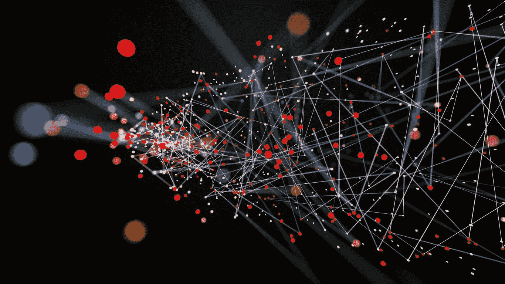

# 数据科学、最佳数据科学实践、AI、ML 和 DL 之间的区别以及技术堆栈！

> 原文：<https://medium.com/analytics-vidhya/data-science-best-data-science-practices-difference-between-ai-ml-and-dl-and-technology-stack-f8bc899e3791?source=collection_archive---------4----------------------->

数据科学

## **什么是数据科学？**

数据科学是数据推理、算法开发和技术的多学科融合，旨在解决复杂的分析问题。

核心是数据。流入并存储在企业数据仓库中的大量原始信息。挖掘它可以学到很多东西。我们可以用它来构建高级功能。数据科学最终是以创造性的方式使用这些数据来产生商业价值。

从数据仓库到发现数据洞察力只有在量化数据分析之后才有可能，以帮助引导战略性商业决策来发现商业价值。在生产中使用算法解决方案从数据洞察中发现数据产品。

## **最佳数据科学实践:**

***理解用例及业务目标:***

这是所有数据科学项目最重要的一步，即定义数据科学需要实现的业务目标。它需要对业务和新项目的预期结果有清晰的理解。它有助于数据科学家为可能的挑战做好准备，并采用正确的方法和输入来获得业务所需的洞察力。

***识别数据:***

大约(60–70)%的数据科学项目时间花在数据准备和清理上。数据以各种形式出现，大致分为结构化、非结构化和半结构化。我们需要识别相关的数据或识别数据中存在的异常，并了解数据是否足以为所需的业务目标提供有用的见解。

**头脑风暴:**

大多数成功的数据科学项目都有一个共同点，即团队成员之间的协作。一个团队由来自不同背景的人组成，他们面临着各种各样的挑战，无论是建模、数据准备/清理还是个人的领域方面。在团队成员中进行头脑风暴会议以达成解决方案总是有用的。

***数据是数值:***

设定结果的期望值，即让每个人都知道结果是基于数据的。这可能与业务目标的预期形成对比，但让业务利益相关方了解这些见解/发现总是有好处的，它可能会打开比业务人员的预期见解更大的前景。

***寻找合适的工具:***

根据业务目标，如果是高度计算性的任务，如从图像、视频或音频数据中提供洞察力，则需要具有 GPU 的高性能系统，并且根据数据生成的速度，也会影响设置正确的工具集。

***洞察报告暨行动:***

在从混乱的数据中发现伟大的见解后，所有见解的价值都变小了，直到并且除非它被转化为业务价值的可视化。商业价值的可视化越好，商业终端人员的行动计划就越好，他们可以基于可视化的数据定制他们的商业操作，并习惯于他们试图吸引的客户的商业需求。Insight 是一种原始碳，经过可视化技术处理后会变成抛光钻石。

***定期验证确认:***

模型是在一组不同参数的数据上开发的，但是数据在一段时间内是不同的。如果我们对一段时间后捕获的新数据使用相同的模型，则该模型可能会在过去提供的洞察力方面崩溃。始终建议采用一种测试策略来测试新数据的模型，并定期验证/确认结果，如果模型性能恶化，则修改模型。

## **AI、ML、DL 的区别:**

***AI 是如何开始的？***

艾伦·图灵是一位数学家，二战中破译了英格玛密码机的密码学家，逻辑学家，哲学家，剑桥奖学金获得者(22 岁)和超长距离赛跑运动员。他还奠定了现代计算机和人工智能的基础。

他的作品在 20 世纪 50 年代逐渐为公众所知。这催生了“通用人工智能”的概念:计算机能拥有人类智能的相同特征吗，包括推理、互动和像我们一样思考？答案是响亮的“不”(至少现在还不是)。

因此，我们不得不专注于“狭义人工智能”——能够完成特定任务的技术，例如下棋、推荐你的下一部网飞电视节目以及识别垃圾邮件。所有这些都展示了人类智慧的一部分。但是它们是如何工作的呢？那就是机器学习。

***AI 需要 ML:***

在高层次上，ML 通常意味着算法或模型

数据:获得大量(干净的)数据，具有人类定义的特征(例如，“年龄”，“身高”，“FICO 分数”，“这是垃圾邮件吗？”等等。)

训练:使用数据来“调整”每个特性的相对重要性。

推论:根据新数据预测某事。

这方面的一个例子是预测垃圾邮件:谷歌 Gmail 收集了大量关于什么是垃圾邮件，什么不是垃圾邮件的数据(这被称为“标记数据”)。该算法然后识别垃圾消息与非垃圾消息共同特征。该算法然后对*未标记的数据*(即新邮件)运行，以预测它们是否是垃圾邮件。

ML 需要大量的人工干预，例如手动告诉垃圾邮件过滤器在垃圾邮件和非垃圾邮件中查找什么(例如，查找单词“Western Union”/查找可疑网站的链接等。).在图像上也不是很准确。

**ML<= { NLP，DL }:**

深度学习(包括递归神经网络、卷积神经网络等)是一种机器学习方法。它是神经网络的延伸。深度学习非常广泛地用于基于视觉的分类(例如，区分飞机图像和狗图像)。深度学习也可以用于 NLP 任务。然而，需要注意的是，深度学习算法并不专门处理文本。

ML 和 NLP 有一些重叠，因为机器学习经常用于 NLP 任务。LDA(潜在狄利克雷分配，一种主题建模算法)就是一个这样的无监督机器学习的例子。

然而，自然语言处理有很强的语言学成分(图中没有显示)，这需要理解我们如何使用语言。理解语言的艺术包括理解文本中的幽默、讽刺、潜意识偏见等。一旦我们明白这意味着讽刺(是的，没错！)我们可以将其编码到机器学习算法中，以统计方式自动为我们发现相似的模式。

总而言之，为了做任何 NLP，你都需要理解语言。不同类型的语言是不同的(研究论文、博客、twitter 有不同的写作风格)，所以有一个很强的组成部分是手动查看你的数据，以了解它试图告诉你什么，以及你作为一个人会如何分析它。一旦你弄清楚你作为一个人类推理系统在做什么(忽略散列标签，使用笑脸来暗示情绪)，你就可以使用相关的 ML 方法来自动化这个过程并扩展它。

## **技术和工具:**

机器学习在各种计算领域的应用正在迅速普及，这不仅是因为廉价而强大的硬件，还因为免费和开源软件的可用性越来越高，这使得机器学习易于实现。作为软件工程团队的一部分，机器学习从业者和研究人员不断构建复杂的产品，将智能算法与最终产品集成在一起，以使软件更加可靠、快速且没有麻烦地工作。市场上有各种各样的开源机器学习框架可用，这些框架使机器学习工程师能够构建、实现和维护机器学习系统，生成新项目，并创建新的有影响力的机器学习系统。

让我们来看看一些顶级的开源机器学习框架。

***阿帕奇火花 Mlib:***

这是一个机器学习库，其主要目标是使实用的机器学习变得可扩展和简单。它由常见的学习算法和实用程序组成，包括分类、回归、聚类、协作过滤、降维以及低级优化原语和高级管道 API。

Spark MLlib 被视为 Spark 核心之上的分布式机器学习框架，主要由于基于分布式内存的 Spark 架构，它的速度几乎是 Apache Mahout 使用的基于磁盘的实现的九倍。

***张量流:***

TensorFlow 是一个开源的机器学习软件库，由 Google Brain 团队开发，用于各种感知和语言理解任务，并对机器学习和深度神经网络进行复杂的研究。它是 Google Brain 的第二代机器学习系统，可以在多个 CPU 和 GPU 上运行。TensorFlow 部署在谷歌的各种产品中，如语音识别、Gmail、谷歌照片甚至搜索。

***Accord.NET***

雅阁。NET 是一个用于科学计算的. NET 开源机器学习框架，由多个用于不同应用的库组成，如统计数据处理、模式识别、线性代数、人工神经网络、图像和信号处理等。

***亚马逊机器学习(AML):***

亚马逊机器学习(AML)是面向开发者的机器学习服务。它有许多可视化工具和向导，用于创建高端复杂和智能的机器学习模型，而无需学习复杂的 ML 算法和技术。通过 AML，可以使用简单的 API 获得对应用程序的预测，而无需使用定制的预测生成代码或复杂的基础设施。

*Keras 是一个用 [Python](https://en.wikipedia.org/wiki/Python_(programming_language)) 编写的开源神经网络库。它能够在 [TensorFlow](https://en.wikipedia.org/wiki/TensorFlow) 、[微软认知工具包](https://en.wikipedia.org/wiki/Microsoft_Cognitive_Toolkit)、 [Theano](https://en.wikipedia.org/wiki/Theano_(software)) 或 [MXNet](https://en.wikipedia.org/wiki/MXNet) 之上运行。Keras 包含许多常用神经网络构建模块的实现，如层、目标、激活函数、优化器和一系列工具，使处理图像和文本数据更加容易。*

*对于机器学习和深度学习，还有许多其他这样的库，这取决于选择哪一个的用例。*

## ***学习数据科学:***

*学习数据科学有许多来源，但最重要的要求是学习一种编程语言来实现数据科学用例。*

****编程语言:*** Python、R、Java、SAS、MATLAB 等*

****适合初学者:****

*强烈推荐开始机器学习的课程是 Udemy，Coursera，Edx 等。*

*由于我已经从所有这些来源学习了课程，我以我的经验推荐以下内容，即如果有人只是对机器学习感兴趣，而对数学课程不感兴趣，可以参加 udemy "**Machine Learning A-Z:Hands-On Python&R In Data Science "，**它解释了所有基本机器学习算法的 Python 编码以及所有算法的基本指令。*

*如果有人有兴趣了解算法背后的数学概念，那么我会强烈推荐 Coursera 的**“机器学习入门”**课程。因为作者“吴恩达”花了很大力气解释算法背后的数学原理。*

****为高级研究员:****

*对于高级机器学习/深度学习概念，人们可以按照教科书和课程来学习下面提到的核心机器学习和深度学习，*

***来自 **Coursera** 的深度学习**课程是开始深度学习的必备课程，该课程还涵盖了纯**实时用例**的任务。如果候选人可以在没有外部资源太多帮助的情况下完成本课程和所有用例，那么他/她将能够执行深度学习中的大多数任务。*

*在 Udemy 中有许多基于特定主题的课程，适用于许多用例。*

*掌握数据科学实践需要大量阅读，并找到相关链接:*

***用于机器学习中的统计**—[https://web.stanford.edu/~hastie/Papers/ESLII.pdf](https://web.stanford.edu/~hastie/Papers/ESLII.pdf)*

***进行深度学习**——[https://github.com/janishar/mit-deep-learning-book-pdf](https://github.com/janishar/mit-deep-learning-book-pdf)*

*Coursera——[https://www.coursera.org/](https://www.coursera.org/)*

*乌代米——[https://www.udemy.com/](https://www.udemy.com/)*

***牛津**——[https://github.com/oxford-cs-deepnlp-2017/lectures](https://github.com/oxford-cs-deepnlp-2017/lectures)*

***分析维迪亚**——[https://www.analyticsvidhya.com/](https://www.analyticsvidhya.com/)*

***机器学习掌握**——[https://machinelearningmastery.com/](https://machinelearningmastery.com/)*

## ****注:****

*内容取自各种博客文章和维基百科文章，很少取自我以前的博客文章。这里将它们结合起来，以获得数据科学的总体概述。*