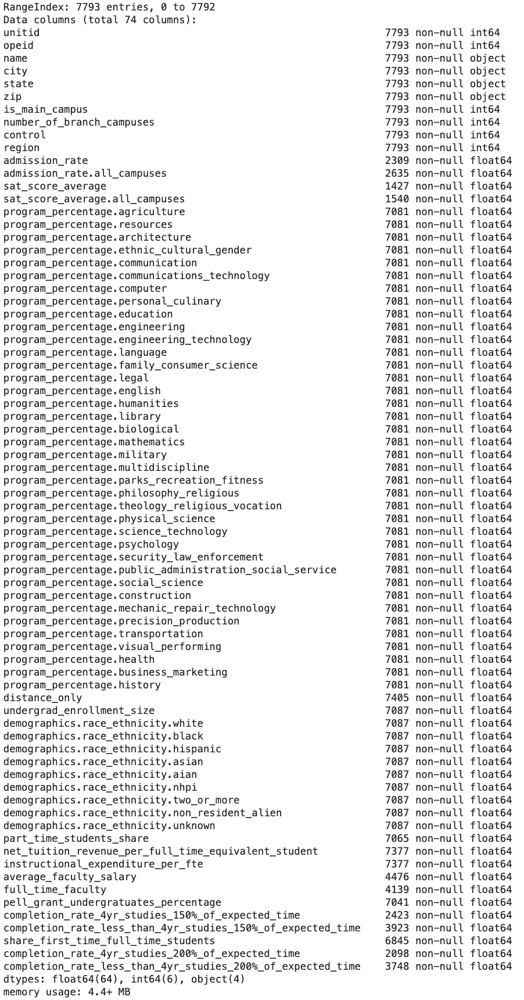
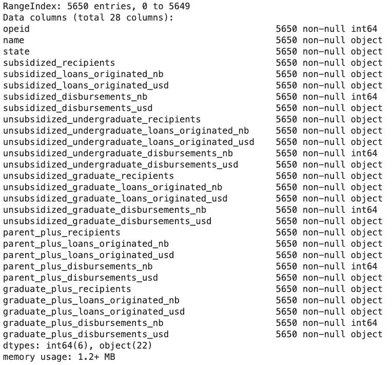
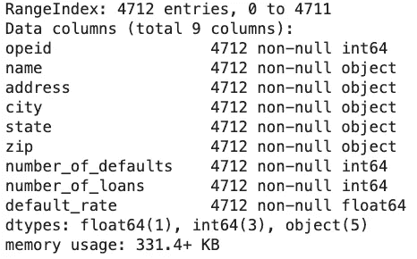

# 数据科学商业案例:美国的学生贷款市场

> 原文：<https://medium.com/analytics-vidhya/data-science-business-case-student-loan-market-in-the-usa-9c08450cfe99?source=collection_archive---------11----------------------->

## 第 1 部分:如何构建项目？

# 介绍

在这一系列文章中，我们将通过回顾使这个项目成功的不同阶段来尝试解决一个数据科学业务案例。我们将重点关注的业务案例如下:

***业务案例:*** *一家金融公司希望进入美国的学生贷款市场。他们有一套数据集，其中包含特定年份的贷款信息、获得这些贷款的大学(如学生人数、位置、学生人口统计等)以及与这些贷款相关的违约率。*

作为一名数据科学家，我们的目标是利用可用数据帮助该公司以某种竞争优势(可能是位置、提供的利率等)进入市场。在这篇文章中，我们将看到如何构建这样一个项目，以及如何以一种有益于公司并增加其成功机会的方式完成每个阶段。

# 为什么构建你的项目至关重要？

在深入我们的业务案例之前，有必要回顾一下为什么清晰的项目结构对于项目的成功和作为公司数据科学家的个人成功都非常重要。

在了解如何从中受益以及作为数据科学家如何让他们受益之前，公司可能不愿意在数据科学项目上投入时间、精力和金钱。当然，规划一条有保证的道路和结果是不现实的，因为任何项目都会有一系列(不)预期的惊喜。然而，你仍然需要能够向他们展示一个项目结构，希望每个人都在同一页上。构建项目有几个好处(不仅限于数据科学项目！).

以下是我最喜欢的几个:

*1。允许您组织工作，提高效率*

*2。让你管理期望:什么是现实的结果，在什么时间范围内？*

*3。将项目分成几个阶段，每个阶段都有一个可交付成果。*

我想强调最后一点，因为它经常被低估，尽管在我看来，它是最重要的一点。您可能知道，在数据科学中，项目的结果是无法保证的。有时，你在过去两个月中努力工作的预测算法仍然会给你不可靠的结果，即使你尝试了所有方法并正确地遵循了每一步。这是工作的一部分，并不是所有的事情都可以被模型化。然而，你的老板不会考虑这个选项。毕竟他给你两个月工资不就是为了听你说你的模型不能用是因为那个数据不好/不足对吧？那个 **就是为什么你要把你的项目分解成可交付的阶段。**这里的关键词是**交付成果。**将一个项目分成几个阶段对许多人来说已经很自然了，你应该问自己的问题是:

在这个阶段结束时，我能展示哪些对公司有价值的东西？

因此，让我们通过使用上述业务案例来回顾一个项目结构的例子。我们将看到项目的每个阶段如何以某种方式、形态或形式产生对公司有价值的见解*。*

# 阶段 1:你能用这些数据做什么？

最终，您试图回答的问题是:**我可以用这些数据做什么？它如何为公司带来好处？**

这个问题的第一部分需要你的技术知识。换句话说，给定手头的数据，什么样的分析是可能的？什么模式可行？哪些技术合适？等等。第二部分需要你的商业头脑。也就是说，考虑到现有数据在技术上的可能性，我们可以获得哪些知识来直接或间接地使公司受益？能增加利润吗？它能带来客户需要的新服务吗？它能优化内部流程以提高生产率吗？等等。回答问题的第一部分是什么会给你的项目一个结构。回答问题的第二部分是什么将策划那个结构，并帮助你产生我们前面提到的交付物。然而，你不应该把这看作是一个连续的过程，而是一个贯穿整个项目的迭代过程。

那么，在我们的业务案例中，这看起来会是什么样的呢？嗯，我们是在和一家金融公司打交道，更准确地说是和一家贷款公司打交道。因此，他们业务和利润的核心将围绕着他们提供的贷款和利率。让我们快速浏览一下可用的数据，看看我们可以想出哪些用例来帮助公司改善贷款服务。

## 学院特色

我们数据集中的大学要素

## 贷款

我们数据集中的贷款要素

## 违约率

我们数据集中的违约率

很自然，我们想到的第一个想法是利用过去的数据创建一个预测算法来预测违约率。违约率是公司盈利能力的一个关键方面。预测违约率，让贷款公司设定一个合理的利率，从而确保业务盈利，同时仍然保持在贷款市场的竞争力。通过违约率预测，该公司还可以进行收入预测，并确保他们的预测是正确的。

随着公司在该领域的发展，他们将拥有自己的客户，数据集将获得新的数据流。最终，这些流数据可以用来不断地重新训练算法。因此，利率和风险状况将不断调整，以便随时提供最好的产品。借贷市场竞争非常激烈，他们需要利用快速发展的技术来保持盈利。金融公司越来越需要将自己改造成软件公司，以跟上金融科技世界的快节奏。

另一个想法是生成一些大学简介。大学概况也可以解释为定义每个大学的风险概况。由于该公司还不是市场上的积极贷款人，他们都有找到正确市场的负担和自由。根据公司愿意采取的策略，它可能更愿意将风险分散到几所小型大学，或者希望服务于一小组大型大学。大学的规模只是许多因素中的一个因素，如违约率、大学的年龄、大学的位置(影响纳税)、公司是否可以在该位置开设分支机构等。

现在，可以与公司中的数据科学家同事或管理层一起审查和评估上述两个想法。这是一个相当简单但重要的步骤。在制定计划之前，每个人都同意应该优先考虑和提出哪个想法。

# 第 2 阶段:仔细查看数据

有些东西在纸上可能很有意义，从商业角度看似乎是完美的想法，但一旦你看了数据，你就会意识到这在技术上是不可能实现的。这可能是一种直觉(通过过去的经验)，但你仍然必须利用数据来证明这样的结论，这将有助于在管理层面前为自己辩护。这也适用于技术上可行的事情！

那么，在检查了可以对数据做些什么之后，下一步是什么呢？嗯，这是**验证这个想法的技术可行性**。这里有几个步骤:探索性分析、统计分析、数据预处理等。让我们更详细地检查一下。

## 探索和统计分析

简而言之，这个阶段实现了两个目的:**验证当前的假设，并发现可用于创建新假设的新见解。**

探索性分析是一个宽泛的术语，用于描述深入研究数据集中的要素的阶段。您可能会查看特征分布(单变量分析)，或者查看特征之间的相关性(双变量分析)。这是一个很好的主意，在这里包括大量的观想。目标是尽可能熟悉数据集的要素。你想要寻找能在未来的分析中帮助你的模式。你还想以最有效的方式交流这些发现，这通常意味着制作一些更容易理解的漂亮图表。

也是在这个阶段，你验证项目是可行的。假设你试图像我们上面提到的那样预测违约率，在这种情况下，**因变量**(或预测值)就是违约率，但是你的自变量应该是什么呢？你的因变量和你的特征之间有很强的关系吗？如果是，它是线性的还是非线性的？提前做这件事是至关重要的，你是在构建你的案例，以显示创建一个预测模型是否合理。通过进行适当的探索性分析，你可以为你的公司节省大量的时间和金钱。

*注意:这个阶段将是本系列中另一篇文章的主题，在这篇文章中，我们将对感兴趣的特性进行彻底的探索性分析，并试图从数据中获得尽可能多的见解。*

## 数据预处理

在数据预处理阶段，您需要处理**缺失值**、**异常值**，可能还有**特征选择**和**特征工程**(尽管这可能已经是建模的一部分)。数据预处理可能是乏味的，有时是重复的，但却是数据科学项目中绝对必要的一部分。不处理数据集中的上述特征会导致错误的结果，或者有偏见的结果。这个阶段通常会占据整个项目的大部分，因为它可以决定你最终模型的成败，所以不要掉以轻心。

除此之外，你可能会很容易认为你不需要与管理层分享你在这个阶段所做的工作。我认为这是错误的方法。你在这里做的决定，(例如:包含或不包含某些特性，你处理缺失值的方式，等等。)将对最终的算法产生巨大的影响，项目中的每个人都应该知道每个决定背后的推理。将它视为一种让您的知识对公司显而易见的方式，并确保您公司的数据科学项目取得长期成功。此外，一些从技术角度看可能有意义的决策从业务角度看可能没有意义。这是你的工作，以确保你满足业务需求，同时仍然是科学的方法。

*注意:这一阶段将是本系列另一篇文章的主题，在这篇文章中，我们将深入探讨数据预处理过程，展示在处理缺失值、极值等时可以做出的决策类型。*

# 阶段 3:数据建模

在数据探索和预处理之后，我们准备进入建模阶段。从一个用例到另一个用例，这个阶段会有很大的不同。因此，本系列中还将有一篇单独的文章专门介绍大学风险分析和违约率预测模型的设计和实现。与前两个阶段一样，即使在这个阶段，我也要强调沟通。试着让你所有的决定清晰明了，并与你的团队和管理层分享任何关键的进展。

# 结论

总之，数据科学项目的结构可以概括为以下三个阶段及其交付成果:

1.  **你能用手头的数据做什么？**

*   为公司的短期和长期数据战略设计做出贡献，并帮助将数据科学定位为其业务的一部分
*   记录数据集
*   为项目的其余部分设计一个计划

**2。仔细查看数据**

*   验证领域专家或经验观察提供的当前假设
*   通过观察数据中的模式和变量之间的关系产生新的假设
*   通过统计分析验证项目的理论可行性
*   创建可视化以简化对您的数据和发现的解释(这可以在以后发展成仪表板)

**3。数据建模**

*   提出客户概况(在我们的商业案例中是风险概况)
*   改善服务(在我们的业务案例中，更好的贷款产品)

这就是这篇文章，我希望你喜欢的内容！业务方面有时是数据科学项目中被忽略的一个方面，提醒我们作为数据科学家，即使在结果不确定且更接近研究的项目中，完成的每项任务都需要带来一些价值。

下一篇文章将在我们的业务案例的上下文中讨论数据预处理(第 2 阶段的一部分),在这个案例中，我们是美国学生贷款市场中一家即将成立的金融公司的数据科学家。保持更新！

# 让我们社交吧！

请通过以下任何平台联系我:

**推特:** @Stelios_Rms

【stelio.rammos@gmail.com】邮箱:T2

【领英:[https://www.linkedin.com/in/stelios-rammos-675382149/](https://www.linkedin.com/in/stelios-rammos-675382149/)

**博客:**[http://www.blog.steliosrammos.com](http://www.blog.steliosrammos.com)