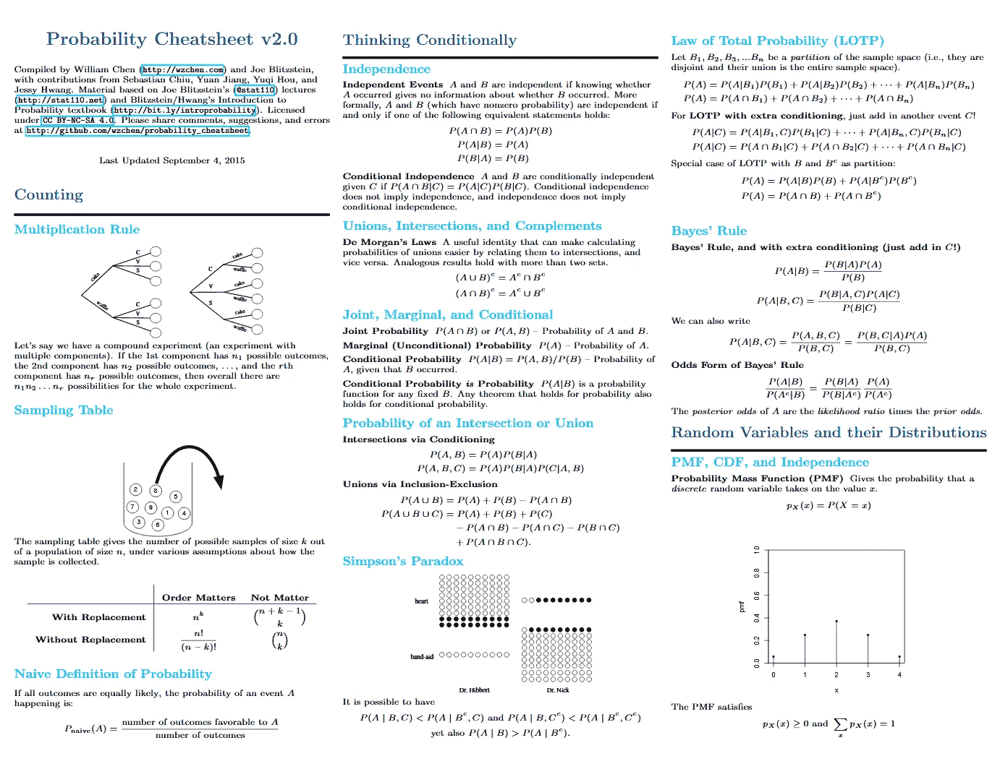

# 数据科学备忘单

> 原文：<https://medium.com/analytics-vidhya/data-science-cheat-sheets-109ddcb1aca8?source=collection_archive---------2----------------------->

代数，微积分，概率，统计，Python，R，机器学习，神经网络，Numpy，Pandas，Matplotlib

凯利·西克玛在 Unsplash 上的照片

***注:点击图片获取高分辨率备忘单。***

# 代数学

*下面有 2 页* ***页*** *。点击图片获取完整的备忘单。*

来源:[http://tutorial.math.lamar.edu/getfile.aspx?file=B,31,N](http://tutorial.math.lamar.edu/getfile.aspx?file=B,31,N)

# 线性代数

*下面有 4 页***。点击图片获取完整的备忘单。**

*

来源:[https://mini reference . com/static/tutorials/linear _ algebra _ in _ 4 _ pages . pdf](https://minireference.com/static/tutorials/linear_algebra_in_4_pages.pdf)* 

# *结石*

**下面有 4 页***。点击图片获取完整的备忘单。***

**

来源:[http://tutorial.math.lamar.edu/getfile.aspx?file=B,41,N](http://tutorial.math.lamar.edu/getfile.aspx?file=B,41,N)** 

# **可能性**

***下面有* ***第 10 页*** *。点击图片获取完整的备忘单。***

**

来源:http://www.wzchen.com/s/probability_cheatsheet.pdf** 

# **统计数字**

***下面有* ***4 页*** *。点击图片获取完整的备忘单。***

**

来源:[http://www . math centre . AC . uk/resources/uploaded/43799-pro b-stats-ff-for-web . pdf](http://www.mathcentre.ac.uk/resources/uploaded/43799-prob-stats-ff-for-web.pdf)** 

# **计算机编程语言**

**

来源:[http://datasciencefree.com](http://datasciencefree.com)** **

来源:[https://www.datacamp.com](https://www.datacamp.com)** 

# **稀有**

**

来源:[http://datasciencefree.com/](http://datasciencefree.com/)** 

# **机器学习**

## **Azure 机器学习**

**

来源:[https://docs . Microsoft . com/en-us/azure/machine-learning/algorithm-cheat-sheet](https://docs.microsoft.com/en-us/azure/machine-learning/algorithm-cheat-sheet)** 

## **sci kit-学习**

**

来源:[https://sci kit-learn . org/stable/tutorial/machine _ learning _ map/index . html](https://scikit-learn.org/stable/tutorial/machine_learning_map/index.html)** **

来源:https://www.datacamp.com** 

# **神经网络**

**

来源:https://www.asimovinstitute.org/neural-network-zoo/** **

来源:[https://www.asimovinstitute.org/author/fjodorvanveen/](https://www.asimovinstitute.org/author/fjodorvanveen/)** 

# **PySpark**

**

来源:[https://www.datacamp.com](https://www.datacamp.com)** **

来源:[https://www.datacamp.com](https://www.datacamp.com)** 

# **Numpy**

**

来源:[https://www.datacamp.com](https://www.datacamp.com)** **

来源:[https://intelli paat . com/blog/tutorial/python-tutorial/numpy-cheat-sheet/](https://intellipaat.com/blog/tutorial/python-tutorial/numpy-cheat-sheet/)** **

来源:[http://datasciencefree.com/](http://datasciencefree.com/)** 

# **建立在 Numpy 上的科学线性代数**

**

来源:[https://www.datacamp.com](https://www.datacamp.com)** 

# **数据可视化**

**

来源:[https://www.datacamp.com](https://www.datacamp.com)** 

# **熊猫**

**

来源:[https://www.datacamp.com](https://www.datacamp.com)** **

资料来源:https://www.datacamp.com** 

# **Matplotlib(数据可视化)**

**

来源:[https://www.datacamp.com](https://www.datacamp.com)** 

# **Seaborn(数据可视化)**

**

来源:[https://www.datacamp.com](https://www.datacamp.com)** 

# **克拉斯**

**

来源:[https://www.datacamp.com](https://www.datacamp.com)** 

# **Jupyter 笔记本**

**

来源:[https://www.datacamp.com](https://www.datacamp.com)** 

****感谢**的阅读！请👏如果你喜欢这篇文章，请跟我来，因为它**鼓励我**写更多！**