# 数据科学—使用 R 中的 data.table 进行数据辩论

> 原文：<https://medium.com/analytics-vidhya/data-science-data-wrangling-using-data-table-in-r-94b9f1f06a28?source=collection_archive---------14----------------------->

用简单的术语学习机器学习中最常用的数据表函数！

# 数据表

data.table 在执行文件读写、聚合、更新、范围和间隔连接等操作时，速度超快，内存效率高。R 程序设计中的大数据集。它继承了 data.frame，为更快的开发提供了简短灵活的语法。

# 句法

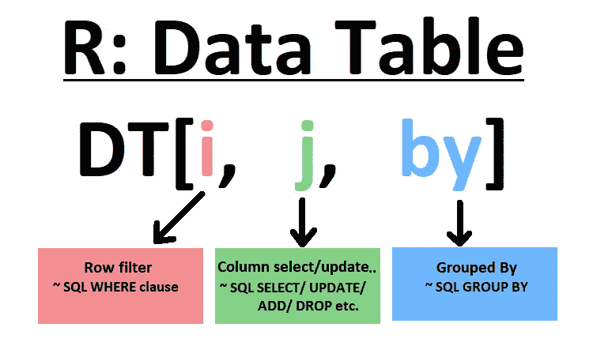

## 安装并加载软件包

```
**# Install package**
install.packages(“data.table”) 
**# Load library**
library(data.table)
```

# 读出数据

`fread`与`read.table`类似，但更快更方便。自动检测所有控制，如`sep`、`colClasses`、`nrows` 。

```
**# Read the data**
airline_dt = fread("[https://github.com/suryatechie/data/blob/master/Airline_US_DOT_May_2020.csv?raw=TRUE](https://github.com/suryatechie/data/blob/master/Airline_US_DOT_May_2020.csv?raw=TRUE)")**# Contains data from 
#** [**https://www.transtats.bts.gov/DL_SelectFields.asp?Table_ID=236**](https://www.transtats.bts.gov/DL_SelectFields.asp?Table_ID=236) **for
# the month of May 2020\. It's having the fields DAY_OF_MONTH, 
# DAY_OF_WEEK, FL_DATE, OP_UNIQUE_CARRIER, ORIGIN, DEST, DEP_DELAY, 
# ARR_DELAY, CANCELLED, and DIVERTED.****# Check the class of the loaded data**
class(airline_dt)
```

*‘数据.表格’‘数据.框架’*

`fread` 将数据存储为`data.table`。从上面`data.table`类的输出中，我们可以看到它继承了`data.frame`

```
head(airline_dt)
```

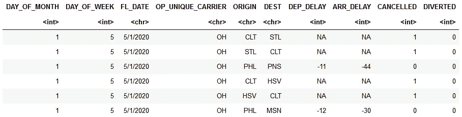

# 将 data.table 转换为 data.frame

**从数据表创建**数据框

```
# Creates new object
airline_df <- ***as.data.frame***(airline_dt)
class(airline_df)
```

输出:“data.frame”

**将**数据框转换为数据表

```
# Converts the current object ***setDT***(airline_df)
class(airline_df)
```

输出:' data.table' 'data.frame '

# 将数据框转换为数据表格

**从数据框创建**数据表

```
# Creates data frame
airline_df <- ***as.data.frame***(airline_dt)# Creates new object
airline_dt <- ***data.table***(airline_df)
class(airline_dt)
```

输出:' data.table' 'data.frame '

**将**数据表转换为数据框

```
# Converts the current object ***setDF***(airline_dt)
class(airline_dt)
```

输出:“data.frame”

```
# Convert back to data table as we are going to work on data table
***setDT***(airline_dt)
```

# 不使用过滤器计算行数和列数

```
nrow(airline_dt)
```

*180617*

```
ncol(airline_dt)
```

*10*

# 获取列名

```
names(airline_dt)
```

'月日'，'周日'，'航班日期'，'唯一承运人'，'始发地'，' DEST '，' DEP 延误'，'到达延误'，'取消'，'改道'

# 重命名列

```
**setnames**(airline_dt, c(“**OP_UNIQUE_CARRIER**”,”***DEST***”), c(“**CARRIER**”, “**DESTINATION**”))**# Print data table** airline_dt
```

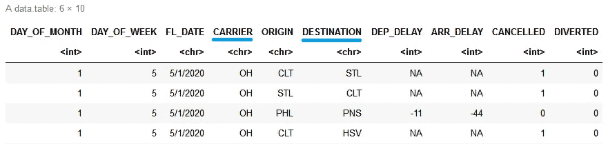

# 检查列类

```
**sapply**(airline_dt,**class**)
```

**月日:**'整数'**星期日:**'整数' **FL_DATE:** '字符'**承运人:**'字符'**始发地:**'字符'**目的地:**'字符'**DEP _ 延迟:**'整数'**ARR _ 延迟:**'整数'**取消:**

# 更改列类

```
airline_dt <- airline_dt[, FL_DATE:=**as.Date**(FL_DATE,format=’%m/%d/%Y’)]**# Display the top rows**
head(airline_dt)
```

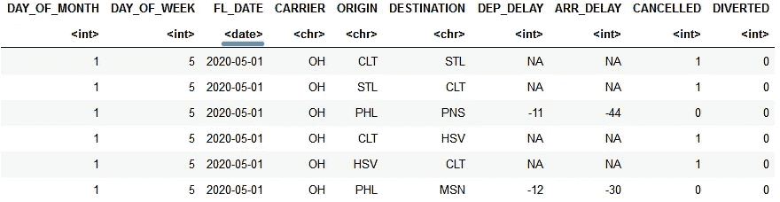

# 选择列

```
# Select CARRIER column
airline_new_dt<-airline_dt[,**CARRIER**]**# Print data table**
airline_new_dt
```

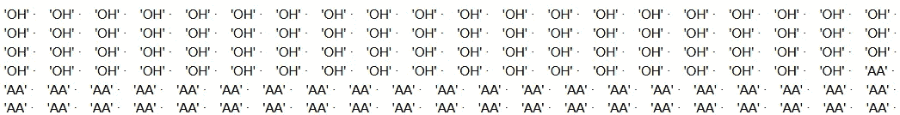

上述逻辑将返回一个向量。取而代之的是，使用下面的代码来获取选择的列数据作为`data.table`:

```
**# Option 1: Select by passing column as a list**
airline_new_dt<-airline_dt[,**.**(CARRIER)]**# Option 2: Select by passing column as a list**
airline_new_dt<-airline_dt[,**list**(CARRIER)]**#  Option 3: Select by passing column as a vector and with=F**
airline_new_dt<-airline_dt[,**c**("CARRIER"),**with=FALSE**]**#  Option 4: Select by passing column as an index and with=F**
airline_new_dt<-airline_dt[,**4**,**with=FALSE**]**# Print data table**
airline_new_dt
```


```
**# Select multiple columns**
airline_new_dt<-airline_dt[,c("FL_DATE","CARRIER","ORIGIN","DESTINATION"),with=FALSE]**# Select multiple columns by dropping unwanted columns using Logical Operator NOT (!)**
airline_new_dt<-airline_dt[,**!c**("DAY_OF_MONTH","DAY_OF_WEEK","DEP_DELAY","ARR_DELAY","CANCELLED","DIVERTED"),with=FALSE]**# Select multiple columns using column indexes (sequence)**
airline_new_dt<-airline_dt[,**c**(3:6),with=FALSE]**# Print data table**
airline_new_dt
```

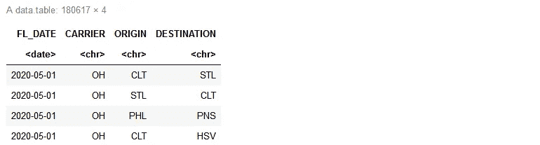

```
**# Select multiple columns using LIKE**
airline_new_dt = airline_dt[,names(airline_dt) **%like% "DE"**, with=FALSE]**# Print data table**
airline_new_dt
```

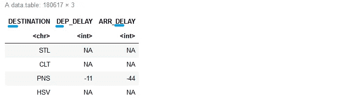

# 筛选行

```
**# Filter rows using Logical AND (&)**
airline_new_dt = airline_dt[ORIGIN **==** "ORD" **&** DESTINATION **==** "SFO",]**# Filter rows using IN and Logical AND (&)**
airline_new_dt = airline_dt[ORIGIN **%in%** c(“ORD”, “ATL”) **&** DESTINATION **%in%** c(“SFO”, “LAX”),]**# Filter rows using IN and Logical OR (|)** 
airline_new_dt = airline_dt[ORIGIN %in% c("ORD", "ATL") | DESTINATION %in% c("ORD", "ATL"),]**# Filter rows using IN, Logical NOT and Logical AND** 
airline_new_dt = airline_dt[!ORIGIN **%in%** c("ORD", "ATL") **&** !DESTINATION **%in%** c("ORD", "ATL"),]**# Print data table**
airline_new_dt
```

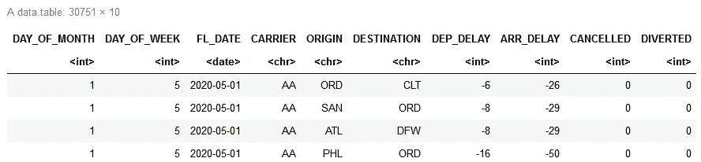

# 使用计算行数。普通

```
# All rows. No filter
airline_new_dt[,**.N**]
```

149866

```
# Row count after filter
airline_dt[!ORIGIN **%in%** c("ORD", "ATL"), **.N**]
```

165050

# 创建新列

使用 **:=运算符**创建新列

```
**# Create new column from two character columns separated by '-'**
airline_new_dt[,ORIGINDEST**:=**paste(ORIGIN,DESTINATION,sep = “-”)]**# Create new column from two numerical columns**
airline_new_dt[,DEP_ARR_DELAY:=DEP_DELAY**+**ARR_DELAY]**# Create multiple columns by providing column names as vector and values using list**
airline_new_dt[, **c**("ORIGINDEST","DEP_ARR_DELAY")**:=list**(paste(ORIGIN,DESTINATION,sep = "-"), DEP_DELAY+ARR_DELAY)]**# Print data table**
airline_new_dt
```

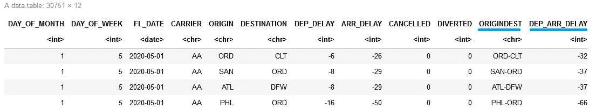

```
**# Create new column using ifelse**
airline_new_dt[, DEP_DELAY_15:= **ifelse**(DEP_DELAY>=15,1,0)]**# Print data table**
airline_new_dt
```

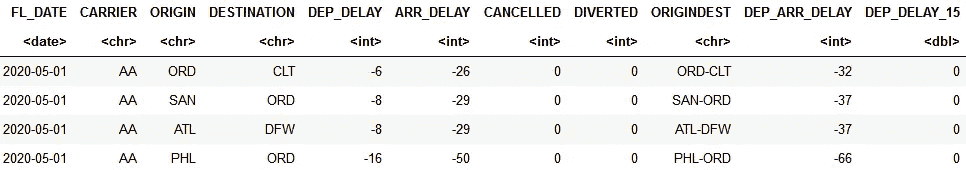

# 汇总统计数据

```
# Summary statistics for Departure Delay (DEP_DELAY)
# The following code excludes NA values from analysisairline_new_dt[, .(mean = **mean**(DEP_DELAY, na.rm = TRUE),
median = **median**(DEP_DELAY, na.rm = TRUE),
min = **min**(DEP_DELAY, na.rm = TRUE),
max = **max**(DEP_DELAY, na.rm = TRUE),
Sd = sd(DEP_DELAY, na.rm = TRUE),
Var= var(DEP_DELAY, na.rm = TRUE))]
```

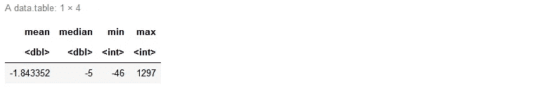

**感谢**阅读！请👏如果你喜欢这篇文章，请跟我来，因为它**鼓励我**写更多！