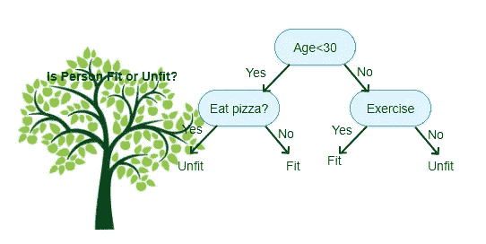
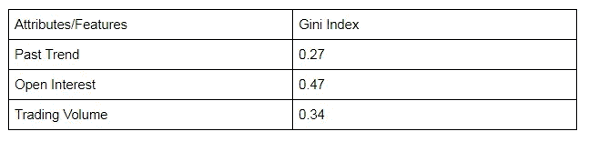
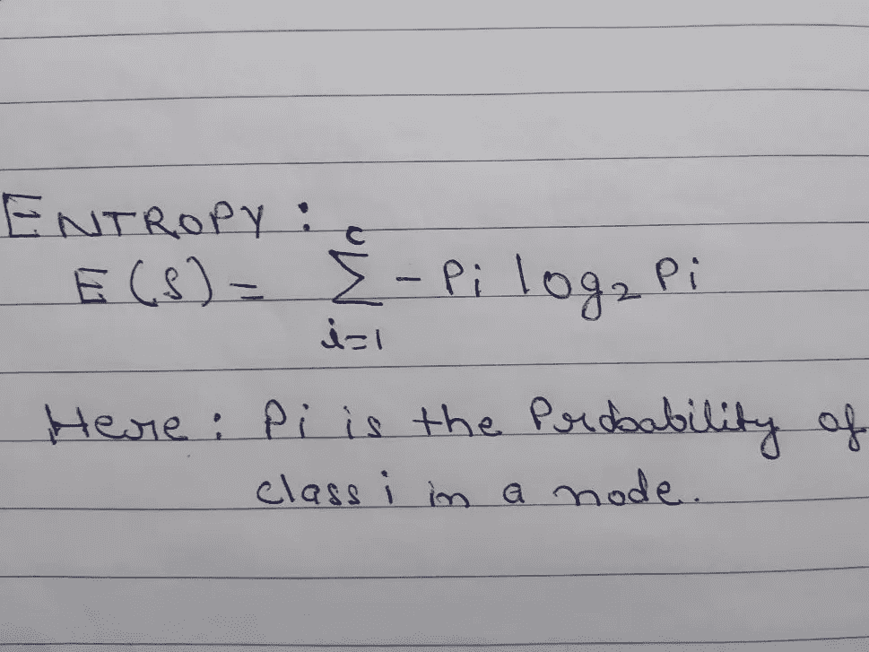

# 数据科学:决策树

> 原文：<https://medium.com/analytics-vidhya/data-science-decision-tree-f87c2e272749?source=collection_archive---------8----------------------->

决策树

决策树很容易解释

## **什么是决策树？**

决策树是用于分类和回归问题的监督机器学习算法。

分类处理预测离散值的类别，如 0/1，或预测某人是否患有疾病，而回归处理预测连续值，如个人工资、房价等。

## **直觉**

顾名思义，它使用树状模型进行决策。决策树是倒过来画的，它的根在顶部。它还包括内部节点**、**叶节点，我们将进一步讨论。

它像人脑一样决定。如下图所示，如果我们需要检查一个人是否合适，它会检查某些标准，并根据这些标准做出决定并返回结果。在机器学习中，我们可以用决策树分类器来做到这一点。

年龄 **=** 根节点，吃披萨/运动 **=** 内部节点，健康/不健康 **=** 叶节点

决策树。来源不明

## 决策树中的拆分标准:

这是一个大问题，选择正确的特征，最好的分裂树，我们可以在更少的迭代中到达叶节点，这将用于决策。有各种技术用于决定哪些特征可以用作根节点和内部节点。

## 分类技术:

1.CHAID(卡方自动交互检测)

2.CART(分类回归树)使用基尼指数(基尼杂质)作为度量。

3.ID3(迭代二分法 3)使用 ***熵*** 和 [***信息增益***](https://en.wikipedia.org/wiki/Information_gain_in_decision_trees)*作为度量。*

*我们将在这里讨论使用基尼指数或基尼系数的 CART 技术。*

## *GINI 指数或 GINI 杂质:*

*基尼指数或基尼不纯度被用作决策树中节点的不纯度的度量。如果所有的记录都属于同一个类(因变量)，则称一个节点是 100%纯的。在二进制分类中，如果一半的记录属于一个类，另一半的记录属于另一个类，则称节点为 100%不纯*

**

*具有最小基尼系数特征将被选择用于分割。基尼系数**的计算方法是从 1 中减去每个等级概率的平方和。它倾向于更大的分区。***

*计算基尼指数的公式如下。*

**

*未知来源*

*分裂的基尼系数计算为分裂节点级别的每个节点的加权平均值。*

**

*未知来源*

*让我们看一个带有数据集的例子，以便于理解。*

*这是我们的数据集。让我们用一个简单的例子来了解基尼指数是如何工作的。列**‘Return’**是我们的目标变量*

**

# *让我们从计算“过去趋势”的基尼指数开始。*

*注:这里的“P”表示概率*

*p(过去趋势=正):6/10*

*p(过去趋势=负):4/10*

*当(过去趋势=正，回报=涨)时，概率= 4/6*

*当(过去趋势=正，回报=负)时，概率= 2/6*

*基尼指数= 1 — ((4/6) + (2/6) ) = **0.45***

*When(过去趋势=负&回报=正)，则概率= 0*

*当(过去趋势=负&回报=跌)时，概率= 4/4*

*基尼指数= 1 — ((0) + (4/4) ) = **0***

***基尼系数的加权平均值可计算如下:***

***过去趋势的基尼指数**=(6/10)*0.45+(4/10)*0 =**0.27***

# *未平仓利息基尼指数的计算*

*p(未平仓利息=高):4/10*

*p(未平仓权益=低):6/10*

*当(未平仓利息=高&回报=高)时，概率= 2/4*

*When(未平仓利息=高&回报=低)，那么概率= 2/4*

*基尼指数= 1 — ((2/4) + (2/4) ) = **0.5***

*当(未平仓利息=低&回报=高)时，概率= 2/6*

*When(未平仓利息=低&回报=低)，那么概率= 4/6*

*基尼指数= 1 — ((2/6) + (4/6) ) = **0.45***

***基尼系数的加权和可计算如下:***

***未平仓合约基尼指数**=(4/10)*0.5+(6/10)*0.45 =**0.47***

# *交易量基尼指数的计算*

*p(交易量=高):7/10*

*p(交易量=低):3/10*

*当(交易量=高&回报=涨)时，那么概率= 4/7*

*当(交易量=高&回报=低)时，那么概率= 3/7*

*基尼指数= 1 — ((4/7) + (3/7) ) = **0.49***

*当(交易量=低&回报=高)时，概率= 0*

*当(交易量=低&回报=低)时，那么概率= 3/3*

*基尼指数= 1 — ((0) + (1) ) = **0***

***基尼系数的加权和可计算如下:***

***交易量基尼指数**=(7/10)*0.49+(3/10)*0 =**0.34***

**

*从上表中，我们观察到“过去趋势”具有最低的基尼指数，因此它将被选为我们决策树的根节点。*

*类似地，我们将重复相同的过程来确定决策树的子节点或分支，并到达叶节点或定义的最大深度。*

# ***熵:***

*它是另一种度量决策树中一个节点的杂质、无序或不确定性的技术。熵值介于 **0 到 1 之间。***

*如果一个节点具有相等数量的可用类(在两类分类问题中相等数量的“是”和相等数量的“否”)，则称该节点是完全不纯的*

*如果一个节点包含“是”或“否”的类标签(全是“是”和零个“否”或者全是“否”和零个“是”)，则称该节点是完全纯的*

***信息增益(IG)** 衡量一个变量或特征给了我们多少关于类的“信息”。*

*信息增益基于在变量/特征上分割数据集后熵的减少。*

# *为什么它很重要？*

1.  ***信息增益**是**决策树算法**用来构建决策树的主键。*
2.  *信息增益内部使用熵来计算节点的杂质。*
3.  *具有最高**信息增益**的**特征/变量**将被考虑首先构建树。*

***熵的方程式:***

**

***信息增益方程:***

**

*计算数据集中每个特征/变量的信息增益，具有最高信息增益的特征将用于构建决策树。*

***参考代码**:*

## ***决策树分类器可视化:***

*这种可视化需要安装 sklearn，0.21 或更高版本。下面代码中提到的步骤。*

## *决策树的优势:*

1.  *它的计算速度非常快。*
2.  *决策树不需要数据集的标准化/缩放，因为它使用概率函数来训练决策树模型，并且不使用任何距离度量。*
3.  *数据中的缺失值也不会在很大程度上影响决策树的构建过程。*
4.  *很容易解释。*
5.  *基尼系数优于熵，因为它计算速度快，基尼系数不需要计算像熵这样的任何值的“对数”。*

## *缺点:*

1.  *决策树学习者可以创建过于复杂的树，不能很好地概括数据。这被称为过度拟合。(当模型的训练精度高而测试精度低时，会发生过拟合)*
2.  *决策树可能不稳定，因为数据的微小变化可能导致生成完全不同的树。这称为方差，需要通过装袋或增压等方法来降低。*
3.  *如果某个类别(来自目标特征)占主导地位，决策树学习器会创建有偏向的树。因此，建议在拟合决策树之前平衡数据集。*

***结论**:这都是关于基尼指数的决策树。还有一种叫做熵的技术，使用信息增益，我将在后面添加。希望你喜欢阅读。如果你喜欢我的文章并想看更多，请张贴 **50 个掌声**和**关注**我的博客。*

*想要连接:*

*链接进来:[https://www.linkedin.com/in/anjani-kumar-9b969a39/](https://www.linkedin.com/in/anjani-kumar-9b969a39/)*

*如果你喜欢我在 Medium 上的帖子，并希望我继续做这项工作，请考虑在**上支持我***