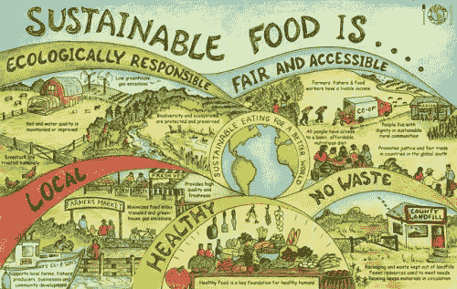
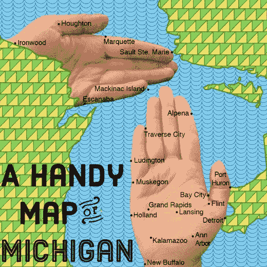
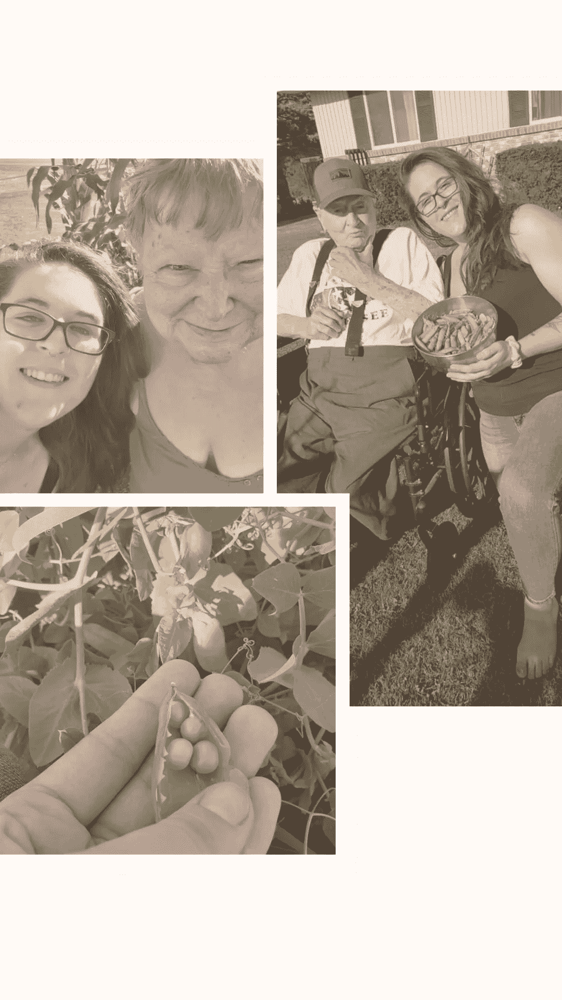
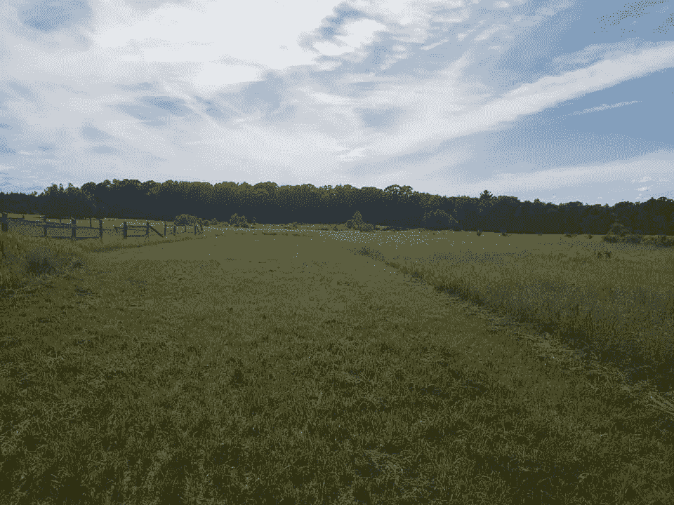

# 数据科学和食品可持续性

> 原文：<https://medium.com/analytics-vidhya/data-science-food-sustainability-53740950b585?source=collection_archive---------22----------------------->

我的名字叫凯拉，我是一个数据迷和食物可持续性倡导者——这些是我的故事。

在过去的一年左右的时间里，我一直在挣扎着重新构建我的生活、我的态度和我前进的道路。我已经爱上了数据科学和它的各种应用；但是特别是当涉及到我们食品经济的肮脏真相时，特别是在美国。

我的高中朋友亲切地称我为“非斯”,因为我是罗马尼吉普赛人的后代——我们从来不是移民家庭。至少不会太久…

## 根据不同的情况，我有许多不可避免的答案:“那么你是哪里人？”

随着我越来越深入地接受真实的自己，同时发现并拥抱那些塑造了我的人和事，我意识到我实际上是一个彻头彻尾的中西部农家女孩。

在我成长的岁月里，我在密歇根州繁荣的大都市斯特林的家庭农场里打捆干草和清理马厩；我与一种更像“现代家园”的生活方式有着密切的联系。

我有着美好的回忆，在妈妈早早醒来做油炸西葫芦的日子里，我会在我们家周围种上南瓜，以便于取用。

我了解了结构的价值，了解了每个参与者对农场流动的重要性，了解了感激大自然母亲的慷慨，同时又担心她最终会发怒。

当萨莉和韦恩·奥尔搬到我们家对面的农场时，他们张开双臂欢迎我加入他们的家庭。莎莉教我做我的第一个蛋白酥皮饼，以及它所有的变种；如何正确测试焦糖阶段，以及如何制作完美的砂锅。

韦恩教我如何将野生草莓从沼泽移植到我们的花园，如何在收获新鲜鸡蛋的同时尊重鸡，最重要的是——坚持的概念。我是一个坚定的人，热爱老西部片和谷仓猫，我逐渐意识到我内心深处的许多价值观都是由这个人灌输的。

事实上，这是我最后一次见到他，我意识到我的路一直在我面前。我只需要低着头，慢慢地清理掉挡我路的灌木丛。

那是一个可爱的仲夏，我们坐着从花园里摘豌豆。我评论那些路过的 18 轮车，它们似乎比我记忆中的更真实。

就在那时，一切都发生了变化，农产品被用卡车运到了农村的中心地带。

家庭农场正在消亡，我的生活方式正在消亡，我们与“美国方式”的联系正在消亡。

总的来说，这些不是我最喜欢的照片，但却是我最珍爱的一些。当我收获最初教我这样做的父亲形象的劳动时，我们谈论了我对不仅仅是食物消费，还有生产和运输的热情。10 年的专业厨师生涯让我比我意识到的更接近农场，更接近慢餐，更接近传统。

2020 年 3 月，我参加了 Flatirons 的沉浸式数据科学训练营，在那里我有幸建立了终身联系，并发现了我对分析的热爱。我以一个围绕全球粮食经济温室气体排放分析的顶点项目结束了这次冒险。

这个项目与许多其他细微的时刻一起将我带到了这一时刻，我的激情项目宣言: ***【第五代】***——一群人的想法，来自任何一代或任何背景，都热衷于追求可持续的粮食经济。为了未来，为了过去，为了社区的繁荣。我将利用空闲时间构建这个想法，同时围绕食品可持续性和手工生活这一主题进行各种分析。

继续我的旅程，我在亚利桑那州立大学攻读软件工程和可持续食品系统的双学位。现在，我将保持低调，通过恢复我的博客*手杖&图*来引导韦恩坚定的灵魂走过我的旅程。我将关注最佳食谱中的最佳食谱，记录我过上更可持续生活的经历，并展示我的各种分析。

我期待着这一具有挑战性的冒险，并敦促任何和每个人都加入我！

**如果你也对 *Gen V(ictory)* :**

*在网络上找到我:*[Medium](/@kailastone)|[Twitter](https://twitter.com/stone_kode)|[LinkedIn](https://www.linkedin.com/in/kaila-stone/)|[GitHub](https://github.com/kailastone)

谢谢大家！—凯拉