# 猫的数据科学:第 6 部分

> 原文：<https://medium.com/analytics-vidhya/data-science-for-cats-part-6-79b1fa1f61d9?source=collection_archive---------17----------------------->


# 将数据拟合到您的模型:时间序列分析

(数据取自开源时间序列数据集，并进行了略微编辑。)

凯蒂，你还记得胡曼前几天跟你讲过一个时间序列的成分和平稳性[(这里)](https://dev.to/orthymarjan/data-science-for-cats-part-4-2kh2)吗？你当然知道，但你不记得霍曼告诉过你如何确定一个时间序列是否平稳。

为了检查我们的数据是否稳定，你要做的第一件事是，你开始相信你的数据不是稳定的，并一直希望有人证明你是错的。这就像，每当你的胡曼让你穿上马具，把你放进你的旅行包里，你马上就明白胡曼要带你去看兽医，并一直祈祷你是错的，并一直希望胡曼带你去别的地方。在这里，相信“数据是不稳定的”或“胡曼带你去看兽医”被称为“**零假设**”。另一方面，你的数据是静止的，或者胡曼带你去公园或游乐场的事件被称为'**替代假设'**。现在你必须检查你的零假设是否正确。

首先，从 csv 文件加载数据。

```
df = pd.read_csv("likestuna - Sheet3.csv") 
df.head()
```

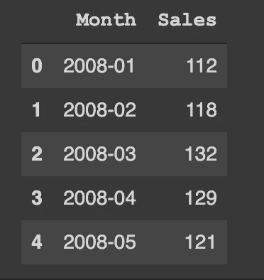

现在，胡曼说他将使用一种叫做 ADF 测试的方法来“测试”平稳性，这种方法也被称为增强的 Dickey Fuller 测试。名叫 Dickey 和 Fuller 的 Hoomans 发现了这个方法，他们检查了名为' **p 值**'的东西。这个 p 值就像是你 ADF 测试的评委。他的价值越高，就越支持你的零假设。如果这个值低于 0.05，它就违背了你的假设，这意味着你一开始相信的都不是真的。

```
from statsmodels.tsa.stattools import adfuller
def adfuller_test(sales):
    result=adfuller(sales)
    labels = ['ADF Test Statistic','p-value','#Lags Used','Number of Observations']
    for value,label in zip(result,labels):
        print(label+' : '+str(value) )

    if result[1] <= 0.05:
        print("Strong evidence against the null hypothesis (Ho), rejects the null hypothesis. Data is stationary")
    else:
        print("Weak evidence against null hypothesis (Ho), proves the null hypothesis. Data it is non-stationary ")

adfuller_test(df['Sales'])
```

胡曼得到输出:

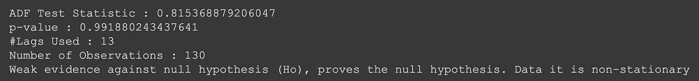

你看，你的 ADF 测试说你的数据不是平稳的。你现在做什么？

要使一个序列平稳，首先要记住一个时间序列何时或为何变得不平稳。如果你还记得胡曼在你的数据科学之旅的第四部分向你展示的图表，在你绘制数据后，有重复的相似的片段，它们不断上升，因为我们有上升的趋势。你可以说趋势是你的数据分布在这么多不同层次的原因。

将时间序列固定化的一个好方法是将你的时间序列移动一点，并与你的原始序列进行比较。通过移位，胡曼的意思是引入一个延迟，你将称这个延迟为' **LAG** '。例如，如果您的数据延迟一个月后才开始，该怎么办？

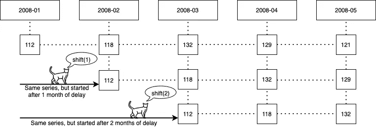

您希望看到您的数据在轮班后的样子。

```
df['Sales']
df['lag 1']=df['Sales'].shift(1)
df['lag 2']=df['Sales'].shift(2)
df.head()
```

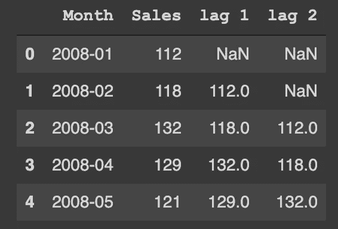

胡曼试图绘制你的数据，和一个 5 个月的延迟数据在同一个图表中，观察它看起来如何。

```
ax = df['Sales'].plot(color = 'b') 
df['Sales'].shift(5).plot(ax=ax, color = 'm')
```

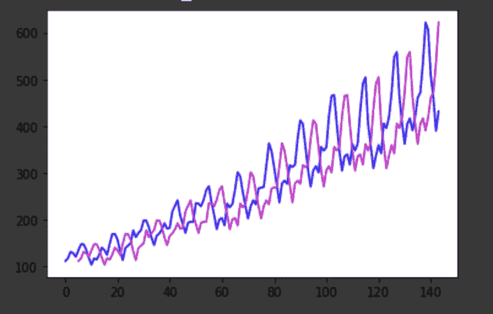

这里，蓝色是您的原始数据，洋红色是延迟了 5 个单位(在您的情况下，是几个月)的数据。

胡曼说，如果你绘制你的数据和 1 个单位滞后数据的差异，它很可能会变得稳定。这有什么区别呢？

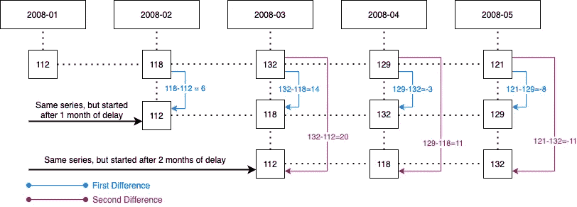

```
df['Sales First Difference'] = df['Sales'] - df['Sales'].shift(1)
df['Sales Second Difference'] = df['Sales'] - df['Sales'].shift(2)
df.head()
```

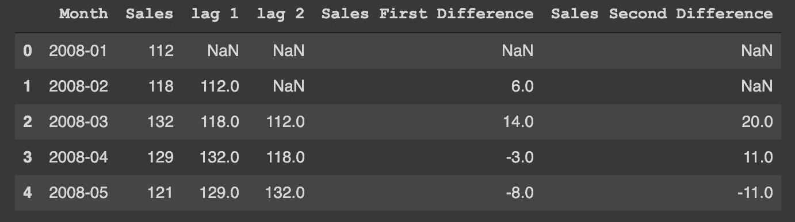

胡曼现在检查第一个差异是否是固定的。

```
adfuller_test(df['Sales First Difference'].dropna())
```

现在，p 值变为 0.054213290283824704，仅略高于 0.05 的临界值，这意味着我们的数据还不是稳定的。如果你取第二个差值，

```
adfuller_test(df['Sales Second Difference'].dropna())
```

p 值现在变为 0.03862975767698862，这表明数据肯定是平稳的。所以你需要取第二个差来对数据进行平稳化？

嗯，实际上不是。现在你糊涂了。Hooman 现在要求您仔细查看第一个和第二个差分 ADF 结果的 p 值。在第一差异的情况下，p 值几乎为 0.05，0.054213290283824704 和 0.05 之间的差异完全不显著。所以你可以说第一个差异已经让你的数据几乎静止了。如果您在第一个差异使数据几乎平稳的情况下采用第二个差异，则您的数据有可能变得过于平稳，这将不会给你一个好的预测。如果您有任何困惑，您可以使用其他一些平稳性检查方法交叉检查该值，如 KPSS。胡曼说，你必须记住这一项作为'**阶差分**'，或简称为' d '。如果你需要求 99 次差来得到一个平稳的时间序列，你的 d 值应该是 99。在这种情况下，你的 d 值就是 1。

还有一种方法你可以尝试确认你的 d 值。你必须画出一个时间序列和它的滞后版本之间的相关性，并观察输出。胡曼称这种相关性为“**自相关**”。它通常会衰减，所以如果输出曲线立即接近 0，我们可以假设序列和滞后版本之间的差异是稳定的。

```
from pandas.plotting import autocorrelation_plot
import matplotlib.pyplot as plt
autocorrelation_plot(df['Sales First Difference'].dropna())
plt.show()
```

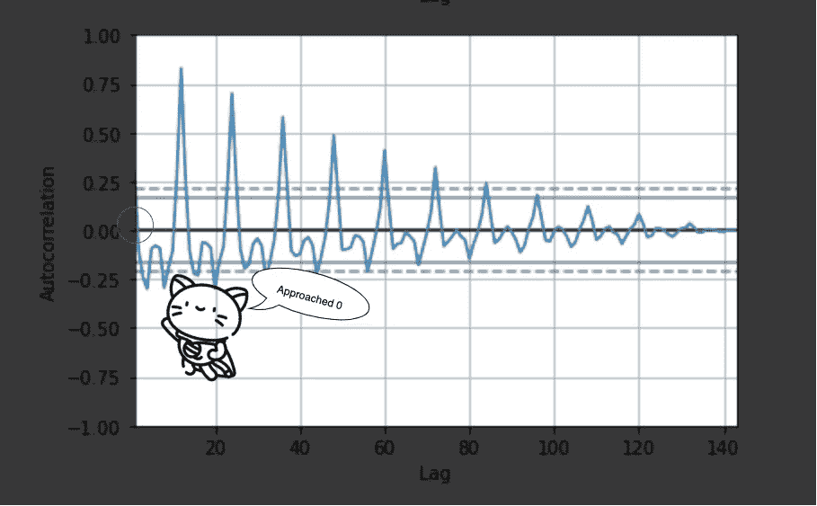

胡曼将使用名为“ **ARIMA** ”的自回归综合移动平均模型来预测这一数据。您需要知道 3 个值来优化这个模型，并且您已经知道其中一个值，d 值。

你看，ARIMA 模式有三个部分。AR 或自回归部分用 p 表示，积分部分用 d 表示(您已经计算过了)，移动平均线部分用 q 表示。您已经知道 d 的作用，现在想知道 AR 和 MA 项的作用。胡曼开始解释。

第一项是“**自回归**”，它有两部分，自动和回归。您已经从之前与 hooman 的对话中了解了回归。胡曼说，auto 的意思是“和你自己在一起”。所以你可以说，自回归是数据的滞后值对当前值产生影响的事件。AR(x)表示 x 数量的滞后项将对您当前的数据产生影响。另一方面，‘**移动平均线**项消除了数据的随机性。MA(x)表示您正在进行 x 次先前的观察，以了解您当前的数据。

现在如何计算这些 AR(或 p)和 MA(或 q)项？胡曼首先解释了 AR 项的计算。你需要画一个'**偏自相关函数**或者' **PACF** 来找出 AR 项。PACF？那是什么？胡曼说，在 PACF，你取你的序列的每个滞后值，通过去除滞后解释的影响找到残差，并找到一个“部分”相关性。

```
from statsmodels.graphics.tsaplots import plot_pacf

plt.rcParams.update({'figure.figsize':(9,3), 'figure.dpi':120})

fig, axes = plt.subplots(1, 2, sharex=True)
axes[0].plot(df['Sales First Difference']); axes[0].set_title('1st Differencing')
axes[1].set(ylim=(0,5))
plot_pacf(df['Sales First Difference'].dropna(), ax=axes[1])

plt.show()
```

输出如下所示:

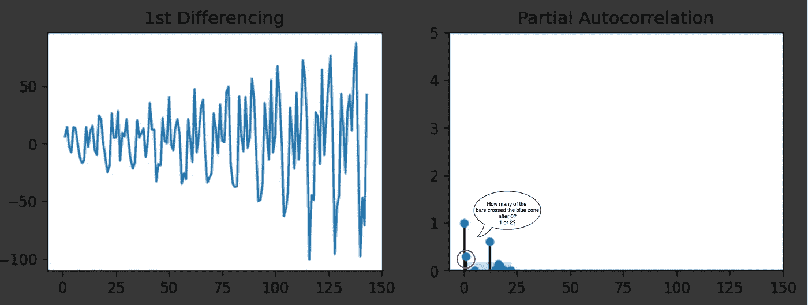

胡曼不确定 0 之后有多少根棒线穿过了蓝区。可能是 1 或 2。所以我们的 AR 值要么是 1，要么是 2。

为了解释 MA 项，您必须检查'**自相关函数**或 **ACF** 来找到 MA 项。ACF 会给你一个时间序列的完全自相关和滞后值。

```
from statsmodels.graphics.tsaplots import plot_acf

fig, axes = plt.subplots(1, 2, sharex=True)
axes[0].plot(df['Sales First Difference']); axes[0].set_title('1st Differencing')
axes[1].set(ylim=(0,1.2))
plot_acf(df['Sales First Difference'].dropna(), ax=axes[1])

plt.show()
```

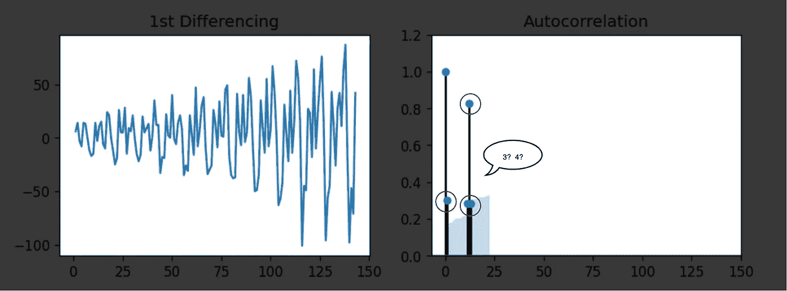

胡曼同样从这个图中计算出毫安值。可能是 3 或 4。

所以你的(p，d，q)组合可能是(1，1，3)，(2，1，3)，(1，1，4)或者(2，1，4)。是哪一个？

取第一个组合，用它来拟合 ARIMA 模型，然后像这样计算汇总:

```
from statsmodels.tsa.stattools import acf

# Create Training and Test
train = df['Sales'][:130]
test = df['Sales'][130:]

from statsmodels.tsa.arima_model import ARIMA
# Build Model
model = ARIMA(train, order=(1, 1, 3))  
fitted = model.fit(disp=-1)  
print(fitted.summary())
```

输出中会有一个' **AIC** '项。AIC 的意思是赤池信息标准，评估你的模型有多好。值越低，模型越好。

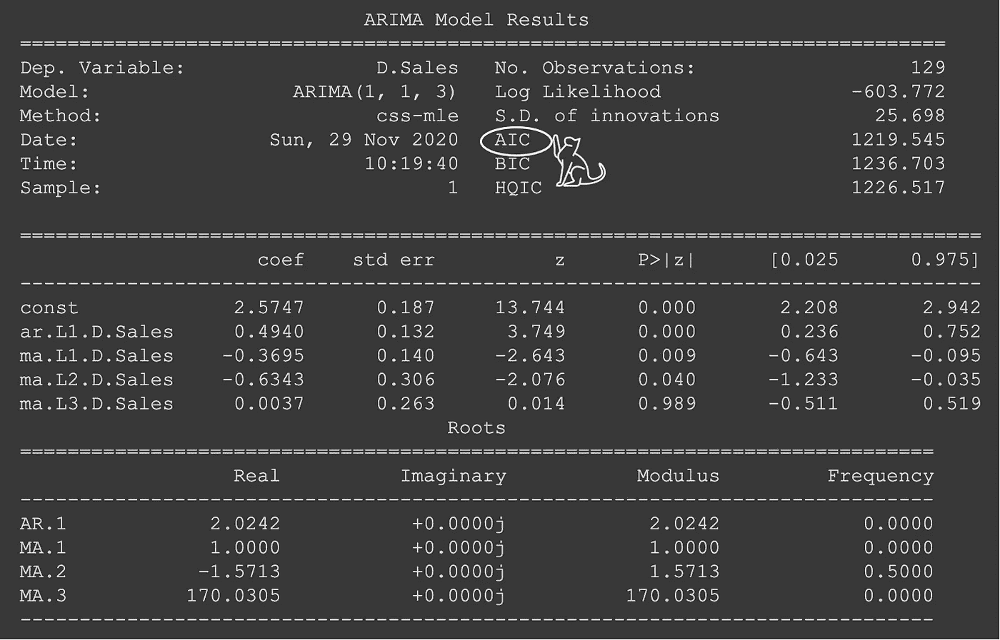

现在，胡曼比较了所有 4 种组合的 AIC。

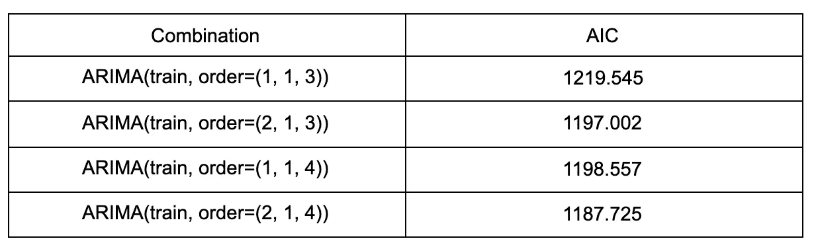

你看，阶为(2，1，4)的模型给出了最好的结果。胡曼现在试图绘制数据。

```
from statsmodels.tsa.stattools import acf

# Create Training and Test
train = df['Sales'][:130]
test = df['Sales'][130:]

from statsmodels.tsa.arima_model import ARIMA
# Build Model
# model = ARIMA(train, order=(3,1,1))  
model = ARIMA(train, order=(2, 1, 4))  
fitted = model.fit(disp=-1)  

# Forecast
fc, se, conf = fitted.forecast(14, alpha=0.05)  # 95% conf

# Make as pandas series
fc_series = pd.Series(fc, index=test.index)
lower_series = pd.Series(conf[:, 0], index=test.index)
upper_series = pd.Series(conf[:, 1], index=test.index)

# Plot
plt.figure(figsize=(12,5), dpi=100)
plt.plot(train, label='training')
plt.plot(test, label='actual')
plt.plot(fc_series, label='forecast')
plt.fill_between(lower_series.index, lower_series, upper_series, 
                 color='k', alpha=.15)
plt.title('Forecast vs Actuals')
plt.legend(loc='upper left', fontsize=8)
plt.show()
```

数据越多，答案就越好。

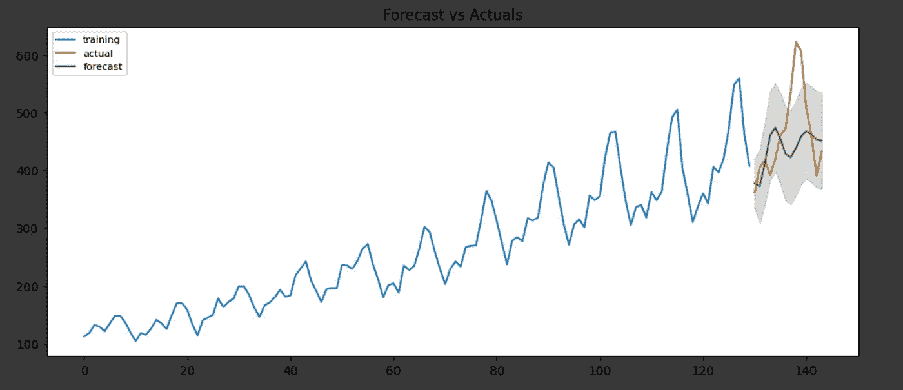

现在你有你的销售预测！

上一部分:[https://orthy marjan . medium . com/data-science-for-cats-part-5-93eb 20 EB 1 ad 8](https://orthymarjan.medium.com/data-science-for-cats-part-5-93eb20eb1ad8)

*原载于 2020 年 11 月 29 日*[*https://dev . to*](https://dev.to/orthymarjan/data-science-for-cats-part-6-1g4a)*。*