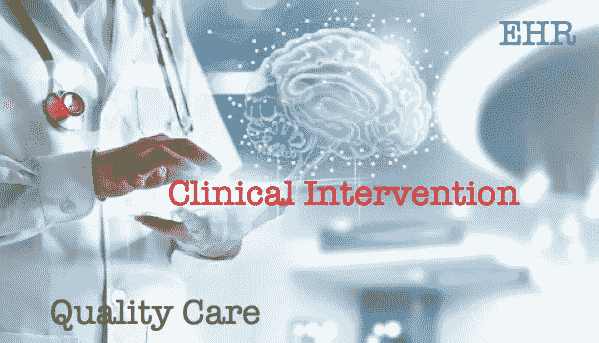

# 影响底线的医疗保健领域的数据科学使用案例

> 原文：<https://medium.com/analytics-vidhya/data-science-for-healthcare-and-clinical-optimization-6049af2c2811?source=collection_archive---------12----------------------->

**EHR 将医疗保健优化提升到新水平**

EHR 开启了医疗保健行业的新篇章。电子健康记录(EHR)是病人病历的电子版本(T3)。全面的数据源包括患者人口统计数据、供应商订单、诊断、程序、药物、实验室值、生命体征和流图数据…