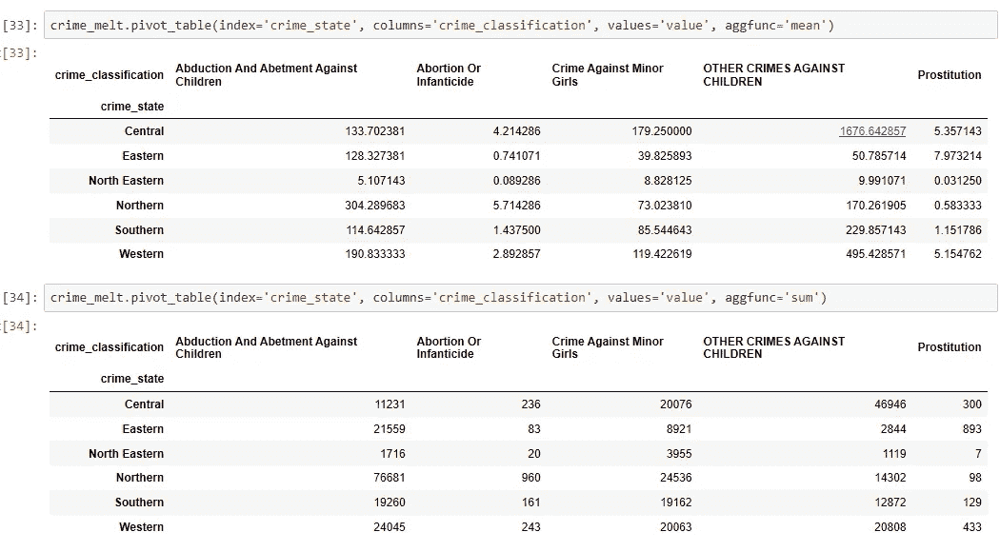

# 社会问题的数据科学——印度犯罪数据的探索性数据分析

> 原文：<https://medium.com/analytics-vidhya/data-science-for-social-problems-an-exploratory-data-analysis-on-crime-data-in-india-5211ba2190b0?source=collection_archive---------17----------------------->

比尔·牛津在 [Unsplash](https://unsplash.com?utm_source=medium&utm_medium=referral) 上的照片

九月是印度节日的开始。以孩子的形式崇拜上帝是印度各地的普遍做法。我们以“巴尔·加内什，巴尔·克里希纳”的形式崇拜男婴，以女神的形式崇拜女婴。在纳夫拉特里节期间，我们会看到年龄在 2-10 岁之间的女孩以马的形式在全国各地进行为期 9 天的礼拜。我现在正在我的家乡庆祝纳瓦拉特里节，我不禁想到，儿童崇拜和针对儿童的犯罪在这个国家共存是多么具有讽刺意味。近年来，与儿童有关的犯罪率以惊人的速度增长。我们不断在报纸和其他社交媒体应用上看到这样的新闻。一则这样新闻引起了我的注意，那是一个两个半月大的婴儿。标题是这样的“又一次强奸——这次她没有穿短裙或短裤，只穿了尿布”。

作为一名有抱负的数据科学学生，这让我开始思考印度针对儿童犯罪的趋势。当我开始寻找一个好的数据时，我发现了“2001 年至 2012 年期间因针对儿童的犯罪而被捕的犯罪头目”，这些数据是由印度政府在其开放数据网站(【https://data.gov.in/】T4)上发布的。我的好奇心驱使我研究这个数据集，我想知道为什么会发生这样的犯罪，在哪里会发生这样的犯罪，以及这些事件背后的原因。

## **作品**

我开始研究 2001 年至 2014 年期间印度针对儿童的犯罪的时间序列数据。我的研究包括空间和经验分布。这一数据包括 2001 年至 2014 年期间 28 个邦和 7 个中央直辖区所有报告的对儿童犯下的罪行以及被定罪的罪行。然而，2014 年，由于"特伦甘纳邦"的形成，邦的数量变成了 29 个。但是在我的分析中，我将 28 个州的数据结合起来，不仅仅是为了保持简单。

**让我们对国家和犯罪进行分类**

***犯罪:*** *共报告了 12 种犯罪类型。我把它们合并成类别。下面是代码和输出。*

***犯罪分类:***

***国家分类:***

***我们来看带值解读:***

***让我们形象化***

下面是 2001 年至 2014 年间每种犯罪所占份额的快速图表。以占‘总犯罪’百分比的形式出现的犯罪

*占‘总犯罪’的百分比*

*这张图表支持了我们的观点，即在其他犯罪中，前三大犯罪是绑架&绑架儿童——35.02%，其他针对儿童的犯罪——28.75%，强奸儿童——24.6%。*

*这些年犯罪率的增长:*

*现在是时候来看看按地域划分的犯罪趋势了。为此，我首先按地区对各州进行了分类。*

*当然，我现在可以深入了解每个地区的犯罪情况*

*如上所述,“北部”地区是“诱拐和教唆针对儿童的犯罪”高发地区，而“中部”地区是“其他针对儿童的犯罪”高发地区。*

为了更好的可读性，我把它作为一个单独的表格。当我将犯罪类型与国家进行比较时，从数据集中发现了一些有趣的事实。

*   ***注****:2001 年至 2010 年，安得拉邦未成年女孩拉皮条的情况有所增加，但自 2011 年起，犯罪率大幅下降。*
*   ***注****:2001-2014 年期间，北方邦谋杀儿童、绑架&诱拐儿童、杀婴案件不断高发。*

我观察到的趋势似乎与最近一份名为《被遗忘的声音:印度城市儿童的世界》的报告的结果相关。

*2015 年，所有联合国会员国都以可持续发展目标(SDG)的形式呼吁采取行动，消除贫困，保护地球，确保所有人在 2030 年前享有和平与繁荣，并为消除暴力侵害儿童行为带来前所未有的机遇。他们制定了 17 个目标，其中我发现目标 5 & 16，即“性别平等&和平、公正和强大的机构”，这与我的主题有关，我的主题是每个孩子都应该受到保护，免受暴力和剥削。*

> **结论**

更好的童年会带来更好的未来，这是一个全球共识。2015 年，联合国以可持续发展目标(SDGs)的形式发出了一项普遍呼吁，要求采取行动消除贫困，保护地球，确保所有人到 2030 年享有和平与繁荣，并为结束暴力侵害儿童行为带来了前所未有的机遇。现在是我们作为一个国家建立更强大的司法机构、有效的法规和意识，以彻底根除我国这一日益严重的疾病的时候了。数据科学在分析犯罪时非常有用。利用机器学习和深度学习模型预测犯罪在发达国家越来越普遍。

*目前我所分析的数据是在州一级犯下的罪行。为了更好地预测，我想看看个人层面(即案件层面)的犯罪数据*以及是否被定罪的信息*。*

> **数据集的代码**

 [## NivyaSreeAvula/hetro-repo

### 此时您不能执行该操作。您已使用另一个标签页或窗口登录。您已在另一个选项卡中注销，或者…

github.com](https://github.com/NivyaSreeAvula/hetro-repo/blob/master/Crime_against_children.ipynb)  [## Tableau 公共

### 看到最好的 Tableau 公共。注册直接在你的收件箱里接收当天的 Viz。

public.tableau.com](https://public.tableau.com/views/Crimehead-wisepersonsarrestedundercrimeagainstchildrenduring2001-2014/Sheet4?:embed=y&:display_count=yes&:origin=viz_share_link)