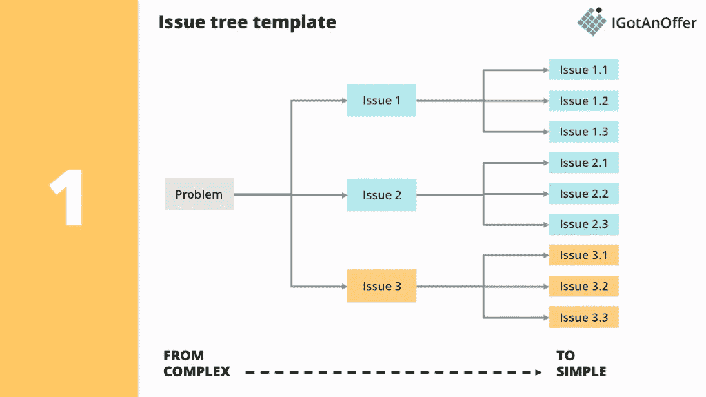

# 数据科学面试指南:产品/案例问题

> 原文：<https://medium.com/analytics-vidhya/data-science-interview-guide-part-ii-product-case-question-e14de2bbb68a?source=collection_archive---------6----------------------->

图片来源:Ekaphon maneechot/Shutterstock

(这是在海阳老师的指导下写的[数据科学面试指南](/@nyjimmy97/data-science-interview-part-i-take-home-assignment-26ccc244f3b8)的第二部分。)

我在一家备受赞誉的初创公司面试数据科学职位。当我在面试室等面试官的时候，我的大脑思考了所有可能出现的问题。我在等着解释为什么我很适合这家公司，展示我在 Jupyter notebook 上完成的带回家的作业，并在机器学习算法上解决这个问题。我很自信。毕竟，我花了几个小时准备这个特别的面试。让我松了一口气的是，面试官抛出了一些对我来说并不意外的问题，直到他说…

> 好的，现在我们来测试一下你的思考速度。天啊，我想。“你如何衡量我们平台上用户的客户终身价值？”

那是…没有预料到的，但是我尽我所能回答了。当我在 NTU 导师项目中接受孙海洋先生的指导时，我学到了一些关于这种问题的知识——这种问题通常被称为**产品面试**或**案例**问题**。**下面这篇博文概述了我在项目期间从海洋中学到的东西。

数据科学面试中的产品面试/案例问题不应该让候选人感到意外。一般来说，产品面试问题有 6 种类型。

[链接至表 1(如果该表未显示)](https://docs.google.com/spreadsheets/d/1ohnT-M6PZ-ke5AV7hy3dhHlCcPELY9a8jPUvLh6lk1k/edit?usp=sharing)

这些问题构成了管理咨询面试的主要内容，但它们也用于数据科学面试，以测试候选人在现实生活场景中的逻辑思维和行为能力。一般来说，你会得到一块白板，和面试官一起回顾你的回答。面试官可能会在你这么做的时候给你回应(给你一个提示，告诉你是否在正确的道路上)。

这些问题一开始可能看起来很吓人，因为你以前可能没有考虑过这个问题。但这正是问题的关键——当你解决这个新奇的问题时，面试官给你一个展示你逻辑思维过程的机会。深呼吸，让我们从回答上面的一个模拟问题开始:**’*假设你是脸书集团的产品经理。最近，脸书小组的用户参与度有所下降。根本原因是什么？*’**

一般来说，解决问题的策略是

1.  **理解问题。**
2.  **把问题分解成更小、更容易解决的部分。**
3.  **解决问题的每个小部分。**

让我们来看一下这些步骤。

# **第一步:理解问题**

这一步包括在你开始解决问题之前问一些澄清性的问题。对于这个特定的问题，一些突出的问题(和基本原理)如下。

[链接到表 2(如果表中没有显示)](https://docs.google.com/spreadsheets/d/1RXyKpYzsZmfQW-bZTko-yDg_aRFC8KZV-4ElWiUvluE/edit#gid=0)

当然，面试官可以拒绝回答你的问题，因为回答你的问题可能会给你太多的信息或不必要地限制回答。在这种情况下，你需要对问题做一个假设。

让我们假设面试官对澄清性问题的回答是

*   在过去的一年中，使用率逐渐下降。
*   几乎所有国家都出现了下降**。**
*   **面试官拒绝回答是否介绍了任何功能。**

**记住这些，让我们从步骤 2 开始。**

# ****第二步:将问题分解成更小、更容易理解的部分。****

**我们再回忆一下问题。问题是关于*用户参与度*的下降。但是具体是什么意思呢？让我们把它分解成更小的部分，这些部分是*互斥的，也是集体穷举的(MECE)* 。如果两个部分互相排斥，它们就不能共存。如果两个部分加在一起是穷尽的，那么两个较小的部分(没有别的)加起来就是完整的较大部分。MECE 的一个典型例子是将“利润”分解为“收入”和“成本”。这就是 MECE，因为收入不能被认为是成本，反之亦然(互斥)，收入和成本加起来就是利润(统称为穷举)。为了说明这个过程，我们使用一个*问题树*，如下图所示。**

****

**来自 [IGotAnOffer](https://igotanoffer.com/blogs/mckinsey-case-interview-blog/issue-tree) 的问题树**

***用户参与度*的概念可以认为是用户与 app 互动的频率和时长。我们可以把它翻译成(大约)MECE 部分。**

**用户参与度是以下因素之一**

*   **脸书群组的用户数量**
*   **用户每次访问花费在脸书群组上的平均时间**
*   **用户访问脸书群组的平均次数**

**这样，我们进一步将单个部分分解成更小的部分。**

*   ****脸书群组的用户数量**受到每个脸书群组的平均用户数量和活跃脸书群组数量的影响**
*   ****用户每次访问脸书群的平均时间**受每个脸书群内容的数量和质量、脸书群与用户的相关性以及其他变量的影响。**
*   ****用户访问脸书群的平均次数**受到脸书向用户推送脸书群通知的频率、脸书群与用户的相关性、脸书群的平均更新频率、每个脸书群在主页上的可见性的影响。**

**你看这是怎么回事。随着关键词“用户参与度”被分解成更小的部分，我们准备假设用户参与度下降的原因。你可以进一步将这些部分分解成更小的部分，这可能有助于你清楚地表达你的回答。**

# ****第三步:解决问题的每个小部分。****

**对于这一部分，我们将假设每一个小的部分是如何促成手头的问题的。我将借助下面的表格来说明这一点。(在面试过程中，当你在白板上写下答案时，你可能会解释你的答案。)**

**[链接到表 3(如果表没有显示)](https://docs.google.com/spreadsheets/d/1EMZ20VamzMl5EcqFAjItXLAmteX-dAVwE9zHTajzbos/edit#gid=1145625783)**

**你可以想象，面试官可能会根据你的回答提出后续问题。例如，如果你的回答暗示脸书群体通知的频率下降(3.1.3)，面试官可能会问你验证这一假设的方法。(提示:A/B 测试在这里很有帮助！).面试官也可能试图让你偏离某个特定的方向，所以要对给出的暗示做出反应。**

**在长篇大论的后续问题之后，是时候拍拍自己的背了——你已经完成了面试的这一部分！**

**被一个面试问题弄得措手不及当然是一个不愉快的过程(我可以担保)。我希望这篇文章以及我在 LevelUp 旅程中从海洋和南阳中学到的东西对您理解数据科学面试中可能出现的案例问题有所帮助。再次感谢海洋耐心地指导我和我的数据科学伙伴(Nanyang)**

**如果你想了解更多关于案例问题的知识，网络世界充满了免费资源，比如 YouTube 的[系列案例访谈 101。我用来学习案例问题的另一个极好的资源是 Victor Cheng 的](https://www.youtube.com/watch?v=6R5bT4cJh0A)[案例访谈秘密。](https://www.amazon.com/Case-Interview-Secrets-Interviewer-Consulting/dp/0984183523)如果您有更多问题或任何反馈，欢迎在下面评论，或者直接在 LinkedIn 上与我联系！**

** [## voon Hao(Travis)Tang——数据分析师

### 查看 Voon Hao (Travis) Tang 在全球最大的职业社区 LinkedIn 上的个人资料。冯豪(特拉维斯)有 7…

www.linkedin.com](https://www.linkedin.com/in/voon-hao-tang/)**