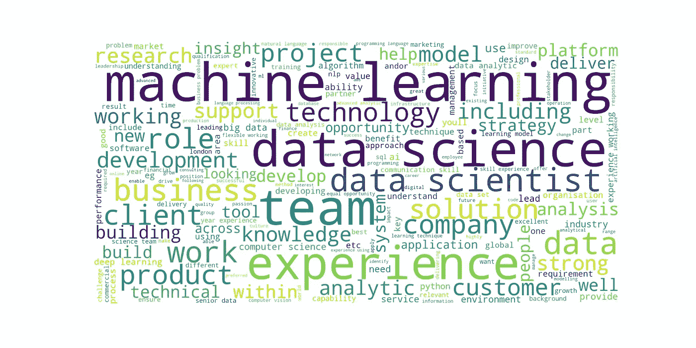
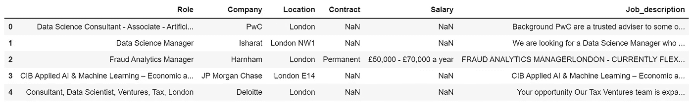
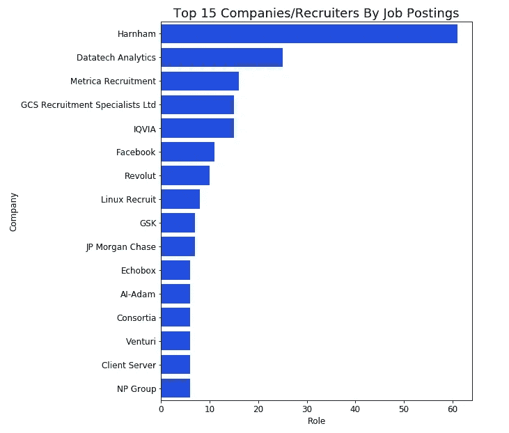
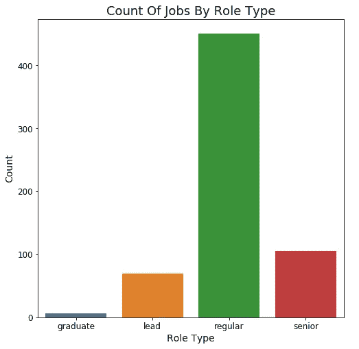
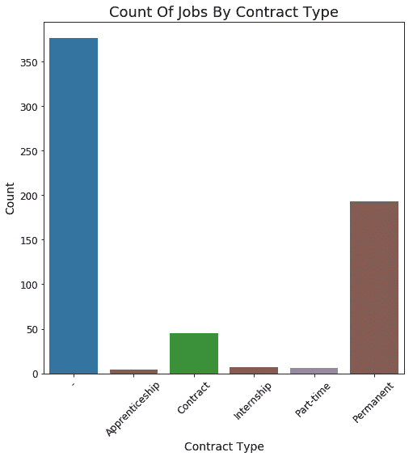
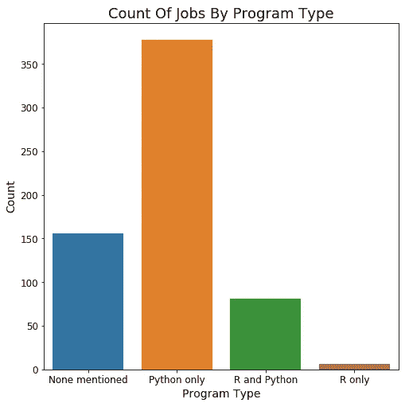
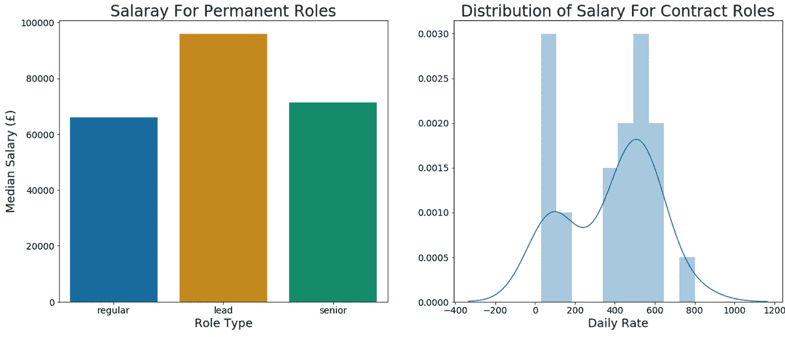
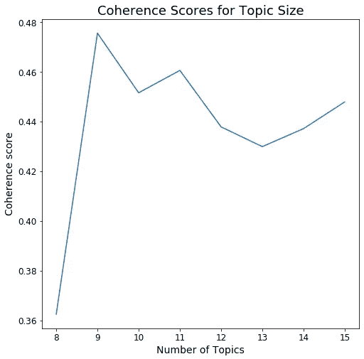
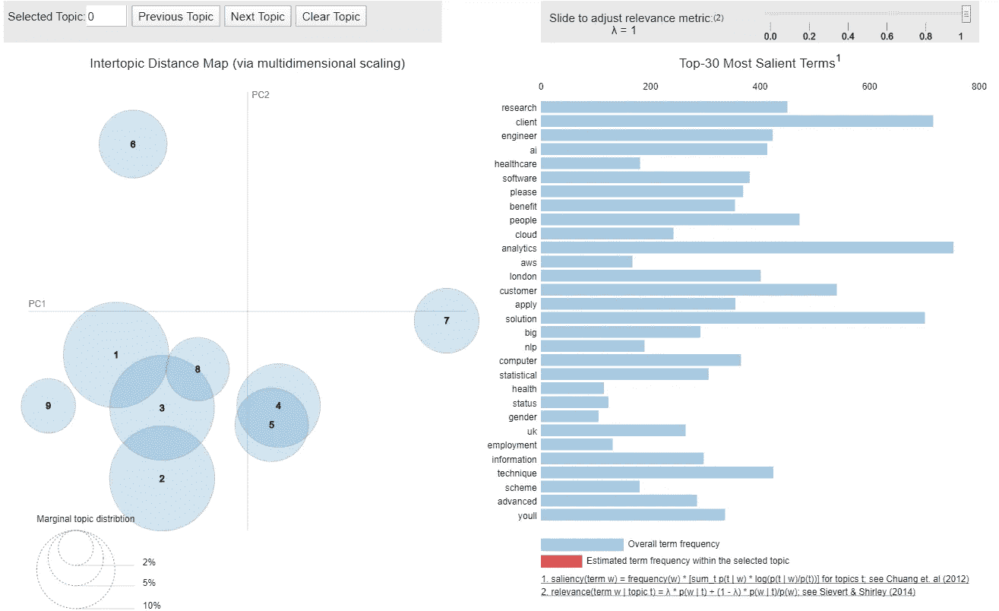
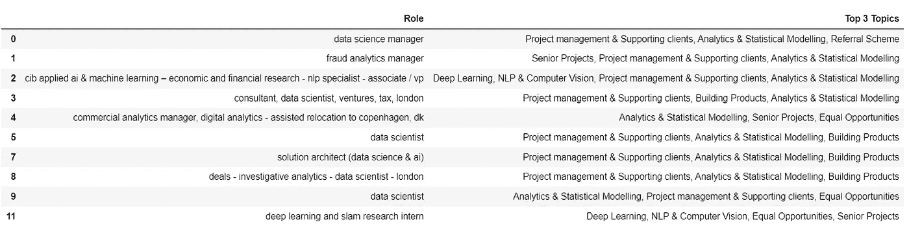

# 数据科学求职:在 Python 中使用 NLP 和 LDA

> 原文：<https://medium.com/analytics-vidhya/data-science-job-search-using-nlp-and-lda-in-python-12ecbfac79f9?source=collection_archive---------5----------------------->

*抓取招聘广告并使用主题建模来发现招聘信息中隐藏的主题*

作为一个最近在市场上寻找新的数据科学工作的人，我一直在许多网站上看招聘广告，并认为分析[甚至](https://www.indeed.co.uk/)上的职位并将潜在狄利克雷分配(LDA)应用于职位描述会很有趣。LDA 生成的主题应该有望给出雇主所寻求的关键数据科学技能的指示。

为了做到这一点，采取了以下过程:

1.  从确实使用美丽的汤刮数据
2.  分析招聘信息
3.  清理数据并应用主题建模

目前，我只收集了大伦敦地区的工作，因为这与我自己有关，但我也可以收集英国其他地方的工作，以增加数据集。用于此分析的所有代码都可以在 [Github](https://github.com/tcaffrey/LDA_Job_Search) 上找到。

# **1。刮痧招聘广告**

每个招聘广告上的信息确实包括:

*   职称
*   公司
*   位置
*   合同类型*
*   薪金*
*   工作说明

*不包括在每一份招聘广告中。合同类型(永久、合同等。)只获得 40%的时间和大约 50%的工资。

招聘广告的抓取是使用漂亮的 Soup 库完成的，为此创建的代码包含在 Github 页面上。但是，下面的输出示例显示了收集到的信息:

# 2.分析数据

## 公司/招聘人员发布的职位数量

不出所料，大多数经常被推荐的公司都是招聘公司。尽管在大伦敦地区，Harnham 和 Datatech Analytics 的角色数量最多。为了更好地了解他们所扮演的角色，有必要与这两个人直接交流。

## 删除重复发布

有时，招聘人员或公司会为一份工作发布相同的广告，导致重复数据。这些可以简单地根据职位描述删除，但是如果竞争的招聘人员发布同一份工作的广告，可能会有轻微的差异。

去除这些紧密匹配的作业的最简单的解决方案是根据它们的字数来比较余弦相似度。任何包含接近 1 但不等于 1 的分数几乎肯定是相同工作的重复。

## 用余弦相似度去除相似职位描述

> 余弦相似性是一种度量，用于确定文档的相似程度，而不考虑它们的大小。它测量在多维空间中投影的两个向量(包含单词计数)之间的角度余弦，其中每个维度对应于文档中的一个单词。余弦相似度捕捉文档的方向(角度),而不是大小。
> 
> 余弦相似性是有利的，因为如果两个相似的文档由于它们各自的大小而相距欧几里德距离很远，它们之间仍然可以有小角度，这表明它们是相似的。

在计算余弦相似度之前，这些招聘广告被转换成基于字数的向量。这种方法肯定会捕捉几乎完全相同的任何文档，但也应该捕捉任何添加了额外部分并更改了帖子长度的文档(例如，除了与招聘公司相关的信息之外，另一个招聘人员还发布了相同的职位描述)。

我做了一些检查，将一个相当长的不相关招聘人员联系信息插入到与另一个广告有很高余弦相似度(接近 1)的广告中。有了这个“噪声”,余弦相似性降低了，但仍然返回余弦相似性> 0.99，这表明这些相似的工作描述仍然应该被挑选出来。然而，欧几里德距离有显著的增加，这表明为什么不值得使用距离度量来移除相似的文档。

对紧密匹配分数的一些探索导致 0.98 以上余弦相似性的截止被用作移除。这一截止水平捕捉到的广告略有不同，但本质上是相同的工作发布。

## 职位名称

数据科学家或机器学习工程师是职位回报最高的结果。然而，在搜索返回的大约 600 个结果中，似乎有很多不同的职位名称，大约 400 个职位名称只使用过一次。

现在，我将把每个职位分为以下几类:

*   领导:任何包含领导、主管、负责人或经理的头衔
*   高级:任何包含高级或主要的头衔
*   毕业生:任何包含毕业生的头衔
*   常规:将其他任何东西归类为常规角色

我确信会有一些角色最终被归类为常规角色，而实际上他们是一个更高级或初级的角色。然而，这似乎是目前根据头衔缩小工作范围的一种更好的方法。我至少可以确定，如果某个职位是高级、领导或毕业生，我就不会在缩小求职范围所需的一系列结果中要求这个职位。

## 合同类型

事实上，这是一个合同和永久职位的混合体。40%的角色都有与之相关的合同类型。可以进一步调查没有合同类型的合同，并从它们的描述中找到更多信息。现在，我将合同类型分类如下:

*   合同:任何与“合同”或“临时”相关的东西
*   学徒期
*   实习
*   兼职
*   永久:任何被归类为“全职”或“永久”的合同

## Python vs R

调查一下职位描述里是指定 Python 还是 R，更多的是出于好奇。

Python 是工作描述中压倒性的首选程序。这比我想象的要高，并且证明了使用 Python 而不是 R 来产生数据科学相关的分析/模型是有道理的。

## 薪水

实际上，永久职位每年都有工资，但对于承包商职位，工资率(每小时、每天、每周、每月)是指定的。

固定职位的平均工资比我预期的要高，这让我认为一些高级职位包括在内，但是这个资历没有包括在内。对于承包商角色来说，某些工资似乎存在误差，这表现在每天 0-200 英镑的角色中。这些角色被上传为每周 400-500 个，而它们可能意味着一天(并将它们与其他角色放在一起)。

# 3.主题建模

## 预处理文本数据

有大量关于文本数据预处理技术的资料。这项工作采用的方法包括:

*   删除特殊字符和空格
*   转换成小写
*   标记文档
*   删除停用词
*   让令牌满足
*   删除只有一个字符的单词
*   删除数字，但不删除是数字的单词

所有这些预处理都是通过 Python 库 [NLTK(自然语言工具包)](https://www.nltk.org/)完成的。

## 使用 Gensim 创建词典和单词语料库包

> [Gensim](https://radimrehurek.com/gensim/) 是一个 Python 库，用于大型语料库的主题建模、文档索引和相似性检索

Gensim 要求将单词(令牌)转换为唯一的 id，这可以通过创建一个将单词映射到 id 的字典来完成。一旦创建了词典，就可以创建包含单词 id 及其在每个文档中的出现频率的单词语料库包。它实际上相当于一个文档术语矩阵。

## 基于 LDA 的主题建模

> 主题建模是一种无监督的机器学习技术，它检测一组文档中的单词和短语，并聚类最能代表文档的单词组。

简单总结一下 LDA 的流程:

*   选择要使用的主题数量
*   LDA 将检查每个文档中的每个单词，并指定 K 个主题中的一个。
*   分析分配给主题的每个文档中的单词百分比。
*   对于文档中的每个单词，还分析该单词被分配给主题(在所有文档中)的次数百分比。

*P(主题 t |文档 d) = %的文档 d 中当前分配给主题 t 的单词*

*P(单词 w |主题 t) = %在所有文档中单词 w 被分配给主题 t 的次数*

在以下情况下，LDA 会将单词 w 从主题 A 移动到主题 B:

*p(话题 A |文档 d) * p(单词 w |话题 A) < p(话题 B |文档 d) * p(单词 w |话题 B)*

经过指定次数后，LDA“收敛”到一个更优的状态，在这个状态下，主题表示和用这些主题表示的文档更容易被接受。

## 连贯性得分

使用以下步骤来确定模型的主题一致性:

1.  选择每个主题中出现频率最高的前 n 个单词。
2.  计算上面选择的每个单词的成对分数，并通过合计这些成对分数来生成每个主题的连贯分数。
3.  主题模型分数被计算为每个主题的一致性分数的平均值。

一种寻找最佳主题数的方法，用不同的主题数(k)建立各种不同的模型，并选择具有最高一致性分数的模型。

从图中可以看出，主题的最佳数量是 9。主题和相关的关键字可以用优秀的 pyLDAvis 包(基于 R 中的 LDAvis 包)可视化。

图上的每个气泡代表一个主题。泡沫越大，这个话题就越流行。一个好的主题模型会有相对较大的、不重叠的气泡分散在图表中。从这一点和一致性得分来看，这个特定的模型似乎可以改进(增加数据大小应该会产生改进)，但是我认为它是一个作为基线模型的良好起点。

## 招聘广告中包含的主题

9 个主题中有 2 个与招聘人员信息相关(如平等机会或推荐方案)。但是，其余主题与数据科学相关，涵盖以下领域:

1.  分析和统计建模
2.  深度学习、自然语言处理和计算机视觉
3.  机器学习、大数据和云计算
4.  构建数据产品
5.  项目管理和支持客户

从招聘广告中发现的主题并不令人惊讶，尽管知道处理这些广告中的文本数据并将 LDA 应用于它们会产生预期的结果令人欣慰。因此，对于当前市场中的数据科学家来说，能够获得上述主题的技能和经验非常重要。

## 为职位发布分配主题

在 LDA 模型中计算每个主题对工作的贡献。我按照角色的主导地位提取了前 3 个主题，这样就可以观察到每项工作所涉及的内容。

通过过滤职位信息(特别是职位类型和合同类型)并指定前 3 个主题，可以创建一个与我的搜索更相关的职位广告的精简列表，以便进一步阅读。

感谢阅读。如果你有任何反馈，请在 LinkedIn 上评论这篇文章或给我发消息。

领英:[https://www.linkedin.com/in/t-caffrey/](https://www.linkedin.com/in/t-caffrey/)

Github 库:【https://github.com/tcaffrey/LDA_Job_Search 