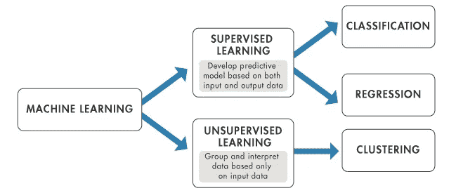
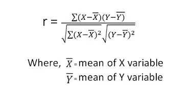
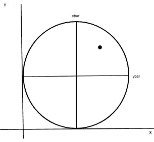
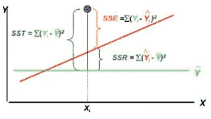

# 数据科学与线性回归(上)

> 原文：<https://medium.com/analytics-vidhya/data-science-linear-regression-part-i-1800681ac5de?source=collection_archive---------24----------------------->

为什么我决定写这篇文章？

我在数据科学和机器学习领域担任导师。我的日常工作是通过在线论坛解决学生的技术疑问。在我任职期间，我感觉学生们花了 X 的钱来学习课程，课程缺乏内容，提供了错误的信息。学习数据科学和机器学习的费用要比课程费用低得多。网上有大量的文章和视频，互联网比海洋更有深度，只是我们需要潜水和准备潜水。

我决定让这篇文章尽可能通俗易懂，我不会使用太多的技术定义。因此，让我们从简单了解什么是数据科学开始，然后以线性回归结束我们的文章。

# **什么是数据科学？**

数据科学是一门从数据中提取隐藏模式的**科学。我们需要把重点放在这一行的下列词语上:**

*   **数据:**指每天生成的数据量。当我们生成这些数据点时，我们在数据集中留下了我们的行为模式和习惯，即数据可以描述你的行为模式和习惯，例如:莫迪先生总是在促销活动或清仓大甩卖时购买衣服。
*   **模式:**模式只是数据集中的趋势、关联、规则或聚类。
*   a)趋势:趋势的例子是，随着一天中温度的增加，冰淇淋的销售量增加
*   b)周期:例如:夹克在冬天比夏天卖得多
*   c)关联:例如:当有人购买产品 B 时，产品 A 总是被购买

我们可以通过对数据和图形表示进行各种统计分析来确定上述所有术语，即通过进行**探索性数据分析(又称 EDA** )。在未来的日子里，我会就此发表深入的文章，这将对你有益。告诉你数据分析师 80%的时间都在做 EDA。

现在，我已经告诉你什么是数据科学，那么让我们转移到什么是机器学习！

# **什么是机器学习？**

请看看这张图片，想一想，我会在文章的最后告诉你它的本质！

**机器学习是数据科学的一部分吗？**显然，这是不需要问的。**但是我们为什么要用它呢？仅仅通过对数据进行统计分析和用可视化图形描绘数据，我们无法表达数据中的每一个模式，因此无法形成一个单独的程序。机器学习的作用来了，因为它解决了难以用算法解决的任务。例如，它可以是手机上的人脸识别或语音理解，驾驶汽车(谷歌自动驾驶汽车)，通过症状诊断疾病(沃森)，建议产品，书籍(亚马逊)，电影(网飞)，音乐(Spotify)，执行个人助理的功能(Siri，Cortana)。**

**现在问题来了，程序和机器学习有什么区别？**

在传统编程中，你对程序的行为进行硬编码，也就是说，你定义一个或一组行为。在机器学习中，你把很多事情留给机器，机器从数据中学习行为。

哇，我还没告诉你什么是机器学习呢！让我告诉你并用一个例子来解释它，你制定定义。

我家有个新生儿，他的名字叫雅利安。他四岁了。他真的很可爱，他一直在努力学习走路。每次他试图用腿站立时，他都摔倒了(数据)。我多次看到他这样做，相信我，我想我在他这个年纪的时候也会像他一样。今天，在经历了许多尝试和失败后，他终于站了起来，并迈出了小步。

通过这个例子，我想告诉你的是，每次他试图站起来，但失败了，是他的一组数据。每次他尝试的时候，他都知道为了站立他必须摆腿的角度，也就是说，他从数据中获得经验，也就是说，他从数据中学习。最后，雅利安站了起来(输出)。

我认为，这将会使你清楚地理解你在网上和任何在线课程中读到的所有定义。

谈到机器学习算法，我们将其大致分为两部分:

*   **监督学习:**在这种情况下，算法需要某种初始帮助来识别隐藏模式。监督学习有两个阶段。首先是训练和建模，其次是测试和检查准确性。在监督学习中，数据集有 **N 个自变量** & **一个因变量**。我们根据 **N 个独立变量**预测因变量的值。因此，自变量和因变量之间存在关系。这种模型也被称为**替代假设**，因为除非你演示并证明它，否则无论你发现什么样的模式，都只是一种猜测。
*   **无监督学习:**这有未标记的数据集，即没有因变量。它只是帮助你识别数据中隐藏的模式。它通过计算数据点之间的距离和相似性来发现模式。

既然我们已经讨论了**监督学习，**我们应该转移到我们的第一个算法。

# **线性回归**

线性回归是一种监督学习模型。在这种情况下，生成的模型以方程的形式表示，其中方程可以是:

*   二维->直线方程
*   三维->平面方程
*   n 维->超平面方程

使用这个模型，回归告诉我们将预测一些实数值。术语**线性**是指使用独立变量的线性组合来生成模型的方法，即 y 是具有相同程度的不同权重的 xi 独立变量的组合。

**Y 的方程式:**

**y=截距+系数*自变量**

我们的数据集中有了所有的自变量，我们需要找到它们与因变量之间的关系。因变量和自变量之间的这种关系可以用**相关性**来表示，相关性**的范围从-1 到 1。**

*   如果相关性接近 1 或-1，那么就有完美的关系
*   如果相关性接近于 0，则在删除该独立变量之前，进一步研究该变量

下面给出相关公式:

*   在线性回归中，我们将 X 变量视为独立变量**和 Y 变量视为因变量**。
*   (X-Xbar)表示 X 与其中心值有多不相似
*   公式的分子是协方差，即数据点在数学空间中如何一起变化。
*   (X-Xbar)(Y-Ybar)是面积，它是数据点远离中心点所享有的自由度

在上图中，黑色数据点(xi，易)远离它们的中心值。

*   Xbar 和 Ybar 是预测的预期值，但由于数据中的随机因素，数据点会远离它们。

现在我们已经得到了与因变量相关的好的自变量。现在，为了拟合回归线，我们的算法必须找到最小化误差平方和的最佳表面。

在上图中，我们展示了我们已经绘制了自变量和因变量 **x** & **y** 之间的散点图。图中的蓝点是实际数据点，红线显示数据点之间拟合的预测表面。

**SSE= Sum(Y-Y_hat)**

其中， **Y_hat** 为预测值& **Y** 为实际值。我们的目标是最小化 SSE。

在上图中， **SSR(残差平方和)**表示模型捕获的误差。SSR 越接近 SST(总平方和= SSR+SSE ),模型越好。

在线性回归中，有一个更重要的术语被使用，即 **R 决定系数**。它显示了线性模型最佳拟合线对数据点的拟合程度。

整个矩形区域(abcd)是由对角线框表示的数据所享有的自由度。对于该区域，预测值如何捕获该区域由'**' S '**'标记框(dcfe)表示，该框表示您的模型针对该数据点捕获的误差百分比。数据点享有的自由度与模型捕获的错误百分比之比称为决定系数。决定系数= dcfe/abcd。

我们使用另一个度量来判断模型的准确性，称为**调整后的 R** 。是 R -fluke。侥幸是指由统计侥幸引起的 X & Y 变量之间的关系

这是本文中线性回归的第一部分，仅仅是关于基本概念。在下一部分中，我将带你更深入地讨论线性回归的工作原理，我们如何从零开始以及从现有的库中构建它。你会发现每周都有一篇新文章。敬请关注。

上图的本质是，大多数时候我们的数据并不足够，我们的模型无法有效地从中学习。因此，我们让数据堆积起来，然后建立一个模型。