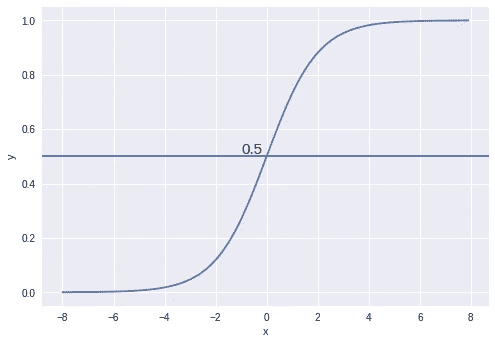

# 数据科学:逻辑回归

> 原文：<https://medium.com/analytics-vidhya/data-science-logistic-regression-f5cd21e9e9c8?source=collection_archive---------29----------------------->

来源:Dreamstime.com

**简介:**

逻辑回归是监督机器学习算法，用于二元类或多类分类(也称为一对一分类)。这是著名的分类算法之一。在理解之前，让我们定义一下逻辑回归中回归的含义。

**回归基本上是一种寻找变量之间关系的统计方法。在机器学习中，这用于根据从数据集获得的变量之间的关系来预测事件的结果。线性回归是机器学习中使用的一种回归**

## ****直觉:****

****逻辑回归也称为逻辑回归或逻辑建模，是一种监督学习分类算法，用于预测目标变量的概率。目标或因变量的性质是二分的，这意味着只有两种可能的类别。数学上，逻辑回归模型预测 P(Y=1)是 x 的函数。****

******为什么 logistic 回归即使用于分类也叫“回归”？******

****逻辑回归是回归，因为它发现变量之间的关系。它是逻辑的，因为它使用逻辑函数作为链接函数。因此有了全名。****

> ******注**:逻辑回归使用预测建模的概念作为回归；因此，它被称为逻辑回归，但用于分类样本；因此，它属于分类算法。****

******为什么我们不能用线性回归解决问题？******

******1。**当数据集中有大量异常值时，我们的最佳拟合线会完全偏离。这条线给出的预测将是不正确的，因为我们不应该对分类问题使用线性回归。****

****直线方程****

********

****也可以写成****

********

****其中:****

****y =因变量，x =自变量，m/w =斜率，c/b =截距****

******2。**线性回归给出的输出值可以大于 1 或小于 0。但是根据逻辑回归的假设，值应该在 0 和 1 之间，所以根据逻辑回归的假设，不可能有大于 1 或小于 0 的值，所以我们不能使用线性回归。****

********

## ******我们将用两类问题来讨论逻辑回归:******

## ****逻辑回归的工作原理:****

****逻辑回归可以应用于两类分类问题可以线性分离的问题。下图(绿色类和红色类)****

********

****表示为 yi=+1 的正类****

****表示为 yi=-1 的负类****

****如果截距为 0，则 y 可表示如下。****

********

****wTx 也称为数据点和平面之间的距离****

********

****要了解更多关于权重也称为系数(如上所述)是如何决定和更新的，请浏览我的梯度下降文章。****

****[https://medium . com/datadriveninvestor/an-overview-of-gradient-descent-algorithms-e 373443 AFA 7 f](/datadriveninvestor/an-overview-of-gradient-descent-algorithms-e373443afa7f)****

********

****如果任何数据点高于该平面，它将是正值，因为导数将返回正值，如果点低于该平面，它将是负值。****

******情况 1** :对平面上方的一个数据点进行分类时(图中的绿点)****

****这里****

********

****所以记录目前会被分类****

******情况 2** :对平面下的一个数据点进行分类时(图中红点)****

****这里****

********

****(-1 *任何负值都变成正值)****

****所以记录目前会被分类****

******情况 3** :当分类一个属于负类(红色类)但在正类(绿色类)中可用的数据点时****

********

****这里，****

********

****(-1 *任何正值都变成负值)****

****因此记录目前不会被分类****

****因此，我们应该从所有这些情况中注意到，所有数据点的总和以及距离应该是最大的(成本函数应该是最大的),以创建可以线性分离两个数据点的最佳拟合线。****

********

## ****现在我们从这个代价函数中得到的值基本上是从- **∞** 到+ **∞的连续值。******

****现在，由于我们需要预测值的类别，我们应该将成本函数生成的值传递给 **Sigmoid 函数**，它将在 0 和 1 之间转换成本函数值(Sigmoid 函数的范围在 0 & 1 之间)****

****************

****图片:KDnuggets****

****这种方式将消除异常值的影响，并将所有范围从-∞到+∞ **到** 0 到 1 的值转换。****

****在两类分类问题中，低于任何特定阈值(**比如 0.5** )的所有值将被分类为**类 0** ，高于阈值的将被分类为**类 1** 。****

## ******逻辑回归的优势:******

1.  ****当数据集是线性可分的时，逻辑回归表现良好。****
2.  ****这是一种广泛使用的技术，因为它非常高效，不需要太多的计算资源，可解释性强，不需要缩放输入要素，不需要任何调整，易于正则化，并且输出校准良好的预测概率。****
3.  ****与线性回归一样，当您移除与输出变量无关的属性以及彼此非常相似(相关)的属性时，逻辑回归的效果会更好。因此，特征工程在逻辑和线性回归的性能方面起着重要的作用****

## ******缺点:******

1.  ****逻辑回归试图基于一组独立变量来预测结果，但如果研究人员包括错误的独立变量，该模型将很少有甚至没有预测价值。****
2.  ****我们不能用逻辑回归来解决非线性问题，因为它的决策面是线性的。****
3.  ****逻辑回归要求每个数据点独立于所有其他数据点。如果观察结果是相互关联的，那么模型将倾向于强调这些观察结果的重要性****

******结论**:逻辑回归算法是一种非常广泛使用的机器学习和预测建模技术，如果使用有效的话。****

****希望你喜欢我的文章。请点击拍手图标(最多 50 次)来激励我写更多。****

****想要连接:****

****联系方式:【https://www.linkedin.com/in/anjani-kumar-9b969a39/ ****

****如果你喜欢我在 Medium 上的帖子，并希望我继续做这项工作，请考虑在 [**patreon**](https://www.patreon.com/anjanikumar) 上支持我****