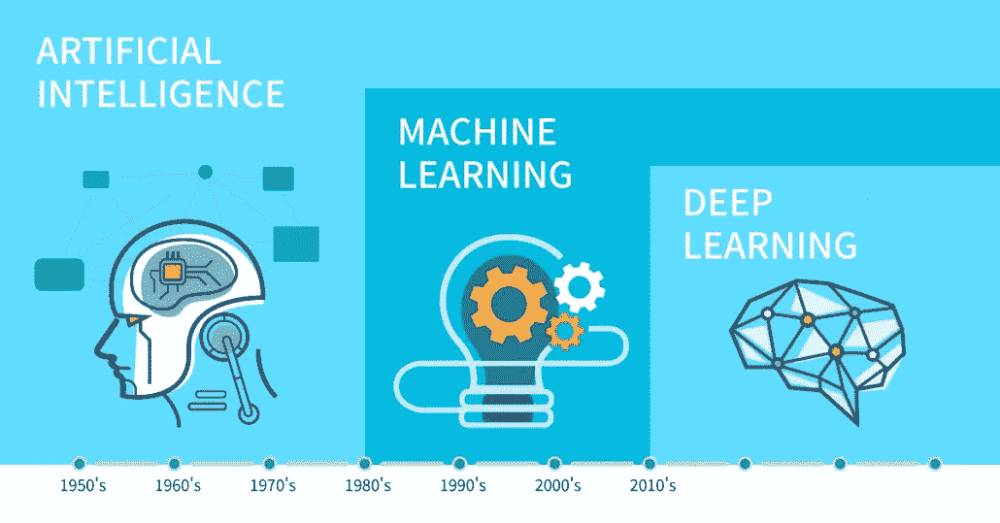
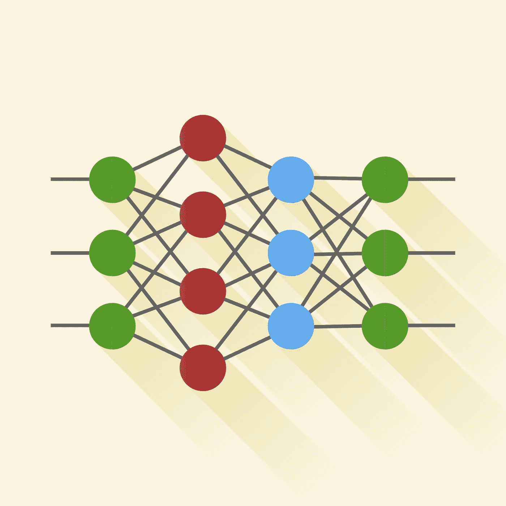
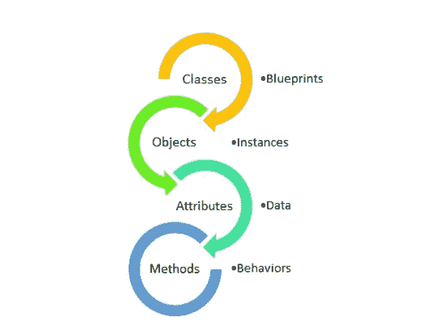

# 数据科学，机器学习和思考。

> 原文：<https://medium.com/analytics-vidhya/data-science-machine-learning-and-the-musings-886844c946a2?source=collection_archive---------23----------------------->


无可挑剔的梵高的《星夜》

说到职业选择和追求，很少有人能搞清楚。以下文章简要讨论了关于数据科学和机器学习的几个问题，这些问题存在于许多即将开始新的 it 职业生涯或只是对其好奇的人的脑海中。让我们澄清一下，看看它们是如何成为“21 世纪最性感的工作”的。

## 1.为什么要学习数据科学和机器学习？

据消息来源称，每天产生的数据量高达 25 亿亿分之一(2500000000000000)字节，如果堆积起来，相当于 4 个埃菲尔铁塔。世界上的每个组织都使用各种策略、工具和专业人员来理解海量数据——大数据，但没有足够的资源将数据转化为有用的见解，也没有熟练的专业人员来处理这些数据。


现在，当谈到追求数据科学的职业生涯时，这有各种积极的因素，如薪酬， ***根据 Glassdoor，数据科学家的年薪为 171，345 美元*** ，比全国平均工资高出约 163%。此外，对教育背景没有限制，即除了计算机工程师和统计学家，来自机械、电子、电气甚至管理领域的专业人士都可以在数据科学领域找到工作。然而，数据科学家的角色需要大量的技能和经验来获得丰厚的工资，不是每个人都能一蹴而就的。但是，其他职位，如数据分析师、业务分析师、商业智能分析师、数据架构师、数据工程师等，在未来可能会成为数据科学家。

除了所需的技能和多年的工作经验，招聘人员现在还看重一个人的一些品质，比如， ***一个人有多好奇？一个人的判断力有多强？有多会讲故事？*** 。许多领先的专业人士都承认，如果一个候选人很好奇，有判断力，会讲故事，但编程经验较少，他们仍然会选择那个候选人，而不是那个有很好的编程技能但对数据不感兴趣的候选人。因此，大门对人们是敞开的，即使他们没有那么好的技能。

如前所述，数据科学家使用“工具”从海量数据中筛选信息，那么这些工具是什么呢？这就是机器学习出现的时候。在过去，人们将数据存储为计数或刻度线，并发明了算盘来分析这些数据，然而，这不能应用于当前的场景。机器学习领域具有各种算法，这些算法提取数据、收集数据、从数据中收集见解以及准备模型，这些模型一旦被创建就可以用于更长时间来执行上述功能。因此，该过程是自动化的。此外，未来的数据科学家可以专攻机器学习，变得更受雇主欢迎。在美国，机器学习工程师的平均工资为 114，961 美元/年 ，还需要掌握数学、代数和统计知识( ***不是数学或统计博士*** )，并具备全面的机器学习基础知识。

随着数据的增加，对数据专家的需求也在增加。在此期间，2011 年麦肯锡关于大数据的一项研究表明 ***“仅美国就面临 14 万到 19 万具有分析专业知识的人的短缺”*** ，这为学生和其他专业人士提供了一个进入该领域的绝佳机会。此外，这两种职业在几乎每个领域都有广泛的应用。医疗保健组织使用数据来监控患者健康图表，军队使用数据来监控国防军队，商店经理利用客户数据来定制折扣等等。

综上所述， ***数据统治未来世界，*** 学习这些技能可以让世界集体和个人变得更好，因为它们不一定需要专业知识才能进入该领域。此外，利用未开发的机会可以帮助建立一个高生活水平的更好的职业前景。

## 2.非技术类考生有可能进入数据科学&机器学习领域吗？如果是，如何和不是，为什么？

父母在技术教育上花费大量金钱，期望他们的孩子有一个光明的未来。老实说，对于非技术背景的员工来说，很难找到一份好工作并在其中生存下来，因为他们无法在技术领域发挥自己的才能。尽管这些刻板印象是由全球各地的招聘人员设定的，但如今情况发生了变化。所以，是的！一个非技术人员可以在数据科学或机器学习领域追求成功的职业生涯。甚至有很多由非技术背景的人拥有和创建的 IT 创业公司的成功故事。所以，我们可以说天空不是极限。怎么会？让我们来揭开谜底！


随着网上铺天盖地的信息和同事的建议，混乱是必然的，思想肯定会碰壁。不管怎样，有很多方法可以进入这个行业。首先，自 2012 年以来，MOOCs(大规模开放在线课程)出现了显著增长，在疫情期间，它呈指数级增长。哈佛、斯坦福等许多知名大学都与这些 MOOCs 合作，提供最先进的课程模块、动手实验室和作业。最重要的是，许多课程甚至不需要技术背景，因此参加在线课程可以帮助增强信心和技能，以填补空白。最好学习的在线网站之一是 Coursera、T2、乌达城、T4、乌德米、斯瓦扬、等等。

第二，也是最受欢迎的著名来源，YouTube。虽然 YouTube 上的技术视频很少，但这种趋势在过去几年里迅速发展，最棒的是它们是免费的！大多数在线课程都是付费的，或者需要付费才能获得认证，但是 YouTube 是免费学习的最佳资源。除此之外，还有无数的 YouTube 频道可以了解数据科学和机器学习，如 [Kaggle](https://www.youtube.com/user/kaggledotcom) 、[数据学校](https://www.youtube.com/user/dataschool)、[速成班](https://www.youtube.com/channel/UC0rqucBdTuFTjJiefW5t-IQ)、 [Tensorflow](https://www.youtube.com/channel/UC0rqucBdTuFTjJiefW5t-IQ) 等等。

此外，还有一个最古老且无可挑剔的学习技能的来源，那就是书籍。有很多书是给绝对初学者或“傻瓜”看的，即。 [*【傻瓜的机器学习】*约翰·保罗·穆勒和卢卡·马萨隆](https://www.amazon.in/Machine-Learning-Dummies-John-Mueller/dp/1119245516)、*[*使用 Python 进行计算和编程简介*](https://www.youtube.com/channel/UC0rqucBdTuFTjJiefW5t-IQ)*约翰·v·古塔格 [*数据科学从零开始:Python 的第一原理*](https://www.amazon.in/Data-Science-Scratch-Principles-Python/dp/9352138325/ref=bmx_7?_encoding=UTF8&pd_rd_i=9352138325&pd_rd_r=089c40de-6dde-4bf9-a7c0-c2d39c393586&pd_rd_w=mGAIs&pd_rd_wg=3iCEY&pf_rd_p=36ca7b19-4351-4ad5-b4ac-81d572158780&pf_rd_r=PWE41DVXA40TAP0TPNV2&psc=1&refRID=PWE41DVXA40TAP0TPNV2) 乔尔·格鲁什 [*乔治·t·海涅曼*](https://www.amazon.com/Algorithms-Nutshell-Practical-George-Heineman/dp/1491948922) 加里**

**除此之外，实际应用知识是在某一领域获得专业知识的最佳途径。人们可以参加网站举办的各种在线比赛:[厨师](https://www.codechef.com/contests)、[谷歌](https://codingcompetitions.withgoogle.com/)、[极客论坛](https://www.geeksforgeeks.org/contests/)等等。参加这样的比赛是一种理想的尝试，可以发现一个人的弱点和优势，有助于将精力和注意力集中在正确的方向上，避免筋疲力尽和失去动力。**

**最终，成为编码社区的一部分。作为一名技术人员，痛苦的事实是学习永无止境，所以必须保持无所不知的态度，而不是无所不知。这些社区帮助初学者提升他们的技能，举办各种技术活动，帮助解决技术错误，增加网络和对技术的认识。比较知名的有 [StackOverflow](https://stackoverflow.com/) 、 [GitHub](https://www.googleadservices.com/pagead/aclk?sa=L&ai=DChcSEwjp2IagkOTrAhWCHSsKHVRnBpoYABAAGgJzZg&ae=2&ohost=www.google.com&cid=CAESP-D2NLZVkkqI36SPoEt3YnvPfwkZUH50XuR0-7DgAXp508F4GfL_d_ZZeev3zM5jge7jf8g-E6pYZmrnmRD_JA&sig=AOD64_2mBAzJnLSLBZ07jW6a4vf3hOOCZg&q&adurl&ved=2ahUKEwi6if-fkOTrAhWj73MBHdhBC1UQ0Qx6BAgxEAE) 、 [Reddit](http://www.reddit.com/) 、 [Quora](http://quora.com/) 、[黑客新闻](https://news.ycombinator.com/)。甚至有一些专门为科技行业女性创建的社区。**

## **3.数据科学和机器学习在商业中有哪些应用？**

**几乎每个业务部门:营销、销售、反馈、服务关怀，都在利用数据科学和机器学习来提升业务销售和机会。**

****

**从数据科学开始，数据科学以多种方式帮助利用商业智能做出更好的决策。以前，商业智能是静态的，但数据科学使其更加动态。随着大数据可供跨国公司使用，他们在数据科学家的帮助下分析数据并获得所需策略的知识。该过程的要点可以解释如下:**

1.  **业务理解——从利益相关者那里理解问题的背景和性质，从而指导进一步的过程。**
2.  **分析方法—根据陈述的问题类型，采用描述性、诊断性、预测性或规范性方法。**
3.  **数据理解和收集——从各种来源收集数据，准备、转换和可视化数据，以便更好地理解数据。**
4.  **构建模型——选择的数据和算法然后经过多次迭代进行训练、评分和评估，最后部署给利益相关者。**

**上述过程对于机器学习也是类似的。**

**许多商业公司使用分析后的数据来了解客户购物模式，并在高峰时段轻松应对。例如，数据科学帮助沃尔玛解释客户行为，帮助他们储备需求产品以及未来的产品。沃尔玛还根据每个商店量身定制了结账方式，即自助结账或便利结账。此外，基于购物车分析，他们策划折扣和优惠，组织货架和推荐产品，以增强购物体验。**

**由于全球化，客户来自世界各地，处理简单的查询和反馈会破坏消费者和服务提供商的整体体验。因此，在机器学习的帮助下，聊天机器人被集成到可以处理第一波问题的系统中，帮助客户支持，使公司能够解决需要立即关注的严重问题。**

**商业领域的经典机器学习应用之一是异常检测，用于诊断欺诈交易。这种策略广泛应用于制造业，以提高生产率和效率，降低成本，优化停机时间。收集和分析数据的程序是在系统中安装传感器。机器学习模型处理这些信息，以发现异常实体并对其进行分析，从而防止进一步的问题和对系统环境的破坏。类似地，这些模型有助于信用卡欺诈、医疗诊断、网络安全和许多其他方面。**

**现在在网站上无处不在的机器学习和数据科学的典型应用之一是推荐引擎。更准确地说，在浏览网飞时，很难不注意到它是如何设计其主页的，在那里人们可以看到排名前 10 的节目以及根据用户的观看历史推荐的节目。有人可能会问，为什么网飞秀总是一鸣惊人？嗯，分析数据有助于他们嗅出每部电视剧的成功之处，甚至是在它上映之前。**

**数据科学和机器学习的各种实践几乎存在于业务的每一步，随着时间的推移，对市场、股票价格、客户行为以及这些行为的潜在威胁有了更深刻的理解。**

## **4.什么是深度学习？阐明它的子类。**

**多年来，人工智能激起了人们的兴奋，但即使在机器学习到来之后，也经历了人工智能的冬天。令人惊讶的是，深度学习神经网络取得了突破，并通过整个人工智能领域带来了人工智能的春天。**

****

**深度学习是机器学习的子集，机器学习是基于具有表征学习的人工神经网络的人工智能的一部分。简而言之，深度学习神经网络模拟了人类大脑的工作，但并不完全如此。提到区别，人工神经网络是静态的和符号化的，而生物大脑是动态的和模拟的。**

**大约在 20 世纪 50 年代，英国数学家和计算机科学家艾伦·图灵提出了机器学习的概念，当时他预测将会发明像超级计算机一样的人脑，后来在 20 世纪 60 年代中期，苏联数学家伊瓦赫年科-帕拉创建了紧凑的功能神经网络，这一想法得以实现。自那以来，已经有了很多发现，深度学习网络在各个领域都找到了一席之地。**

**记住，所有的深度学习算法都是机器学习算法但不是所有的机器学习算法都是深度学习算法。深度学习模型使用大量的标记数据进行训练，用于需要高计算能力的高复杂性问题，产生准确的结果。不利的一面是，经过训练的数据很难解释，而且价格昂贵。**

**在深度学习中，准备算法来对图像、文本和声音执行分类任务。深度学习是自动驾驶汽车的支柱，使它们能够区分人和灯柱，或者识别停车标志。此外，在手机、平板电脑、电视和扬声器等设备中，神经网络支持语音命令和控制。**

****

**形容词“深”表示在网络中使用多个隐藏层，其中有一个输入层、几个隐藏层和一个输出层。传统的神经网络有 3-5 个隐藏层，但深度网络有多达 150 个。使用标记的数据，他们在没有人工干预的情况下提取特征。最流行的神经网络之一是卷积神经网络(CNN ),它适合于处理 2D 数据，例如图像。**

**深度学习是基于在以下文本中强调的架构的子分类:**

*   **生成式-他们专注于使用无监督学习方法对层进行预训练，这种方法后来被包括在模型中以进行进一步的训练和微调。这消除了训练较低级架构的困难。**
*   **区别性-它们处理每一层的输出并将其与原始信息相叠加。**
*   **混合深度学习-混合深度学习模型结合了生成性和鉴别性的工作。**

**此外，深度学习工具已经成为几种疾病的自动医疗诊断的辅助工具，如心律失常、乳腺癌、肺炎的检测以及皮肤癌和脑部疾病的分类。同样，深度学习模型在由七个 CNN 模型组成的特殊 COVIDX-Net 模型的帮助下，帮助学习大型 DNA/RNA 序列和新冠肺炎形式 X 射线图像的快速跟踪诊断。总之，深度学习已经产生了超出人类思维的准确和高度复杂的结果，并随着时间的推移从聚合数据中做出了前卫的揭示。**

## **5.Python 中的面向对象编程是什么？用插图描述。**

**面向对象编程(OOP)是一种编程范式，它围绕对象而不是逻辑或功能来组织软件设计。一般来说，面向对象编程由对象组成，对象由相应的数据结构和所需的过程组成，因此遵循自底向上的问题解决方法。它主要关注数据，而不是过程。**

**一个对象有两个特征:**

*   **属性**
*   **行为**

**举例来说，假设人类是一个物体，**

*   **属性—姓名、年龄、性别、体重**
*   **行为——行走、哭泣、奔跑**

****

**Python 是一种多用途编程语言，它专注于 DRY(不要重复自己)概念，从而产生可重用的代码。Python 遵循某些面向对象的编程原则，如下所述:**

## ****类****

**一般来说，类是对象的蓝图，用于生成用户定义的函数。例如，一个类就是一个带有标签的人类草图。类创建了一个*方法，*包含了从类中创建的对象可以对其数据执行的行为和属性。**

**让我们将人类定义为一个类:**

***#注意:类名的第一个字母要大写。***

```
**class Human:
    pass**
```

**这里，通过使用关键字“class”我们准备了一个空类“Human”。关键字“pass”是一个占位符，表示代码的其余部分将被放置在哪里，这段 python 代码运行时不会出现任何错误。该类用于生成实例，这是一个包含真实数据(如姓名、年龄或品种)的对象。**

## ****对象****

**通过实例化类来创建对象，并为其分配内存。要实例化一个对象，请编写类名“human ”,后跟左括号和右括号()。**

```
**Human()**
```

**可以创建两个同名的对象，但是它们不相等，因为它们代表不同的内存位置。**

*   ****在 python 中创建类和对象:****

```
**class Human:

    #class attributes
    species = "homo sapiens" #instance attributes
    def __init__(self, name, age):
        self.name = name
        self.age = age#instantiating Human class
monica = Human("Monica", 25)
rachel = Human("Rachel", 27)#access class attributes
print("Monica is a human / {}.".format(monica.__class__.species)
print("Rachel is a human / {}.".format(rachel.__class__.species)#access instance attributes
print("{} is {} year(s) old.".format(monica.name, monica.age)
print("{} is {} year(s) old.".format(rachel.name, rachel.age)**
```

****输出:****

```
**Monica is a human / homo sapiens.
Rachel is a human / homo sapiens.
Monica is 25 year(s) old.
Rachel is 25 year(s) old.**
```

**在上面的程序中，创建了一个名为*“Human”*的类，其属性为*“species”。***

**接下来，在该类的*“init”*方法中定义属性。**

**然后， *"Human"* 类的实例被创建， *"monica"* 和 *"rachel"* 是我们新对象的值/引用。**

**要访问类属性类型， *__class__species。对于该类的所有对象，类实例是相同的。同样，要访问实例属性 type， *monica.name* 和 *monica.age.* 然而，实例属性是特定于类的每个实例/对象的。***

## ***方法***

*方法是在类体内定义的函数，代表对象的行为。现在，不像 Java，Python 可以有类外的函数。*

***定义功能:***

```
*def eat(self, food):
    return food*
```

***在 Python 中创建方法:***

```
*class Human:

    #class attributes
    species = "homo sapiens" #instance attributes
    def __init__(self, name, age):
        self.name = name
        self.age = age #instance methods
    def eat(self, food):
        return "{} loves {}.".format(self.name, food) def live(self, city):
        return "{} lives in {}.".format(self.name, city)#instantiating Human class
monica = Human("Monica", 25)
rachel = Human("Rachel", 27)#calling instance methods
print(monica.eat("Lasagna")
print(rachel.eat("Pizza")
print(monica.live("New York")
print(rachel.live("Newark")*
```

***输出:***

```
*Monica loves Lasagna.
Rachel loves Pizza.
Monica lives in New York.
Rachel lives in Newark.*
```

*在上面的程序中定义了两个实例方法: *eat()* 和 *live()* 。它们被称为实例方法，因为它们是在类的实例上调用的。*

## *遗产*

*继承允许一个新的类使用现有类的属性，而不用操作它们。因此，新的类称为派生类或子类，而现有的类称为基类或父类。*

***python 中继承的说明:***

```
*#Base or Parent Class
class Human:

    def __init__(self):
        print("I am Human")
    def species(self):
        print("Homo Sapiens")
    def exc(self):
        print("Exercises daily!")#Derived or Child Class
class Monica(Human):

    def __init__(self):
    #call super() function
        super().__init__()
        print("I am Monica")
    def species(self):
        print("Human Being")
    def cook(self):
        print("Cooks lovely!")monica = Monica()
monica.species()
monica.exc()
monica.cook()*
```

***输出:***

```
*I am Human
I am Monica
Human Being
Exercises daily!
Cooks lovely!*
```

*在上面的程序中，创建了两个类: *Human* 和 *Monica，*其中( *Monica* )子类继承了( *Human* )父类的函数。这一点从 *exc()中可以看出。**

*同样，子类在 *species()* 方法中修改了父类的行为，这被称为*覆盖*。同时，子类*通过创建一个新的 *cook()* 方法来扩展*父类。*

*最后， *super()* 函数用在 *__init__()* 方法内部，允许父类在子类内部运行。*

## *包装*

*在 python 中使用 OOP，可以限制对方法和变量的访问，防止数据被直接修改。这就是所谓的封装。在 python 中，我们使用下划线作为前缀来表示私有属性。(' _ '或' __ ')*

***说明 Python 中的封装:***

```
*class Food: def __init__(self):
        self.__cost = 10
    def cuisine(self):
        print(" Tropical -> {}".format(self.__cost)
    def setNewCost(self,price):
        self.__cost = pricef = Food()
f.cuisine()#change the cost
f.__cost = 20
f.cuisine()#using setter function
f.setNewCost(20)
f.cuisine()*
```

***输出:***

```
*Tropical -> 10
Tropical -> 10
Tropical -> 20*
```

*在上面的程序中，定义了一个食品类，并使用 __init__()方法来存储食品的价格。*

*即使在尝试修改成本之后，它在第二行输出中也没有改变，因为 python 将 __cost 视为私有属性。*

*因此，要更改该值，需要使用 setter 函数， *setNewCost()* ，将价格作为参数。*

## *多态性*

*“聚”的意思是很多。多态性允许对多种数据类型使用公共接口。假设我们需要给一个形状上色，有各种形状(正方形，圆形，长方形)。同样的方法可以用于通过多态性给所有形状着色。*

***用 Python 说明多态性:***

```
*class square:

    def corner(self):
        print("Square has 4 corners")class circle: def corner(self):
        print("Circle has no corners")#common interface
def corner_test(shape):
    shape.corner()#instantiate objects
s = square()
c = circle()#passing the objects
corner_test(s)
corner_test(c)*
```

***输出:***

```
*Square has 4 corners
Circle has no corners*
```

*在上面的程序中，定义了两个类:*正方形*和*圆形，*每个都有共同的 *corner()* 方法。但是它们的功能不同。*

*为了使用多态性，创建了一个公共接口 *corner_test()* ，它接受任何对象并调用该对象的 *corner()* 方法。从而通过了 *corner_test()* 函数中的 *c* 和 *s* ，有效运行。*