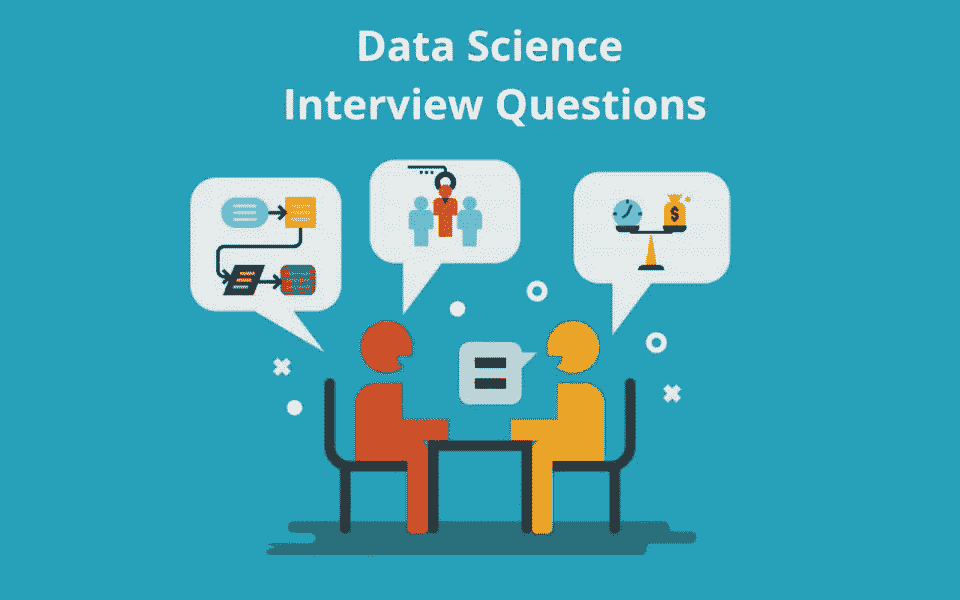

# 数据科学最常见的面试问题

> 原文：<https://medium.com/analytics-vidhya/data-science-most-asked-interview-questions-cf3651f8d157?source=collection_archive---------16----------------------->

> **什么是文本规范化？**

文本规范化是我们将输入文本转换成标准形式的过程。文本规范化的一些主要步骤如下:

词汇化——将单词改变成它们在词典中出现的形式。例子-懒散到懒惰，早上起床，等等。

去除停用词——出现频率很高且没有增加多少价值的词称为停用词。例如——the、a、and、but 等。删除这样的词是必要的，以使文本更清楚。

符号化——将文本分解成最小的有意义的单元。例子-Ajay 喜欢冰淇淋。致['Ajay '，' likes '，' icecream']

> **2。哪一个是非参数模型？线性回归、决策树或 SVM(支持向量机)。提为什么？**

决策树和非线性核支持向量机都是非参数方法，因为它们的相关模型不能由独立于数据的固定有限数量的参数来描述，而它们适合这些参数。

另一方面，线性回归是一种参数方法，因为它的模型是由输入变量的系数和偏移量描述的。因此，无论训练集看起来如何，模型总是由 d+1 个参数捕获，其中 d 是特征空间的维度。

> **3。协方差和相关的区别是什么？**

简而言之，这两个术语都衡量两个变量之间的关系和依赖性。“协方差”表示变量之间线性关系的方向。另一方面,“相关性”衡量两个变量之间线性关系的强度和方向

> **4。什么是微观平均和宏观平均？如果一个类支配另一个类，应该使用哪个？**

微平均在计算平均值时聚合所有类别，而宏平均按类别计算。使用哪一个取决于你的优先顺序，也就是说，如果你重视理解少数类(如异常检测)，那么你会使用宏观平均精度

微观和宏观平均值(不管是什么指标)会计算出稍微不同的东西，因此它们的解释也不同。宏观平均将独立计算每个类别的指标，然后取平均值(因此平等对待所有类别)，而微观平均将汇总所有类别的贡献来计算平均指标。在多类别分类设置中，如果您怀疑可能存在类别不平衡(例如，一个类别的示例可能比其他类别的多得多)，微平均值是更好的选择。

> **5。什么是消失/爆炸渐变问题？**

在机器学习中，当使用基于梯度的学习方法和反向传播来训练人工神经网络时，会遇到消失梯度问题。梯度将变得非常小，有效地防止权重改变其值。

在最坏的情况下，这可能会完全停止神经网络的进一步训练。消失梯度问题限制了具有经典流行激活函数如双曲正切的深度神经网络的发展。它可以使用 ReLU 和 He 权重初始化来解决。

> **6。在 NLP 中特征提取是如何完成的？**

一些流行的特征提取技术将文本转换成特征矩阵(或向量)。

两种最流行的特征提取方法是:

词袋:词袋是将标记转换成一组特征的最基本的方法之一。BoW 模型用于文档分类，其中每个单词用作训练分类器的特征。

TF-IDF: TF-IDF 代表术语频率-逆文档频率。它强调了一个在我们的语料库中可能不太常见但非常重要的具体问题。TF-IFD 值随单词在文档中出现的次数成比例增加，随语料库中包含该单词的文档数量减少而减少。它由两个子部分组成，分别是:

术语频率(TF)，逆文档频率(IDF)。

> **7。什么是 lemmas？**

这可能有助于标准定义。

词元化是指使用词汇和词的形态分析来正确地做事情，通常旨在仅去除屈折词尾，并返回词的基本形式或词典形式，这被称为词元。

> **8。什么是自然语言处理中的术语-文档矩阵和术语-术语矩阵？**

文档-术语矩阵或术语-文档矩阵是描述术语在文档集合中出现的频率的数学矩阵。在文档-术语矩阵中，行对应于集合中的文档，列对应于术语。当创建出现在一组文档中的术语的数据库时，文档-术语矩阵包含对应于文档的行和对应于术语的列。例如，如果有以下两个(短)文档:

D1 =“我喜欢数据库”

D2 =“我讨厌数据库”，

那么文档术语矩阵将是:

它显示哪些文档包含哪些术语以及它们出现的次数。

> **9。对于有异常值的回归问题，你会选择哪种损失度量:均方误差还是平均绝对误差？为什么呢？**

意味着绝对误差，因为与 MSE 相比，它对异常值不是很敏感，因为它不惩罚巨大的误差。它通常用于在连续变量数据上测量性能。它给出了一个线性值，平均加权个体差异。该值越低，模型的性能越好。

> 10。为什么要做降维？提及任何两个原因 s。降维指的是减少数据集中输入变量或特征数量的技术。

我们需要降维，因为随着特征数量的增加，它们也会产生影响，它们是-

1.正因为如此，样本的数量也成比例地增加，这意味着我们将需要更多的样本来很好地代表所有特征值的组合。

2.这也使得模型更加复杂，并导致过度拟合的机会。

> **11。一个训练过的支持向量机(SVM)模型过度拟合数据，你会选择什么来减少过度拟合？**

降低 C 并增加伽马超参数

> **12。您将按什么顺序选择激活功能？**

通过实验，我是这样做的，顺序如下:

渗漏的乙状结肠

> 13。在 t 检验中，我们什么时候拒绝零假设？

当 p 值大于临界值时。

> 14.当 AUC 值为 0.5 时？

当我们可能在标记分类器目标的方式上犯了一个错误，或者我们可能有一个糟糕的训练算法。

> **15。提及任何两个用于衡量语言模型性能的指标。**

两个主要的度量用于估计语音识别系统中语言模型的性能。

首先，它们通过放入语音识别系统时产生的单词错误率(WER)来评估。虽然单词错误率是当前用于评定语音识别性能的最流行的方法，但是它的计算开销很大。

第二，也是更常见的，通过他们对测试数据的困惑来评估他们，这是一种对他们预测能力的信息论评估。

> **16。偏差和方差之间的权衡是什么？**

回答:偏差是由于你使用的学习算法中的错误或过于简单的假设而产生的错误。这可能会导致模型不符合您的数据，使其难以具有高预测准确性，也使您难以将您的知识从训练集推广到测试集。

方差是一个错误，因为你使用的学习算法太复杂了。这导致算法对训练数据中的高度变化高度敏感，这可能导致模型过度拟合数据。对于对测试数据非常有用的模型来说，您将从训练数据中带走太多的噪声。

偏差-方差分解本质上是通过添加偏差、方差和一点由于底层数据集中的噪声而导致的不可约误差来分解来自任何算法的学习误差。从本质上讲，如果你让模型变得更复杂，并添加更多的变量，你会失去偏差，但获得一些方差-为了获得最佳减少的误差量，你必须权衡偏差和方差。您不希望模型中出现高偏差或高方差。

> **17。有监督和无监督的机器学习有什么区别？**

回答:监督学习需要训练标记数据。例如，为了进行分类(监督学习任务)，您需要首先标记将用于训练模型的数据，以便将数据分类到已标记的组中。相比之下，无监督学习不需要显式标记数据。

> **18。KNN 和 k-means 聚类有什么不同？**

回答:K-最近邻是一种监督分类算法，而 k-means 聚类是一种非监督聚类算法。虽然这些机制初看起来可能相似，但这实际上意味着，为了让 K-Nearest Neighbors 起作用，您需要将未标记点分类到其中的标记数据(因此是最近邻部分)。K-means 聚类只需要一组未标记的点和一个阈值:该算法将获取未标记的点，并通过计算不同点之间的距离的平均值来逐渐学习如何将它们聚类成组。

这里的关键区别是，KNN 需要标记点，因此是监督学习，而 k-means 不需要，因此是无监督学习。

> **19。模型精度和模型性能哪个对你更重要？**

回答:这个问题考验你对机器学习模型性能细微差别的把握！机器学习面试问题通常会关注细节。有精度更高的模型在预测能力上表现更差——这怎么说得通？

嗯，它与模型精度只是模型性能的一个子集有很大关系，而且有时会误导人。例如，如果您想要在具有数百万样本的大规模数据集中检测欺诈，如果只有极少数案例是欺诈，则更准确的模型最有可能预测根本没有欺诈。然而，这对于预测模型来说是没有用的，预测模型是为了发现欺诈而设计的，声称根本没有欺诈！像这样的问题有助于证明您理解模型的准确性并不是模型性能的全部。

> 20。你如何处理不平衡的数据集？

答:不平衡的数据集是指，例如，当你进行分类测试时，90%的数据都在一个类中。这导致了一些问题:如果你对其他类别的数据没有预测能力，90%的准确率可能会有偏差！这里有一些克服困难的策略:

1.  收集更多数据以平衡数据集中的不平衡。
2.  对数据集进行重新采样以校正不平衡。
3.  在数据集上尝试完全不同的算法。

这里重要的是，您对不平衡的数据集可能造成的损害以及如何平衡它有敏锐的感觉。

> **21。什么时候应该使用分类而不是回归？**

回答:分类产生离散值和严格分类的数据集，而回归给出连续的结果，使您能够更好地区分各个点之间的差异。如果您希望您的结果反映数据集中的数据点属于某些明确的类别(例如:如果您想知道一个名字是男性还是女性，而不仅仅是他们与男性和女性名字的相关程度，那么您可以使用分类而不是回归。)

> **22。你如何确保你没有过度适应一个模型？**

回答:这是对机器学习中一个基本问题的简单重述:过度拟合训练数据并将数据的噪声带入测试集的可能性，从而提供不准确的概括。

有三种主要方法可以避免过度拟合:

1.  保持模型更简单:通过考虑更少的变量和参数来减少方差，从而消除训练数据中的一些噪声。
2.  使用交叉验证技术，如 k 倍交叉验证。
3.  使用正则化技术，如套索，惩罚某些模型参数，如果他们可能会导致过度拟合。

> **23。你将如何建立数据管道？**

**答案:**数据管道是机器学习工程师的面包和黄油，他们采用数据科学模型，并找到自动化和规模化的方法。确保您熟悉构建数据管道的工具(如 Apache Airflow)和可以托管模型和管道的平台(如 Google Cloud 或 AWS 或 Azure)。解释一个正常运行的数据管道所需的步骤，并讲述您在生产中构建和扩展这些步骤的实际经验。

> **24。我们如何利用你的机器学习技能来创收？**

回答:这是一个棘手的问题。理想的答案应该展示出你对业务驱动力的了解，以及你的技能如何与之相关。例如，如果你正在面试音乐流媒体初创公司 Spotify，你可以说你开发更好的推荐模型的技能将增加用户保留率，从长远来看，这将增加收入。

上面链接的 startup metrics Slideshare 将帮助您准确理解在初创公司和科技公司考虑收入和增长时，哪些绩效指标是重要的。

> **25。你最喜欢的算法是什么，能不能用不到一分钟的时间解释给我听？**

回答:这种类型的问题测试你对如何泰然自若地交流复杂和技术细节的理解，以及快速有效地总结的能力。确保你有一个选择，并确保你可以简单有效地解释不同的算法，以至于一个五岁的孩子可以掌握基本知识！