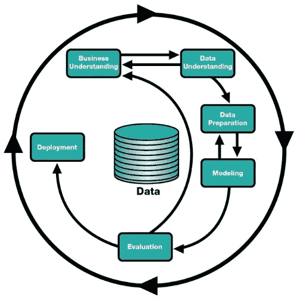
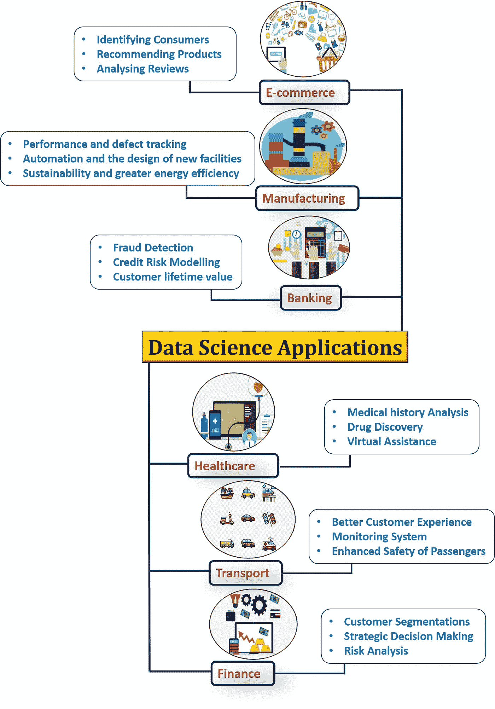
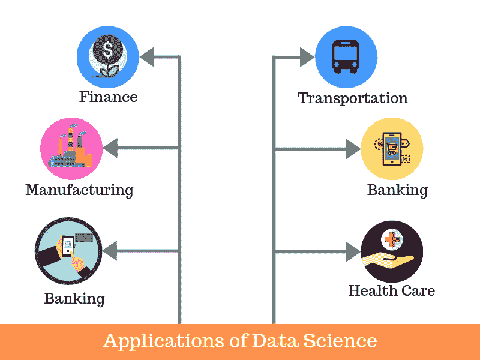

# 数据科学:需求和范围

> 原文：<https://medium.com/analytics-vidhya/data-science-need-and-scope-de0ccfd04030?source=collection_archive---------24----------------------->

# 什么是数据科学？？

数据科学这个术语的使用越来越普遍*、*，但它到底是什么意思呢？成为数据科学家需要哪些技能？数据科学中的决策和预测是如何做出的？在阅读数据科学这个术语时，这些问题通常会浮现在人们的脑海中。

首先，我们来看看什么是数据科学。数据科学融合了各种工具、算法和机器学习原理，目标是从原始数据中发现隐藏的模式。

数据科学主要用于利用预测因果分析、规定分析(预测加决策科学)和机器学习来做出决策和预测。

*   **预测因果分析—** 如果你想要一个可以预测未来特定事件可能性的模型，你需要应用预测因果分析。比方说，如果你提供信用贷款，那么客户未来按时进行信用支付的概率就是你关心的问题。在这里，您可以构建一个模型，该模型可以对客户的付款历史进行预测性分析，以预测未来的付款是否会按时。
*   **规定性分析:**如果你想要一个模型，它有自己做决定的智能，并且能够用动态参数修改它，你当然需要它的规定性分析。这个相对较新的领域就是提供建议。换句话说，它不仅预测，而且建议一系列规定的行动和相关的结果。最好的例子是谷歌的无人驾驶汽车，我之前也讨论过。车辆收集的数据可以用来训练自动驾驶汽车。你可以在这些数据上运行算法，为其带来智能。这将使你的车能够决定什么时候转弯，走哪条路，什么时候减速或加速。
*   **用于进行预测的机器学习** —如果你有一家金融公司的交易数据，需要建立一个模型来确定未来的趋势，那么机器学习算法是最好的选择。这属于监督学习的范式。之所以称之为有监督的，是因为你已经有了可以用来训练你的机器的数据。例如，可以使用欺诈购买的历史记录来训练欺诈检测模型。
*   **用于模式发现的机器学习** —如果你没有可以做出预测的参数，那么你需要找出数据集中隐藏的模式，以便能够做出有意义的预测。这只是一个无监督的模型，因为您没有任何预定义的分组标签。模式发现最常用的算法是聚类。
    假设你在一家电话公司工作，你需要在一个地区建立一个网络。然后，您可以使用群集技术来查找那些将确保所有用户接收到最佳信号强度的发射塔位置。

# 数据科学过程

数据科学可以理解为[数据科学流程](https://www.kdnuggets.com/2016/03/data-science-process-rediscovered.html)，包括业务理解、数据理解、数据准备、建模、评估和部署，如本 [CRISP-DM](https://www.kdnuggets.com/tag/crisp-dm) 框架所述:

数据科学过程

# 数据科学的需求

数据科学的需要是发现数据中的模式。它使用各种统计技术来分析数据并从中得出真知灼见。从数据提取、争论到预处理，数据科学家必须彻底审查数据。然后，他有责任从数据中做出预测。数据科学家的目标是从数据中得出结论。通过这些结论，他能够帮助公司做出更明智的商业决策。

行业需要数据来帮助他们做出谨慎的决策。数据科学将原始数据搅拌成有意义的见解。所以，行业需要数据科学。数据科学家是知道如何利用数据创造奇迹的巫师。一个熟练的数据科学家将知道如何从他遇到的任何数据中挖掘出有意义的信息。他帮助公司朝着正确的方向发展。公司需要强有力的数据驱动决策，而他是这方面的专家。数据科学家是统计学和计算机科学各个基础领域的专家。他运用他的分析才能来解决商业问题。

# 数据科学的范围

在数字革命出现之前，我们所能处理的数据大多是结构化的，而且规模相对较小。因此，传统的 BI 工具足以分析这些小型的结构化数据集。然而，近年来数据的指数级增长改变了整个等式。为什么

与传统的数据集(大多是结构化的)相反，今天生成的数据(来自不同的来源，如社交媒体、金融交易、日志、多媒体文件、在线门户等。)大多是半结构化或者非结构化的。目前，全球 80%以上的数据是非结构化的。

随着每一年的过去，数据只会继续增加，并添加到已经庞大的数据堆中。传统的 BI 工具不可能分析如此大量的非结构化数据集，它们需要更高级、更智能的分析工具来存储、处理和分析数据。这就是数据科学发挥作用的地方。

随着越来越多的组织向大数据、AI 和 ML 开放，对熟练的数据科学专业人员的需求也在不断增加。事实上，《哈佛商业评论》甚至称赞数据科学家的工作是 21 世纪最性感的工作。

由于数据科学，新的和令人兴奋的可能性正在出现，不断改变我们看待周围世界的方式。数据科学对改善人类生活的贡献是巨大的。

# 数据科学的应用

*   识别和预测疾病
*   个性化医疗保健建议
*   实时优化运输路线
*   从足球名册中获取最大价值
*   寻找下一批世界级运动员
*   杜绝税务欺诈
*   自动化数字广告投放
*   帮助你找到爱情的算法
*   预测监禁率

> 隐藏在这些成堆的数据中的知识可以改变病人的生活，或者改变世界——作者阿图尔·布特