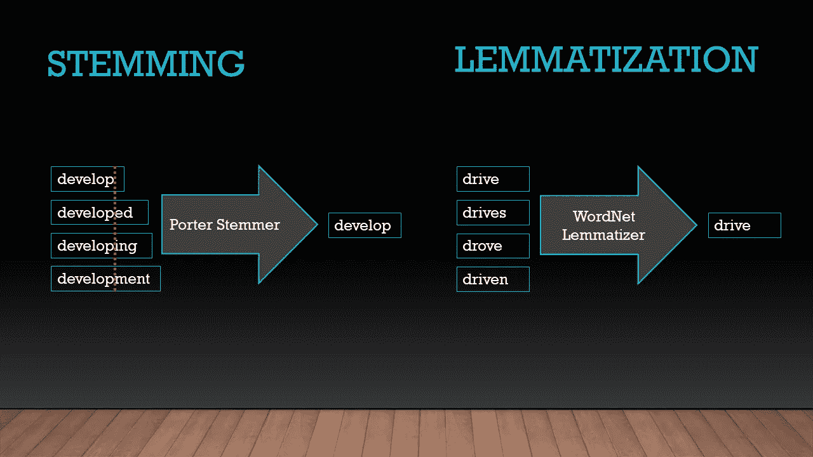

# 数据科学:NLP I

> 原文：<https://medium.com/analytics-vidhya/data-science-nlp-i-1e18f146b3ef?source=collection_archive---------11----------------------->


**1，737，185，185 —活跃网站数量**

**239，6 B —每** [**天**](http://statista.com) 发送的邮件数量

这是一个非常庞大的数据源，包含大量待分析的原始文本，足以证明自然语言处理在当今科技世界中的重要性…

欢迎来到自然语言处理及其应用入门，在这里我们将主要关注 Python 的 NLTK 库(自然语言工具包)以及如何使用它来分析一大堆句子。读完这篇博客后，你将能够从文本中提取一些含义，并使用提到的技术为你的机器学习模型提供输入。

**“自然语言处理** ( **NLP** )是[语言学](https://en.wikipedia.org/wiki/Linguistics)、[计算机科学](https://en.wikipedia.org/wiki/Computer_science)、[信息工程](https://en.wikipedia.org/wiki/Information_engineering_(field))、[人工智能](https://en.wikipedia.org/wiki/Artificial_intelligence)的一个子领域，涉及计算机与人类(自然)语言之间的互动，特别是如何给计算机编程，以处理和分析大量的[自然语言](https://en.wikipedia.org/wiki/Natural_language)数据”——维基百科说。例如，NLP 可以用于语音识别、文本摘要、问题回答，甚至可以用于预测打字，这已经在我们的智能手机中应用，每当我们开始在键盘上键入一些东西时。Cortana 和 Siri 等语音识别软件，或者 Gmail 收件箱中的垃圾邮件检测，都是 NLP 已经在捕捉我们生活的其他例子。了解 NLP 技术是有利的，因为前述领域预计也是 2020 年的技术行业趋势之一。现在让我们用 Python 来研究 NLP 吧！

# 一、Python 和自然语言处理简介

我不会给出太多关于 Python 本身的信息，但是，如果你没有它，你可以去 python.org 下载并安装它的最新版本。安装完成后，您将需要下载一些库，如 Numpy、用于科学计算或访问文件的 Pandas，以及用于进行自然语言处理技术的 NLTK 库，我们在这里将主要关注这些库。

```
pip install nltk
```

它可以包含在使用 import NLTK 的常用方法中，但是，应该下载其中的语料库和包。

```
import nltk
nltk.download()
```

# 二。标记化

在很多情况下，运用“分而治之”的方法确实是我们解决问题的一种方式，对句子的分析也是如此。为了分析文本，我们将文本串分成更小的组成部分，即句子——句子标记化(也称为句子分割)，然后，我们再次将句子分成单词(也称为单词标记化)。基本上，每当我们遇到句号(split())时，首先想到的就是关于将文本拆分成句子。然而，在确定句子边界时，一些例外情况(经常使用)忽略了规则并困扰着我们，例如句号字符用作缩写标记(即等等。公元前)。因此，在许多情况下，建议使用库及其函数来完成句子和单词的分割任务。

```
nltk.sent_tokenize 
nltk.word_tokenize
```

简单地说，从名字中可以明显看出谁做了什么…让我们看看维基百科关于阿塞拜疆的文章中的一个例子:

> 阿塞拜疆是一个[内陆](https://en.wikipedia.org/wiki/Landlocked)国家，位于[欧亚](https://en.wikipedia.org/wiki/Eurasia)的[南高加索](https://en.wikipedia.org/wiki/Transcaucasia)地区，处于[东欧](https://en.wikipedia.org/wiki/Eastern_Europe)和[西亚](https://en.wikipedia.org/wiki/Western_Asia)的十字路口。它东临里海，北接俄罗斯，西北接格鲁吉亚，西接亚美尼亚，南接伊朗。

```
import  nltktext = "Azerbaijan is a landlocked country in the South Caucasus region of Eurasia at the crossroads of Eastern Europe and Western Asia. It is bounded by the Caspian Sea to the east, Russia to the north, Georgia to the northwest, Armenia to the west and Iran to the south."sentences  = nltk.sent_tokenize(text)
for sentence in sentences:
    print (sentence, "\n")
```

将文本中的两个组件—句子视为**输出**:

```
Azerbaijan is a landlocked country in the South Caucasus region of Eurasia at the crossroads of Eastern Europe and Western Asia.It is bounded by the Caspian Sea to the east, Russia to the north, Georgia to the northwest, Armenia to the west and Iran to the s
outh.
```

当谈到单词标记化在同一个例子中的应用时:

```
import  nltktext = "Azerbaijan is a landlocked country in the South Caucasus region of Eurasia at the crossroads of Eastern Europe and Western Asia. It is bounded by the Caspian Sea to the east, Russia to the north, Georgia to the northwest, Armenia to the west and Iran to the south."sentences  = nltk.sent_tokenize(text)
for sentence in sentences:
    print(nltk.word_tokenize(sentence), "\n")
```

作为一个**输出**，每个单词和标点符号都作为句子的一个不同部分被分开。

```
['Azerbaijan', 'is', 'a', 'landlocked', 'country', 'in', 'the', 'South', 'Caucasus', 'region', 'of', 'Eurasia', 'at', 'the', 'cros
sroads', 'of', 'Eastern', 'Europe', 'and', 'Western', 'Asia', '.']['It', 'is', 'bounded', 'by', 'the', 'Caspian', 'Sea', 'to', 'the', 'east', ',', 'Russia', 'to', 'the', 'north', ',', 'Georgia', '
to', 'the', 'northwest', ',', 'Armenia', 'to', 'the', 'west', 'and', 'Iran', 'to', 'the', 'south', '.']
```

# 三。用 NLTK 和 Spacy 进行词性标注

NLTK 是一个很棒的工具，它有大量的功能，这使得它可以为高级 NLP 项目铺平道路。词性标注是文本分析中的一个重要步骤，我们知道句子结构和哪个单词与另一个单词相连，哪个单词源于哪个单词，最终找出单词之间的隐藏联系，这可以在以后提高我们的机器学习模型的性能。所有这些都通过 NLTK 和 Spacy 库得到缓解，它们都带有内置的 ML 算法，可以根据它们之前保存的数据库和句子中围绕**目标** **单词**的单词来识别 POS 标签。

具体说一下 NLTK pos 标签函数，有一个特定的标签列表，在句子被记号化成单词后会被识别。

*   CC 并列连词
*   CD 基数
*   DT 限定词
*   EX 存在性 there(比如:“存在”…想象成“存在”)
*   FW 外来词
*   在介词/从属连词中
*   JJ 形容词‘大’
*   JJR 形容词，比较级“更大”
*   JJS 形容词，最高级“最大的”
*   LS 列表标记 1)
*   MD modal 可能会
*   名词，单数‘书桌’
*   NNS 名词复数‘书桌’
*   NNP 专有名词，单数‘哈里森’
*   NNPS 专有名词，复数“美国人”
*   PDT 预先确定“所有孩子”
*   词尾所有格父母的
*   PRP 人称代词我，他，她
*   PRP$所有格代词我的，他的，她的
*   非常安静地，
*   RBR 副词，比较级更好
*   RBS 副词，最高级 best
*   RP 粒子放弃
*   去，去商店。
*   呃感叹词
*   VB 动词，基本形式 take
*   VBD 动词，过去式，take
*   动词，动名词/现在分词
*   VBN 动词，过去分词 taken
*   VBP 动词，唱。当前，非 3d 拍摄
*   VBZ 动词，第三人称演唱。当前拍摄
*   WDT 疑问词 which
*   代词谁，什么
*   WP$所有格 wh-代词谁的
*   wh-副词 where，when

让我们看一个具体的例子来更好地理解这个列表及其应用:

```
def pos_tagging(s):
    s = re.sub(r'[^a-zA-Z0-9\s]', ' ', s)
    words = nltk.word_tokenize(s)
    return nltk.pos_tag(words)
```

在这个函数中，我们首先使用 [regex](https://docs.python.org/3/library/re.html) 删除带有空格的字母数字函数(如果你不太了解 Python 中的 regex，请查看链接中的文档)，然后句子被标记为单词。然后，这些函数使用“ *nltk.pos_tag* ”函数返回每个单词的 POS 标签。

```
print(pos_tagging(“Can you buy me a Turkish tea?”))
```

知道哪个特定标签属于哪个单词是很重要的，因为它在不同的上下文中是可变的。如在这个例子中，“Can”根据用法可以有几种含义；作为动词和名词的模型。

下面的输出显示每个单词旁边都有不同的标签，be、情态动词“MD”、人称代词“PRP”、动词“VB”、限定词“DT”、形容词“JJ”和名词“NN”:

```
[('Can', 'MD'), ('you', 'PRP'), ('buy', 'VB'), ('me', 'PRP'), ('a', 'DT'), ('Turkish', 'JJ'), ('tea', 'NN')]
```

在我看来，空间在这个问题上的一个简单应用在这里不应该被忽略。对于 spacy 的实现，我们应该首先在命令行中安装它，然后安装我们将在 POS 标记中使用的 en_core_web_sm spaCy English 模型。

```
sp = spacy.load('en_core_web_sm')
sentence = sp("I like to play football.I hated it in my childhood though")
print(sentence.text)
```

首先，导入英语模型并保存我们的句子，然后将其作为*句子打印到屏幕上。说到这个算法的应用:*

```
import spacy
def pos_tagging_s():
    sp = spacy.load('en_core_web_sm')
    sen = sp("I like to play football. I hated it in my childhood though")
    print(sen.text)
    print(sen[1].pos_)
    print(sen[1].tag_)
    print(spacy.explain(sen[1].tag_))
    for word in sen:
        print("Word:", word.text, "\t","POS Tag:", word.pos_,"\t", "Tag for Word:", word.tag_,"Explanatation:", spacy.explain(word.tag_), "\n")
```

在我们看到 pos_tagging_s 函数的 **return** 中带有 word.text 的句子的文本后，我们跳转到 word.pos_ function，它输出每个单词的词性标签。接下来是 word.tag_ function，它返回标记的缩写形式，并使用 spacy.explain(word.tag_)函数输出它的解释，其中给出了对前面编写的 word tag 的更多解释。

上面代码的输出，例如，“我”有一个 PRON 的标签，它的标签词是“PRP”，这个缩写的解释是，“它是人称代词”:

```
Word: I          POS Tag: PRON   Tag for Word: PRP       Explanatation: pronoun, personalWord: like       POS Tag: VERB   Tag for Word: VBP       Explanatation: verb, non-3rd person singular presentWord: to         POS Tag: PART   Tag for Word: TO        Explanatation: infinitival "to"Word: play       POS Tag: VERB   Tag for Word: VB        Explanatation: verb, base formWord: football   POS Tag: NOUN   Tag for Word: NN        Explanatation: noun, singular or massWord: .          POS Tag: PUNCT          Tag for Word: .         Explanatation: punctuation mark, sentence closerWord: I          POS Tag: PRON   Tag for Word: PRP       Explanatation: pronoun, personalWord: hated      POS Tag: VERB   Tag for Word: VBD       Explanatation: verb, past tenseWord: it         POS Tag: PRON   Tag for Word: PRP       Explanatation: pronoun, personalWord: in         POS Tag: ADP    Tag for Word: IN        Explanatation: conjunction, subordinating or prepositionWord: my         POS Tag: DET    Tag for Word: PRP$      Explanatation: pronoun, possessiveWord: childhood          POS Tag: NOUN   Tag for Word: NN        Explanatation: noun, singular or massWord: though     POS Tag: SCONJ          Tag for Word: IN        Explanatation: conjunction, subordinating or preposition
```

# 四。词干化和词汇化



**词干**和**之间的**差异**词汇化**示例(NLP)

词干是一个将单词缩减到其核心词根的概念。特别是，在分析文本中的词频的情况下，这种方法可以真正地工作。基本上，以“ed”或“ing”结尾的单词，例如，将被驱动回到它们的主词根。"词干" = > "词干"

```
import  nltk
from nltk.stem import PorterStemmer
ps = PorterStemmer()
print(ps.stem("stemming"))
#output of the code will be **stem**
```

这当然也适用于被分成单词的句子:

```
sentence = "It is good to be a pythoner who is pythonly pythoning with python"
words = nltk.word_tokenize(sentence)
for word in sentence:
    ps = PorterStemmer()
    print(ps.stem(word))
```

它将输出:

```
It
is
good
to
be
a
python
who
is
pythonli
python
with
python
```

显然，有时一些错误是真实的，如词干过多和词干过少。因此，在不同的句子中，PorterStemmer 和 WortNetLemmatizer 可能不是最好的用法。

再来看**词汇化**，在这里，我们再次将单词驱动到它们的根，然而，应该被驱动的单词在内部被修改，而不是像在词干部分那样，单词只在它们的**结尾**添加了音节，而不是在中的**。在词汇化的同时，我们还应该提到词性标签，这样算法就可以根据 *WordNet* (英语的词汇数据库)知道它连接到了哪个单词。它保存了名词、动词、形容词和副词，它们被分组为认知同义词集(synsets)，每个同义词集表达一个不同的概念。**

```
from nltk.stem import WordNetLemmatizer
lemmatizer = WordNetLemmatizer()# For single word
print(lemmatizer.lemmatize("good", pos='v'))
print(lemmatizer.lemmatize("better", pos='a'))
print(lemmatizer.lemmatize('drive,pos='v'))
print(lemmatizer.lemmatize('drives',pos='v'))
print(lemmatizer.lemmatize('drove',pos='v'))
print(lemmatizer.lemmatize('driven',pos='v'))
```

输出是:

```
good
good
drive
drove
driven
```

# 动词 （verb 的缩写）停用字词(移除)

当我们说话时，我们会使用大量的停用词——也就是我们字面上所说的“停止”。如果你不是在做高级的 NLP，这些单词大部分是没用的，因为即使是一个字母对你的模型也很重要。想想像“一个”、“一个”、“这个”这样的词，甚至像“嗯”这样的停用词，即使是最熟练的演讲者也经常使用。让我们看看存储在 nltk.corpus 包中的停用词列表:

```
from nltk.corpus import stopwords
print(stopwords.words(“english”))
```

nltk.corpus 包中的停用词列表:

```
[‘i’, ‘me’, ‘my’, ‘myself’, ‘we’, ‘our’, ‘ours’, ‘ourselves’, ‘you’, “you’re”, “you’ve”, “you’ll”, “you’d”, ‘your’, ‘yours’, ‘yourself’, ‘yourselves’, ‘he’, ‘him’, ‘his’, ‘himself’, ‘she’, “she’s”, ‘her’, ‘hers’, ‘herself’, ‘it’, “it’s”, ‘its’, ‘itself’, ‘they’, ‘them’, ‘their’, ‘theirs’, ‘themselves’, ‘what’, ‘which’, ‘who’, ‘whom’, ‘this’, ‘that’, “that’ll”, ‘these’, ‘those’, ‘am’, ‘is’, ‘are’, ‘was’, ‘were’, ‘be’, ‘been’, ‘being’, ‘have’, ‘has’, ‘had’, ‘having’, ‘do’, ‘does’, ‘did’, ‘doing’, ‘a’, ‘an’, ‘the’, ‘and’, ‘but’, ‘if’, ‘or’, ‘because’, ‘as’, ‘until’, ‘while’, ‘of’, ‘at’, ‘by’, ‘for’, ‘with’, ‘about’, ‘against’, ‘between’, ‘into’, ‘through’, ‘during’, ‘before’, ‘after’, ‘above’, ‘below’, ‘to’, ‘from’, ‘up’, ‘down’, ‘in’, ‘out’, ‘on’, ‘off’, ‘over’, ‘under’, ‘again’, ‘further’, ‘then’, ‘once’, ‘here’, ‘there’, ‘when’, ‘where’, ‘why’, ‘how’, ‘all’, ‘any’, ‘both’, ‘each’, ‘few’, ‘more’, ‘most’, ‘other’, ‘some’, ‘such’, ‘no’, ‘nor’, ‘not’, ‘only’, ‘own’, ‘same’, ‘so’, ‘than’, ‘too’, ‘very’, ‘s’, ‘t’, ‘can’, ‘will’, ‘just’, ‘don’, “don’t”, ‘should’, “should’ve”, ‘now’, ‘d’, ‘ll’, ‘m’, ‘o’, ‘re’, ‘ve’, ‘y’, ‘ain’, ‘aren’, “aren’t”, ‘couldn’, “couldn’t”, ‘didn’, “didn’t”, ‘doesn’, “doesn’t”, ‘hadn’, “hadn’t”, ‘hasn’, “hasn’t”, ‘haven’, “haven’t”, ‘isn’, “isn’t”, ‘ma’, ‘mightn’, “mightn’t”, ‘mustn’, “mustn’t”, ‘needn’, “needn’t”, ‘shan’, “shan’t”, ‘shouldn’, “shouldn’t”, ‘wasn’, “wasn’t”, ‘weren’, “weren’t”, ‘won’, “won’t”, ‘wouldn’, “wouldn’t”]
```

现在，既然我们确定了这些单词的“重要性”,我们可以把它们从课文和句子的单词列表中去掉:

```
import  nltk
from nltk.corpus import stopwordstxt = "It is good to be a pythoner who is pythonly pythoning with python"
words = nltk.word_tokenize(txt)
stop_words = set(stopwords.words("english"))filtered_txt = [word for word in words if not word in stop_words]
print(filtered_txt)
```

它将通过省略诸如“是”、“到”、“是”、“一个”、“具有”这样的词来输出这个:

```
['It', 'good', 'pythoner', 'pythonly', 'pythoning', 'python']
```

# 不及物动词 N-Grams

N 元语法是“来自给定文本或语音的[样本](https://en.wikipedia.org/wiki/Sample_(statistics))的 *n* 项的连续序列。根据应用可以是[音素](https://en.wikipedia.org/wiki/Phoneme)、[音节](https://en.wikipedia.org/wiki/Syllable)、[字母](https://en.wikipedia.org/wiki/Letter_(alphabet))、[单词](https://en.wikipedia.org/wiki/Word)或[碱基对](https://en.wikipedia.org/wiki/Base_pairs)。*n*grams 通常从[文本](https://en.wikipedia.org/wiki/Text_corpus)或[语音语料库](https://en.wikipedia.org/wiki/Speech_corpus)中收集。维基百科说。基本上，这些单词组合在一起表达一个“更好”的意思。根据这些组合的数量，n-gram 有不同的叫法，其中当 n=1 时，它们是 unigrams。同样，n=2 是二元模型，当 n=3 时，我们称之为三元模型。

```
San Francisco (is a 2-gram)The Three Musketeers (is a 3-gram)Elvin stood up slowly (is a 4-gram)
```

为了查看 n 元语法的应用，让我们来看一个关于 NLP 的句子，并从中生成 n 元语法(我将 n=3，但是，您仍然可以使用函数中的参数)

```
def generate_ngrams(s, n):
    s = s.lower()
    s = re.sub(r'[^a-zA-Z0-9\s]', ' ', s)
    words = nltk.word_tokenize(s)
    # The zip function to generate n-grams
    ngrams = zip(*[words[i:] for i in range(n)])
    #Return concatted words in ngrams  
    return [" ".join(ngram) for ngram in ngrams]
```

首先，我们在输入中将文本作为一个字符串，并输入数字来标识 n-gram 的类型。然后，将所有字符串转换为小写，并提取带有空格的字母数字值。随后，我们将句子标记成单词，以对 n 元语法使用 zip 函数。

```
s = """Natural-language processing (NLP) is an area of computer science and artificial intelligence concerned with the interactions
between computers and human (natural) languages"""print(generate_ngrams(s, n=3))
```

具有上述输入值的该函数的输出为:

```
['natural language processing', 'language processing nlp', 'processing nlp is', 'nlp is an', 'is an area', 'an area of', 'area of computer', 'of computer science', 'computer science and', 'science and artificial', 'and artificial intelligence', 'artificial intelligence concerned', 'intelligence concerned with', 'concerned with the', 'with the interactions', 'the interactions between', 'i
nteractions between computers', 'between computers and', 'computers and human', 'and human natural', 'human natural languages']
```

# 七。刮痧(美丽的汤 4)

正如我们在本文前面提到的，互联网充斥着大数据，并且以令人难以置信的速度变得越来越大。这些内容大部分是由新闻门户、文章和类似维基的博客等网站提供的。“窃取”这些网站的内容，如果你需要一些文本来分析，这是一个最著名和最简单的选择。BeautifulSoup 库是最常用的工具之一，通过其内置的功能来抓取任何网站。要安装 BS4，请在 cmd 中键入以下命令。但是，我们还需要安装 lxml 库来解析 HTML 和 xml 文件，然后在 HTML 或 XML 的标签之间抓取文本:

```
pip install beautifulsoup4
pip install lxml
```

现在，让我们从《纽约时报》([nytimes.com](https://www.nytimes.com/2018/08/13/us/politics/peter-strzok-fired-fbi.html?hp&action=click&pgtype=Homepage&clickSource=story-heading&module=first-column-region&region=top-news&WT.nav=top-news))上随机抓取一篇文章:

```
from bs4 import BeautifulSoup
import requests
import reurl = "[https://www.nytimes.com/2018/08/13/us/politics/peter-strzok-fired-fbi.html?hp&action=click&pgtype=Homepage&clickSource=story-heading&module=first-column-region&region=top-news&WT.nav=top-news](https://www.nytimes.com/2018/08/13/us/politics/peter-strzok-fired-fbi.html?hp&action=click&pgtype=Homepage&clickSource=story-heading&module=first-column-region&region=top-news&WT.nav=top-news)"
res = requests.get(url)
html = res.content
soup = BeautifulSoup(html, 'html5lib')
entered_attr = input("enter attribute:")
t = soup.findAll("p",attrs={"class": "css-exrw3m evys1bk0"})
all_text = ""
for te in t:
    all_text += te.textprint(all_text)
```

这里，我们将请求发送到给定的 URL，以抓取保存在上面代码所示的“html”变量中的网站内容。下面， *findAll* 函数用它的 All 标签抓取网站的所有内容。但是，作为参数，我们输入了“ *p* ，这意味着将检索所有段落，然后，由于执行了函数“ *findAll* ，将输出所有 *p-* 值(段落)文本。为了根据属性过滤它，我们可以添加另一个参数，即“attrs”，它接受类*的属性值(假设您有一些关于 HTML 标签的信息并检查了浏览器的功能)。*由于函数返回的不是一段，而是几段，最后我们在 all_text 中汇总全部，最终打印出来。

```
WASHINGTON — Peter Strzok, the F.B.I. senior counterintelligence agent who disparaged President Trump in inflammatory text messages and helped oversee the Hillary Clinton email and Russia investigations has been fired for violating bureau policies, Mr. Strzok’s lawyer said Monday….
```

> 由于该主题足够宽泛，可以一次输入全部内容，因此我将在这里总结一下*NLP 第一部分* *的介绍，*我们提到的关于
> **NLP 的简要介绍，标记化，使用 NLTK 和 Spacy 的词性标记，词干化和词条化，停用词及其移除，N-Grams 和使用 BS4 的网站抓取。**
> 
> **NLP 第 2 部分**将讲述关于 NLP 的更高级的概念，其中我们将构建 ML 模型来分析搜集的数据，对文本进行**情感分析，**谈论 **Sklearn 和**构建**朴素贝叶斯分类器，**进行**文本分类，文本矢量化:单词包和 TF-IDF，文本摘要**等等。

*感谢* ***您的*** *时间看完(如果您还在进行这个长的:)。如果有任何遗漏或错误，我随时欢迎建设性的批评。干杯！</>/*

**Elvin Aghammadzada
巴库工程大学计算机系学生**