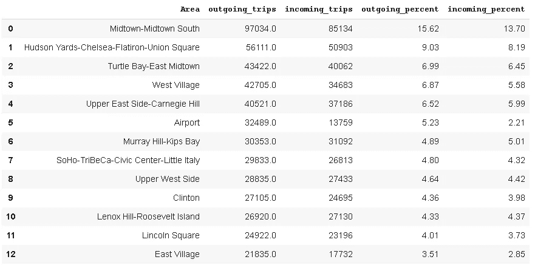

# 纽约市出租车乘坐的探索性数据分析。

> 原文：<https://medium.com/analytics-vidhya/data-science-of-new-york-city-taxi-ride-data-b55a4f9145de?source=collection_archive---------12----------------------->

本文的目的是基于人的感知来理解出租车乘坐。这将有助于非技术人员(操作经理)轻松理解探索性分析。我们把这篇文章分成两节。第一部分是将游乐设备的技术读数转化为人的感知。第二部分将纯粹探索隐藏在数据点中的知识。


# 第 1 部分:人类理解的数据操作。

嗨，朋友，

我们观察到，纽约市非常喜欢乘坐出租车。我们需要理解原始数据点来获取信息，以便机器可以预测乘坐时间。本文为理解地理数据提供了一个额外的例子。这种方法不是玩弄经纬度点和日期时间值；我们更喜欢用一种更聪明的方式将这些价值聚合到人类智慧的深度。作为一个人，首先，我们需要知道出租车将在哪个地区接送乘客，其次，我们需要知道乘客将在一天中的哪个时间段上车。这种方法使得数据准备步骤变得复杂，但是模型将会得到巧妙的训练。

**实施以下策略:**

1.  安装所需的库。
2.  获取所需的数据集；主要是出租车乘车记录和纽约市 NTA 记录。
3.  NTA 记录中定义的区域的标签整数。
4.  将纬度和经度点列转换为 NTA 记录中定义的区域名称列。
5.  将日期-时间列转换为月、工作日和日时段列。
6.  参考文献。

# 1.安装所需的库。

```
!pip install geopandas
!pip install tqdm==4.36.0
!pip install pandas
!pip install Shapely
```

首先，我们看到的数据，然后决定我们可以做些什么来最好地了解纽约市的交通。

# **2。获取所需的数据集；主要是出租车乘车记录和纽约市 NTA 记录。**

**出租车乘车记录。**


该数据给出了经度、纬度和两点之间的旅行持续时间。

我的观点是这会产生大量的行集合。如果我们将该区域视为一个旅行点并获得旅行持续时间的平均值，而不是一个精确的点，那么我们可以抽取行，我们将只需要面对 5 分钟的容差。我在网上找到了纽约市附近的多多边形区域[1]

纽约市 NTA 记录。

**3。NTA 记录中定义的区域的标签整数。**

标记整数有助于模型将数字与两个区域之间的距离联系起来。

现在，根据上述边界区域质心的纬度和经度值，我们将从左下到右上顺序分配一个序列号。

# 4.将纬度和经度点列转换为 NTA 记录中定义的区域名称列。


我们的目标是操作原始数据结构，以便最终修订的模型训练将具有以下列

1.挑选月份，

2.挑日，

3.挑选插槽

4.选取区域

5.拖放区域

6.行程 _(分钟)

**在 geopandas 库的帮助下，遵循以下步骤:**

1.首先，获得纽约市区域的多重多边形几何图形。

2.获取拾取的点几何图形(长，横)

3.获取下降点的几何图形(经度，纬度)

4.进行空间连接以获取城市区域，并根据行程 id 进行接送。

获取单独的数据帧，该数据帧包含纬度和经度，id 为，以转换为几何点。


下面是纽约城市地理。边境行政区。


邻近列表区(纽约市)

# 5.将日期-时间列转换为月、工作日和日时段列。

# 让我们完成数据框以进行 EDA:

基于“id”将数据框“FrameDayMonth”与“tripAreaDiff”连接起来。


朋友，我还没有完成纽约市出租车乘坐数据科学的工作。让我们从第二部分开始。

# 第二部分:纽约市出租车乘车数据的探索性数据分析


你好，朋友，我希望你已经理解了之前的第一部分，它通过人工智能进行数据操作来读取出租车乘车记录。现在，在本文中，我们将使用海生库来探索这些数据。在这里，我将从被操纵的数据帧开始，并且将从不同的角度看到该帧。在这种情况下，我们还将看到 700 万条记录数据如何巧妙地减少到 1.5 lac 行，而不会丢失重要信息。

# 必需的库:

```
import seaborn as sns
import matplotlib.pyplot as plt
import pandas as pd
import numpy as np
```

让我们看看被操纵的框架。下面的数据框架只是时间和空间信息到人类感知模式的转换。


让我们在不失去本质的情况下减少数据量

# 问题 1:有多少独特的旅行？

数据中存在 6410 次不同的旅行。

(6410, 3)

# 对于纽约市，“行程分钟”列的值超过 200 都是异常值。

用 NaN 替换异常值，然后用分组记录的平均值替换 NaN 值。

1.  我们发现 894 个条目的 trip 值超过 200。
2.  基本上，它们都是异常值，因此将它们转换为 NaN 值。
3.  按照所有列的升序对数据框进行排序。
4.  现在，使用“ffill”方法用以前的记录填充这些值，这对于给定的缺失行程分钟更有可能发生。


# 问题 2:一个区内进出的乘车次数是多少？



# 观察结果:

1.  西村对外出游乐设施的等级为 5，而对进入游乐设施的等级为 4。
2.  该机场的出境等级为 6，入境等级为 16。

# 流量:

而不是携带不同行程分钟的重复行。这是一个聪明的方法，它可以为重复的已定义要素行合计行程分钟数，并将最近的一列作为有效行数的“交通”。


根据下表所示的行程分钟记录得出行程长度。


# 世纪之旅:

我们可以说，在下面提到的时间段内，从市中心南部到 Hudson Yards-Chelsea-flat iron-Union Square 有超过 100 次旅行。


# 工作日的行程长度分布是怎样的？


# 上图显示:

1.  短距离、短距离、长距离和长距离旅行在所有的日子里都是降序排列的。
2.  周日，出行时段更加明显。
3.  周四，短途旅行和短途旅行大致相等。

如果我们交换 X 和 Y 的值。


# 从上图可以看出:

1.  周日，较长和较长的行程是低频率的，较短的行程是高频率的。

通过这种方式，我们可以观察上图的下表。


# 相对于出行规模的交通量。

1.  跨越世纪的短途旅行。在下图中，短途旅行只显示了超过一个世纪的记录。


# 所有工作日一天时段的流量。


# 观察。

1.  在所有的日子里，上午时段的交通流量为零。
2.  对于深夜时段，周日和周六的客流量最大。
3.  对于夜间时段，周一，周二，周三，周四，Fri 日显示最高的流量。
4.  对于清晨，周日的交通流量最低。
5.  对于深夜，周一和周二的交通流量最低。
6.  中午，星期三和星期二的交通流量最低。
7.  晚上，周一和周三的交通流量最低。
8.  就夜晚而言，周日的交通流量最低。

# 如果我们在一个函数调用中需要一个模型就绪的数据帧，请参考下面的代码。

# **参考文献**:

[1][https://data . cityofnewyork . us/City-Government/Neighborhood-制表-地区-NTA-/cpf4-rkhq](https://data.cityofnewyork.us/City-Government/Neighborhood-Tabulation-Areas-NTA-/cpf4-rkhq)

[2][https://GIS . stack exchange . com/questions/174159/convert-a-pandas-data frame 转 a-geodataframe](https://gis.stackexchange.com/questions/174159/convert-a-pandas-dataframe-to-a-geodataframe)

[3][https://geopandas.readthedocs.io/en/latest/mergingdata.html](https://geopandas.readthedocs.io/en/latest/mergingdata.html)

[4][https://GIS . stack exchange . com/questions/174159/convert-a-pandas-data frame 转 a-geodataframe](https://gis.stackexchange.com/questions/174159/convert-a-pandas-dataframe-to-a-geodataframe)

[5][https://geo pandas . readthedocs . io/en/latest/gallery/create _ geo pandas _ from _ pandas . html](https://geopandas.readthedocs.io/en/latest/gallery/create_geopandas_from_pandas.html)