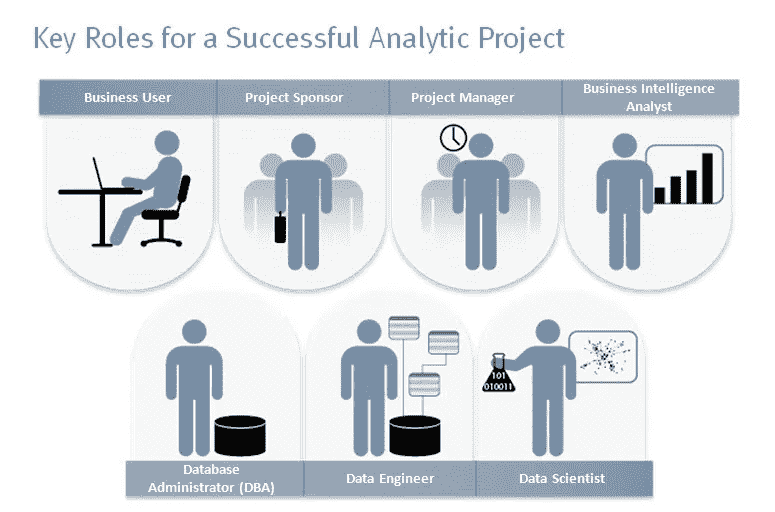
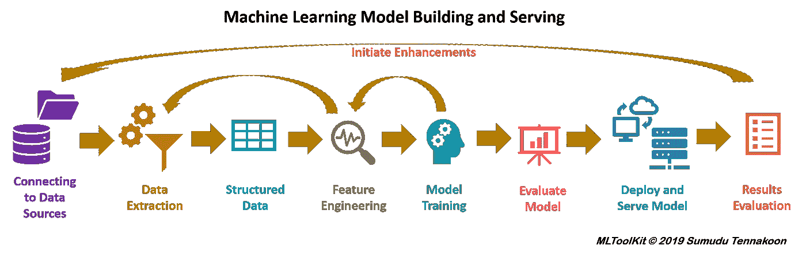
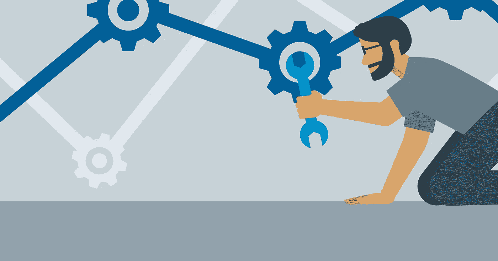

# 数据科学项目生命周期入门

> 原文：<https://medium.com/analytics-vidhya/data-science-project-lifecycle-a-primer-f4bf5f79eef8?source=collection_archive---------16----------------------->

数据科学项目正在退出，因为它涉及教计算机(模型)解决商业问题。然而，直接构建这些模型并不能达到预期的效果。数据科学项目有多个阶段，每个阶段涉及多个步骤，它们是迭代的，以获得更好的结果。

image:[https://docs . Microsoft . com/en-us/azure/machine-learning/team-data-science-process/life cycle](https://docs.microsoft.com/en-us/azure/machine-learning/team-data-science-process/lifecycle)

让我们试着理解阶段:

**1。业务理解:**这是项目的业务阶段。涉众决定项目目标和范围。领域专家、业务分析师、数据工程师、数据科学家和 BI 专家都对项目目标达成共识。审查阶段、截止日期和验收标准是共同商定的，并记录在案。

**2。数据获取&理解:**我们从不同的来源收集数据，并尝试理解变量的含义、与业务问题的关系以及相互之间的关系。也称为探索性数据分析。在这里，我们可以从数据源和机器学习环境构建管道。

从不同来源收集数据

**3。特征工程:**在这一阶段我们要让数据适合建筑模型。

**4。模型构建:**这是我们构建统计或机器学习模型的阶段，这将有助于企业做出决策。

**5。模型部署:**我们将最好的模型部署到生产中，这样就可以用它来对新数据做出决策。

图片来源:[https://pypi.org/project/pymltoolkit/](https://pypi.org/project/pymltoolkit/)

让我们看看每个阶段通常会发生什么

**1。业务理解:**理解可以避免或改进的领域和业务问题，以便为业务带来更好的结果。这涉及多个利益相关者，如领域专家、业务分析师、数据工程师、数据科学家和软件工程师。每个人在项目的每个阶段都有定义需求和贡献的重要角色。

**2。数据采集&了解:**这是数据科学工作的开始。在这一步中，我们从不同的来源收集所有可用的数据，并开始分析这些数据。

这是数据科学项目生命周期中最长也是最重要的阶段。这涉及多个步骤。

***a)数据收集-*** 我们从数据库中收集数据，了解变量，根据业务问题定义预测器、目标变量。

***b)探索性数据分析-*** 对收集到的数据进行分析，进行描述性和推断性分析，生成洞察。以下是探索性数据分析的一部分。

> **“EDA 是产生大量见解的地方”**

**数据清理:**必须清理数据，以避免丢失值和异常值，因为这些会扭曲数据并降低模型的统计能力。

***缺失值插补:*** 我们需要避免数据中的缺失值，可以通过为连续数据类型输入均值、中值和分类数据类型输入插补模式的缺失字段来解决。

***异常值处理:*** 异常值需要被识别和处理，以避免数据中的偏斜。异常值可以通过箱线图和散点图直观地识别出来。异常值可以通过使用百分位数、使用四分位数间距(IQR)和使用 Z 分数、三标准偏差进行识别和统计处理。

***单变量分析:*** 一次分析一个变量。这是通过绘制基于数据类型的基本条形图、直方图、饼图、箱线图、计数、计数百分比等来完成的

***双变量和多变量* :** 两个或多个变量的分析。

***连续-连续:*** 如果两个变量是连续的，则通过散点图进行分析，以了解彼此之间的关系。但是如果要建立关系的强弱，这里也可以建立相关性，1 表示正相关，-1 表示负相关，0 表示没有关系。numpy 中有建立关联的功能。

***分类-分类:*** 双向表，堆积柱形图，卡方检验。

***分类-连续:*** 我们可以绘制箱线图，并通过执行 Z-检验/T-检验和 ANOVA 建立统计显著性

**3。特征工程:**这是一个步骤，我们创建新的值或特征并添加到我们的数据集，以提高模型数据的可读性/可理解性/可理解性。

特征工程是机器学习模型性能的关键步骤

***特征缩放:*** 这是影响模型性能的一个步骤。并非所有算法都需要缩放。基于距离的算法，如果使用梯度下降来达到全局极小点，则需要缩放。例如:KNN，均值，线性和神经网络。不需要缩放的模型是基于树的 bagging 和 boosting 算法。

有两种方法可以做到这一点。规范化和标准化。每个人都有自己的目的。

***归一化:*** 也叫极小极大归一化。这种技术在 0 和 1 之间缩放特征的值。Sklearn 库有一个函数叫做‘最小-最大缩放器’。

***标准化:*** 也叫 Z 分标准化。该技术将平均值视为‘0’&标准差视为‘1’进行计算，从而对特性值进行缩放。Sklearn 库有一个函数叫‘standard scaler’。

***特征编码:*** 由于机器学习模型是数学模型，不能理解分类变量，所以需要编码来解决这个问题。

有 3 种类型的分类变量。

a)二元分类变量-例如:是/否，真/假

b)名词性范畴变量:例如:事物名称

c)顺序分类变量:例如:冷、暖、热或小、中、大

对于*二进制类别*，使用二进制编码技术进行编码，将变量的两个值中的一个替换为数字 0，第二个替换为数字 1。

对于*标称类别*，使用一键编码技术进行编码，为每个值创建新的虚拟变量，如果值存在，则用 1 替换，表示变量存在，用 0 表示不存在。对变量的每个值重复这个过程。

对于*序数类别，*编码通过将数值映射到变量的特征，使用建议值顺序的标签编码来完成。

**4。模型构建:**这是迄今为止机器学习项目中最有趣、最受关注的阶段。

在这一阶段，我们使用数据上的算法来建立一个产生期望输出的模型。使用算法取决于业务问题和目标变量的数据类型。给定的业务问题本质上可以是有监督的、无监督的和强化学习，并且有多种学习算法，如回归、分类、聚类和发现关联。以上每一种学习算法都有具体的算法。

简单说一下。

请参考我的另一篇[文章](/@bharadwajvenkat/data-science-and-machine-learning-a-foreword-1a5bdc583ed7)，了解学习算法的解释，以及使用这些算法的场景和评估指标。

在对建立模型的数据使用合适的算法之后，还有一个重要的模型评估步骤。评估模型有多种方法。在业务理解或数据理解阶段，根据接受和同意的指标评估模型性能。如果模型没有产生预期的结果，我们需要回到前面的阶段，因此有术语“项目生命周期”。

**模型部署:**我们的冠军模型需要被部署，以开始为业务做出决策。

这是机器学习项目生命周期的软件工程阶段。我们可以使用多种技术和工艺，如 pickle、flask、docker 和 kubernetes、cloud。转换后的模型可以部署在云上。

*关于模型构建、模型评估和模型部署技术的详细说明，将会有另一篇文章。*

干杯！！！