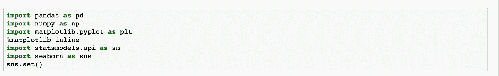
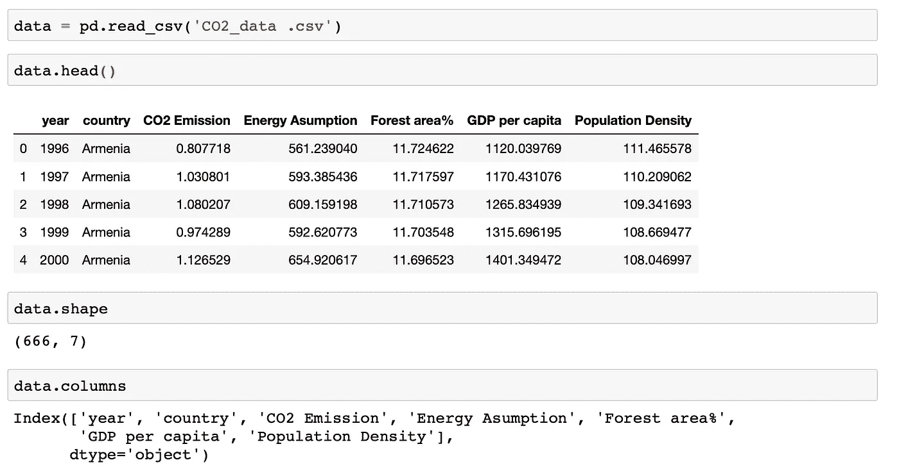
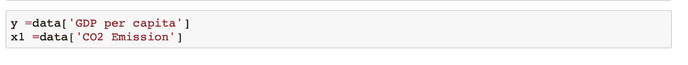
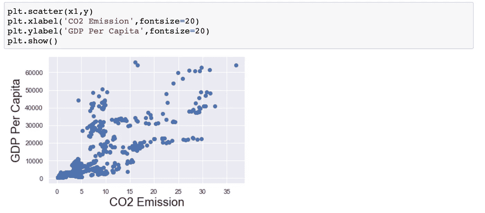
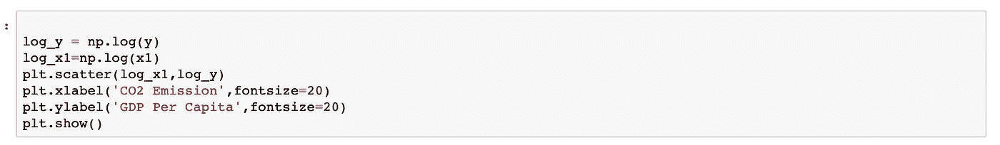
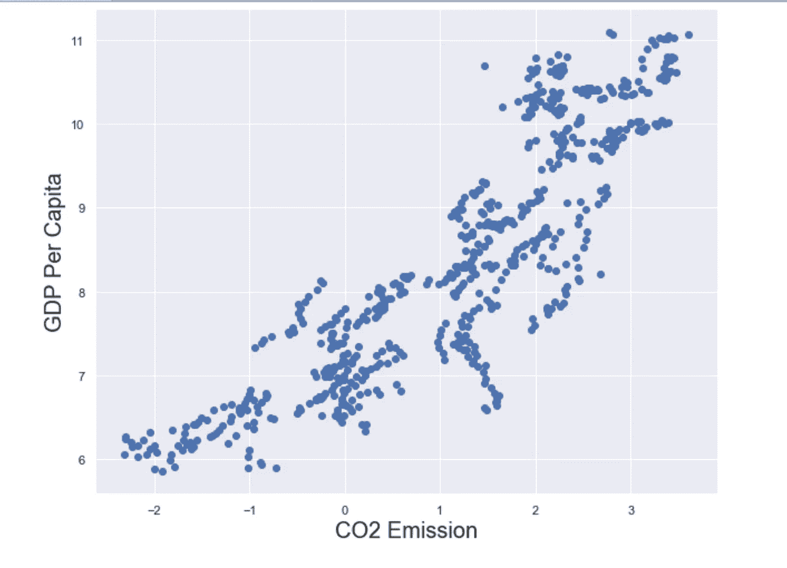
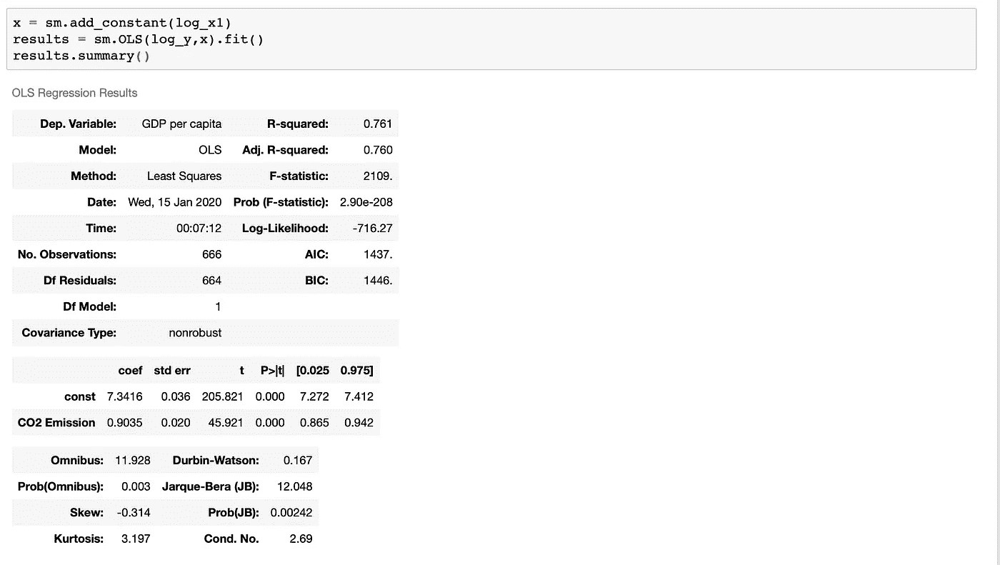
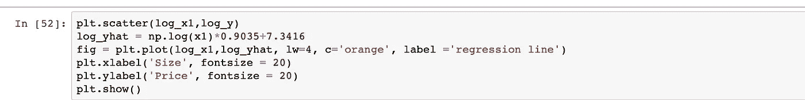
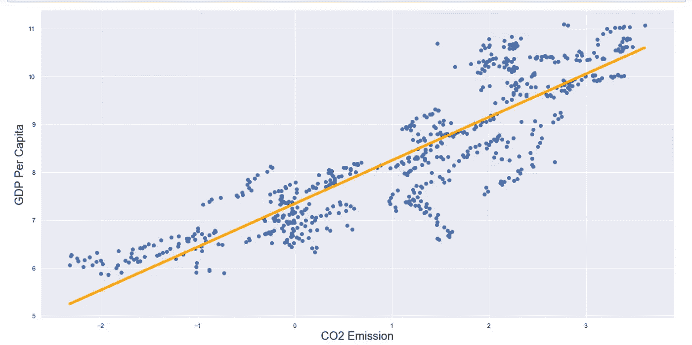

# 数据科学:使用 Python 的简单线性回归

> 原文：<https://medium.com/analytics-vidhya/data-science-simple-linear-regression-using-python-fe67000114c4?source=collection_archive---------6----------------------->

简单的线性回归是回归分析的基本部分。分析因变量(y)和自变量(x)有几个步骤。

为什么是 Python？为什么不是 R 或者 Matlab？回答:因为我爱 Python。

1 步骤:导入我们需要的库。通常对于简单的线性回归，我们需要**熊猫**、 **NumPy** 、 **matplolib** 、 **statsmodels** (或 **sklearn** )和 **seaborn** 等。**Pandan**s’提供数据结构和操作，用于操纵数值表和[时间序列](https://en.wikipedia.org/wiki/Time_series)。**Matplotlib**和**seaborn**用于数据可视化。 **Statsmodels** '(或' **sklearn'** )用于统计分析， **NumPy** 为多维数组提供对象。

2步骤:加载数据。我们需要知道我们文件的类型。最常见的文件类型有 **csv** 、 **txt** 、 **xlsx** 。我们可以使用 pandas 加载我们的数据，然后我们需要知道数据结构——我们的数据看起来像什么。我们可以使用 **your_data.head()、your_data.tail()、your_data.shape** 和 **your_data.describe()** 来很好地理解你的数据。我的数据是真实的数据，来自世界银行，这是一个开放的数据网站。

我将我的数据指定为“数据”，并使用 **pd.read_csv()** 加载我的数据，然后我使用上面的不同方法来了解我的数据结构——我们需要分析多少变量。在这里，我可以看到有 666 行和 7 列，我们还可以看到数据中的所有变量。

3 **步骤:创建我们的线性回归。**我们想知道**二氧化碳排放量**(自变量— x1)和**人均 GDP**(因变量— y)之间的关系。

首先，我们声明因变量和自变量。

第二，我们使用 matplotlib 得到一个散点图。我们之所以需要把它们画出来，是因为我们需要知道它们是否有线性关系。

根据散点图，我们可以观察到两个变量具有线性关系，但是数据并不真正满足[同方差](https://www.statisticssolutions.com/homoscedasticity/)的假设。所以我们转换我们的数据—使用 Numpy( np.log())。我们可以取两个变量的对数，再把它们画出来。下面这个新的散点图比前一个好得多。

4 **步:系数和截距。**在这一步，你可以使用 **sklearn** 或者 **statsmodels** 。这里我使用 statsmodels 并进行回归。

上表显示了我们回归的结果。第**列系数**和第**行常数**和**二氧化碳排放量**分别表示**截距**和**系数**。所以我们的模型是:

**log _ y _ hat**=**log _ x1*** 0.9035+7.3416

其中 **log_y_hat** 是人均 GDP 的预测值**。**

5 **步骤:绘制我们的数据，预测数据。**

*   最后一步很简单，但请记住用转换后的数据(log_y 和 log_x1)绘图。
*   这些都是简单线性回归的步骤。您还可以使用不同的方法或库来操作数据。如果您的数据是数值数据，但却是分类数据，那么您可能需要使用不同的方法(如虚拟变量)。在我的下一篇博客中，我将讨论带有虚拟变量的多元线性回归。

下面是我做的简单线性回归教程: