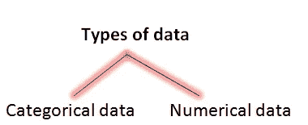
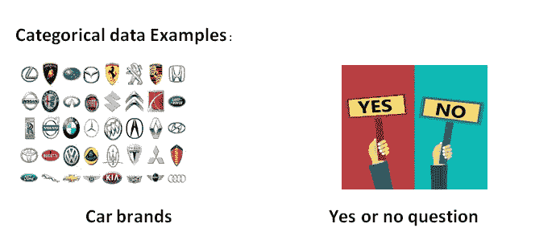
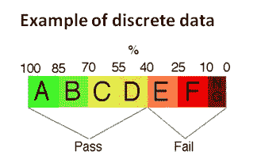
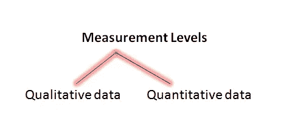
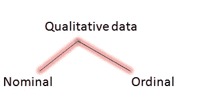
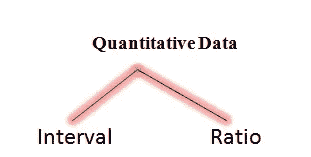
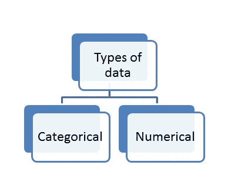
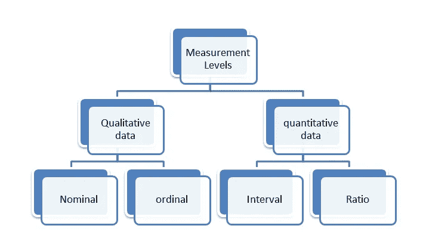

# 数据科学-统计分析(一)

> 原文：<https://medium.com/analytics-vidhya/data-science-statistic-analysis-part-1-16d07333348?source=collection_archive---------31----------------------->

在数据科学中，统计数据分析是最重要的步骤之一。每个数据科学家都必须对统计学有深刻的理解。每个统计分析的第一步是确定数据是处理总体数据还是样本数据

**人口**:基于兴趣的所有项目的集合，用 N 表示，称为**参数**

**样本:**用 n 表示的总体的子集，称为**统计量**

需要指出的是，人口在现实生活中很难定义和观察，但在样本中，更容易收集，即耗时更少，成本更低。统计测试几乎总是与样本数据一起工作。它们是两个决定性的特征，一个是随机性，另一个是代表性

**随机性:**当样本中的每个成员都是完全随机地从总体中选出时，就收集到了随机性样本

**代表:**代表样本是总体的子集，它准确地反映了整个总体中的成员

如果你想学习适当的统计学来执行不同的测试，也许这是进入数据科学领域的敲门砖。所以首先我们需要知道变量。对于不同类型的变量需要不同类型的统计和可视化方法

我们可以根据数据的**类型和测量级别以两种主要方式对数据进行分类。**

# **数据类型**

**分类数据:**由分类变量组成，即分组数据。

**数值数据:**顾名思义表示数字，分为两个子集，一个是离散数据，另一个是连续数据。

**离散数据:**离散数据通常涉及计数而非测量。它只能接受某些值。

大学成绩

**连续数据**:它不假设一个标度上的一个独特点，它可以取任何值。它包括测量

**例子:**除了重量，其他也是连续的，如高度、面积、距离和时间。

# 测量级别

**定性数据:**定性数据是一种描述信息的数据。定性数据通常通过直接或间接观察或提问来收集。定性数据进一步分为两种类型

定性数据的类型

**标称:**只是简单的命名或标注，没有特定的顺序。名义尺度也称为分类变量尺度。

**名义数据的例子**包括性别、婚姻状况。

**有序:**遵循严格顺序即有序类别的一组类别数据，常用于各种调查和问卷中。

**有序数据示例，**服务评级，即 0 到 5 之间的评级

**量化数据:**可以测量或计数，用数字表示，如考试成绩、人的体重等。定量数据进一步分为

定量数据的类型

**区间和比率**都代表一个数字，但是比率有真 0 值，而区间没有

**比率**的例子是对象数量、时间、距离，间隔变量的例子是温度(温度通常用摄氏度和华氏度表示，即它们没有真正的 0 值。最后是 2，3，10，10.5 这样的数字。等等可能是区间或比率，但我们必须小心你所处的环境。

# 整体图形表示

我们已经看到了不同类型的数据和测量级别，我们准备继续研究如何可视化数据，这使我们能够直观地表示我们正在处理的数据。如果您知道数据的类型和度量级别，可视化数据会容易得多。

要了解这个过程，请查看我的下一篇博客

感谢您的阅读。我希望这篇文章能给你一些关于统计分析的简单的数据科学概念。