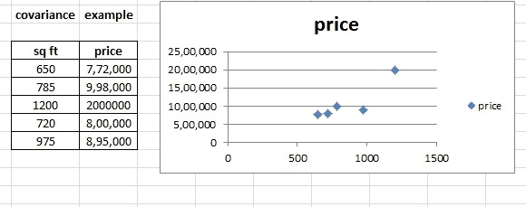

# 数据科学-统计分析(下)

> 原文：<https://medium.com/analytics-vidhya/data-science-statistic-analysis-part-2-acab5e0f2fa?source=collection_archive---------24----------------------->

如果你知道数据的类型和度量水平，那么可视化数据会容易得多。

让我们开始可视化过程。首先，我们将可视化分类变量，它们是 4 种常见的方法

1.  频率分布表
2.  条形图
3.  帕累托图

## **频率分布表:**

它有两列一个是类别本身和相应的频率。想象一下，你拥有一家汽车商店，只卖德国汽车。上表显示了汽车的类别及其频率，即售出的数量。

如上表所示，我们可以看到奥迪的销量最大，这是频率分布表，现在让我们来看一下这个数据

上图展示了数据的可视化，就像你熟悉的条形图和饼图一样，我继续看帕累托图。说到帕累托 80-20%法则，它指出 80%的结果来自 20%的原因

这些是我们可以直观表示**分类数据**的主要方式

来到**数值数据**，先说频率分布表。当我们处理数字变量的时候，把数据分成区间，然后找到相应的频率更有意义。通过这种方式，我们可以对数据进行总结，从而提供有意义的视觉表现。

**我们如何选择这些区间？**

通常，统计学家更喜欢处理包含 5 到 20 个区间的一组数据。这样总结会很有用。然而，这因情况和个人的正确选择而异，并取决于数据量。

在我们的例子中，将数据分成五个等长的区间。

在我们的例子中，间隔的长度应该是 100 -1 除以 5，四舍五入的结果是 20。因此我们的间隔如下:

如上表所示，每个区间的宽度为 20，然后对于频率列，区间中包含一个数字，如果该数字

1.  大于下限
2.  低于或等于上限

对于许多分析，计算相对频率是有用的。我们再加一栏，加相对频率。相对频率通过频率除以总频率来计算，例如频率为 2，总频率为 20，即 2/20 =0.1。

现在我们已经总结了原始数据，可以开始绘制了。

用于表示数字数据的最常见图形是**直方图。**我们将使用之前示例中的频率分布表，

**直方图**

正如你所看到的，它看起来像一个条形图，但传达了非常不同的信息。每个小节的宽度等于音程，高度等于频率，请注意，不同的小节表示在音程之间有一个延续，每个音程在下一个音程开始的地方结束。

这就是我们如何构建直方图来表示数字数据。

到目前为止，我们已经介绍了只表示一个变量，但如何表示两个变量之间的关系。让我们来介绍一下**十字表**和**散点**和**的剧情。**我们可以再次将变量分为分类变量和数字变量。

让我们从分类变量开始。最常见的表示方法是使用交叉表，或者一些统计学家称之为列联表。让我们看看这个例子，

您可以看到显示投资类型的行和每个投资者分配的列。一旦我们创建了一个交叉表，我们就可以通过可视化数据来绘制一个非常有用的图表。一个非常有用的图表是变化的条形图共享**并排条形图。**

我们可以很容易地比较特定投资者或投资者之间的资产持有情况。

最后，我们想以一个非常重要的散点图来结束。散点图用于表示两个数值变量。在本例中，我们收集了 100 名学生的阅读和实践技能分数。让我们看一下图表

散点图

分数范围在 200 到 800 分之间，这就是为什么它被限制在 200 到 800 分之间。第二，我们的纵轴显示实际技能，而横轴显示阅读技能。每一点都给了我们关于某个学生表现的信息。

散点图通常代表许多观察值，它给出了数据分布的主要概念。我们可以看到有一个明显的上升趋势，即实践技能分数较低的学生获得了较低的阅读技能分数，而实践技能分数较高的学生获得了较高的阅读技能分数。

我们可以看到，在图表中间的学生，阅读和实践技能的分数都在 450 到 550 之间，我们可以看到在图表中间的学生，阅读和实践技能的分数都在 450 到 550 之间。

我们已经完成了对数据的所有基本理解。查看我的[之前的博客](/@kmshilpamurali/data-science-statistic-analysis-part-1-16d07333348)对描述性统计的基本理解。

让我们进入描述性统计的核心，即**集中趋势和可变性的测量。**

它们是集中趋势三种度量**均值、中值、众数**

**平均值**也称为简单平均值，对于总体用 mu 表示，对于样本用 x 条表示。

平均公式

平均值是集中趋势最常见的度量，但它有一个巨大的缺点，即它很容易受到离群值的影响。平均值不足以得出一个明确的结论，所以是的我们可以计算第二个测量值中位数。

**中位数**是有序数据集中的中间数。为了找到中间值，按从高到低的顺序排列观测值。让我们介绍另一个度量标准**模式**，该模式是最常出现的值，它可用于数字和分类数据。

**哪种方法最好？**

集中趋势的度量应该一起使用，而不是单独使用。

我们讨论了集中趋势的度量，让我们继续讨论不对称的**度量。**

测量不对称最常用的工具是**偏斜度**

**偏斜度公式**

几乎总是会用到执行计算的软件。所以我们不去计算，而是去了解偏斜度的含义。偏斜度表示数据是否集中在一侧。偏斜度分为**正偏斜度和**负偏斜度，让我们看看例子

**正偏斜**

从图中，你可以看到数据点集中在左侧，也可以注意到尾巴倾向于哪一侧。如果平均值大于中值，则称之为**右偏或正偏**，即异常值在右侧。

**负偏度**

从图中，你可以看到数据点集中在右侧，也可以注意到尾巴倾向于哪一侧。所以左偏或负偏度意味着异常值在左边。

现在，如果情况没有偏斜，那么均值、中值和众数都相等，让我们看看这个例子。

**无歪斜**

为什么偏斜度很重要？

偏斜度告诉我们数据的位置。不对称的度量，如偏斜度或集中趋势度量和概率论之间的联系，这有助于我们完全理解数据。

让我们讨论一下**变量间关系的度量——协方差和相关系数**

**协方差:**它是两个随机变量的联合变异性的度量

上面的散点图清楚地显示了变量之间的关系，即两个变量是相关的，测量这种相关性的主要统计量称为协方差。

协方差可以是

1.  **> 0**
2.  **=0**
3.  **0<0**

计算两个变量之间协方差的公式，它是一个样本数据，所以我们使用样本公式。

协方差给人一种方向感，即

**相关系数:**

相关性调整协方差，使两个变量之间的关系变得容易。相关系数的公式，

如果相关系数为 1，则存在**完全正相关**，即一个变量的全部可变性由另一个变量解释。

如果两个变量之间的相关系数为零，则有**个独立变量**

最后，负相关可以是-1 的完全负相关或-1，0 的不完全负相关

**注意:**x 和 y 之间的相关性与 y 和 x 相同，因此这导致了因果关系。对于任何分析师或研究员来说，理解偶然关系的方向是非常重要的。

感谢您的阅读。我希望这篇文章能给你一些关于描述性统计分析的简短的数据科学概念。