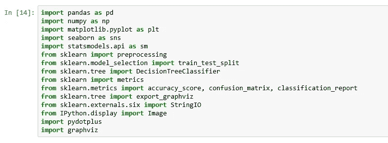
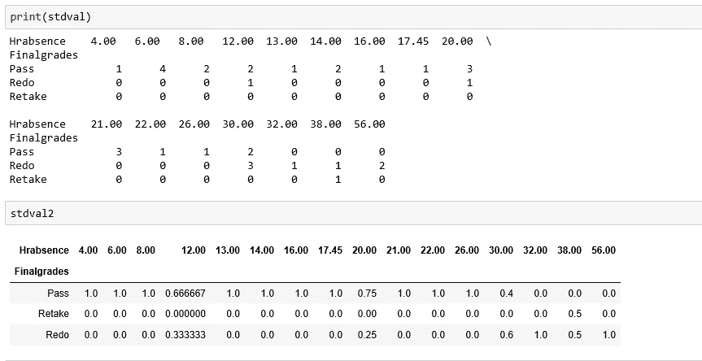

# 使用机器学习算法逐步预测学生成绩的数据科学技术。

> 原文：<https://medium.com/analytics-vidhya/data-science-techniques-to-predict-students-grade-step-by-step-using-machine-learning-algorithms-3c839c9c8ff7?source=collection_archive---------1----------------------->

还有其他影响学生成绩的因素。

模型建筑设计，灵感来自兰戈利设计模式。

这篇文章分为三个部分。

1.  在第一部分，我们了解缺课小时数如何影响学生最终成绩的因素，并为 [**机器学习模型**](https://www.analyticsvidhya.com/blog/2017/09/common-machine-learning-algorithms/) 准备数据。
2.  在第二部分中，我们建立**决策树**来预测学生最终成绩的事件结果的机会，并绘制成绩和咨询之间的关系，以及另一个成绩和缺课之间的关系。
3.  在第三部分中，我们使用影响学生表现的**缺课小时数**和**咨询**建立神经网络来预测学生成绩。使用 keras 和 Tenserflow。

包装

Jupyter 笔记本

本文涵盖的主题

1.  探索性数据分析。
2.  数据准备
3.  数据预处理
4.  决策树分类
5.  标准化数据集
6.  构建模型
7.  模型评估
8.  工作指标
9.  将模型保存到文件

加载数据，通过使用简单的熊猫包如下。

来源:Jupyter 笔记本

来源:Jupyter 笔记本

机器学习算法可以更好地处理数值，但在我们的数据集**中，最终成绩**是文本值。为了将*分类文本数据*从 [**sklearn 包**](https://scikit-learn.org/stable/) 转换成*数字*机器可读格式，我们应用 [**标签编码器()**](https://scikit-learn.org/stable/modules/generated/sklearn.preprocessing.LabelEncoder.html) 方法。

来源:Jupyter 笔记本

label _ encoder . fit _ transform(STD[' final grades '])方法将文本值转换为数值，如 0 =“通过”，1=“重做”，2=“重新获取”。

来源:Jupyter 笔记本

在类似于 sklearn 的 [**标签编码器**](https://scikit-learn.org/stable/modules/generated/sklearn.preprocessing.LabelEncoder.html) **中，使用 pandas 包，该包可以将分类值转换为一系列 0 的& 1，这使得 lot 更容易量化和比较。这可以将列内的值转换成列，使更有意义。使用 [**熊猫假人**](https://pandas.pydata.org/pandas-docs/stable/reference/api/pandas.get_dummies.html) **包裹**。**

来源:Jupyter 笔记本

来源:Jupyter 笔记本

使用 pandas package concat dataframe 和虚拟数据，结果是 0 和 1 的列值与相应的学生最终成绩的组合。

来源:Jupyter 笔记本

在数据集中，它包含咨询次数 1 &咨询次数 2 只不过是学生咨询或拜访教授讨论他们项目的次数。过去也解释过，我们对问题理解得越多，我们就能找到更好的解决方案。在下一篇文章中，我将展示咨询或拜访教授的程度如何影响学生的成绩。

来源:Jupyter 笔记本

在数据集 newset 中创建新列作为**咨询**，将其他咨询 d1 和咨询 d2 的值合并到一列中。并使用 pandas 包删除剩余的列。

**探索性数据分析**:绘制成绩与咨询之间的关系。使用[T5【海本】包回归 plo t](https://seaborn.pydata.org/generated/seaborn.regplot.html) 。

使用 seaborn 软件包绘制**等级、咨询和 Hrabsence】之间的关系。**

来源:Jupyter 笔记本

来源:Jupyter 笔记本

查看通过、重做和重考的学生总数。

来源:Jupyter 笔记本

接下来，查看并比较学生成绩和期末成绩

来源:Jupyter 笔记本

现在，看看缺课的人力资源数量是否与学生成绩相关。

使用 [**交叉表**](https://pandas.pydata.org/pandas-docs/stable/reference/api/pandas.crosstab.html) 聚合包含分类值的数据集中两列或更多列之间的矩阵，以获得快速汇总。

来源:Jupyter 笔记本

来源:Jupyter 笔记本

从柱状图中，我们可以看出旷课小时数与期末成绩之间的显著关系。

来源:Jupyter 笔记本

来源:Jupyter 笔记本

**卡方检验**

来源:Jupyter 笔记本

第 1 部分:Github/Jupyternotebook 来源

 [## bayyaraghu/用例

学生成绩预测 github.com](https://github.com/bayyaraghu/Usecase/blob/master/Untitled1.ipynb)  [## 冠状病毒动力学

### 它传播的速度有多快。以指数或再现数 R0 表示。

medium.com](/@bayyaraghu08/dynamics-of-corona-virus-cfed9b6d78be) 

在下一篇文章[第二部分](/@bayyaraghu08/machine-learning-algorithm-for-student-grade-prediction-and-visualization-using-decision-tree-7bfeb10c2ee8)中，我们将讨论使用决策树来寻找可能的成绩结果。

**关于作者** : Raghu Bayya，数据科学家 ML/深度学习。

大数据专家