# 数据科学:篮球中的移动点和投篮价值的科学

> 原文：<https://medium.com/analytics-vidhya/data-science-the-science-of-moving-dots-in-basketball-and-shot-value-5f66e791476b?source=collection_archive---------10----------------------->

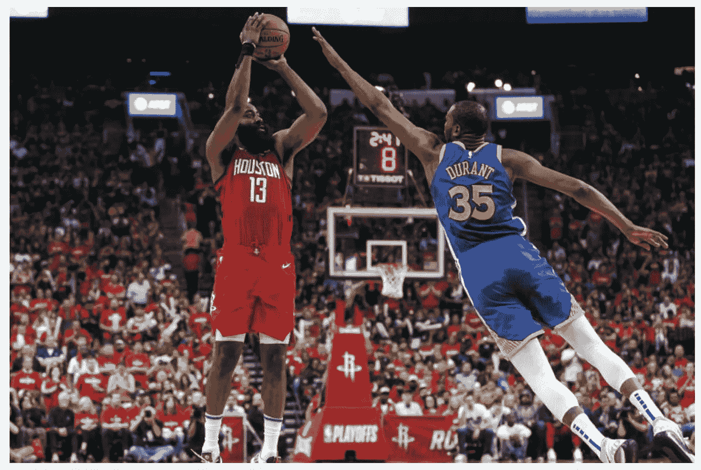

通过将球员表示为点并跟踪他们的运动，数据科学方法现在可以研究球员的行为，并为教练/球队高管提供更好的比赛规划以及在比赛中执行什么策略以获得最高成功率的见解。统计数据总是被用在体育运动中，但是基本的统计数据衡量一个运动员的行为有多准确呢？它们是对教练和体育分析家“感觉”的准确测量吗？对比赛有“感觉”并使用视力测试是教练和专家拥有的一项重要技能，但你如何量化这种定性的“感觉”？例如，在篮球比赛中，一个普通的球迷可以看出一个球员投篮不中，因为这是一个激烈的竞争，或者有一个更高的投篮命中率，另一个队友可以投篮，但你如何衡量这一点？Second Spectrum 等公司正在与各种 NBA 球队合作，并使用机器学习和时空模式识别来帮助回答这些问题。简单描述/说明如何通过 [STATS SportVU 系统](https://www.stats.com/sportvu-basketball/)获取这些信息:

*STATS sport vu 利用安装在篮球场上的六个摄像头系统，每秒钟跟踪球员和球的实时位置 25 次。利用这些跟踪数据，STATS 能够根据速度、距离、球员间隔和控球情况创建大量创新统计数据。*

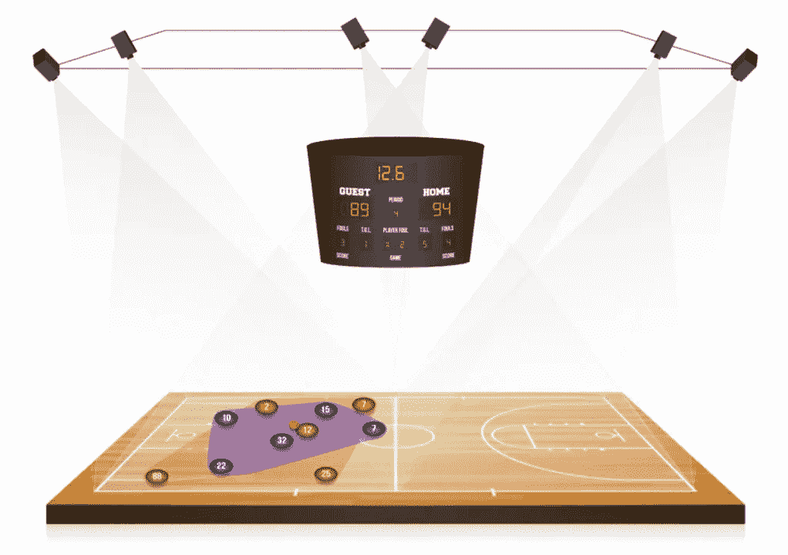

通过利用这些工具，玩家每秒钟的每一个动作都可以被捕捉为数据。机器学习模型然后使用该数据/运动来学习玩家的行为。机器可以学习识别重要的术语，比如传球、抢篮板、投篮。甚至可以识别高级打法，如挡拆、后仰和低位掩护。更令人惊讶的是，随着收集的信息越来越多，机器也在学习，并且随着时间的推移越来越准确。更简单地说，机器学习模型正在做的是分类什么是投篮，什么不是投篮，什么是挡拆，什么不是挡拆。它通过分类和识别戏剧的许多变体来收集信息。最终，机器可以通过识别何时以及何种类型的游戏导致成功(即得分)来识别这些游戏何时是最有效的。

这里是一些机器学习模型每秒钟捕捉到的[视觉效果](https://www.ted.com/talks/rajiv_maheswaran_the_math_behind_basketball_s_wildest_moves/transcript?language=en#t-496437):

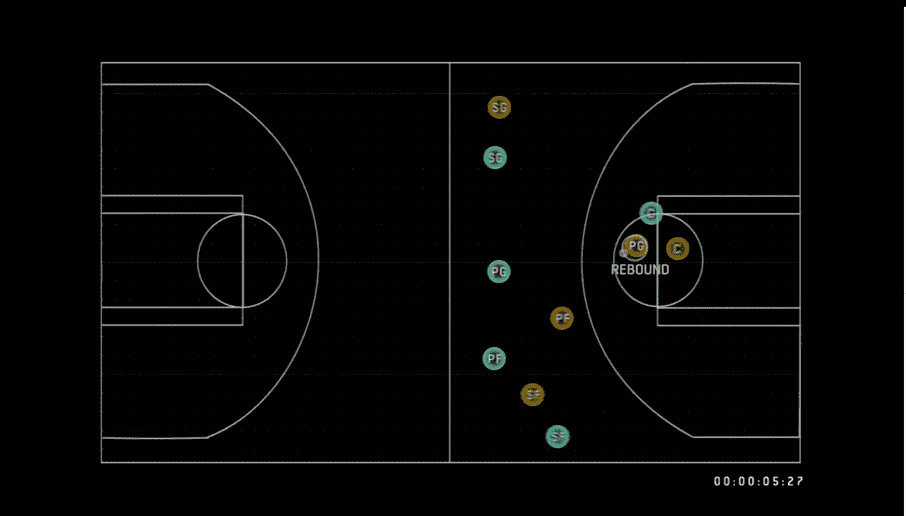

机器学习和时空识别可以识别诸如反弹之类的术语

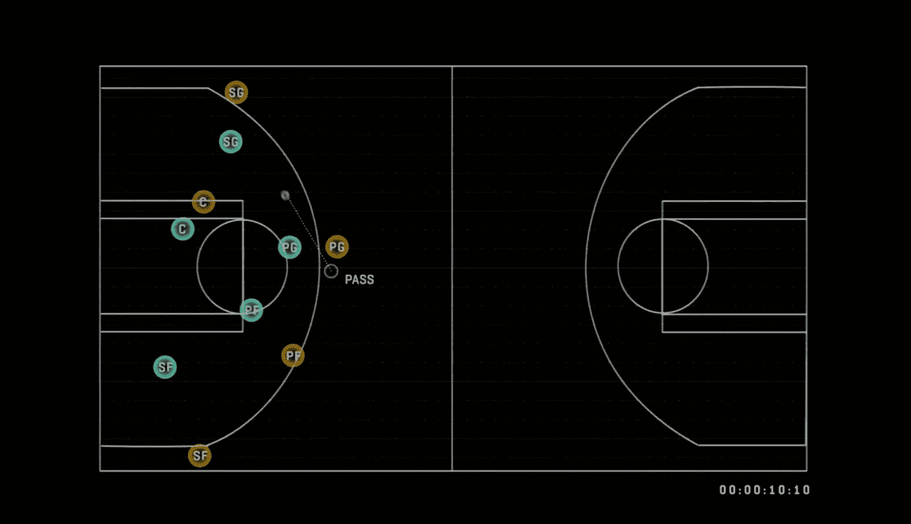

机器学习与传递示例

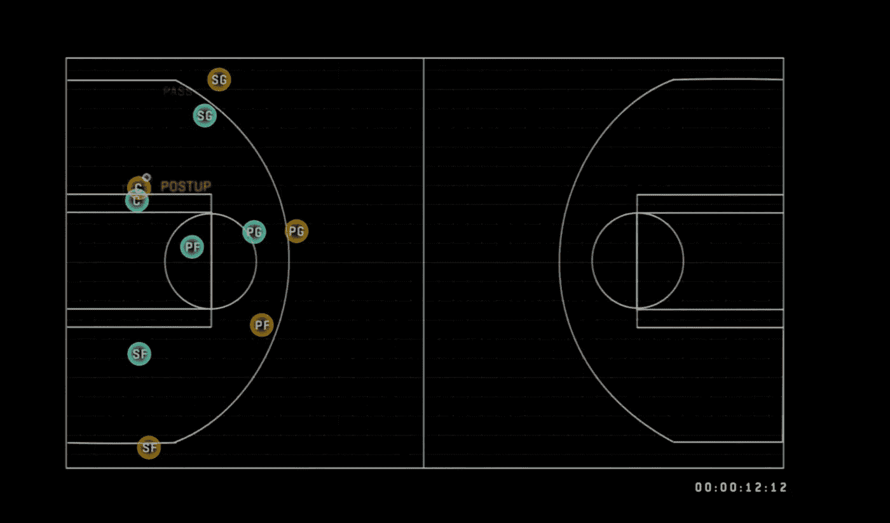

机器学习发布示例

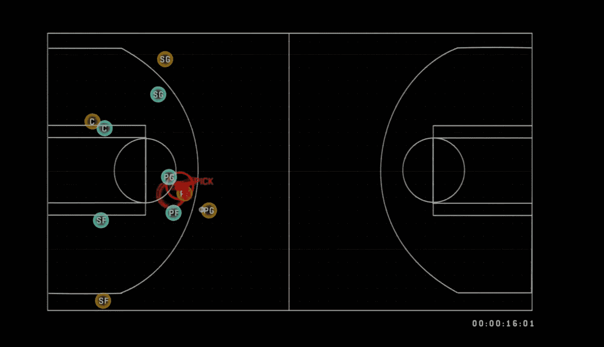

识别挡拆的机器学习

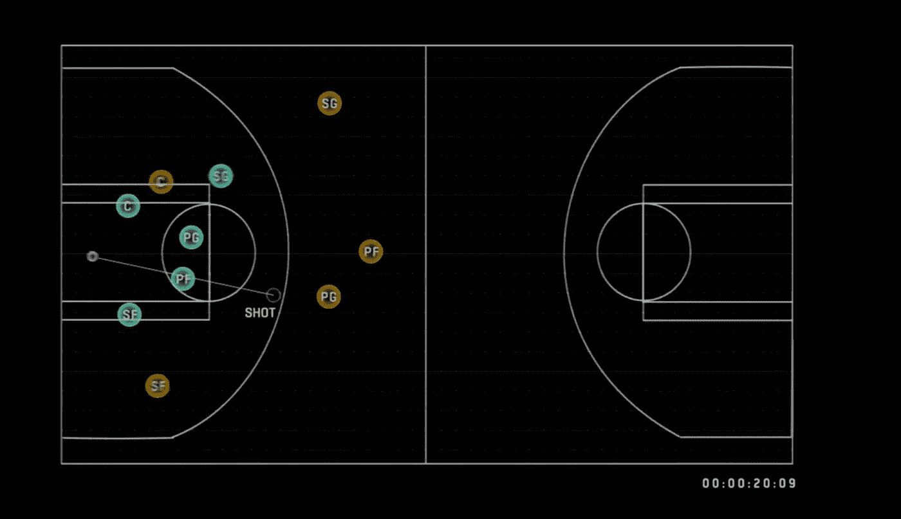

机器学习和投篮

教练组和球队可以利用这些信息开始识别一些事情，例如哪些球员在使用挡拆后返回的成功率最高。游戏上线时，哪些组合球员最有效？在球队最需要得分的时候，哪种打法增加了得分的机会？

**最高拍摄值**

这项技术的一个更具体的应用是拍摄值。目前，确定一名球员是否是一名优秀射手的最常见和最广泛接受的方法是他们的有效投篮命中率(EFG%)。它只是投篮次数与投篮次数的比值。因为三分球更有价值，EFG 也更重视三分球。简单地说，EFG 获得了投篮的 T2 能力 T3，但它没有量化投篮的 T4 质量 T5。我是否让我最好的射手得到了最好的投篮机会来获得最大的成功？像射门是否有争议或者防守者离射手有多近这样的因素有多重要？我如何捕捉一个镜头的能力和质量，并创造一个更好的？

second spectrum 用来定义有效投篮质量(ESQ)的一些更重要的特征是防守者到射手的距离和接球投篮与运球投篮的比较。然后，他们通过引入 ESQ 来增强 EFG 指标，以真正衡量投篮价值。second spectrum 包括的用于确定投篮质量的一些其他特征是投篮距离、投篮角度、防守距离、防守角度、球员速度和球员速度角度。

[视觉](http://www.sloansportsconference.com/wp-content/uploads/2014/02/2014-SSAC-Quantifying-Shot-Quality-in-the-NBA.pdf)EFG:

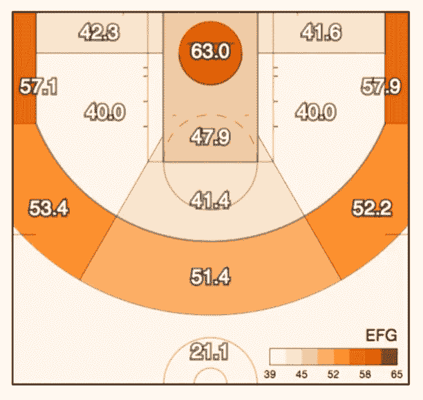

有效投篮命中率

上面是一个普通 NBA 球员从不同距离投篮的机会的示意图。你离篮筐越近，机会就越大。从 22 英尺线外投篮会得到更高的分数(3 分)。除了 EFG(投篮能力)，还有其他因素影响投篮命中率。

**投篮质量的构成:** [防守距离](http://www.sloansportsconference.com/wp-content/uploads/2014/02/2014-SSAC-Quantifying-Shot-Quality-in-the-NBA.pdf)和[接球&投篮与脱手运球投篮](http://www.sloansportsconference.com/wp-content/uploads/2014/02/2014-SSAC-Quantifying-Shot-Quality-in-the-NBA.pdf)

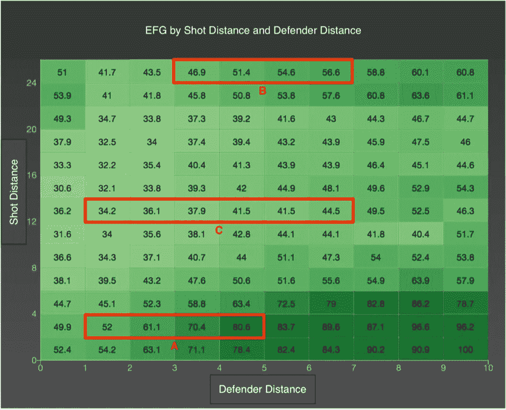

热图显示了相同的 EFG 如何受到防守距离的影响。

这张[热图](http://www.sloansportsconference.com/wp-content/uploads/2014/02/2014-SSAC-Quantifying-Shot-Quality-in-the-NBA.pdf)表明防守队员离射手越远，射门得分的几率就越高。当防守者的距离增加 1 英尺时，射门得分的几率大约增加 9%。教练应该设计这样的战术，让射手们到达最佳射手和最大空位投篮的位置。在 VU 体育统计系统之前，每个时刻每个球员的信息都没有被记录。

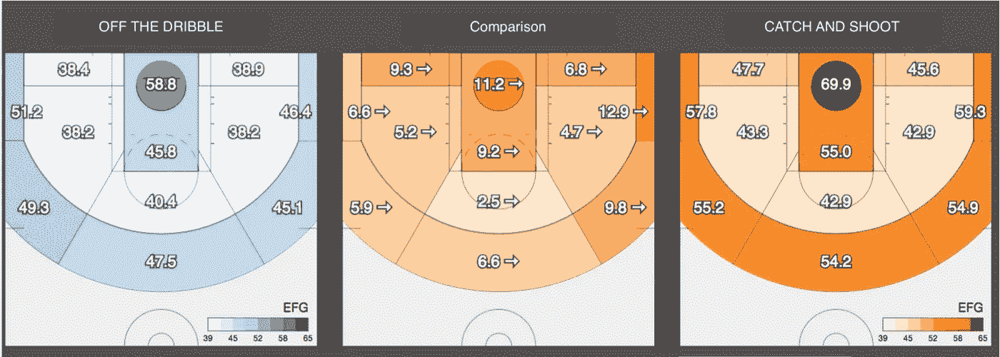

与运球投篮相比，接球投篮如何增加投篮机会

投篮质量的另一个重要方面是投篮是否“脱离运球”或“接球投篮”。接球投篮指的是在射手接到传球前的瞬间，然后在没有运球的情况下投篮。在接球投篮中，射手和防守者之间更有可能有一些距离，比赛是为接球和射手设计的，所以他们空位的机会也更高。此外，在接球投篮时，射手更有可能保持平衡，并能够在投篮时摆正姿势，这意味着射门的机会更高，也是更好的射门方式。离开运球意味着射手可能在投篮时更加失去平衡，这偏离了投篮的基本原则。这也意味着如果射手/球员手中有球，那么就有更多的眼睛盯着那个球员，很可能射手/球员已经被对方防守，这意味着更难射门。

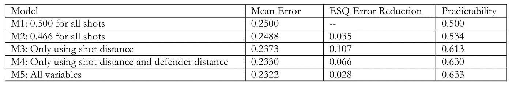

模型 5 在拍摄质量方面具有最低的 MSE 和最高的可预测性。

通过将这些变量(防守者距离和脱手运球与接球投篮)以及一些其他变量(即投篮距离、投篮角度、球员速度、球员速度角度)考虑在内，second spectrum [设计了模型](http://www.sloansportsconference.com/wp-content/uploads/2014/02/2014-SSAC-Quantifying-Shot-Quality-in-the-NBA.pdf)，以查看哪个模型在预测投篮质量方面最好。他们确定最佳模型是返回最小均方误差(MSE)的模型。使用的一些模型包括决策树(使用 ID3、M5P)、逻辑回归、高斯过程回归。用于验证模型的一些数据筛选方法包括训练测试分割和 10 倍交叉验证。

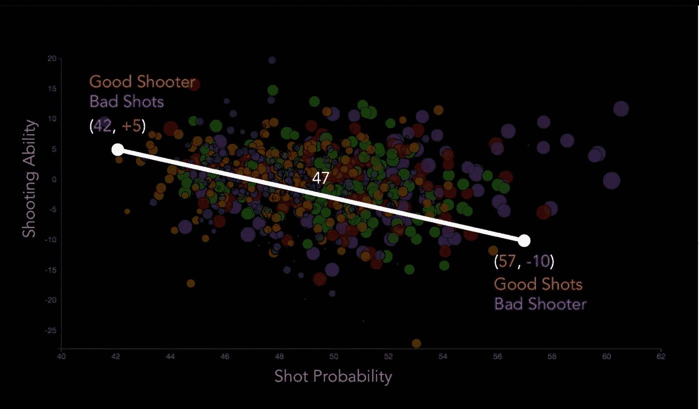

EFQ+与 ESQ

这张[图](https://www.ted.com/talks/rajiv_maheswaran_the_math_behind_basketball_s_wildest_moves/transcript?language=en#t-496437)展示了一个球员的投篮能力和他们投篮的质量。像这样的图表可以帮助总经理、高管和团队做出决定，他们正在考虑支付数百万美元的球员是否投篮命中率高，是一个好射手。一支球队更喜欢什么样的球员组合？是付给一个投篮好的好射手还是付给几个投篮不错但总体成本更低的好球员？像这样的视觉和洞察力可以帮助团队更好地回答这个问题。

真实世界应用:

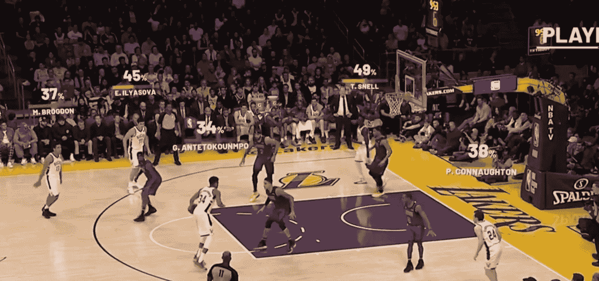

哪个镜头最好？

在这个[的例子](https://www.secondspectrum.com/video.html)中，通过利用 Second Spectrum 的技术，我们可以一秒一秒地看到球员的射门值。在这种情况下，Antetokounmpo 有 34%的机会在罚球线附近投篮，并且有一个防守队员离他几英尺远。他该不该射这一枪？或者他应该把球传给一个更开放的球员，比如伊利亚索娃，一个三分球接球投篮，他也有更高的机会投篮？还是应该把球传给离篮筐更近、投篮机会最高的斯内尔？

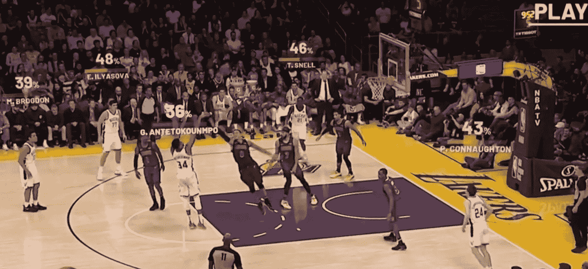

…在这种情况下，Antetokounmpo 拍摄了最不利的镜头，但仍然成功了。他毕竟是 MVP。

参考资料:

*   [http://www . sloansportsconference . com/WP-content/uploads/2014/02/2014-SSAC-量化-投篮质量-在 NBA.pdf](http://www.sloansportsconference.com/wp-content/uploads/2014/02/2014-SSAC-Quantifying-Shot-Quality-in-the-NBA.pdf)
*   [https://www.secondspectrum.com/video.html](https://www.secondspectrum.com/video.html)
*   [https://www . ted . com/talks/Rajiv _ maheswaran _ the _ math _ behind _ basketball _ s _ wildest _ moves/抄本？language=en#t-496437](https://www.ted.com/talks/rajiv_maheswaran_the_math_behind_basketball_s_wildest_moves/transcript?language=en#t-496437)
*   [https://www.stats.com/sportvu-basketball/](https://www.stats.com/sportvu-basketball/)