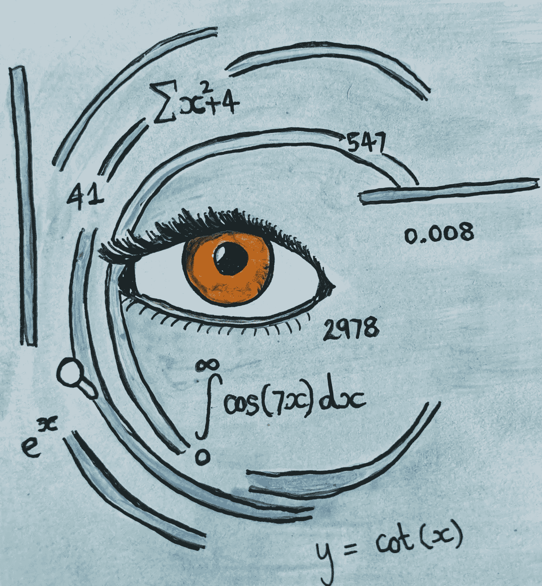
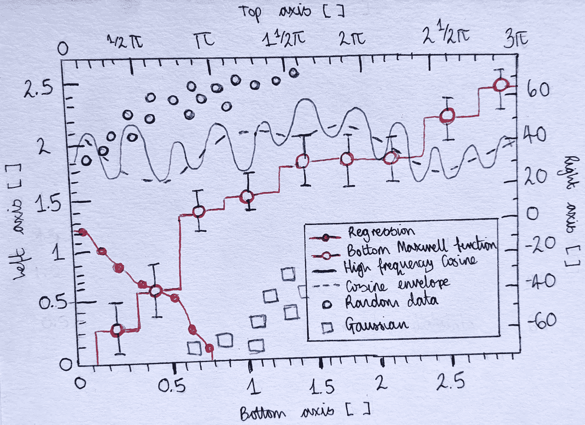
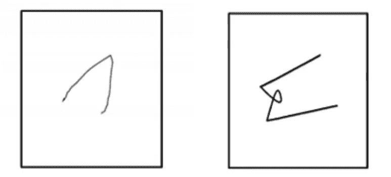
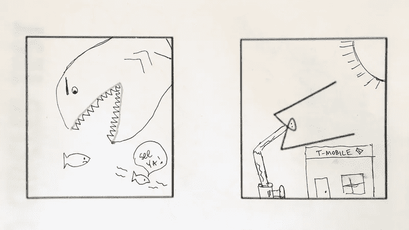

# 数据科学:软技能手册

> 原文：<https://medium.com/analytics-vidhya/data-science-the-soft-skills-handbook-ca7a38062e0b?source=collection_archive---------38----------------------->

我刚刚花了几年时间成为 R、Python 和 Java 的编程专家，现在你却告诉我我不能被雇佣，因为我没有足够好的*软* *技能*？

如果我能分析大数据，以创纪录的速度处理数字，绘制漂亮复杂的图表，并将统计数据转化为预测，那么我是什么样的人又有什么关系呢？

这很重要。

即使你能做所有这些美妙的事情，*除非你能传达出来，否则这些事情毫无意义。*

老实说，如果你不考虑提高你的软技能，没有人会在生意上雇用你。

虽然数千名聪明、敬业和崭露头角的新数据科学家被抛在后面似乎有些残酷和不公平，但当你看到他们无法与我们其他人交流他们的世界时，这完全是有道理的。

*“软技能到底是什么？”*

好问题。

这个术语含糊得令人恼火，让你认为你知道它的意思，但又闪烁其词，让你仍然需要一本“数据科学中傻瓜的软技能”手册。

以下是我能给热衷于建立自己的软面的新数据科学家(以及很大一部分经验丰富的科学家，他们可能会被忽视)的最佳建议。

# **1。同情你的非数据科学受众**

我知道这听起来有点居高临下，但数据科学家经常会被他们的最新项目冲昏头脑。

想象力天马行空，以最酷、最复杂和最令人印象深刻的方式展示数据，他们兴奋得迷失了方向，以至于完全错过了他们实际上被问及的问题。

同理心是这个指针的关键。

如果你，一个数据科学家，能够把自己放在具有企业意识的利益相关者的位置上，你会从他们的角度看问题，并以更人性化的方式处理这种情况。

你会开始理解*为什么*你被要求处理数据，以及*这对你的公司意味着什么；这不仅仅是一个证明你是一名优秀程序员的机会(他们已经知道了，否则你不会得到这份工作)。*

当你像《终结者》中的阿尼一样看待这个世界时，试着去认识它。

记住，你在和那些行为和想法与你非常不同的人打交道。

通常，你的观众不会是其他数据科学家，他们会对你展示的 Python 的最新特性垂涎三尺。领导者、分析师、顾问和销售专家希望了解如何提高他们公司的效率，或者预测经济增长的趋势。

大多数看你作品的人不会理解什么是“聚类”或者“模糊算法”到底是干什么的。

你的工作不是用你能做的所有复杂的事情来迷惑他们:你需要学会在数据科学的“硬”方面做到最好，同时弥合你自己和非数据科学同行之间的差距。

> 通常，你的观众不会是其他数据科学家，他们会对你展示的 Python 的最新特性垂涎三尺。

要点:在展示数据时，设身处地地为听众着想，人们会开始倾听你。

# **2。熟悉商业世界**

如果你进入一个商业行业，发现自己在不同的专业领域进行合作，当你的同事开始用他们独特的商业术语交谈时，你可能会感到自己被排除在外(*可扩展性*，*核心能力，利用*……)。

你需要打破愚蠢地点头附和的循环，并希望一旦你面前有了数据，他们的意思就会变得清晰。

克服被忽视的最好方法是问，再问，再问。

当然，你不是商业专家，你也不会研究数据科学多年后才发现自己不得不关心产品营销。但是，你是在企业中工作，不管你喜欢与否，这使你成为企业俱乐部的一员。

开始弥合科学和商业之间的沟通鸿沟。

首先在你的公司内部做一些调查，了解他们的核心价值观，他们的驱动力以及他们为谁工作。

是的，你不必对女性服装充满热情来从事网上购物算法，但阅读一下网上购物者在使用你的软件时想看什么、它如何帮助他们以及你为什么要这样做是有帮助的。

不要回避成为公司的一员:拥抱它，把你新的商业智慧加入到你不断增长的技能清单中。

相信我，比起只学习编程技能，你会在数据科学的商业技能上投入更多的时间。

要点:**如果你在商界工作，让自己对它感兴趣，了解它是如何运作的，弥合差距，不要疏远自己。**

# **3。让自己的作品变美，多读文学**

就简洁、实事求是的语域而言，科学写作自有其美。很可能，你在整个大学期间都在练习这样写作，并发现这是一种向考官展示作品的舒适方式。

这种风格需要呆在它该呆的地方:研究和学术界。它在商业中没有地位。

在商业中占有一席之地的是:

*   普遍理解的术语，
*   要点总结，
*   趋势和预测，
*   易于理解的图表。

本质上来说，“把它变得简单”一点。

这并不是说要付出 40%的努力，像对待蹒跚学步的孩子一样对待你的观众。但是，如果你能让一个图表看起来更大、更漂亮、更清晰，而不是更复杂，并且同时有多个坐标轴，那就去做吧。

如果这意味着你需要添加另一张幻灯片以保持清晰，并不断地为常见的首字母缩写词如 NLP、DL…(“自然语言处理”、“深度学习”看起来很难懂，对吗？)—咬咬嘴唇，照做。

历史小说的作者并不期望他们的读者已经研究了他们选择写作的时代。相反，它们提供了必要的背景，让读者的目光毫不费力地扫过页面——让读者的眼睛休息一下，让你的作品变得容易理解，而不需要移除你的信息核心。

> 阅读更多的文学作品将有助于你扩大词汇量，你讲故事的技巧也会得到提高。

相信我，当你用你使用的方程式或你写的奇特算法来注释你的图表时，没有人会被打动。就像没有人对阅读作者凌乱的初稿感兴趣一样——我们想要清晰和易用。

没有人想看到这种图表。

阅读更多的文学作品将有助于你扩大词汇量，你讲故事的技巧也会得到提高。也许你对简·奥斯汀或田纳西·威廉姆斯不感兴趣，那很好。寻找一些其他形式的书面艺术(诗歌、散文、歌词)，研究作家如何抓住观众的美。

在你自己的工作中展示发现时，使用这些讲故事的工具——减少数据的单调，融入你的发现的激动人心之处，其潜在的情绪和情感。

要点:学习如何写作来吸引读者的目光，为你的观众美化你的科学作品，并抵制在新发现的软技能上炫耀你的硬技能的冲动。

# **4。发掘你的创造力**

如果你正在读这篇文章，很可能你更擅长于解决问题和分析思考，而不是创造力。如果是这样的话:不要放弃尝试创新。

> 仅仅擅长编程是不行的。

的确，创造力不仅仅是你与生俱来的东西。

当然，有些人从娘胎里出来就已经能弹吉他或用完美的音调唱歌了，但是我们大多数人必须不断练习，直到掌握为止。

如果你一看到空白画布就害怕，并且过去害怕诗歌考试——你并不孤单。但是你应该停止把它作为逃避创造力的借口。

仅仅擅长编程是不行的。

有许多有趣的方法来发掘你隐藏的才能，相信我，你内心深处是如此有创造力，只是你还没有发现而已。

[*快速提高创造性思维的 7 个有趣练习*](https://www.artworkarchive.com/blog/7-fun-exercises-to-quickly-improve-creative-thinking) 是一篇精彩的文章，概述了一些万无一失的技巧，让你练习你的创造力，释放你的才华。

其中一个有趣的例子是“完成不完整图形测试”:

完成不完整图形测试示例，让您开始。[[https://www . artworkarchive . com/blog/7-fun-exercises-to-quick-improve-creative-thinking](https://www.artworkarchive.com/blog/7-fun-exercises-to-quickly-improve-creative-thinking)]

你从一些随机的不完整的线条开始，然后加上你能想到的任何东西。查看他们的结果:

完成至的不完整图形测试结果。[[https://www . artworkarchive . com/blog/7-fun-exercises-to-quick-improve-creative-thinking](https://www.artworkarchive.com/blog/7-fun-exercises-to-quickly-improve-creative-thinking)]

一旦你开始花些时间放松你大脑的分析部分，尝试一下创造性的一面，你会发现工作变得更有趣，更有意思，也更容易处理。

**要点:**你不必成为下一个米开朗基罗来允许自己开始。更有创造力将帮助你用酷的、新的方式解决问题，如果你只是停留在你的舒适区，你永远也想不到。

总的来说，你已经具备了成为一名软数据科学家的所有潜力(不要担心——你可以像你喜欢的数字一样努力)，你可能只是需要更新这些技能并练习它们。

**资源:**
[*https://www . simpli learn . com/soft-skills-for-data-scientist-article*](https://www.simplilearn.com/soft-skills-for-data-scientist-article)[*https://towardsdatascience . com/the-unwanted-data-science-soft-skills-cc 836d 51 b 73d*](https://towardsdatascience.com/the-unspoken-data-science-soft-skills-cc836d51b73d)[*https://www . tableau*](https://www.tableau.com/en-gb/learn/articles/data-science-skills)