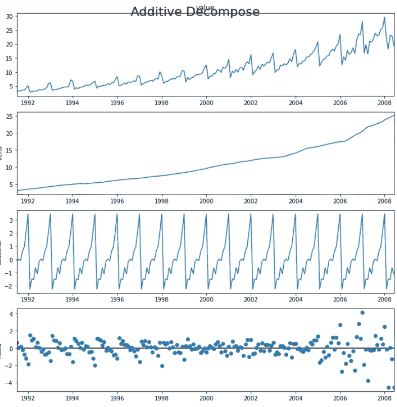

# 数据科学:使用 Python 进行时间序列分析

> 原文：<https://medium.com/analytics-vidhya/data-science-time-series-analysis-using-python-f3434ed02f7a?source=collection_archive---------21----------------------->


# 什么是时间序列？

> 时间序列是以固定的时间间隔记录的一系列观察结果。

根据观测频率的不同，时间序列通常可以是每小时、每天、每周、每月、每季度和每年。有时，你可能有秒和分钟的时间序列，比如，每分钟的点击次数和用户访问量等等。

**时间序列需求:**

> **时间序列是必需的，因为它是你开发序列预测之前的准备步骤。**

此外，时间序列预测具有巨大的商业意义，因为对商业很重要的东西，如需求和销售、网站的访问者数量、股票价格等，本质上都是时间序列数据。

# 在 Python 中导入时间序列:

导入必要的库:

```
from dateutil.parser import parse 
import matplotlib as mpl
import matplotlib.pyplot as plt
import seaborn as sns
import numpy as np
import pandas as pd
```

# 正在上传。csv 文件:


# 对时间序列执行各种操作:

*   时间序列索引
*   消除时间序列的趋势
*   加法和乘法时间序列
*   时间序列中的白噪声
*   时间序列中的自相关函数和偏相关函数
*   时间序列平稳性检验

# 1-使用时间序列数据进行索引→


**可视化时间序列:**


# 2-消除时间序列趋势→

> 取消时间序列趋势是指从时间序列中删除趋势部分。


# 3-加法和乘法时间序列→

> 根据趋势和季节性的性质，时间序列可以建模为加法或乘法，其中，序列中的每个观察值可以表示为以下分量的和或积:

> **加性时间序列:
> 值=基数+趋势+季节性+误差**
> 
> **乘法时间序列:
> 数值=基数 x 趋势 x 季节性 x 误差**


输出:



# 4-时间序列中的白噪声→

> 像平稳序列一样，白噪声也不是时间的函数，即它的均值和方差不随时间变化。但不同的是，白噪声是完全随机的，均值为 0。从数学上来说，一个均值为零的完全随机的数字序列是一个白噪声。


# 5-时间序列中的自相关和偏相关函数→

> **自相关**就是一个序列与其自身滞后的相关性。如果一个序列是显著自相关的，这意味着该序列以前的值(滞后)可能有助于预测当前值。
> 
> 部分自相关也传达类似的信息，但它传达的是序列及其滞后的纯相关性，不包括中间滞后的相关性贡献。


输出:


# 6-测试时间序列的平稳性→

> 平稳性是时间序列的一个属性。平稳序列是指序列的值不是时间的函数。


> 如果你不愿意冒平常的风险，你就只能满足于平常
> 
> 吉米·罗恩

# 谢谢大家！！

# 不断学习😊✌