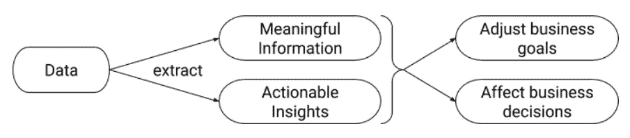
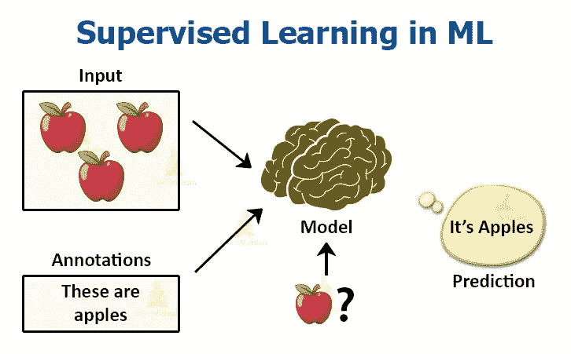

# 数据科学:理解基本概念

> 原文：<https://medium.com/analytics-vidhya/data-science-understand-the-basic-concepts-f30c60691b7e?source=collection_archive---------10----------------------->

考虑到自己是个新手(在我写这篇文章的时候)，我正在努力为自己制定职业道路和学习计划。然后偶然看到一篇很牛逼的文章叫做“*如何一步一步成为 ML 专家*”(这里是[链接](https://www.analyticsvidhya.com/blog/2018/07/mystory-became-a-machine-learning-expert-10-months/))。对我来说，这绝对是一个很有价值的线索。所以我来了，从一小步开始。如果你和我在同一个地方，看到了这篇文章，我希望它能帮助你。

# 目录—目录

1.  “分析—分析—分析—分析”有什么区别？
2.  什么是数据科学？
3.  什么是大数据？
4.  什么是机器学习(ML)？
5.  什么是人工智能(AI)？
6.  上述领域之间有什么不同和联系？

***免责声明*** *:我不是以下任何信息的作者，我只是总结了我所研究的。有些部分，我用自己的话解释，但有些部分，我抄袭了原文。请在这篇文章的脚注中找到参考文献。*

# 1.“分析—分析—分析—分析”有什么区别？

数据科学中最常用的词以 ana-开头。然而，没有多少人彻底明白这是什么意思，它们之间有什么区别(至少对我来说，因为英语不是我的母语)。

根据牛津学习词典，以下是每个单词的定义:

*   [**分析**](https://www.oxfordlearnersdictionaries.com/definition/english/analyse?q=analyze)【/ˈænəlaɪz/】(动词):检查某物的*性质或结构*，尤指通过把它分成几个部分，以便理解或解释它。
*   [**分析**](https://www.oxfordlearnersdictionaries.com/definition/english/analysis?q=analysis)【/əˈnæləsiːz/】(名词):对某事物进行详细的研究或检查，以便对其有更多的了解。
*   [**分析型**](https://www.oxfordlearnersdictionaries.com/definition/english/analytic?q=analytic)/ˌænəˈlɪtɪk/(adj):*也作分析型*，运用逻辑方法思考某事物以便理解它，尤指通过分开看所有部分。
*   [**分析**](https://www.oxfordlearnersdictionaries.com/definition/english/analytics?q=analytics) /ˌænəˈlɪtɪks/(名词):使用模型对数据*进行仔细完整的分析，通常由计算机执行；该*分析产生的信息*。*

准确地说，有两点值得注意:

*   是什么词类？(名词，动词…)。
*   语境是什么？

我认为“分析”和“分析”是最容易互换的词。然而，仅仅定义并不能帮助我们区分。所以应该提供更多的上下文。

我个人对分析和分析的区别的总结

# 2.什么是数据科学？

为了充分理解什么是数据科学，我们应该从 3 个方面来看:

*   定义:短的和长的都有。
*   目标和可交付成果。
*   过程。

## **2.1 定义:**

**简定义** :数据科学是对大量数据的研究，可以揭示*洞察*，帮助组织做出*战略选择*。

**长定义** :说到数据科学，就要说到做这项工作的人——*数据科学家*。数据科学家的基础基于四大支柱。

*   业务/领域知识
*   数学(包括统计和概率)
*   计算机科学(例如，软件/数据架构和工程)
*   沟通(书面和口头)

数据科学家的四大支柱(Alex Castrounis)

## **2.2 目标&可交付成果:**

**目标** ⁴:数据科学的目标是构建从*数据*中提取*以业务为中心的洞察*的*手段*。

我个人对数据科学目标的总结

交付物:这里有一些例子

*   预测(根据输入预测值)
*   预测(如销售和收入)
*   分类(例如，垃圾邮件或非垃圾邮件)
*   推荐(例如，亚马逊和网飞推荐)
*   异常检测(例如，欺诈检测)
*   识别(图像、文本、音频、视频、面部识别等)
*   可操作的见解(通过仪表板、报告、可视化等)
*   自动化流程和决策制定(例如，信用卡审批)
*   评分和排名(例如，FICO 分数)
*   细分(例如，基于人口统计的营销)
*   优化(例如，风险管理)

## **2.3 流程:**

加布多流程模型(Alex Castrounis)

# 3.什么是大数据？

为了全面理解大数据，让我们从不同的角度来看它:

*   定义:短的和长的。
*   大数据的优势
*   大数据的挑战
*   最佳实践

## 3.1 定义:

**简短定义** ⁵:大数据是一个术语，适用于其规模或类型超出传统*关系数据库*以低*延迟*捕获、管理和处理数据的能力的数据集。

> [**数据延迟**](http://Data latency is the time it takes for data packets to be stored or retrieved. 2\. In business intelligence (BI), data latency is how long it takes for a business user to retrieve source data from a data warehouse or business intelligence dashboard.) :存储或检索**数据包**所需的时间。在商业智能(BI)中，**数据延迟**是指业务用户从**数据仓库或商业智能仪表板中检索源**数据**所需的时间。**

**长定义**:任何满足以下 5 个标准(也称为 5v)的数据都将被视为大数据

***量* ⁵** :数据量很重要。对于一些组织来说，这可能是数十 TB 的数据。对于其他人来说，它可能是数百 Pb。

***速度* ⁷** :数据产生和处理的速度。大数据通常是实时可用的。Big Dat 的主要方面是根据需求以更快的速度提供数据。与大数据相关的两种速度是:

*   生成的频率。
*   处理、记录和发布的频率。

***品种*** ⁶: **大数据**涵盖 3 类数据

*   **结构化数据**:定义明确的结构化数据，遵循一致的顺序，其设计方式使其能够被**人或计算机**轻松访问和使用。 *Ex:数据库管理系统(****DBMS****)。*
*   **半结构化数据**:可以认为是结构化数据的另一种形式。这种数据的主要部分没有明确的结构，也不符合 RDBMS 等数据模型的形式结构。 *Ex:逗号分隔值(****CSV****)文件。*
*   **非结构化数据**:

资料来源:Edureka

***价值* ⁵** :数据有内在价值。但是在价值被发现之前，它是没有用的。存储海量无意义的数据不值得。

⁵:你的数据有多真实——你能依赖它多少？这是关于数据的可靠性和信任。

## 3.2 大数据的优势:

***受益#1*** *:回答更多问题，更彻底*

大数据最重要的好处之一是能够更有力地提问和回答问题。回答复杂问题的整个过程可以从数月和数周缩短到数天甚至数小时或 minutes⁸.

大数据让你有可能获得更完整的答案，因为你有了更多的信息。更完整的答案意味着对数据更有信心——这意味着解决问题的方法完全不同，⁰.

***好处#2*** *:更快、更好地做出决策*

凭借 Hadoop 和内存分析的速度，再加上分析新数据源的能力，企业能够立即分析信息，并根据他们已有的 learned⁹.做出决策

## 3.3 挑战:

***挑战#1*** *:需要人才*

*   数据科学家和大数据专家是 IT 领域最令人垂涎的高薪员工。AtScale 调查发现，缺乏大数据技能是过去三年大数据面临的头号挑战。
*   雇佣或培训员工会*大幅增加成本*，获取大数据技能的过程会*花费大量时间*。

***挑战#2*** *:存储管理+硬件需求*

*   大数据需要存储。许多人根据他们的数据当前所在的位置来选择存储解决方案。然而，云逐渐流行起来，因为它支持您当前的计算需求，并使您能够根据需要增加资源。明智地选择，因为这是一项高成本的投资。
*   组织面临的另一个重要问题是支持大数据分析计划所需的 IT 基础架构。存储数据的存储空间、与分析系统之间传输数据的网络带宽以及执行这些分析的计算资源的购买和维护成本都很高。

***挑战#3*** *:急速变化*

*   大数据分析的另一个潜在缺点是技术正在快速变化。组织面临着一种非常现实的可能性，他们将投资于一种特定的技术，但几个月后会有更好的技术出现。

## 3.4 最佳实践:

来源: [Allerin](https://www.allerin.com/blog/top-5-big-data-best-practices)

 [## 五大大数据最佳实践|物联网|大数据|区块链|

### 保险大数据健康大数据大数据分析框架大数据 Hadoop 解决方案

www.allerin.com](https://www.allerin.com/blog/top-5-big-data-best-practices) 

在研究大数据时，我遇到了一个新的概念:“暗数据”，这很有趣。

> **暗数据**是通过各种计算机网络操作获得的**数据**，但不以任何方式用于获得洞察力或决策。一个组织收集**数据**的能力可能会超过其分析**数据**的能力。 [IBM](https://en.wikipedia.org/wiki/IBM) 估计大约 90%由传感器和模数转换产生的数据从未被使用过…
> 
> …人们普遍认为，随着用于数据分析的更先进的计算系统的建立，暗数据的价值就越高。有人指出，“数据和分析将是现代工业革命的基础”。

# 4.什么是人工智能？

我发现有两篇文章完美地概括了这个概念:

 [## 什么是人工智能？明智的定义| Emerj

### 什么是人工智能(AI)？我们认为这个术语是理所当然的，但是我们如何表达一个正式的定义呢？还有…

emerj.com](https://emerj.com/ai-glossary-terms/what-is-artificial-intelligence-an-informed-definition/)  [## 什么是人工智能？AI 如何工作，应用和未来？

### 人工智能入门？人工智能的历史人工智能是如何工作的？什么是…

www.mygreatlearning.com](https://www.mygreatlearning.com/blog/what-is-artificial-intelligence/) 

## 4.1 定义

> **人工智能**是一个实体(或合作实体的集合)，能够接收来自环境的输入，解释并学习这些输入，并展示相关和灵活的行为和动作，帮助实体在一段时间内实现特定目标或目的⁵.

**但是智力是什么意思呢？**

> **人工智能**基于这样的原理:人类智能**可以被定义为一种机器可以很容易地模仿它并执行任务的方式，从最简单的到那些甚至更复杂的。人工智能的目标包括学习、推理和感知⁶.**

*→人工智能是指机器对人类智能的模拟。*

## 4.2⁷的分类

来源:[法律援助](https://lawtomated.com/ai-for-lawyers-ani-agi-and-asi/)

**周 AI (ANI —人工狭义智能):**

*   三种人工智能中最有限也是最常见的。
*   Week AI 是任何专注于做好一项任务的人工智能工具。
*   弱人工智能不是模仿或复制人类智能。它旨在模拟人类行为。所以，它远不能匹配人类的智力，而且*也没有试图*。

> 狭窄或微弱的人工智能更像是一个[智能专家](https://www.whoson.com/chatbots-ai/the-rise-of-the-online-robo-advisor/)。它非常智能地完成它被编程去做的特定任务。

**强 AI(AGI——人工通用智能):**

*   强人工智能是指表现出人类水平智能的人工智能——它可以理解、思考和行动，就像人类在任何给定情况下可能会做的一样。
*   世界上还没有强大的人工智能。人们认为，要实现真正强大的人工智能，我们需要让我们的机器有意识。

> 人类能做的事，强大的人工智能也能做。

**超级 AI (ASI —人工超级智能):**

*   超级 AI 是超越人类智力和能力的 AI。
*   在人工智能的类型中，超级人工智能是大多数人在谈论机器人接管世界时所指的类型。或者关于 AI 推翻或者奴役人类。

## 4.3 人工智能应用⁹

来源:[神经丛](https://www.innoplexus.com/blog/how-artificial-intelligence-works/)

**机器学习|从经验中学习**

*   ML 教会机器如何根据过去的经验进行推理和决策。
*   它识别模式，分析过去的数据以推断这些数据点的意义，从而得出可能的结论，而不必涉及人类经验。
*   这种通过评估数据得出结论的自动化为企业节省了人力时间，并帮助他们做出更好的决策。
*   *举例*:谷歌搜索引擎，

**深度学习|自学机器**

*   深度学习是一种 ML 技术。它教会机器通过多层处理输入，以便分类、推断和预测结果。

**神经网络|制造联想**

*   神经网络的工作原理与人类神经细胞相似。
*   它们是一系列算法，捕捉各种潜在变量之间的关系，并像人脑一样处理数据。

**认知计算|根据上下文进行推理**

*   认知计算算法试图模仿人脑，以人类的方式分析文本/语音/图像/对象，并试图给出所需的输出。
*   *例子*:Siri/Cortana……

**自然语言处理(NLP) |理解语言**

*   NLP 是一门由机器阅读、理解和解释语言的科学。
*   一旦机器理解了用户想要交流的内容，它就会做出相应的反应。
*   *例子*:Siri/Alexa/谷歌助手，自动完成，拼写检查…

**计算机视觉|理解图像**

*   计算机视觉算法试图通过分解图像并研究物体的不同部分来理解图像。
*   这有助于机器从一组图像中进行分类和学习，以根据之前的观察做出更好的输出决策。
*   *例子*:自动驾驶汽车，面部识别…

## 4.4 优势与劣势

# 5.什么是机器学习(ML)？

我发现这篇文章完美地总结了这个概念:

 [## 什么是机器学习？-一个知情的定义

### 键入“什么是机器学习？”谷歌搜索打开了论坛、学术研究和…

emerj.com](https://emerj.com/ai-glossary-terms/what-is-machine-learning/) 

## **5.1 定义⁴**

以下是我最喜欢的机器学习的定义

> 机器学习研究是对*人工智能*研究的一部分，寻求通过数据、观察和与世界的交互为计算机提供知识。获得的知识使计算机能够正确地归纳到新的环境中去— **蒙特利尔大学的 Yoshua Bengio 博士**
> 
> 机器学习领域试图回答这样一个问题:“我们如何才能建立能够随着经验自动改进的计算机系统，支配所有学习过程的基本法则是什么?”？— **卡内基梅隆大学**

详细来说，ML 包括以下内容:

*   **表示:**(一组分类器或计算机理解的语言)这描述了你希望如何看待你的数据。有时，您可能希望根据个体(如 k 近邻)或图形(如贝叶斯网络)来考虑您的数据。
*   **评估:**出于监督学习的目的，你需要对你的学习者做得如何进行评估或打分，以便改进。该评估是使用评估函数(也称为*目标函数*或*评分函数*)完成的。例子包括准确性和平方误差。
*   **优化**(搜索方法；例如，通常是得分最高的分类器；使用现成的和定制的优化方法)

来源: [Emerj](https://emerj.com/ai-glossary-terms/what-is-machine-learning/)

我觉得这篇文章很擅长解释概念(明显比我自己强):

 [## 机器学习=表示+评估+优化

### TL；dr:你可以认为机器学习算法是景观、偏好和策略的结合

medium.com](/@devnag/machine-learning-representation-evaluation-optimization-fc7b26b38fdb) 

## 5.2 机器学习的类型

让我们来谈谈 ML 的 4 种基本类型:

**监督学习**:

*   需要以前的数据和以前的结果作为输入。
*   通过使用这些数据进行训练，该模型有助于预测更准确的结果。
*   缺点:标记数据是手工操作，而且由于数据量巨大，成本很高。

**无监督学习**:

*   不需要以前的数据，因此数据不被标记。
*   该算法有助于模型根据特征的相似性形成相似类型数据的聚类。
*   缺点:应用领域非常有限。

**半监督学习**:

这是监督学习和非监督学习的结合。这种方法有助于减少上述两种学习方法的缺点。

*   首先，模型在无监督学习下训练。这确保了大部分未标记的数据被分成簇。
*   对于剩余的未标记的数据，标签的产生和分类容易进行。

**强化学习**:强化模型是为了学习如何做决策

[来源](https://www.xtopo.io/service/machine-learning)

## 5.3 挑战和限制

过度拟合

维度

# ‣:上述领域彼此有何不同，又有何关联？

**脚注**:

[1]1 到媒体。*分析与分析:有什么区别？* ( [链接](https://www.1to1media.com/data-analytics/analysis-vs-analytics-whats-difference))

[1] Quora。*分析与分析(数据分析)有什么区别？* ( [链接](https://www.quora.com/What-is-the-difference-between-Analytics-and-analysis-data-analytics))

[2] Coursera。*什么是数据科学？* ( [链接](https://www.coursera.org/learn/what-is-datascience/supplement/aixTi/lesson-summary))

[3]亚历克斯·卡斯特罗尼斯。*什么是数据科学，数据科学家是做什么的？* ( [链接](https://www.innoarchitech.com/blog/what-is-data-science-does-data-scientist-do))

[4]首席信息官。*什么是数据科学？将数据转化为价值。* ( [链接](https://www.cio.com/article/3285108/what-is-data-science-a-method-for-turning-data-into-value.html))

[5] IBM。*大数据分析。* ( [链接](https://www.ibm.com/analytics/hadoop/big-data-analytics))

[6]爱德华卡。*大数据特征:了解大数据的 5 个 v。* ( [链接](https://www.edureka.co/blog/big-data-characteristics/))

[7]维基百科。*大数据。* ( [链接](https://en.wikipedia.org/wiki/Big_data#Characteristics))

[8] Datameer。*大数据的三大好处。* ( [链接](https://www.datameer.com/blog/three-major-benefits-big-data/))

[9]北欧航空公司。*大数据分析，它是什么，为什么重要。* ( [链接](https://www.sas.com/en_us/insights/analytics/big-data-analytics.html))

[10]甲骨文。*什么是大数据？* ( [链接](https://www.oracle.com/big-data/what-is-big-data.html#link2))

[11]数据化。*大数据利弊*。([链接](https://www.datamation.com/big-data/big-data-pros-and-cons.html))

[12] Allerin。*五大大数据最佳实践。* ( [链接](https://www.allerin.com/blog/top-5-big-data-best-practices))

[13]维基百科。*暗数据。* ( [链接](https://en.wikipedia.org/wiki/Dark_data))

14 Emerj。*什么是机器学习？* ( [链接](https://emerj.com/ai-glossary-terms/what-is-machine-learning/))

15 Emerj。*什么是人工智能？* ( [链接](https://emerj.com/ai-glossary-terms/what-is-artificial-intelligence-an-informed-definition/))

[16]投资媒体。*人工智能*。([链接](https://www.investopedia.com/terms/a/artificial-intelligence-ai.asp))

[17]想想自动化。人工智能的类型:区分弱人工智能、强人工智能和超级人工智能。([链接](https://www.thinkautomation.com/bots-and-ai/types-of-ai-distinguishing-between-weak-strong-and-super-ai/))

[18]神经丛。*人工智能是如何工作的？* ( [链接](https://www.innoplexus.com/blog/how-artificial-intelligence-works/))

[19]我伟大的学问。*什么是人工智能？人工智能是如何工作的，它的类型和未来？* ( [链接](https://www.mygreatlearning.com/blog/what-is-artificial-intelligence/))

[20]自由代码营。*机器学习原理讲解*。([链接](https://www.freecodecamp.org/news/machine-learning-principles-explained/)

21 Techvidvan。机器学习的类型——有监督的、无监督的、强化的。([链接](https://techvidvan.com/tutorials/types-of-machine-learning/))