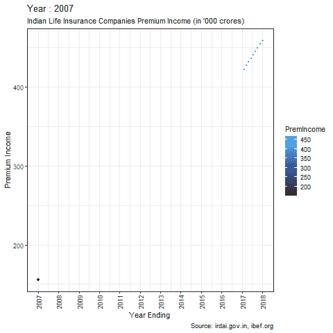
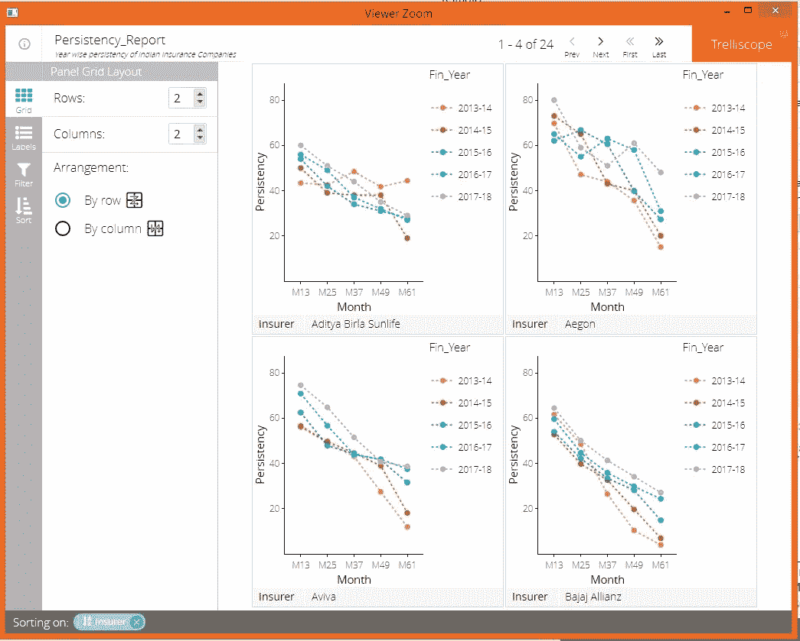

# 人寿保险中的数据科学用例

> 原文：<https://medium.com/analytics-vidhya/data-science-use-cases-in-life-insurance-8cfbfd8b2fff?source=collection_archive---------6----------------------->

图片由 [Unsplash](https://unsplash.com?utm_source=medium&utm_medium=referral) 上的[新数据服务](https://unsplash.com/@new_data_services?utm_source=medium&utm_medium=referral)提供

数据科学是当今科技界的一个新现象。随着计算能力的增强，它改变了我们今天的生活方式。没有手机很难生活，因为你每天有将近 20%的时间都在手机上度过。许多公司正在使用数据科学来增加他们的销售，用于客户分析、活动管理、识别他们的最佳客户等。当你喜欢脸书上的一个帖子，或者在谷歌上快速搜索，或者接到一个购买信用卡的销售电话，或者在亚马逊页面上购物时得到产品推荐，点击鼠标或触摸手机屏幕就会发生很多事情。当你是最终用户时，这是一个勇敢的新世界，甚至对于那些在电脑屏幕后或手机屏幕下施展魔法的数据科学家来说也是如此。

*保险行业的数据驱动分析初创公司(例如*[*【pilot bird】*](https://www.pilotbird.com/)*)在采用公开可用数据(例如社交、人口普查)来更准确地为人寿保险风险定价、细分客户和检测欺诈方面处于领先地位。*寿险公司也不甘落后。他们是数据科学的主要用户。精算师使用死亡率预测模型和保险产品定价。说到统计软件包，R 是精算师最喜欢的语言。有许多用于保险的 R 包，如 chainladder、cplm、lossDev、actuar、favir、commission 和 lifecontingencies。

在印度，有超过 24 家人寿保险公司。人寿保险公司每个月都会生成数百万行数据。这些数据可以是续期保费、新业务保费、会计、销售线索、变更等形式。印度保险巨头印度 LIC 每年销售超过 2000 万份保单，目前服务超过 3.1 亿份保单。所以你可以想象印度和世界各地的保险公司产生的海量数据。这些大数据为全世界的数据科学家带来了大量的机遇和挑战。

看看下面印度保险公司赚取的保费收入。你可以想象这些公司每天产生的大量数据。

用 R ggplot2 和 gganimate 制作的图表

但是，人寿保险公司如何有效地利用这些大数据，因为它们坐拥数据形式的巨大金矿。寿险公司如何为客户提供最佳服务？人寿保险公司如何从现有数据中挖掘销售线索，因为向现有客户销售产品总是比向新客户销售更便宜？人寿保险公司使用数据科学的用例有哪些？

我将向您展示数据科学在人寿保险中的一些好的使用案例。这个列表并不详尽。如果你是人寿保险的大师，那么你可以想到更多。

**政策失效**

保单失效是寿险公司最大的痛处。在印度，将近 50 %的保单在 5 年内失效。在这种模式的帮助下，可以提前联系那些很有可能违反保单的客户。控制失误将为保险公司带来更高的保费收入，增加销售人员的佣金收入，提高客户满意度，并为客户提供有价值的风险保障。

印度保险公司 5 年坚持不懈

**客户流失**

这个数据科学模型预测客户流失。损耗可以是投降或政策失效的形式。提前退保会导致保险公司保费收入的损失以及客户风险保障的损失。提前退保涉及大量的费用扣除。顾客永远收不回他所付的钱。模型在数据中寻找模式。保险公司也开始知道它的哪些产品不受欢迎，并可以根据客户的要求重新设计产品。

**产品亲和力**

产品亲和力研究客户的行为，以便他们可以与新产品交叉销售。这种数据科学模型有助于为客户提供备选计划。例如，拥有 Ulip 保单的客户可能是传统计划的目标客户。40 岁以后的客户可以成为养老金计划的目标。保险公司可以研究访问其网站的客户的数据。其中一些可能是现有客户，一些可能是新客户。通过观察数据的模式，客户可以成为替代产品的目标。当你去亚马逊网站时，你可能会看到同样的事情。在屏幕底部，它会根据您的购买行为推荐您可以购买的产品。

**代理人流失**

人寿保险代理人为人寿保险公司做大部分业务。他们也被称为街上的脚。保险公司花费大量的金钱和时间来培训和雇佣保险代理人。如果这些代理商中途离开，那么所产生的成本将永远无法收回。印度的 LIC 拥有超过一百万的代理商作为其销售队伍的一部分。

该数据科学模型根据代理人售出的保单的年保费、每年售出的保单数量、失效保单、在公司的持续时间等来预测代理人的流失。随着代理人的流失，该代理人销售的保单很可能会在未来失效。

通过观察代理人的行为，保险公司可以采取适当的措施来留住他们。

**续保保费预测**

2017-2018 年，印度保险公司收取了近 265000 卢比的续保保费。

该数据科学模型预测寿险公司账簿上现有保单的续保保费。这有助于为销售团队设定目标，并有助于保持政策的持续性。

**客户生命周期价值**

这种数据科学模型有助于确定客户的生命周期价值。该模型确定客户拥有的当前保单的价值以及当前保单的预期期限。它还考虑了客户可以购买的新保单以及这些保单的保费预测。还考虑了失效模型、回购模型和预测模型。该模型还考虑了与每个策略相关的固定成本。该模型随后可用于交叉销售、追加销售和不同营销活动中的目标客户。

**代理生命时间值**

这种数据科学模型有助于根据保险代理人迄今所做的业务以及他未来可能为公司创造的预期业务来计算其生命周期价值。

保险公司的大多数保单都是由保险代理人出售的。他是保险公司和客户之间的纽带。该模型考虑了代理人售出的保单数量、第一年获得的保费收入、可能从保单中获得的续保保费、要支付的佣金以及聘用代理人所涉及的固定成本。

一旦 ALTV 确定，保险公司可以采取额外措施，通过给予他们额外的激励来留住优秀的员工。

**孤立客户识别模型**

保险代理人是客户和保险公司之间的重要纽带。如果代理人离开保险公司，就没有人为该代理人的客户服务，这导致该代理人售出的保单失效，进而导致公司收入损失。该模型有助于识别孤儿客户。

公司可以识别这样的客户，并可以将策略分配给活跃的代理，从而控制流失并留住客户。

**客户细分**

客户细分是根据相似性将客户归入同一类别的过程。在人寿保险中，有许多变量，如票面金额、保费支付频率、风险类别、产品类型、居住城市、职业、年保费、豪华住宅区居民等，在此基础上可以进行客户细分。这是人寿保险中最重要的数据科学用例之一。

如上所述，该数据科学模型基于不同的标准对客户进行细分。它将客户放在不同的桶中，这反过来有助于针对不同的营销活动的客户。保险公司也可以根据客户细分设计产品，即针对合适的客户设计合适的产品。

不同的技术，如因素分割、K-均值聚类、两步聚类分析、层次聚类和潜在类别聚类分析，可用于客户细分。

**索赔预测**

索赔管理是人寿保险中的一项重要活动。索赔可以有不同的类型，如死亡索赔、伤残索赔、重大疾病索赔等。公司可以通过查看目前已支付的索赔类型来建立预测性索赔模型。核保风险模型中的风险类别也应该用于建立索赔预测模型。一旦建立了索赔预测模型，公司就可以深入研究数据，以找到重要的模式，如索赔来自哪个地区，哪些代理人的保单引发了最大的索赔，以及最大索赔发生的产品组合。

**核保风险模型**

核保是对提案进行风险评估的第一个切入点。根据风险的类型，被保险人拥有的生命，保险公司决定给予该人风险保障。承保范围可以在不收取任何额外费用的情况下提供，或者如果该人有任何类型的风险，如职业风险、健康风险等。他可能会被收取额外的费用来承担这种风险。保险公司可以将不同的被保险人置于不同类型的风险中。

可以建立一个核保模型来预测每天销售的新保单的风险。这将有助于保险公司快速承保这些提案，从而节省医疗和健康测试的费用，并节省未来索赔的费用。

**结论**

我们已经看到数据科学在人寿保险中可能有不同的使用案例。这个列表并不详尽。更多的用例可以添加到这个列表中。人寿保险公司长期以来一直在使用预测建模，并将继续这样做。保险产品的定价是基于预测模型进行的。随着数据科学的进步，保险公司可以使用新的算法来为其产品定价，从而提高盈利能力并留住销售人员和客户。

来源

 [## r 在保险行业

### 今天就来说说保险行业的 R。大卫·史密斯的博客让我想起了我们在 R user 的海报…

www.r-bloggers.com](https://www.r-bloggers.com/r-in-the-insurance-industry/)  [## 伊尔代欢迎你

### “为了保护投保人的利益，规范、促进和确保保险业的有序发展…

www.irdai.gov.in](https://www.irdai.gov.in/) 

[ibef.org](https://www.ibef.org/)

如有任何疑问，请与我在 harnagpal@gmail.com 联系。