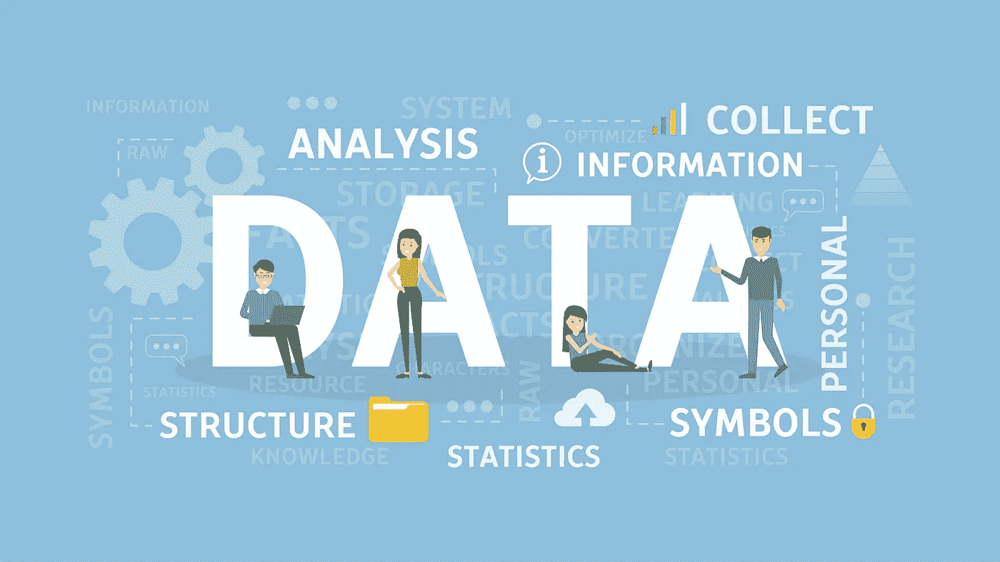
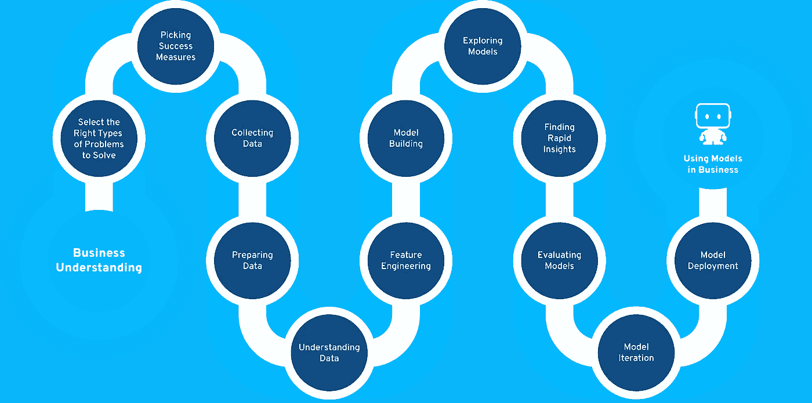
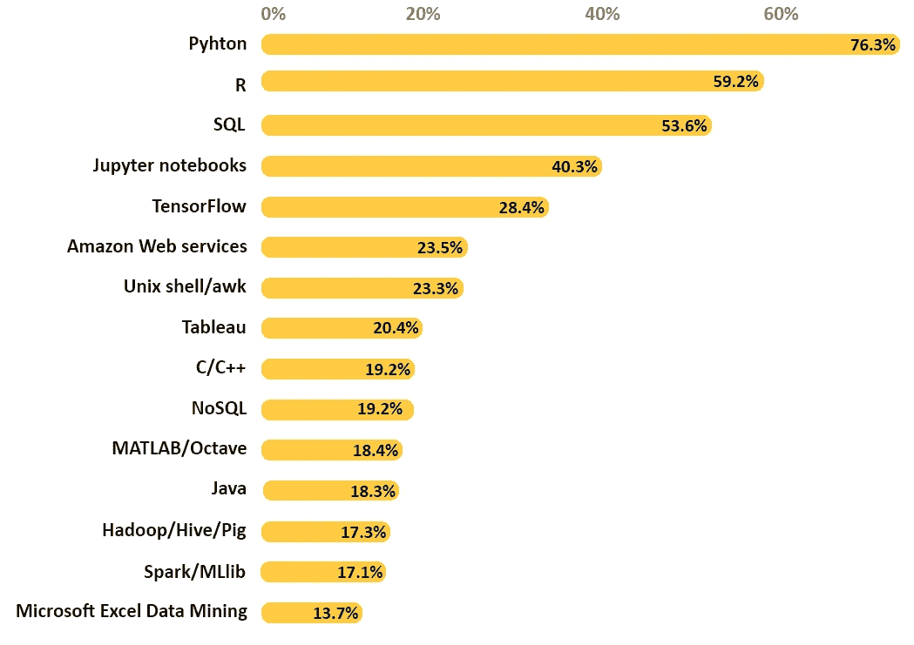
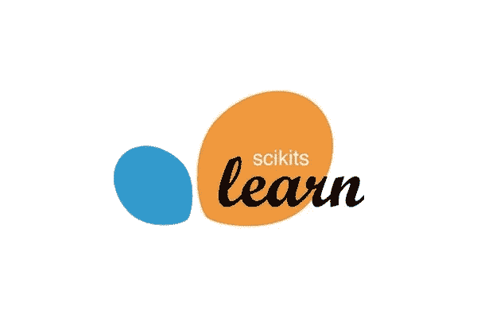

# Python 数据科学:初学者的 4 个重要库。

> 原文：<https://medium.com/analytics-vidhya/data-science-with-python-4-important-libraries-for-beginners-914a8c460674?source=collection_archive---------26----------------------->

大家好，欢迎即将到来的数据科学家。在本文中，我们将了解什么是数据科学，数据科学涉及的步骤，用于数据科学的编程语言以及 python 的 4 个基本库。

## **首先，数据科学到底是什么？**

> 简单地说，数据科学就是从原始数据中提取有用的信息和见解。数据科学与统计的数学领域更密切相关，包括数据的收集、数据的组织、数据的分析和数据的表示。

数据科学是一个领域，它还包括机器学习、深度学习和人工智能，以建立高精度的商业模型。让我们看看下面的图片，其中包括建立一个高精度模型的步骤。

用于数据科学的编程语言是 python 和 r。大多数数据科学家更喜欢 python，因为它提供了处理数据科学应用程序的强大库。

用于数据科学的编程语言

[**Python**](https://www.python.org/) 因其易用性成为科研界使用最广泛的语言。它具有简单的语法，对于没有工程背景的人来说，学习变得简单。

***每个数据科学初学者都应该知道的重要库:***

1.  Numpy
2.  熊猫
3.  Sklearn
4.  Matplotlib

*在本文中，我们看到了库的基本定义。*

[**Numpy**](https://numpy.org/) 是用于数值计算的库。它代表数字 Python。它是 Python 的一个开源模块，提供对数组和矩阵的快速数学计算。

[**熊猫**](https://pandas.pydata.org/) 是为数据操纵而制造的。使用 pandas 可以直接将 csv、html、Json、txt 等格式加载到 python 中并进行处理。它有许多内置功能，使你的工作更容易。

[**Sklearn**](https://scikit-learn.org/stable/) 是 python 中机器学习最有用的库。它包含用于 ML 和统计建模的有效工具，包括分类、回归、聚类和维数减少。

[**Matplotlib**](https://matplotlib.org/)**是一个用于在 Python 中创建静态、动画和交互式可视化的库，用于 2D 数组的绘制。**

****

**蒂姆·莫斯霍尔德在 [Unsplash](https://unsplash.com?utm_source=medium&utm_medium=referral) 上的照片**

***为了更好地理解，请浏览为这些库提供的链接。让我们在下一篇文章中看看这些库的实际用法。***

**数据科学家和即将出现的数据科学家，如果觉得这篇文章有帮助，请鼓掌表示感谢。**