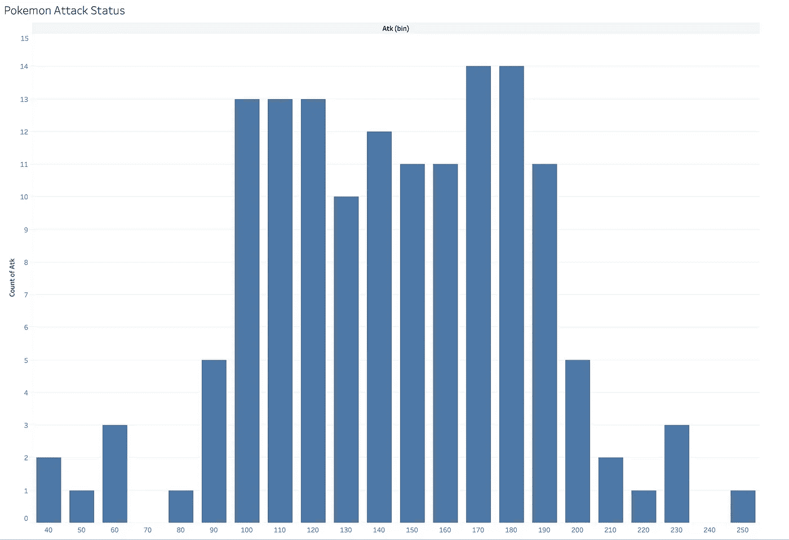

# 数据科学家:随机停止宁滨直方图

> 原文：<https://medium.com/analytics-vidhya/data-scientists-stop-randomly-binning-histograms-1069d7380c3a?source=collection_archive---------8----------------------->

有 10 个柱的直方图。因为为什么不是 10 年？这是我的数据 viz 导师告诉我做的…

直方图是探索性数据分析的重要组成部分。它们让我们免于被类似“平均来说，我们的小部件能达到 1000 人”的东西所欺骗。这是一个伟大的平均水平！但是范围有多大呢？发行？标准差？方差？这些都可以通过一个简单的可视化来回答:直方图。